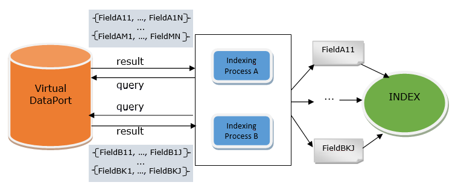

=============================
VDPIndexer Extraction Section
=============================

The target of this type of jobs is to generate indexes with the
appropriate structure to be used by the Data Catalog
(see more about this tool in the 
:doc:`/vdp/data_catalog/index`).
It is composed of several indexing processes, where each one
queries a view from Virtual DataPort to retrieve some results. For each
tuple, this job generates several documents to be stored in the index
(users can choose indexes from Elasticsearch or Scheduler Index exporters).
More specifically, each field of a tuple will be a document inside the
index, and each one will keep a reference to the tuple itself. This way,
we can group all the documents belonging to the same tuple. `General
architecture of a VDPIndexer job`_ shows the general architecture of
this job.

 

To configure the extraction section of VDPIndexer-type jobs a VDP-type
**data source** needs to be selected. Once selected, you may create
several indexing processes to add documents to the index, by clicking 
**New Indexing Process**. Each indexing process will query a
view from the VDP server and retrieve several rows. For each field of
each row, Scheduler will generate a document that will be added to the
configured index (in the exporters section).

You can create several indexing processes at once by clicking 
*New Indexing Process* > *Multiple processes*. In this case, you have to
choose the views you want to index (from all available views) and a new indexing process will
be created automatically for each one, to configure its own settings.

 

`Example of the extraction section of a VDPIndexer job`_ shows an
example of this type of job.

Global Settings
=================================================================================

It is possible to configure the number of indexing processes to run
concurrently during the job execution (**Concurrency Level**) and the
**Maximum number of rows** extracted from Virtual DataPort for each
indexing process. If configured, this parameter will apply for each
indexing process, unless you override it in its configuration. Note that
the displayed number of extracted tuples in the reports will be greater
than the number of rows extracted from Virtual DataPort, as the index
will contain an entry for each field of the view (as explained before).

You can also specify whether to **Index only text fields (and primary keys)**
or to index all fields from the views. This parameter will apply for each indexing process,
unless they overwrite it (explained later). By default, this parameter is enabled 
to keep the index as small as possible, so that only text fields and the primary keys 
of the views are indexed. These fields are usually the most relevant ones.

It is also possible to configure a global date to be used for the
incremental indexing of each indexing process (explained later). Note
that you have to enable each indexing process to use this feature. To
configure this date you can:

a. **Use last successful execution**. It uses the date of the last
   execution of the job that ended successfully.
b. Provide a **custom value**, configuring a start date (following the
   format YYYY-MM-DD'T'hh:mm:ss.SSSZ, for instance:
   2016-01-15T18:35:12.345+0200).

Indexing Process Configuration
=================================================================================

The configuration of each indexing process consists of the following
fields/sections:

-  The VDP **view** to extract tuples from. Only views with defined primary
   keys are shown here and all the fields from the selected one are
   projected (i.e., a ``select * from <view>`` is executed). Views in this
   combo box are retrieved from the VDP data source configured for the job 
   (all views from every database for which the user has permissions are listed,
   not only the ones from the database specified in the data source).
   Note that the corresponding VDP server must be running (there is a
   refresh button that allows reloading the views from the VDP data source
   at any moment).
   
-  You can override the global value for the **Index only text fields (and primary keys)**
   configured for all the indexing processes. To do that, select a value from the drop-down 
   (the *Default* value means using the global parameter).

-  You can override the global value for the maximum number of rows
   configured for all the indexing processes. To do that, disable the
   check box for **use maximum number of rows of the global settings** and
   give a new value for **maximum number of rows of the indexing process**.

-  The **order by expression**: This option is useful if you have limited
   the maximum number of rows to be extracted by the indexing process.
   Example: ``field1 ASC, field2 DESC``. There is a dropdown that contains
   two options:

   -  Default: this is the default option. The text area will be disabled
      and it will be filled with the default order by expression (using the
      primary key of the view and ASC order).
   -  Custom: the user can type the order by expression in the text area.
      Note that, when this option is selected, it is not mandatory to
      provide an order by expression. The text area should be kept empty if
      the user does not want to order the results.

-  The **advanced query filter**. It is the *where* part of the
   parameterized queries already seen for VDP-type jobs. Query conditions
   are optional and there are two combo boxes to help the user to create
   them:

   -  One to **add fields** of the selected view to the condition
      (mandatory fields are indicated). This combo is updated every time a
      new view is selected (if the VDP data source is accessible).
   -  Another one to **add operators** to the condition. This combo
      contains all the possible operators that can be used in a condition.

   Query conditions can have parameters, and the way to define their
   sources and their level of concurrency is identical to the one seen for
   VDP- and JDBC-type jobs.

   When saving the job configuration, the query conditions for every
   indexing process are validated against VDP. If there are errors, the
   names of the indexing processes with errors are shown in red, and the
   detailed information about each error is shown in the details of the
   corresponding indexing process.

-  The **incremental indexing** section. Configuring this section it is
   possible to perform incremental indexing. This feature allows indexing
   only results that are newer than the specified date. This way, the
   results can be added incrementally to an index containing the results of
   previous executions, instead of indexing everything again. In order to
   use this feature, it is needed to **enable** the incremental indexing of
   each indexing process. Then, you can specify a **field name** of the
   view (only fields of :doc:`date-related type </vdp/vql/language_for_defining_and_processing_data_vql/data_types/data_types_for_dates_timestamps_and_intervals>` 
   will be listed in this combo) and set its
   value to the global start date or provide a **custom start date** (with
   the same format as explained before). You can also specify a custom
   **expression** (for instance,
   ``"Date Field" > TO_DATE('yyyy-MM-dd''T''HH:mm:ss.SSSZ','2020-01-01T10:11:12.345+0200')``).
   In this expression you can use the variable ``{0}``, meaning the date of
   the last successful execution. When enabling the incremental indexing
   for a process, it is mandatory to specify either the expression or the
   field name and its date.
    

There is also a field **indexing process name**, where the user may
specify a user-friendly name for each indexing process. This name will
appear in the list of indexing processes to better identify them. By
default, it is filled in with the name of the selected view (note that
it is not possible to assign the same name to several indexing
processes).

 

Given the value of these fields, the query sent to the VDP data source
will be as follows:

.. code-block:: sql

   SELECT_NAVIGATIONAL * 
   FROM <view>
   [ WHERE <incremental_indexing_field> >
                      <incremental_indexing_date> AND
           <incremental_indexing_filter_expression> AND
           <advanced_query_filter>]
   [ ORDER BY <order_by_expression> ]
   [ LIMIT <max_number_of_tuples> ]
   CONTEXT ('EVALUATE_PROPERTY' = 'contenttype')

.. note:: When the connection to VDP is lost, the user can save the job
   as draft in order to not lose the work.

   General architecture of a VDPIndexer job

   Example of the extraction section of a VDPIndexer job
   
.. note:: This type of jobs must be configured with at least one of 
   these exporters: *Scheduler Index* and/or *Elasticsearch*.
   
Recommendations for the Indexing Processes
=================================================================================

Most of the times it is not useful to index all the contents of all the views in order to use them for data discovery. 

Not indexing the useless content will generate smaller indexes (saving storage space) and the job execution will take less time. 

Take in consideration the following recommendations:

- Index only content which adds value for Data Discovery:
  
  - Do not index intermediate views, only final views.
  - Do not index views with aggregated information (e.g. for reporting).
  - Do not index fact tables as they only contain foreign keys, identifiers and numeric measures.
  - Consider indexing only the text fields.
  - Consider indexing only a subset of the rows.

    - E.g. in some views it may be enough to index the most recent data (e.g. one year) or the most important data (e.g. support cases with priority 3 or lower).

- Use incremental indexing:

  - Many views include a *‘last_modified’* field and this jobs can leverage this.
  - You do not need to index all content in the same job.
  - Several jobs can work concurrently in the same index.
