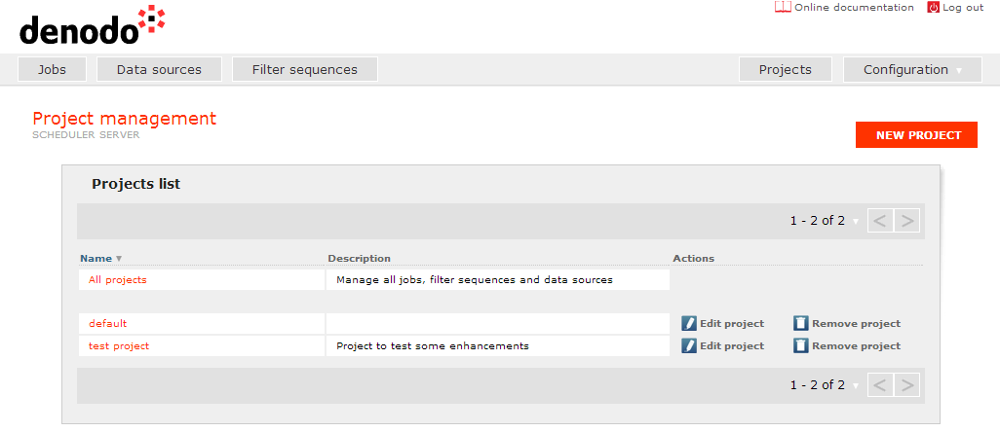

============================
Creating and Scheduling Jobs
============================

.. toctree::
   :hidden:
   
   jobs/jobs.rst
   data_sources/data_sources.rst
   filter_sequences/filter_sequences.rst
   configuring_new_jobs/configuring_new_jobs.rst

In addition to the “Configuration” perspective, the Denodo Scheduler
administration tool presents other additional perspectives: “Projects”,
“Jobs”, “Data Sources” and “Filter Sequences”.

 

The aim of these perspectives is to facilitate the definition of data
extraction jobs. In particular, it allows projects, data sources, filter
sequences, and jobs to be listed/created/modified/deleted (each element
type in its particular perspective).

 

The various elements of the Scheduler work space are organized by
projects (`Projects screen`_). A project groups together a list of data
sources, filter sequences, and jobs; you can have elements with the same
name (case insensitive) in different projects. On the “Project”
perspective, a table with the existing projects is shown and a button to
add new projects is also available. By clicking a project name in the
table of projects, you are choosing the active project. Future actions
in the “Data Sources”, “Filter Sequences” or “Jobs” perspectives will be
related to the active project. To add a new project, its name and an
optional description need to be specified.

 

   Projects screen
 

After the installation the project called “default” is automatically
created. If other components of the Denodo Platform have been selected
in the installation, a properly configured data source for each of them
is also included.

 

To add new elements to the project it is necessary to click on the
perspectives “Data Sources”, “Filter Sequences”, or “Jobs” (according to
the type of the element the user wants to add). If there is no active
project when trying to create a new element, a dialog is displayed to
the user in order to choose the project. The following paragraphs
describe the creation/editing screens for the different types of
elements in detail.

 

Moreover, the “Jobs” perspective allows you to monitor in real time the
execution status of the various jobs that have been scheduled. It also
allows you to find out the status of the last execution (see prior
execution reports), force the execution of a job at a given time or
delete its execution, among other things.

 

In the following sections all the perspectives are described in
detail.
