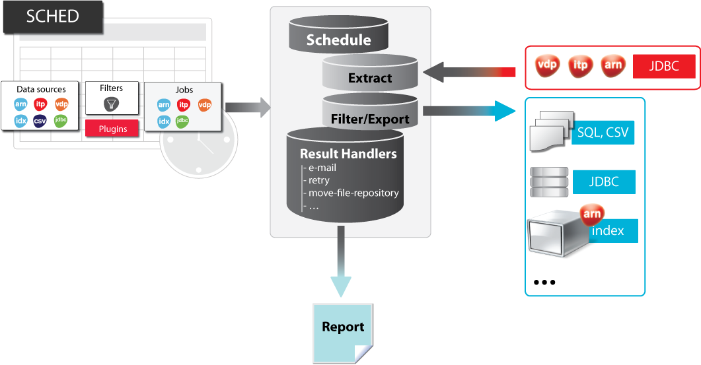

====================
General Architecture
====================

Denodo Scheduler is a tool for time-based scheduling of automatic data
extraction jobs from different data sources. In particular, it allows
the configuration of different extraction jobs to be defined through its
Web administration tool, persistently store this information, and plan
the execution of these jobs against corresponding data servers as
desired.

 

Denodo Scheduler allows extraction jobs to be defined against various
modules of the Denodo Platform. It also allows data to be extracted from
relational databases via JDBC.

 

For the extracted data, Denodo Scheduler allows different filtering
algorithms to be applied and allows the data obtained to be exported in
different formats and repositories.

 

At the core of the system are the extraction jobs that can be defined
for the different components of the Denodo Platform.

-  **Denodo Aracne**. This type of jobs is deprecated and will be removed 
   in the next major version of Denodo.

-  **Denodo ITPilot (ITP)**. Executes queries on wrappers from Denodo
   ITPilot to obtain structured data from Web sources.

-  **Denodo Virtual DataPort (VDP)**. Executes queries on wrappers and
   views defined in Virtual DataPort to obtain data
   resulting from the integration of data that can come from dispersed and
   heterogeneous sources.

-  It is also possible to define a **JDBC** type of job that explores the
   tables specified in a database and retrieves the data contained in them.

 

On a general level and for all jobs, it is possible to configure your
time-based scheduling (when and how often it should be executed),
various types of *filters* for post-processing the data retrieved by the
system, and the way in which the results obtained by the job will be
exported. The available exporters are:

-  Dumping the final results in a database.
-  Indexing the final results in the Scheduler indexing server.
-  Dumping the final results in a CSV-type file (it can also be used to
   generate MS-Excel compliant files).
-  Dumping the final results in a SQL-type file.

 

It also allows the programmer to create new exporters for ad-hoc needs.

 
In the figure `Denodo Scheduler Architecture`_ the server’s basic architecture is shown. In addition
to the jobs and filters, the scheduler lets users define the data
sources to be used for the extraction jobs and by exporters. Denodo
Scheduler allows data sources to be defined for the different components
of the Denodo Platform (VDP and ITP), for relational databases,
and delimited files.

In the case of ITP-, VDP-, and JDBC-type jobs, it is possible to specify
a query parameterized by a series of variables, along with the possible
values for these variables, thus several queries are executed against
the corresponding server.

 

   Denodo Scheduler Architecture
 

The following briefly describes two typical examples of the use of
Denodo Scheduler.

 

**Example**: extracting structured data from the Web with ITPilot

Suppose you want to periodically extract information from customers
accessible via a corporate Web site. The Web site offers users a query
form in which a customer’s Tax ID should be specified and returns as a
response information of interest about the customer specified. The list
of all the Tax IDs to be queried is available in an internal database
accessible via JDBC. The set of data extracted must be dumped to another
internal database also accessible via JDBC. The steps to be followed to
carry out this job with the Denodo Platform are as follows:

 

#. Create a new ITPilot wrapper that automates
   the operation of obtaining data from a customer from the corporate
   Web site. The wrapper will receive as a mandatory parameter a
   customer’s Tax ID, it will automatically execute the query on the
   Web, and will extract the desired results.
#. Add a new JDBC-type data source to Scheduler to access the database
   that contains the Tax IDs of the required customers (see section
   :doc:`/scheduler/administration/creating_and_scheduling_jobs/data_sources/jdbc_data_sources` to find out how to add JDBC data sources).
#. Add another new JDBC data source to Scheduler to access the database
   in which the extracted data will be dumped into.
#. Create an ITP-type job in Scheduler (see section :ref:`Configuring new
   jobs`). The ITP job will query a wrapper to which the different
   values will be specified for the Tax ID attribute. To get the
   different values of the Tax ID attribute, a query on the JDBC data
   source defined in step 2 will be used. Then, to execute the job, the
   ITPilot wrapper will be invoked for each of the Tax IDs sought.
#. Create a JDBC-type exporter for the ITP job (see section
   :ref:`Postprocessing Section (Exporters)`). This exporter will use the
   JDBC data source defined in step 3.
#. Finally, configure the frequency with which you want to execute the
   job in Scheduler (see section :ref:`Time-based Job Scheduling Section`).
