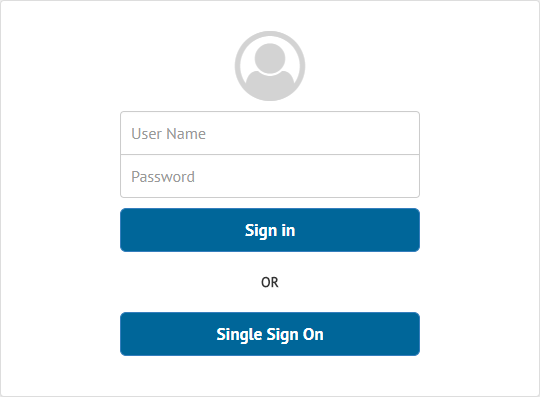

============================
Authenticating with Kerberos
============================

The Solution Manager Server supports Single Sign-On using the Kerberos protocol.

To enable Kerberos authentication in the Solution Manager Server, follow these steps:

#. Perform the post-installation tasks described in the section :ref:`Setting-up
   Kerberos Authentication` of the *Denodo Platform Installation Guide*.

#. Indicate a Kerberos realm, if it is different from the one from your domain,
   as explained in the section
   :ref:`Using Kerberos Authentication in Solution Manager Without Joining a Kerberos Realm`
   of the *Solution Manager Installation Guide*.

#. Enable Kerberos in the Virtual DataPort Server, as described in the section
   :ref:`Setting-Up the Kerberos Authentication in the Virtual DataPort Server`
   of the *Virtual DataPort Administration Guide*.

#. `Configure Kerberos on your browser
   <https://www.oracle.com/technetwork/articles/idm/weblogic-sso-kerberos-1619890.html>`_.

After this change, when the users go to the Solution Manager, they will be logged 
in automatically - without entering their credentials - because the browser 
will send the Kerberos credentials of their system.

   Authentication dialog with Single Sign-On

.. important:: To access the Solution Manager Administration Tool, remember to
               use the Fully Qualified Domain Name of the Server Principal Name
               you configured in the Solution Manager Virtual DataPort Server.
               For example, if your Server Principal Name is
               ``HTTP/denodo-prod.subnet1.contoso.com@CONTOSO.COM``, you should
               access the Solution Manager Administration Tool through the URL
               ``http://denodo-prod.subnet1.contoso.com:19090/solution-manager-web-tool`` or
               ``https://denodo-prod.subnet1.contoso.com:9443/solution-manager-web-tool``.
