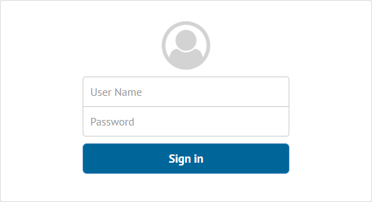

====================================
Authenticating with Virtual DataPort
====================================

Once you have the :ref:`Solution Manager Administration Tool running <Launching
the Solution Manager Administration Tool>`, you can access the tool from a
browser with the URL http://acme:19090/solution-manager-web-tool. After this,
you will see the login dialog.

   Authentication dialog of the Solution Manager Administration Tool

As part of a usual installation, the Solution Manager comes along with a Virtual
DataPort Server. It is used by the Solution Manager Server to resolve all the
authentication requests. In fact, it cannot be used for anything else.

For a detailed explanation on how to create new users in Virtual DataPort or
how to configure the authentication for a whole database with LDAP, you can
check the section
:ref:`Administration of Databases, Users, Roles and Their Access Rights` of the
*Virtual DataPort Administration Guide*.

.. note:: If you want to configure Virtual DataPort so authentication relies on
          LDAP for every connection, take into account that the Solution Manager
          connects by default to database ``admin``.