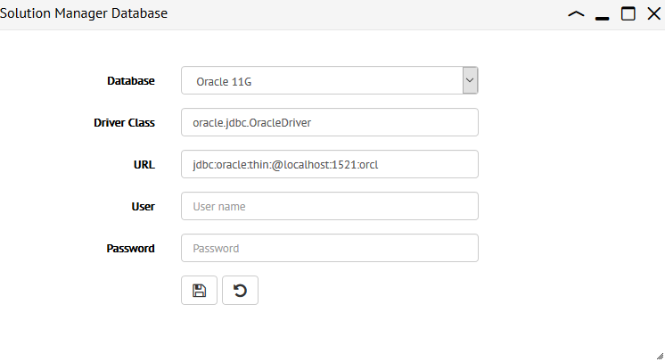
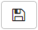

.. _sm-database-configuration:

================================
Setting-Up an External Database
================================

.. note:: Only global administrators and Solution Manager administrators can perform this task.

The Solution Manager server and the License Manager server store their information on a database:

1. Solution Manager: environments, clusters and servers.
2. Promotions: load balancing variables, revisions and deployments.
3. License: global license and license usages.

They all use the same database to store this information. By default, it is a local database included with the installation (Apache Derby). You can configure these components to store this information on an external database. They all have to use the same database.

.. note:: When you change the database on which this information is stored, you will no longer have 
   access to the existing promotions because they will remain on the local database, which will 
   not be accessed anymore. The license will be automatically transferred to the new database.
   The information about environments, clusters and servers will be transferred during the process explained on this page.

Follow these steps:

1. If you already defined environments/clusters/servers in the *Tree Area*, export them to a file. To do this, right-click on the root of this tree (on *Solution Manager*) and click **Export**.

   The information about revisions and deployments *cannot be exported*.

2. Copy the jar file(s) of the JDBC driver of the database to the folder :file:`{<SOLUTION_MANAGER_HOME>}/lib/solution-manager-extensions`.

#. Restart these components:

   -  License Manager server
   -  Solution Manager server
   -  Solution Manager administration tool

   You do not need to restart these components if the jar files of the driver were already in that folder.

#. Open the **Configuration** menu (at the top) and click **Solution Manager Database**. In the new tab, enter the following parameters:

   -  **Database**: select one of the supported databases:

      -  Apache Derby
      -  Microsoft SQL Server 2014, using the Microsoft JDBC driver (the jTDS driver is unsupported).
      -  Oracle 11g. To use this, copy the jar files of the directory :file:`<SOLUTION_MANAGER_HOME>/lib/extensions/jdbc-drivers/oracle-12c` to 
         :file:`{<SOLUTION_MANAGER_HOME>}/lib/solution-manager-extensions`. Solution Manager requires the Oracle 12c drivers to connect to Oracle 11g and 12c.
      -  Oracle 12c
      -  MySQL 5.6. Select this to use MySQL or for the MySQL-compatible edition of Amazon Aurora.
      -  PostgreSQL 9.5. Select this to use PostgreSQL or the PostgreSQL-compatible edition of Amazon Aurora.

   -  **Driver Class**: class name of the JDBC driver. E.g. for Oracle ``oracle.jdbc.OracleDriver``.

   -  **URL**: JDBC URL to connect to your database server.

   -  **User** and **Password**: credentials to connect to the database. This user account needs privileges to create
      tables and insert/update/delete rows in these tables.

    Database configuration panel

.. note:: 
   
   -  When you select the database *Derby Embedded*, the fields *Driver Class*, *URI*, *Username* and *Password* are not editable. It represents a connection
      to the Derby database included with the Solution Manager.
    
   -  When you select the database *MySQL*, add the following parameters to the URL: ``useUnicode=true&characterEncoding=UTF-8``. For example: ``jdbc:mysql://mysql.acme.com:3306/denodo_solution_manager?useUnicode=true&characterEncoding=UTF-8``.

      That way, if you have views or other elements with non-ASCII characters, they will be stored in the database correctly. Note that the schema
      where this is stored needs to have these options: *Default Charset* = *utf8* and *Collation* = *utf8_unicode_ci*.

5. Click the save button |save-btn|. The Solution Manager checks that it can reach this database. You will be prompted to create the necessary tables. If you click *Yes*, they will be created automatically. Alternatively, you can create them manually using the scripts of the directory :file:`{<SOLUTION_MANAGER_HOME>}/conf/solution-manager/sql`.

#. Stop the *License Manager server*, *Solution Manager server* and *Solution Manager administration tool*.

#. Start the License Manager.

   The License Manager will automatically store the license information in the external database.

#. Start the Solution Manager server and the Solution Manager administration tool.
  
   .. important:: Start the License Manager **before** the other components of this installation because first, the License Manager has to store the license on the external database. 
      If you do not do it in this order, the Solution Manager will not start because it will not find a valid license.

#. Log into the Solution Manager. If you already had defined environments, clusters and servers, now they are not there. The reason is that only the license is automatically copied to the new database.

   To restore the environments, clusters and servers, right-click on the root of tree and click **Import**. Select the file you exported on step #1.

