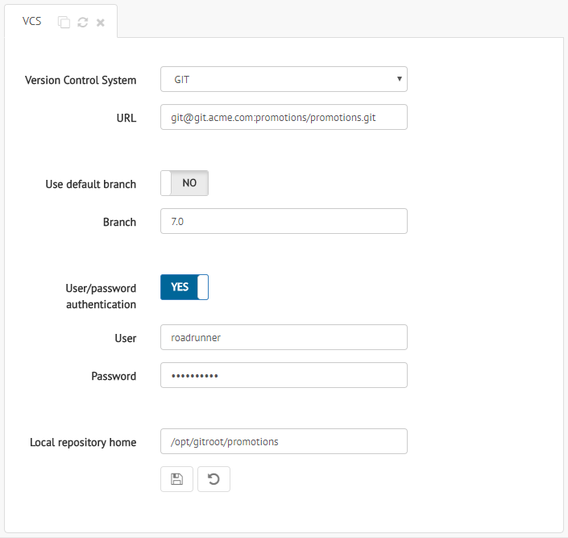

.. _sm-vcs-configuration:

*****************
VCS Configuration
*****************

.. note:: Only global administrators and Solution Manager administrators can configure VCS. 
          More information is available in the :ref:`Authorization` section.

The Solution Manager allows you to save a backup of the state of the Denodo
servers *after a deployment*, on a Version Control System (VCS). The backup
will be performed both for successful and unsuccessful deployments.

On the one hand, the Solution Manager generates a backup for the Virtual
DataPort servers. It accesses to the first Virtual DataPort server of the
environment, following the order defined in the catalog tree, and executes
``DESC VQL DATABASE``. This backup consists of the server catalog (views, data
sources, web services, etc.) expressed as a list of VQL sentences.

On the other hand, the Solution Manager generates a backup for the Scheduler
servers, using the information of the first Scheduler server of the environment.
This backup includes a zip file with the server metadata (tasks, data sources,
etc.). 

The Solution Manager also allows to do a rollback *after a failed deployment*, 
to restore the previous state of the first Virtual DataPort and Scheduler server that is enabled on
each enabled cluster of the environment. To do this, the Solution Manager imports
a VQL file into these Virtual DataPort servers  and a zip file with the Scheduler metadata into the first 
Scheduler server that is enabled on each enabled cluster.

To configure your VCS repository (Version Control System) for backups, click the menu **Configuration** > **VCS Configuration**.

    VCS configuration panel

Provide the following information:

- **Version Control System**: The Solution Manager supports GIT and Subversion as VCS for backups.
  
  Starting with the update 7.0 20190903, you do not have to initialize the Git repository if it is not initialized yet. If necessary, the Solution Manager will initialize it.
  With previous updates, you have to initialize the Git repository manually before enabling this feature. Otherwise, the stages
  "backup generation", "VDP rollback" and "Scheduler rollback" 
  of the deployments will fail if they are enabled.

  The appendix :ref:`How To Initialize a Git Repository` explains how to do this. 

- **URL**: Remote location of the VCS repository.

- **Use default branch**: For Git repositories, you can choose if you want to
  use the default remote branch or not.

- **Branch**: Name of the branch to use for the backup, when
  **Use default branch** is disabled.

- **User/password authentication**: Enable this option if your VCS repository
  requires authentication with user and password.

- **User**: User name to connect to your VCS repository, when
  **User/password authentication** is enabled.

- **Password**: Password to connect to your VCS repository, when
  **User/password authentication** is enabled.

- **Local repository home**: Folder in the file system of the Solution Manager
  where the local copy of the remote repository resides. You do not need to change the default value.

Click |save-btn| to save the changes.

Once you set this up, you can configure the environments so the Solution Manager stores a backup on the VCS after deploying a revision to that environment. To enable this on an environment, open its configuration and select *Save VCS backup when the deployment finishes*.
   
.. |save-btn| image:: ../../common_images/save-btn.png

.. |revert-btn| image:: ../../common_images/revert-btn.png
