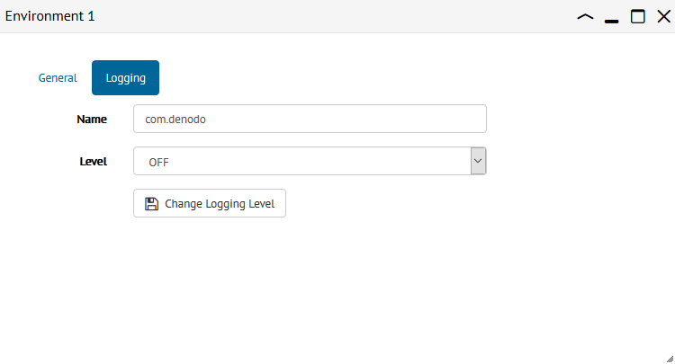

*************************************
Configuring Environment Logging Level
*************************************

.. note:: Only global administrators and JMX administrators
          can change the logging level. More information is available
          in the :ref:`Authorization` section.

The `Logging` section of an environment dialog, allows you to configure the
logging level of the Virtual DataPort servers included in the environment.

   Dialog to configure logging level

In this section, you should specify the following fields:

* **Name**: Logging category, for example, ``com.denodo``.

* **Level**: One of the following logging levels: **OFF**, **FATAL**, **ERROR**, **WARNING**, **INFO**, **DEBUG**, **TRACE**.

Click **Change Logging Level** to confirm the changes.