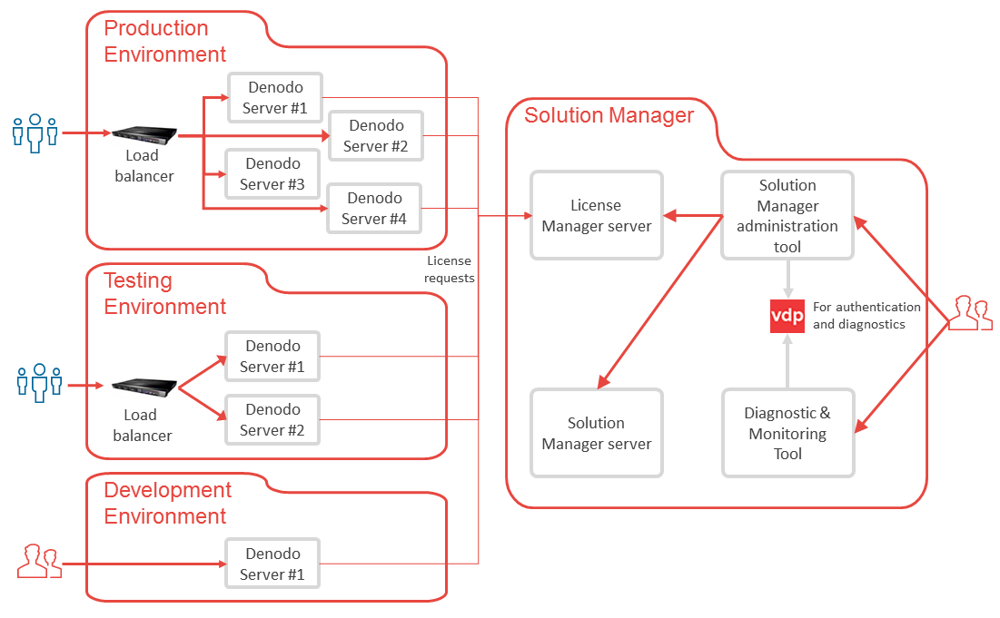

============
Introduction
============

Big corporations with high availability and load balancing requirements tend to
build a large infrastructure to manage their increasing amount of data. Such 
infrastructure may consist of several geographically distributed clusters.
Each one of these clusters is made up of several Virtual DataPort servers that
process the queries, possibly a local cache database and a Scheduler server that periodically executes tasks to keep the
cache updated.

Moreover, every new version of the servers' metadata has its own lifecycle. It is
created in a development environment and promoted to several intermediate
environments (testing, staging...) until it finally reaches production. Each one
of these environments may try to replicate the final infrastructure, but on a
different scale.

Scenarios like that face their own particular problems of administration. Simple
tasks like installing a new license, upgrading a server or deploying a new
version of the metadata, may become much more complex when they have to be
performed on many machines at once.

|

The Solution Manager helps you to manage these large deployments by providing two main components:

-  The License Manager: a centralized point from where administrators manage all the Denodo licenses of the organization.
-  The Solution Manager: web tool for developers and administrators to promote changes from development to the other environments. For example, to propagate new views or changes to views of Virtual DataPort from the development server to the testing servers and then, to production.  

.. _sm-introduction-general-architecture:

General Architecture
====================

The Solution Manager consists of several components that work together to help administrators manage large Denodo
deployments:

1. The License Manager server
#. The Solution Manager server
#. The Solution Manager administration tool: web tool to manage the Solution Manager and the License Manager.
#. The Virtual DataPort server.
#. Diagnostic & Monitoring tool

|

This diagram pictures the recommended architecture for a Denodo deployment in an organization.

   Recommended architecture for a Denodo deployment in an organization

-  This architecture defines three environments: *development*, *testing* and *production*. If your organization has multiple working groups and each group uses its own set of Denodo servers, define these three environments for each group but we recommend using a single License Manager for the entire organization to manage the licenses.

-  Install the Diagnostic & Monitoring Tool along with the Solution Manager. The administrators use this tool from this installation to monitor any Denodo server of the organization.

-  Solution Manager includes a Virtual DataPort server, which is used just for two things:

   1. Authenticating the users of the Diagnostic & Monitoring Tool and the administration tool of the Solution Manager.
   #. The Diagnostic & Monitoring Tool creates a set of views in this Virtual DataPort to analyze the diagnostic files.

   It is not intended to be used as another regular Denodo instance.

-  We do not recommend installing the Solution Manager in the same host as other Denodo instances for performance reasons: the Diagnostic & Monitoring Tool executes complex queries to analyze the log files and this could impact the performance of the other Denodo servers running in the same host.

|

.. rubric:: Role of the License Manager

-  When a Denodo component starts (for example, a Virtual DataPort server), it requests permission to run to the License Manager. If approved, the server starts and periodically, it requests permission to keep running. The benefit of this approach is that you do not need a license file for each server and there is no limitation by IP address. The licenses only keep a limitation of the number of Denodo servers you can run simultaneously, in addition to certain limitations depending on the environment.

-  Only server components request a license, not client applications. I.e. the Virtual DataPort administration tool does not connect to the License Manager because it does not need a license. 

|

.. rubric:: Role of the Solution Manager

The usual development workflow with Denodo has these steps:  

1. A developer creates/modifies elements on the Virtual DataPort and Scheduler servers of the development environment. 

#. The developer creates a *revision* using the Solution Manager web tool. To do this, the Solution Manager connects to the development server and the user selects the elements to include in the revision (data sources, views, Scheduler jobs...).

#. The administrator reviews the revision and if it is correct, deploys it to the Denodo servers of the testing environment.

#. The developer retests the changes in the testing environment.

#. The administrator deploys this revision to the production environment. 

The section :ref:`Promotions` explains this workflow in more detail.
