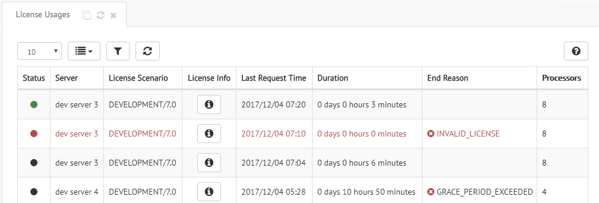
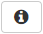
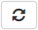

.. _sm_license_usages_table:

********************
License Usages Table
********************

The Denodo servers (Virtual DataPort, Scheduler, etc.) request a license to the License Manager when they start. 
In addition, periodically, they
send a request to the License Manager to check that this license is still valid.

To monitor the license requests, open the *License Usage* dialog. To do this, click the menu **Licenses** > **License Usages**.

    License usages dialog

The table *License Usages* displays the historical information about license
requests sent by the Virtual DataPort servers. This table does not list the license 
requests sent by other components of the Denodo Platform. 

Each row represents a license usage of a Virtual DataPort server. A new 
row is added every time a Virtual DataPort server starts.

In general, during the execution of a Virtual DataPort server, license renewal 
requests are made periodically and if the license does not change and is still 
valid, then the row is updated.

A license usage ends in the following situations, indicating the reason in the column *End Reason*:

-  The Virtual DataPort server shuts down.
-  The Virtual DataPort cannot renew the license during the grace period and 
   the license expires.
-  The License Manager received a request to free the license assigned to that server (see :ref:`Free License Usage <sm_api_free_license_usage>` 
   for more details).
-  The license expired or is invalid.
-  The license has changed. In this case, a new row is added with the new license (you
   can see in :ref:`install a new license <Install a License>` how to change the license).
-  The maximum number of cores/processors defined by the license was exceeded.
-  The maximum number of servers defined by the license was exceeded.
-  The Virtual DataPort is restarted. In this case, the previous active row is 
   ended and a new row is added.

Let us see an example: at first, the server *dev server 3* gets a valid license. After 6 minutes, the
server tries to renew its license, but the License Manager denies the request.
At this point, the license usage becomes inactive and a new row is created with
error status. The server tries to get a valid license again. This time the
License Manager grants a valid license, so a third license usage appears in the
table with active status.

The *License Usages* table has these columns:

- **Status**: license status. The possible values are:

  + |active-status| *Active*. The license granted to the server is valid.
    
  + |grace-status| *In grace period*. The renewal request has not been received
    yet. If the grace period expires without receiving the server request, this
    license usage will change to inactive.

  + |error-status| *Error*. License Manager denied a license request or a license
    renewal. This could happen, for example, when the host where the Virtual DataPort server runs has 16 cores but the license only allows 8.

  + |inactive-status| *Inactive*. The license usage is no longer active due to one
    of the following reasons: 

    a. The server was shut down.

    #. The license renewal request was not received in the License Manager and
       the grace period expired. 

    #. The license renewal was denied due to a license constraint. In this case,
       an additional row is shown in the table describing the cause of the
       rejection.

    #. The License Manager sent a new license on a renewal request, due to the
       global license was updated or the license scenario of the
       environment has changed. In this case, a new license usage of the same
       server is added to the table.

       .. figure:: new_license_installed.png
          :align: center
          :alt: The License Manager granted a new license on renewal
          :name: The License Manager granted a new license on renewal

          The License Manager granted a new license on renewal

- **Server**. The Virtual DataPort server that requested the license.

- **License Scenario**. The license scenario applicable to the server during
  the license usage.

- **License Info**. Click the button |info-btn| to see the license applicable to the server.

- **First Request Time**. Date of the initial license request.

- **Last Request Time**. Date of the last update of the license usage due to a
  license request by the server.

- **End Request Time**. Date when the license usage ends due to a license
  request generated a new license usage. As explained before, this happens when
  the license changed, when it is no longer valid or when it becomes valid
  again. This value is empty on active license usages.

- **Duration**. For active license usages, it is the time elapsed between the
  *First Request Time* and the *Last Request Time* values. For the inactive
  ones, it is the time elapsed between the *First Request Time* and the
  *End Request Time* values.

- **End Reason**. Cause for terminating a license usage. It is only
  applicable to inactive or error license usages. The possible values of this column are:
  
  .. csv-table:: 
      
     SECURE_SHUTDOWN, The Virtual DataPort server was shutdown.
     SERVER_REBOOT, The Virtual DataPort server was rebooted.
     GRACE_PERIOD_EXCEEDED, The License Manager did not receive a request to renew the license while the Virtual DataPort server was in the grace period. 
     LICENSE_ACK_TIMEOUT_EXCEEDED, The communication between the License Manager and the Virtual DataPort server requesting the license failed.
     LICENSE_EXPIRED, The license expired.
     PROCESSORS_EXCEEDED, The maximum number of cores allowed by the license was exceeded.
     SERVERS_EXCEEDED, The maximum number of servers defined by the license was exceeded.
     INVALID_LICENSE, The License Manager could not validate a license scenario included in the global license file.

- **Processors**: number of cores/processors used by the server.

This table is not refreshed automatically. Click the button |refresh-btn| to refresh it.

