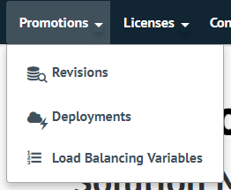
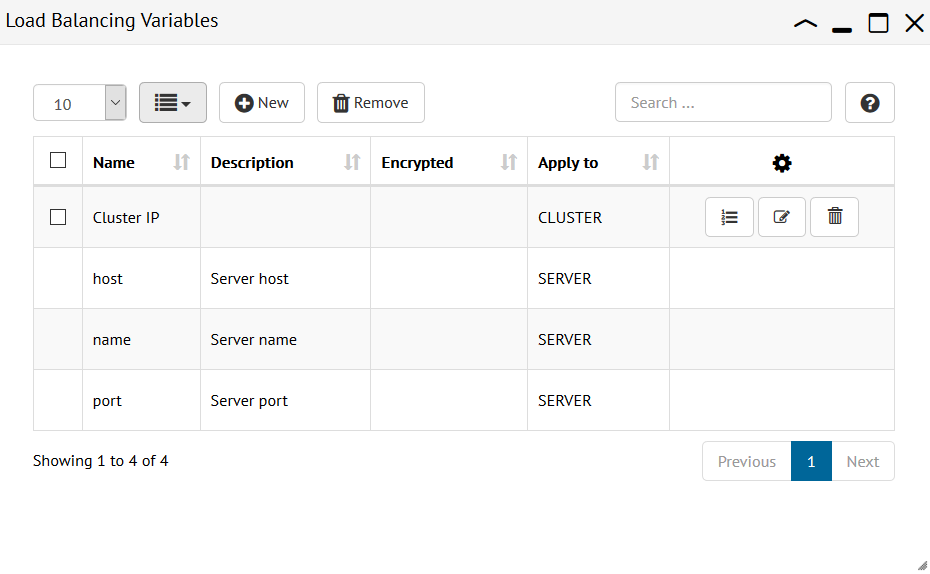
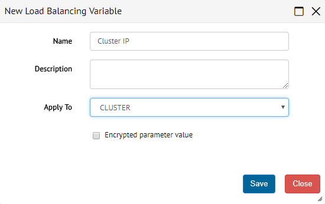
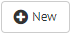
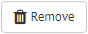

.. _sm_creating_load_balancing_variables:

*********************************
Creating Load Balancing Variables
*********************************

You can see the list of load balancing variables using the Solution Manager
Administration Tool. To do so, open the **Promotions** menu and click **Load
Balancing Variables**. 

    Open the table of load balancing variables

A new tab opens with the table of load balancing variables.

.. _load_balancing_variables_table:

    Table of load balancing variables

Initially, this table contains only the predefined load balancing variables.
You can create a load balancing variable using the button |new-text-btn|. A
dialog opens and you should provide the following parameters:

* **Name**: Descriptive name of the load balancing variable.
  
* **Description**: Extensive description of the load balancing variable. This
  field is optional.

* **Apply To**: Select which element the load balancing variable applies to:
  
  - *CLUSTER* variables are defined for every cluster. You can use them as
    parameters of any deployment script.

  - *SERVER* variables are defined for every Virtual DataPort server. You can
    use them as parameters of those deployment scripts that enable or disable
    servers in the load balancer.

* **Encrypted parameter value**: If selected, the value of the load balancing
  variable will be stored in encrypted format.

    Dialog to add or edit load balancing variables

You can edit or remove the load balancing variables that are not predefined. To
edit a variable, click the button |edit-btn|. To remove it, use the button
|remove-btn|. In addition, you can select several variables using their
check boxes and remove them all by clicking the |remove-text-btn| button in the
table header.

Finally, you can customize the information that this table shows:

* Configure the number of results to show in each page.
* Configure the columns to display.
* Execute a quick search using the search box located at the right top of the
  table.

