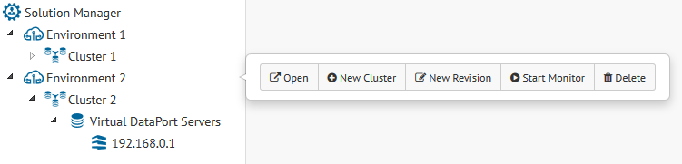
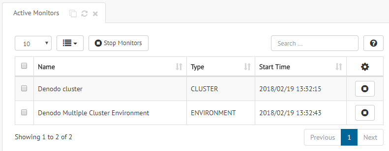
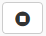

.. _sm-monitoring:

==========
Monitoring
==========

.. note:: Only administrators and JMX administrators (users with the role ``jmxadmin``)
   can execute monitoring operations.
   More information is available in the :ref:`Authorization` section.

With the Solution Manager you can launch the
Denodo Monitor to collect the execution logs from a single Virtual DataPort
server, or from all the servers of a cluster or environment.

To monitor an environment, a cluster or a server, click on that element and then, click
**Start Monitor**. The elements that are being monitored are marked with an "eye" icon next to the name of the element.

   Start Denodo Monitor for an environment

To stop the Denodo Monitor on an environment, cluster or server, click on that element and click **Stop Monitor**.

Take the following into account:

-  If a server is being monitored, you cannot begin monitoring its cluster or environment.

-  If an environment or cluster is being monitored,
   you cannot begin monitoring one of its clusters or servers.

-  When an environment or cluster is being monitored, the Denodo Monitor for that server, environment or cluster has to be restarted if you:

   -  Rename or delete a Virtual DataPort server.

   -  Add a new server or cluster to the environment.

   -  Delete a cluster from environment.

|

To see the list of elements that are being monitored, click the menu **Monitoring** > **Active Monitoring**.

   Active monitoring table

Each row of this table is an element that is being monitored. If the element is a cluster or an environment, the Denodo Monitor
will connect to all the servers of that cluster or environment.

To stop monitoring a server, click |stop-btn| or
select several rows and click **Stop Monitors**.

The Denodo Monitor generates the log files in the folder :file:`{<SOLUTION_MANAGER_HOME>}/resources/solution-manager-monitor/work`:

-  Log files of environments: :file:`{<EnvironmentName>}/{<timestamp>}/logs`

-  Log files of clusters: :file:`{<EnvironmentName>}/{<ClusterName>}/{<timestamp>}/logs`

-  Log files of servers: :file:`{<EnvironmentName>}/{<ClusterName>}/{<ServerName>}/{<timestamp>}/logs`

For example, if you monitor the environment "Production", the logs
are in the folder :file:`{<SOLUTION_MANAGER_HOME>}/resources/solution-manager-monitor/work/Production/{<timestamp>}/logs`.

.. csantos@2018/05/10: COMMENTED TO AVOID CONFUSING THE USER

   .. note:: The working directory folder is defined in property ``com.denodo.solutionmanagerserver.monitoring.workDir`` in file :file:`{<SOLUTION_MANAGER_HOME>}/conf/solution-manager/SMConfigurationParameters.properties`

Monitoring Configuration
========================

There are two configuration files for the Denodo Monitor of the Solution Manager, they are in the folder :file:`{<SOLUTION_MANAGER_HOME>}/conf/solution-manager/denodo-monitor`:

1. :file:`ConfigurationParametersGeneral.template`: general configuration template file.

#. :file:`ConfigurationParametersServer.template`: configuration template file with specific server properties (ping timeout, monitors, list of data sources to ping...).

Solution Manager generates a configuration file for each monitoring execution based on these template files. The generated file is called
:file:`ConfigurationParameters.properties` and it is stored in the :file:`conf` folder, in the working folder of the monitored element.

.. csantos@2018/05/10: COMMENTED TO AVOID CONFUSING THE USER
   .. note:: The Denodo Monitor resources directory of the Solution Manager is defined in property ``com.denodo.solutionmanagerserver.monitoring.resourcesDir`` in file :file:`{<SOLUTION_MANAGER_HOME>}/conf/solution-manager/SMConfigurationParameters.properties`. Solution Manager automatically decompress the Denodo Monitor file in that folder if needed when a monitoring process is launched. We will refer to the :file:`denodo-monitor` folder inside the resources directory as :file:`{<SOLUTION_MANAGER_DENODO_MONITOR>}`. By default, :file:`denodo-monitor` folder is :file:`{<SOLUTION_MANAGER_HOME>}/resources/solution-manager-monitor/denodo-monitor`.

JDBC Logging Configuration
==========================

You can configure the Denodo Monitor to store the information generated by the Queries monitor and/or the Cache monitor in a database. When you enable this feature, Denodo Monitor will keep storing this information in the log files.

To enable this feature, follow these steps:

1. If you never monitored any Denodo server, cluster or environment, start monitoring one server. This will initialize the configuration of this module.

#. Copy the JDBC driver of the database (i.e. its jar file(s)) to the folder :file:`{<SOLUTION_MANAGER_HOME>}/resources/solution-manager-monitor/denodo-monitor/lib`.

#. Go to the folder :file:`{<SOLUTION_MANAGER_HOME>}/resources/solution-manager-monitor/denodo-monitor/sql` and pick the script of the database where you want the logs to be stored.

#. Execute this SQL script on the database. This script creates the tables REQUEST_NOTIFICATION and CACHE_NOTIFICATION.

#. Edit the file :file:`{<SOLUTION_MANAGER_HOME>}/conf/solution-manager/denodo-monitor/ConfigurationParametersGeneral.template`:

#. To store in the database the information of the "Queries Monitor", do this:

   i. Set the property ``vdpqueries.jdbcagent.enable`` to ``true``

   #. Look for the group of properties of the database you are going to use and uncomment its properties. For example, if you want to use MySQL, look for "JDBC Agent Parameters: MySQL" and uncomment the nine properties below. Change the following properties (do not modify the others):

      1. ``vdpqueries.jdbcagent.url``: set to the URL to the database.
      2. ``vdpqueries.jdbcagent.user``: set to the user name that will connect to the database.
      3. ``vdpqueries.jdbcagent.password`` set to the password of the user name that will connect to the database.

         To enter the password encrypted, open a command line and run this:

         For Windows:

         .. code-block:: batch

            cd <SOLUTION_MANAGER_HOME>\resources\solution-manager-monitor\denodo-monitor\bin
            encrypt_password "<password of the database>"

         For Linux:

         .. code-block:: bash

            cd <SOLUTION_MANAGER_HOME>/resources/solution-manager-monitor/denodo-monitor/bin
            ./encrypt_password.sh "<password of the database>"

         Copy the result of this program to the property ``vdpqueries.jdbcagent.password`` and set ``vdpqueries.jdbcagent.password.encrypted`` to ``true``.

#. To store in the database the information of the "Cache Monitor":

   i. Set the property ``vdploadcacheprocesses.jdbcagent.enable`` to ``true``.

   #. Repeat the same steps above, but for the properties whose name start with ``vdploadcacheprocesses``.

