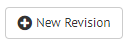
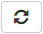

.. _sm_creating_revisions:

******************
Creating Revisions
******************

.. note::
   Only global administrators, promotion administrators, promotion users and
   developers can create revisions. More information is available in the
   :ref:`Authorization <Authorization>` section.

A revision is a collection of Virtual DataPort catalog elements and Scheduler
tasks. There are several ways to create a revision from the Solution Manager
Administration Tool:

* Click the source environment |environment_node| and select
  the |new-revision-text-btn| option.

  .. figure:: new_revision_access.png
     :align: center
     :alt: Create a revision by clicking the source environment
     :name: Create a revision by clicking the source environment

     Create a revision by clicking the source environment

* Go to the :ref:`revisions table <sm_revisions_table>` by clicking in the
  **Promotions** menu and then **Revisions**.
  
  .. figure:: ../../common_images/promotions_menu.png
     :align: center
     :alt: Open the revisions table 
     :name: Open the revisions table

     Open the revisions table

  Then click the |new-revision-table-btn| button on the header of the table and select the
  source environment.

  .. figure:: ../../common_images/new_revision_access_table.png
     :align: center
     :alt: Create a revision by clicking the "New Revision" button in the revisions table
     :name: Create a revision by clicking the "New Revision" button in the revisions table
  
     Create a revision by clicking the "New Revision" button in the revisions table

A new tab opens with the *New Revision* dialog, which looks like the picture
below:

   Dialog to create a new revision

The dialog is separated in two sections. In the `General` pill you can configure
the basic options about a revision: the name, the source servers... In the
`Revision Elements` pill you can select what elements you want to promote.
To create a revision, fulfill the forms in both sections and remember to click
the save button |save-btn| on the top.

Once created, each revision consists of:

* A VQL with the Virtual DataPort elements selected, if any.
* A zip with the Scheduler tasks selected, if any.
  
General Options
===============

In the `General` section, you can configure the following options:

- **Name**: Descriptive name for the revision.

- **Description**: Extensive description about the revision. This field is
  optional.

- **Type**: There are two types of revisions according to what the Solution
  Manager should do with the elements during the deployment:

  1. **CREATE**: The elements in the revision will be created during the
     deployment.

  #. **DROP**: The elements in the revision will be removed during the
     deployment.

- **Virtual DataPort server**: Server in the catalog that will be the source
  for the Virtual DataPort elements.

- **Use the default Virtual DataPort Server database**: If selected, the
  Solution Manager will connect the database defined in the server metadata when
  shows the Virtual DataPort elements.

- **Virtual DataPort server database**: Database used by the Solution Manager
  when connects to the server to show the Virtual DataPort elements, if
  **Use the default Virtual DataPort Server database** is disabled.

- **Scheduler server**: Server in the catalog that will be the source for the
  Scheduler tasks. This field is optional.

- **Replace/Drop Virtual DataPort elements**: For **CREATE** revisions, you can
  choose different strategies that will affect how the VQL for Virtual DataPort
  elements is generated:

  + *Drop elements before creating them*: The generated VQL will try to delete
    each element before creation. If the element does not exist, the ``DROP``
    command will fail.
  
  + *Replace existing elements*: The generated VQL will try to replace each
    element. Unlike the previous option, if the element does not exist, the
    ``CREATE OR REPLACE`` command will not fail. This is the recommended option
    in most of the cases.

  + *Do not replace existing elements*: The generated VQL will only try to
    create each element. If the element exists, the ``CREATE`` command will
    fail.

- **Included elements**: For *CREATE* revisions, you can choose which extra
  elements will be included in the VQL for Virtual DataPort elements.

  + **Include server properties**: If selected, the properties that can de modified of the Virtual DataPort server will be included in the generated VQL.

  + **Include web container properties**: If selected, the tomcat properties that can be modified will be included in the generated VQL.

  + **Include jars**: If selected, those jars that are dependencies of elements
    in the revision, because of a custom function for instance, will also be
    included in the generated VQL.

  + **Include statistics**: If selected, those statistics already calculated
    for elements in the revision will be included in the generated VQL.

  + **Include VDP dependencies**: If selected, the revision will include the selected elements
    and the elements that they depend on (underlying views, data sources, etc.). For example, if you select this
    option and a derived view, the revision
    will also include all the elements needed to recreate this view (other views, base views, data sources...). 
    
    This option does not apply to users, roles or Scheduler jobs.

Additional Options
==================

The :ref:`Virtual DataPort properties<Configuring Virtual DataPort Properties>` allow to parameterize information of certain elements inside the VQL (data sources, users...). For example, on each environment (development, testing, production...), JDBC data sources may point to different databases, XML data sources to different files, etc. The JDBC base views are a special case, being possible to configure if the `catalog` and `schema` are exported as properties or not.

In the *Additional Options* section, you can configure the option *Include environment properties* for catalog and schema names in JDBC base views`. Select this checkbox if the name of the catalogs and/or schemas of your JDBC data sources are different in the source and the target environment. The generated VQL will contain the information of `schema` and `catalog` parameterized with properties, as you can see in the following VQL:
  
.. code-block:: sql

    CREATE OR REPLACE WRAPPER JDBC jdbcviewtest
    DATASOURCENAME=test_ds
    CATALOGNAME='${databases.admin.views.jdbc.jdbcviewtest.CATALOGNAME}' 
    SCHEMANAME='${databases.admin.views.jdbc.jdbcviewtest.SCHEMANAME}' 
    RELATIONNAME='jdbcviewtest' 
    OUTPUTSCHEMA (
        id_field = 'id_field' :'java.lang.Integer' SORTABLE
    );

In this VQL, the values for `CATALOGNAME` and `SCHEMANAME` are included as properties. In this case you will need to register the corresponding properties for each JDBC base view included in the revision in the target environment, in order to replace each property with the corresponding value during a deployment.

**If the source and target environment share catalog and schema, clear this check box**. The generated VQL for the revision will contain directly the value for the `schema` and the `catalog` instead of a property.

Revision Candidate Elements
===========================

Once you selected a Virtual DataPort server and optionally a Scheduler server,
you can go to the *Revision Elements* pill and select all the elements and tasks
that the revision will include.

Under the title *Selected elements*, the Solution Manager Administration Tool
shows you all the candidate elements you can select in the following order: 

  |yes| Virtual DataPort databases.
  
  |yes| Associations.
  
  |yes| Scheduler tasks. The only tasks considered for revisions are *VDP Cache* and
  *VDP Indexer*.
  
  |yes| Users. Default users are ignored.
  
  |yes| Roles. Default roles are ignored.

The following types of elements are not included in the revision candidate elements tree:

  |No| Resource Manager plans and rules.
  
  |No| Widgets.
  
  |No| JMS listeners.

The rules and plans of the :ref:`Resource Manager <vdp_admin_resource_manager>` cannot be included in a revision. The reason is that the servers of each environment should have their own rules and plans.

   Revision candidate elements example

You can reinspect the metadata source clicking the refresh button |refresh-btn|.

.. important:: 
   The list of candidate elements and tasks depends on the permissions of the
   user that connects to the servers. Remember that in the dialog of
   :ref:`server definition <sm_creating_servers>`, you can choose which user is
   used for creating revisions, the one defined in the server metadata or the
   one that is logged in the Solution Manager.

Virtual DataPort Databases
--------------------------

In the list of candidate elements, the content of Virtual DataPort databases is
hidden by default. You have to expand a database, clicking its corresponding
arrow, to show all the elements it contains.

   Revision database elements example

Notice that the Solution Manager Administration Tool does not display all the
elements that belong to a database. Currently, the only elements that are
supported for revisions are:

* Database configuration: This option allows to include the specific database configuration in 
  the revision VQL. This option is only displayed in *CREATE* revisions for the databases where
  the user used to connect to the Virtual DataPort server has ``dbadmin`` privileges. If this option 
  is available, it is displayed as the first element inside a database (*Include database configuration* node).

* Data sources.

* Folders.

* User-defined stored procedures.

* Views.

* Web services. In *CREATE* revisions, the list of candidate web services only
  considers those web services that are actually deployed. *DROP* revisions
  show all the web services. Moreover, you can select individual operations or
  resources.

Elements Dependencies Tree
--------------------------

The selected elements in the revision may have dependencies with another
elements that probably you also want to include. For instance, a view may depend
on other views or on a data source. The Solution Manager Administration Tool
allows you to check the dependencies for some of the candidate elements. In the
*Selected elements* tree, click the element for which you want to check its
dependencies, and they will appear in a hierarchical view under the title
*Dependencies tree*. When you select elements in the *Dependencies tree*, they
are automatically selected in the *Selected elements* tree. If the selected elements
belong to a database whose content was not loaded yet, the database content is loaded and
the elements are selected.

.. note::   
   If you select *Include VDP dependencies*, the VDP elements shown in 
   the dependency tree are disabled. The users, roles and Scheduler jobs are 
   never disabled.

It is possible to check the dependencies of the following elements:

* Scheduler tasks. You can see the views for a *VDP Cache* task.
  
  .. figure:: dependencies_scheduler.png
     :align: center
     :alt: Scheduler cache tasks dependencies
     :name: Scheduler cache tasks dependencies
  
     Scheduler cache tasks dependencies

* Views. The dependencies of a view include other views, data sources,
  stored procedures and those associations where the view participates as an end
  point. Additionally, if a Scheduler task depends on a view, the dependency
  tree will also show that task.

  .. figure:: dependencies_views.png
     :align: center
     :alt: View dependencies
     :name: View dependencies
  
     View dependencies

* Web services operations. The dependencies of a web service operation include another 
  views, data sources, stored procedures and those associations where the published 
  view participates as an end point.

  .. figure:: dependencies_webservice.png
     :align: center
     :alt: Webservice operation dependencies
     :name: Webservice operation dependencies
  
     Webservice operation dependencies

* Associations. The dependencies of an association include the views of the endpoints and the dependencies of those views.

  .. figure:: dependencies_associations.png
     :align: center
     :alt: Association dependencies
     :name: Association dependencies
  
     Association dependencies

* Users: You can see its roles as dependencies. Note that the predefined roles
  are ignored.
  
  .. figure:: dependencies_users.png
     :align: center
     :alt: User dependencies
     :name: User dependencies
  
     User dependencies

.. |environment_node| image:: ../../common_images/environment-node.svg 
                      :width: 30px

.. |save-btn| image:: ../../common_images/save-btn.png 

.. |no|  image:: ../../common_images/no.png

