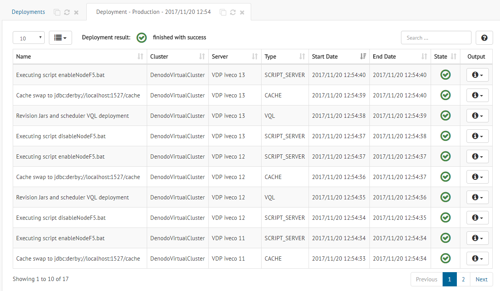
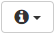

.. _sm_deployment_progress:

*******************
Deployment Progress
*******************

.. note:: Only global administrators, promotion administrators and promotion users
          can check the progress of a deployment. More information is available
          in the :ref:`Authorization <Authorization>` section.

The Solution Manager can show you the evolution of a specific deployment. You
can access this information in two different ways:

* Right after launching a deployment from the
  :ref:`Revisions table <Deploy Revisions>`, a notification appears. Click it.

* From the :ref:`Deployments table <sm_deployments_table>`, click the icon under
  the column **Status**.

No matter the method you used, a new tab will open with all the information
about that specific deployment.

   Progress information about a deployment

This information consists of a set of tasks that the Solution Manager executes
during the deployment. For each task, the following data is available:

* Its **name**.

* The **cluster** where the task is executed.

* The **server** where the task is executed.

* Its **type**, which can take one of the following values:

  - **SCRIPT_CLUSTER**. Execution of the script to disable or enable a cluster
    in the load balancer.

  - **SCRIPT_SERVER**. Execution of the script to disable or enable a server in
    the load balancer.

  - **VQL**. Execution of the VQL commands of a revision.

  - **SCH**. Import scheduler metadata.
  
  - **DATACATALOG_SYNC**. Data Catalog server metadata synchronization.

  - **CACHE**. Perform the cache swap in a Virtual DataPort server.

  - **ROLLBACK**. Execution of rollback operation.

  - **BACKUP**. Generation of backup data after finishing the current deployment
    execution.

  - **SERVER_DEPLOYMENT**. The server was ignored because it was disabled.
    
  - **CLUSTER_DEPLOYMENT**. The cluster was ignored because it was disabled.

* Its **start date**. 

* Its **end date**.

* Its **state**:

  - |deployment_progress_pending| **Pending**.

  - |deployment_progress_in_progress| **In progress**.

  - |deployment_progress_skipped| **Skipped**. The task was not executed.

  - |deployment_progress_ok| **OK**.

  - |deployment_progress_error| **Error**.

  - |deployment_progress_warning| **Warning**. The task was executed but
    finished with a warning.
    
* Its **output**. You can check the output produced during the execution of a
  specific task or the error information, in case it failed. Click the
  |info-btn| icon and select the option you want from the emerging menu.

  .. figure:: deployment_execution_info.png
     :align: center
     :alt: Menu to access information about the execution of a deployment task
     :name: Menu to access information about the execution of a deployment task
  
     Menu to access information about the execution of a deployment task

  A new dialog will open with the information you selected.

