.. _sm_deployments_table:

*****************
Deployments Table
*****************
.. note:: Only global administrators, promotion administrators and promotion
          users can access the *Deployments* table. Promotion users
          can only see their own deployments. More information
          is available in the :ref:`Authorization <Authorization>` section.

To open the *Deployments* table, click the **Promotions** menu and then
**Deployments**.

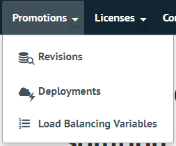

   Open the *Deployments* table

A new tab will open, where you can check all the information about deployments
and perform any available operation with each one of them, according to its
current state.

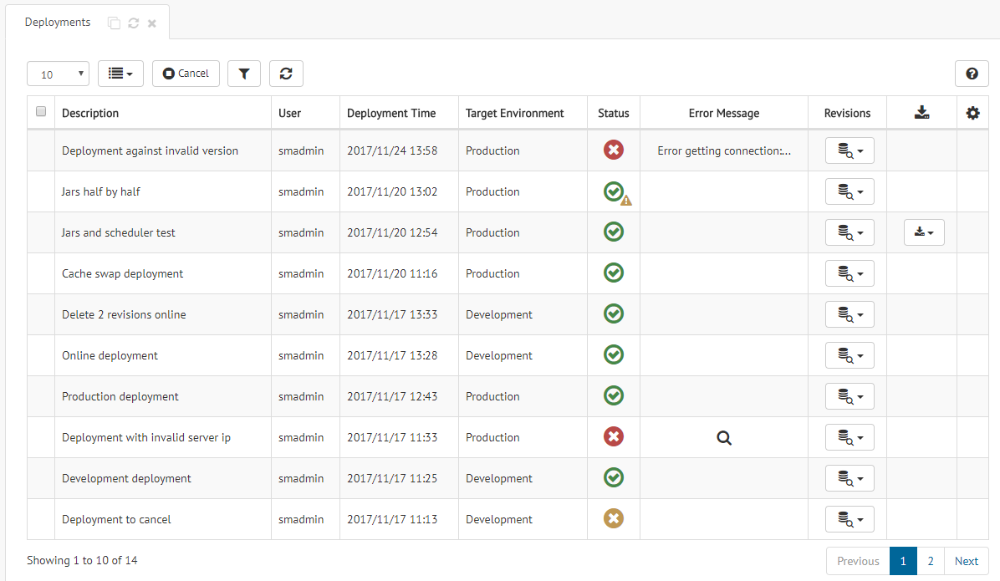

   Example of *Deployments* table

The Solution Manager displays the following information about a deployment:

* Its **description**.

* The **user** that executed the deployment.

* Its **creation time**.

* The **target environment** where the deployment was executed.

* Its **status**, which can take one of the following values:

  - |deployment_pending| **Pending**.

  - |deployment_in_progress| **In progress**.

  - |deployment_cancelled| **Canceled**.

  - |deployment_ok| **OK**.

  - |deployment_ok_warning| **OK with warnings**. The deployment finished correctly
    but some operation could not be completed; for instance, backup generation.

  - |deployment_error| **Error**.

* An **error message** if some error happened.

The following sections explain in detail the operations that you can execute on
deployments from this table.

Cancel Deployments
==================

To cancel one or several deployments, select them and click the
|cancel-text-btn| button.

.. note:: Note that you can only cancel deployments whose status is *pending* or
          *in progress*.

Filter Deployments in the Table
===============================

To apply a filter to the results in the table, click the |filter-btn| button and
fulfill the form in the dialog below.

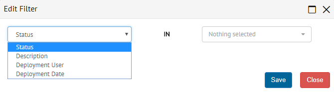

   Filter deployments dialog

A new tag like |filter-tag| will appear above the table to represent what it is
filtering. You can edit the filter clicking its name or remove it clicking its
|remove-filter| button.

You can create more than one filter. The table will show only those deployments
that verify all the filters defined.

Check the Progress Summary of a Deployment
==========================================

To access the :ref:`progress summary <sm_deployment_progress>` of a specific
deployment, click the icon under the **Status** column.

See the Errors of a Deployment
==============================

Under the column **Error Message** you can check the errors for an unsuccessful
deployment. If the deployment finished with a single error, the column will
contain the error message. If the message is too long, you can see the whole
text in the tooltip for that column.
    
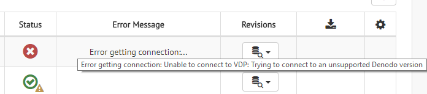

   Unsuccessful deployment with a single error

If the deployment finished with more than one error, this column will show a
|search-btn| button. Click it to see all the information about the errors.

See the Revisions of a Deployment
=================================

To see the revisions of a deployment, click the |revisions-btn| button. You can
click on one of the revisions that appear in the emerging menu and a new tab
will open with all the information about that revision in read-only mode.

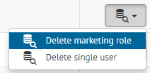

   Revisions of a deployment

Download Backup Data for a Deployment
=====================================

If the option **Save VCS backup when the deployment finishes** is enabled for
the :ref:`target environment <Configuring Deployments>`, a backup is generated
and stored at the end of the deployment, even when a problem occurred. You can
download this backup, which consists of a VQL for Virtual DataPort and a zip
with tasks for Scheduler. Click the |download-btn| button and select the
corresponding option in the emerging menu.

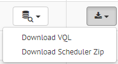

   Download the backup data for a deployment

.. |deployment_pending| image:: ../../common_images/pending-status.png

.. |deployment_in_progress| image:: ../../common_images/progress-status.png

.. |deployment_ok| image:: ../../common_images/ok-status.png

.. |deployment_error| image:: ../../common_images/error-status.png

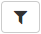

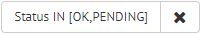

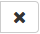

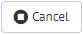

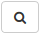

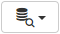

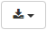
