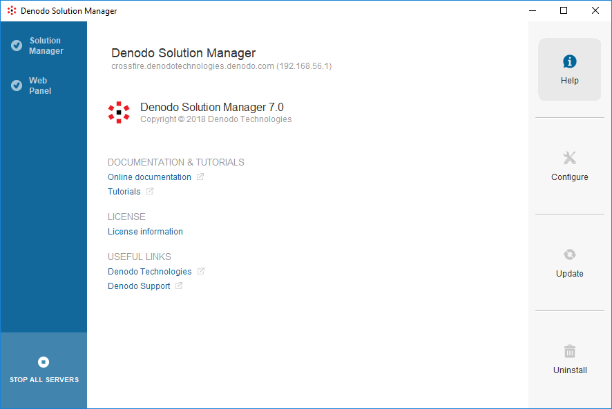

===================
Control Center Help
===================

In the **Help** screen of the Denodo Platform you can do the following:

-  Click **Online documentation** to open the documentation of the Denodo Platform (opens a window in your browser).
-  Click **Tutorials** to open Denodo tutorials in your web browser.
-  Click **License information** to display the terms of the license. This only lists the information that affects this installation (terms for the local Solution Manager and Virtual DataPort). To obtain the full list of servers granted by this license, open the Solution Manager administration tool.

   Denodo Platform Control Center Help screen
