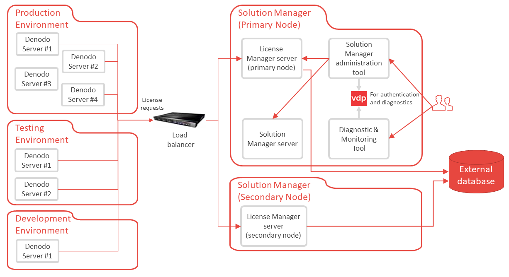

=================
High Availability
=================

This section explains how to achieve high availability (HA) in the License Manager. This post-installation task is optional but highly recommended unless you are only testing this tool.

When a Denodo server component starts (e.g. a Virtual DataPort server, the Scheduler server...), it requests permission to run. To do this, the component sends an HTTP request to the License Manager with details about the host where the component is going to run (host name, IP address, number of cores, etc.). If approved, the component starts.

Periodically, each component sends a request to the License Manager to keep running. If for some reason, the License Manager does not respond (e.g. the host where the License Manager runs is down), there is a *grace period* of 5 days. During this period, the Denodo server still works and it keeps trying to renew the license. After 5 days of the License Manager not responding, the component shuts down.

    
    High availability architecture with the License Manager

In this architecture, the License Manager is the single point of failure so we recommend setting up a secondary License Manager and make all the Denodo Platform servers to connect to them using a load balancer, not directly.

The License Manager supports the **active-passive**. This means that the load balancer has to be configured to redirect all the requests to the primary License Manager; and if the primary License Manager fails, to send the requests to the secondary License Manager.

To do this, follow these steps:

.. note:: Your license must allow running two License Manager servers in *active-passive* HA configuration.

1. Log into the Solution Manager administration tool you just installed and configure it to use an external database. The section :ref:`Setting-Up an External Database` explains how to do this.
   
   This License Manager of this installation will be the primary License Manager.

2. In another host, use the same installer to install the component *Solution Manager*. You do not need to install the *Web Panel* component, nor the *Diagnostic and Monitoring Tool*.
   
   This will be the secondary node for the License Manager.
   
   For this secondary installation, use the same license file you used for the primary Solution Manager.
   
3. Log into the Solution Manager administration tool *of the secondary node* and configure it to use the same external database as in step #1.
   
4. In the secondary node, after configuring the external database, stop all the components, except the *License Manager server*. The Solution Manager is not meant to be used on a cluster, only the License Manager is.

5. In the load balancer of your organization, configure the two License Managers on an *active-passive* configuration. By default, the License Manager runs on the port 10091.

   To detect if the primary License Manager server is up, send a GET request to ``https://<solution manager host>:10091/pingLicenseManager`` (see :ref:`sm_api_ping_solution_manager` for more details). If the server is up and configured correctly, this endpoint returns the HTTP code 200. Otherwise, the request fails.

6. Configure your existing Denodo Platform installations to point to the virtual host name defined for both License Managers, in the load balancer.

.. important:: In the load balancer, only configure the License Manager server to work with high availability, not the Solution Manager server nor its administration tool. They are not designed to run on a cluster.

The section :ref:`Updating Solution Manager with High Availability` provides best practices regarding how to update a cluster of License Managers.
