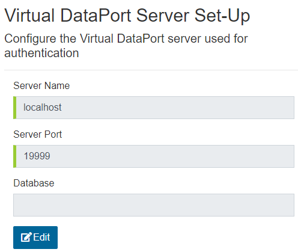
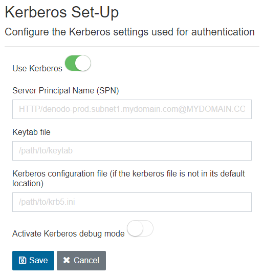
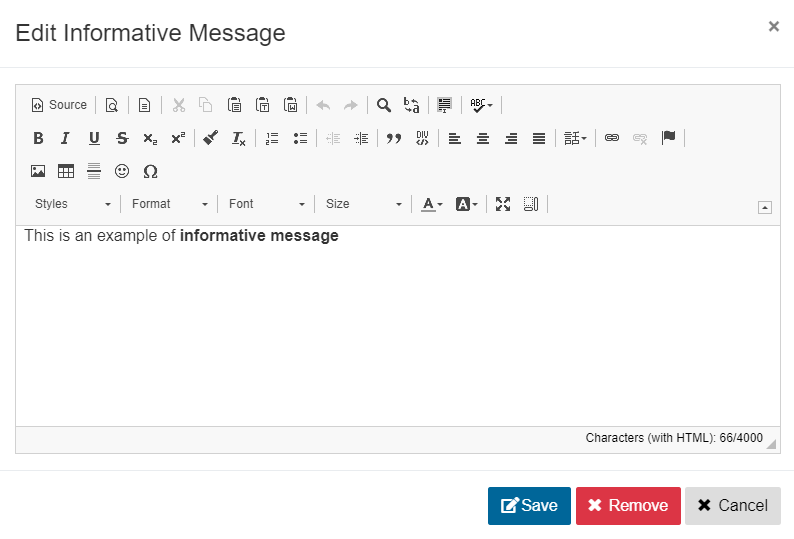
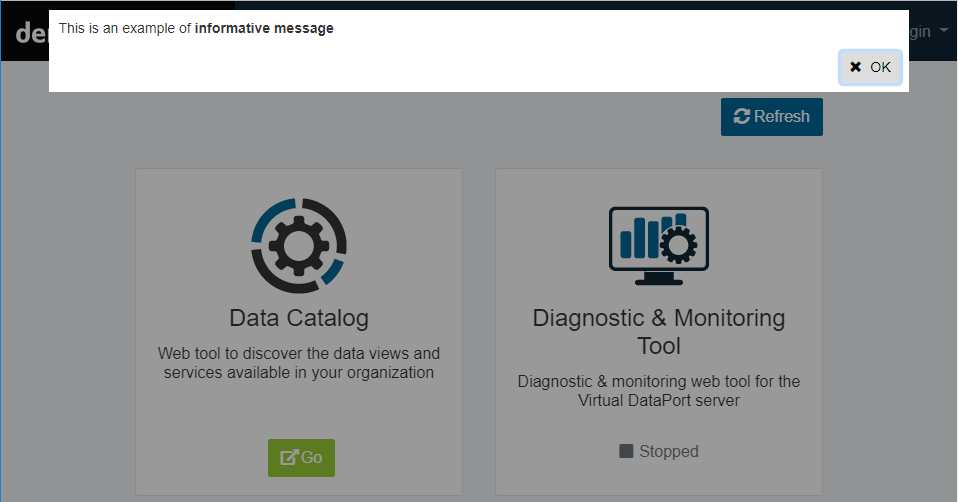

=============
Configuration
=============

.. note:: These options are only available when accessing the Web Panel
   in administration mode. That is, by going to the URL \https://dv-server.acme.com/webpanel/#/admin.
   If you enabled Kerberos authentication, you have to access the Web Panel using the 
   *Fully Qualified Domain Name* defined by the configured 
   *Server Principal Name* and not an alias (e.g. \https://denodo-prod.subnet1.acme.com/webpanel/#/admin)

To access the configuration of the Web Panel:

1. Go to \https://denodo-prod.subnet1.acme.com/webpanel/#/admin
#. On the top-right, click **Login** and enter your credentials (not necessary if you enabled Kerberos authentication).
#. On the top-right, click **Configuration**.
   
Virtual DataPort Server Set-Up
==============================

In this section you can change the settings for accessing the Virtual DataPort
Server that will be used for authentication.

Click **Edit** to change the **Server Host**, **Server Port** and **Database**
parameters. **Database** is optional: it is the name of the Virtual DataPort 
server database which should be used for authentication (this is useful when 
the database uses LDAP authentication).

   
   Virtual DataPort Server Set-Up

Kerberos Set-Up
===============

To enable Kerberos authentication on the Web Panel, do this:

1. Click **Edit** in the **Kerberos Set-Up** panel.
#. Enable **Use Kerberos**.
#. Enter the **Server Principal Name** (SPN).
#. Enter the full path to the **Keytab file**. Do not enter a relative path.
#. Optionally, enter the full path to the krb5 file.
#. Optionally, you can **Activate Kerberos debug mode**.

The sections :ref:`Setting-up Kerberos Authentication` and 
:doc:`Providing a Krb5 File for Kerberos Authentication</solution_manager/installation/appendix/providing_a_krb5_file_for_kerberos_authentication/providing_a_krb5_file_for_kerberos_authentication>`
provide more details about this.

   
   Kerberos Set-Up

Informative Message Set-Up
==========================

You can add an informative message that will be displayed to all users when they access the Web Panel. It will show up at the top of the page.

It can be used to display a welcome message, inform users when the service is expected to be down for maintenance, legal disclaimers, etc.

To configure the informative message, click **Edit Informative Message**.

   
   Informative Message Set-Up

To enter the message in HTML, click **Source** in the editor, enter the HTML and click **Source** again (the *Save* button is disabled while in *Source* mode).

   
   Informative Message
