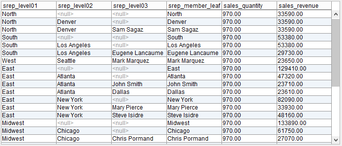

==========================================================================
Creating a Multidimensional Base Views Over a Multidimensional Data Source
==========================================================================

The following figure displays the different elements of a
Multidimensional Database and how they are represented in Virtual
DataPort.

   Elements of a cube of a multidimensional data source (1)

To create a base view that retrieves data from a cube, open the
“Multidimensional Data Source” dialog and select at least, a hierarchy
and a measure of the cube. After selecting the appropriate elements,
click **Import**. The Tool will create a base view for each group of
elements of a cube (|image1|). Each view will have:

-  A field for each level (|image2|) of each selected hierarchy (|image3|)

-  A field for each selected measure (|image4|)

-  A field for each selected attribute (|image5|). Attributes are also
   known as “Dimensions properties”.

-  A field for each selected variable (|image6|) of each dimension (|image7|). The required 
   variables are selected in the “Create base view” dialog and cannot be 
   deselected.

For example, let us say that we have a cube called ``InfoCube`` (see
`Elements of a cube of a multidimensional data source (2)`_).

We are going to create a base by selecting the following elements of
this cube:

-  The hierarchy ``IO_SREP hierarchy`` (``Sales representative``
   dimension), which has three levels.
-  The ``Sales revenue`` measure
-  The ``Sales quantity`` measure

   Elements of a cube of a multidimensional data source (2)

After selecting the elements, the Tool displays a dialog where you configure 
how Virtual DataPort retrieves the data from SAP BW and what data is required. These
options are available for the hierarchy selected at previous step.

The following figure displays the different configurations:

   
.. note::

   This dialog is only available for SAP sources.

If the **Leaf Members Only** check box is cleared,
the schema of the base view will have five fields: one for each level of
the hierarchy and one for each measure (see the following image). The
section :ref:`“Leaf Members Only” Option` explains in
detail the effect of selecting or clearing this check box.

   Creating a multidimensional base view

The following figure displays the result of querying this view.

   Result of querying a multidimensional base view

Note the hierarchical meaning of the values of the ``srep_level01``,
``srep_level02`` and ``srep_level03`` fields. The elements of the
``srep_level01`` level are regions like “East” or “Midwest”, which have
cities like “Atlanta” or “New York” (``srep_level02``) and these cities
have sales representatives like “Samuel Jackson” or “John Smith”
(``srep_level03``).

.. _my-reference-label_1:

“Include Empty Rows” Option
=================================================================================

The queries to base views may return many empty rows when the data of
the cube is sparse. You can avoid obtaining the combinations of members
whose measures do not have value. To do this, clear the **Include empty
rows** check box of the “Multidimensional Data Source” dialog. Do this
when creating the base view, before clicking the button “Create selected
base views”.

.. note:: This option is configurable at second step for SAP adapters.

.. _my-reference-label_2:

“Leaf Members Only” Option
=================================================================================

When creating an SAP BW base view, if the “Leaf Members Only” check box is 
selected, the base view will only have
one field for the leaf level of each hierarchy instead of
having one field for each level of each hierarchy. That is, the levels of
the hierarchies that are not leaf will be ignored (only when “Leaf Label Only” is also checked)

.. note:: This option is configurable per hierarchy with SAP adapters.

For example, let us say that we have a cube called ``InfoCube`` (see
`Creating an SAP BW base view with "Leaf Members Only" enabled (1)`_) and we select the hierarchy ``IO_SREP hierarchy``
(``Sales representative`` dimension) and the measures ``Sales revenue``
and ``Sales quantity``.

If we select the **Leaf Members Only** check box,
the base view will have three fields instead of five: one for the
``Level 03`` of the hierarchy and one for each measure.

   Creating an SAP BW base view with "Leaf Members Only" enabled (1)

   Creating an SAP BW base view with “Leaf Members Only” enabled (2)

The benefits of creating a base view with the “Leaf Members Only” option enabled are the following:

-  The rows corresponding with the partial aggregates of non-leaf levels
   are removed from the result. In our example, the aggregate sales for
   all the sales representatives of the Midwest region, the aggregate
   sales for all the sales representatives in New York, etc. are removed
   from the result.
   
   This may be considered a more natural “relational view” of the data
   in the cube, since those aggregates can be seen as superfluous. I.e.
   they can be computed from the rows corresponding with the leaf
   levels. This is especially true when the origin data is relational in
   nature (e.g. ODS objects).
-  When this option is selected, Virtual DataPort can push down more
   complex conditions to SAP BW, without needing to use the “MDX Query”
   option.

“Leaf Label Only” Option
=================================================================================

If the **Leaf Label Only** is selected when creating a Multidimensional base view, 
the view schema contains only the leaf level of the selected hierarchy. If
the option is not selected, the entire hierarchy is added to the view. Nevertheless, 
the MDX query delegated to SAP only aggregates by the leaf level.

.. note:: This option is only available for the multidimensional data
   sources whose adapter is SAP BW (BAPI) or SAP BI (BAPI) and it is configurable per hierarchy.  

For example, let us say that we have a cube called ``InfoCube`` (see
 `Creating an SAP BW base view with "Leaf Members Only" enabled (1)`_) and we select the hierarchy ``IO_SREP hierarchy``
 (``Sales representative`` dimension) and the measures ``Sales revenue``
 and ``Sales quantity``.
 
If you clear the **Leaf Label Only** check box, the base view will have one field per level at selected hierarchy.

   Creating an SAP BW base view without "Leaf Label Only" (1)

 
   Creating an SAP BW base view without "Leaf Label Only" (2)

The following figure displays the result of querying this view.
   

  Result of querying a multidimensional base view without leaf label only

Note that results have the aggregates only for field ``srep_level03``, but also the ancestors
of these values are present at returned data.

"Member captions" Option
=================================================================================

If the **Member captions** check box is selected when creating a
Multidimensional base view, the members will be 
represented by using its caption. Captions usually have more business-friendly 
values but may be ambiguous (duplicated captions could exist). 

.. note:: This option is only available for the multidimensional data
   sources whose adapter is SAP BW (BAPI) and SAP BI (BAPI) and it is configurable per hierarchy.  
   
"Technical keys" Option
=================================================================================
 
If the **Technical keys** check box is selected when creating a
Multidimensional base view, the members will be represented
by using its technical key. If the option is left unchecked, then the members 
caption will be used. If the **Member captions** checkbox is also selected, then 
the new base view will have an extra field for each selected hierarchy. 
The name of this extra field will be like “<level name>_tech_key”. Captions usually have more business-friendly values but
may be ambiguous (duplicated captions could exist). 
 
.. note:: This option is only available for the multidimensional data
  sources whose adapter is SAP BW (BAPI) and SAP BI (BAPI) and it is configurable per hierarchy.
 
For example, let us say that we have a cube called ``InfoCube`` (see
`Creating an SAP BW base view with "Leaf Members Only" enabled (1)`_) and we select the hierarchy ``IO_SREP hierarchy``
(``Sales representative`` dimension) and the measures ``Sales revenue``
and ``Sales quantity``.

If we select the **Technical keys** check box, the base view will have one field extra for the technical key.

   Creating an SAP BW base view with "Technical Keys" enabled (1)

  Creating an SAP BW base view with "Technical Keys" enabled (2)

The following figure displays the result of querying this view.

   Result of querying a multidimensional base view with technical keys

Note that values for fields ``srep_level03`` and ``srep_level03_tech_key`` are the
captions and the technical keys respectively. 

      
"Member leaves" Option
=================================================================================
 
If the **Technical keys** check box is selected when creating a
Multidimensional base view, the schema of the new base view will have an extra 
field for each selected hierarchy. This field will hold the value of the leaf level 
of the row. This is useful if you are working with “ragged dimensions”. 
In ragged dimensions, each value of the dimension can have different depth. 
The implication is that when a base view created over a ragged dimension is 
queried, you do not know which field of the view will hold each leaf value. 
This makes it difficult to execute queries in which you want to filter by the 
leaf value of the dimension. Thanks to this option, you can filter by the leaf 
values of a dimension using this extra field. The name of this extra field will 
be like “<dimension name>_member_leaf”. 
You can only select this option if you clear “Leaf Members Only”. 
 
.. note:: This option is only available for the multidimensional data
  sources whose adapter is SAP BW (BAPI) and SAP BI (BAPI) and it is configurable per hierarchy.
 
For example, let us say that we have a cube called ``InfoCube`` (see
`Creating an SAP BW base view with "Leaf Members Only" enabled (1)`_) and we select the hierarchy ``IO_SREP hierarchy``
(``Sales representative`` dimension) and the measures ``Sales revenue``
and ``Sales quantity``.

If we select the **Member leaves** check box, the base view will have one field 
extra for the member leaf of the hierarchy.

   Creating an SAP BW base view with "Member leaves" enabled (1)

  Creating an SAP BW base view with "Member leaves" enabled (2)

The following figure displays the result of querying this view.

   Result of querying a multidimensional base view with member leaves

Note that values for field ``srep_member_leaf`` contain the leaf value of the hierarchy 
for each row.

.. _my-reference-label_3:

“Include Member Keys” Option
=================================================================================

If the **Include member keys** check box is selected when creating a
Multidimensional base view, the schema of the new view will have an
extra field for the leaf level of each hierarchy. In each row, the value
of this extra-field will be the technical name of each member.

.. note:: This option is only available for the multidimensional data
   sources whose adapter is SAP BW (BAPI) and SAP BI (BAPI) and it is configurable per hierarchy.

For example, let us say that we have a cube called ``InfoCube`` (see
`Creating an SAP BW (BAPI) base view with "Include Member Keys" selected
(1)`_) and we select the hierarchy ``IO_SREP hierarchy``
(``Sales representative`` dimension) and the measures ``Sales revenue``
and ``Sales quantity``.

If we select the **Include member keys** check box and the **Leaf Members Only**, the base view will have four fields:
one for the “Level 03” of the hierarchy (``srep_level03``), one for each
measure (``sales_quantity`` and ``sales_evenue``) and ``srep_key``,
which will contain the technical name of the member.

   Creating an SAP BW (BAPI) base view with "Include Member Keys" selected (1)

   Creating an SAP BW (BAPI) base view with "Include Member Keys" selected (2)

The benefit of creating a base view with the "Include Member Keys" check
box selected is that you will be able to filter not only by the business
name, but also by the technical name of the members of dimension. In the
view created in `Creating an SAP BW (BAPI) base view with "Include Member Keys" selected (2)`_, you can filter by these:

-  The business name: by adding a ``WHERE`` condition with the field
   ``srep_level03``.
-  The technical name (attribute that has the same name as the level,
   but ending with “\_key”): by adding a ``WHERE`` condition with the
   field ``srep_key``.

Take into account that filtering by business name may return different
results than filtering by technical name. The reason is that in a
dimension, there may be several members with the same business name, but
the technical name is always unique.

SAP Metadata Cache
=================================================================================

Virtual DataPort caches the metadata of SAP to speed up the queries to
multidimensional base views.

The first time you query an SAP base view, Virtual DataPort caches the
value (also called “caption”) and the technical name of all the members
of the hierarchy that was selected when creating the view.

Later, when a query to this view filters by the caption of a member, the
Server searches in the SAP Metadata Cache, the technical name of the
members whose caption is the value provided in the query. Then, it will
use this technical name to build the MDX query sent to SAP. The benefit
of filtering by the technical name is that SAP processes these queries
more efficiently than if the queries filter by the caption of the
member.

Note that filtering by the technical name of a member may not lead to
the same result as filtering by its caption. The reason is that
technical names are unique, but captions are not. Therefore, there may
be more than one member with the same caption.

This cache is automatically cleared when you restart the Virtual
DataPort server. You can also delete the contents of this cache at any
time, without restarting the Server. To do this, open the data source
and click the button **Clear metadata cache**. Alternatively, you can
invalidate the cache by executing a VQL command (see more about this
last option in the section :ref:`Invalidating the Metadata Cache of SAP BAPI
Data Sources` of the VQL Guide).

.. |image1| image:: ../../common_images/multidimensional_cube.png

