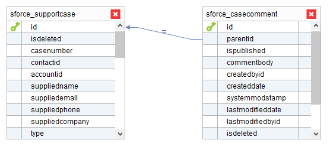
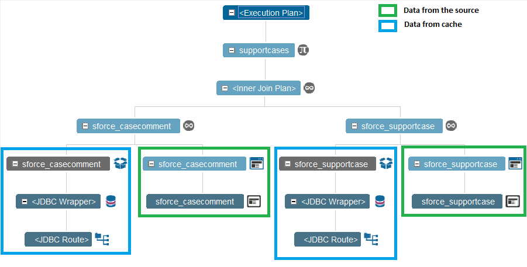
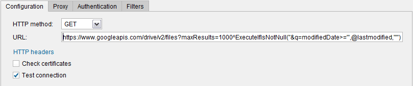
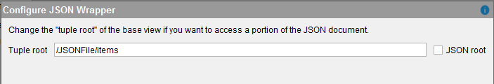
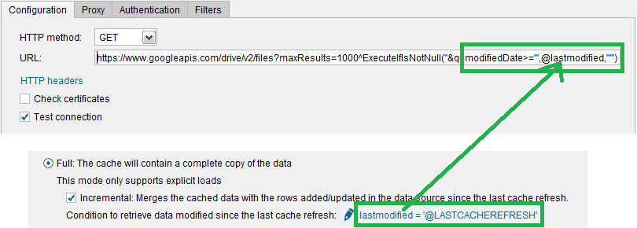

================
Incremental Mode
================

The incremental mode is a subtype of the full cache mode. With this mode
enabled, the queries to the view will be “incremental queries”. That is,
the queries to this view merge the results obtained from the cache with
the most recent data retrieved from the source. The main benefit of this
mode is that the queries will always return fully up to date results
without needing to retrieve the full result set from the data source,
just the rows that are added/changed since the last cache refresh.

This cache mode provides the option *Push down query conditions to the data source*. With this option,
the WHERE conditions of the queries that hit this view will be delegated to the source. This may
improve the performance of these queries. However, the result 
may not include data that was modified since last cache refresh. 
For example, there are cache data from a support case
which has a column indicating its status. Let us suppose that the cache data for a certain row has ``open`` as value and executed queries are filtering
by:
like ``status = 'open'``.
At this time, the support case is updated at source and its status value changed to ``closed``. If we have this option enabled, as conditions are 
being delegated to the source, returned data does not contain the updated row, so data is taken 
from the cache giving and outdated information. This option is disabled by default. 

To be able to use this mode, the view has to have a field that
contains when a row was last inserted/updated. For example, if the
view has a field ``last_modified_date``, you have to enter a condition
like ``last_modified_date > '@LASTCACHEREFRESH'``.

When executing the query, the variable ``@LASTCACHEREFRESH`` is replaced
with the timestamp of the last time a query to load the cache was
executed and finished successfully.

As it is a variant of the full mode, unlike with partial mode, the cache
of the view still needs to be loaded explicitly (i.e. you have to
execute a query with the appropriate parameters to load the cache). In
the same way, we recommend using Denodo Scheduler to preload the cache
of these views because it provides a wizard where you can select the
views whose cache you want to preload and how often.

Requirements a View Has to Meet to Support Incremental Queries
==============================================================

A view has to meet the following requirement to support the incremental
cache mode:

#. This option is only available for base views.
#. The base view must have a primary key.
#. The base view has to have one or more columns that indicate when the
   row was added or updated.
#. Virtual DataPort *must* support pushing down to the source conditions
   over these fields that indicate when each row was added/updated.
   
   At runtime, when a base view with incremental mode is involved in a query, the execution engine will send a query to the data source with a condition over these fields. For example,
   
.. code-block:: sql

   SELECT *
   FROM customer
   WHERE last_modified > 
       '<latest date when the cache of the view was refreshed>'.
   
..
  
   If the base view does not support pushing down this type of condition to the source, this cache mode is pointless and you should probably either do not use cache or use cache full. The reason is that if the condition cannot be pushed down to the source, the source will have to return the entire result set and then, the Server will filter out the results. Although the query will return the right results, it makes this option pointless because it does not make the query faster, nor diminishes the amount of data retrieved from the source.
   
5. The source cannot remove rows from the data; only add or update them.
   If rows are deleted in the source, the incremental queries will
   return the deleted rows until the cache of this view is invalidated
   and cached again. Many scenarios meet this requirement because rows
   are not actually deleted but instead, are marked as deleted or
   invalid.

How Incremental Queries Work at Runtime
=======================================

When you query a view whose cache mode is incremental, the execution
engine executes two queries:

#. A query to the cache database.
#. A query to the source with a WHERE condition like
   ``last_modified > '<latest date when the cache of the view was refreshed>'``.

Then, the execution engine processes the result as follows:

-  If the source and the cache return the same row, it returns the row
   of the source.
-  If the source returns row but the cache does not, it returns the row
   of the source. This means that this row has been inserted after the
   latest execution of the cache preload query.
-  If the cache returns a row but the source does not, it returns the
   row of the cache. This means that the row has not been updated since
   the latest execution of the cache preload query.

   This is why the queries to base views with incremental mode return the rows that have been already deleted from the source until the cached data is invalidated and loaded again. Virtual DataPort, just by executing a query, cannot differentiate the rows that have been deleted from the rows that have not been updated since the latest cache refresh.

A row from the cache and a row from the source are considered the same
if the values of the primary key are the same.

Example 1 of Use of Incremental Queries (Salesforce)
=================================================================================

Let us say that you store on Salesforce information about the support
cases opened by customers. Let us say that you created two Salesforce base
views:

-  sforce\_support\_case
-  sforce\_case\_comment

You can create the view support\_case that is a join view of these two:

   Incremental queries - example 1: support\_case view

In this scenario, to speed up the queries to the derived view
``support_case`` you can do the following:

1. On the two base views (not on the derived one), set the cache mode to
   “full incremental” with the condition

.. code-block:: sql
 
   last_modified_date > '@LASTCACHEREFRESH'

2. Define a new job on the Denodo Scheduler to preload the cache of the
   two base views at night, when the load of the Server is low (e.g. at
   1 AM).

During the day, when client applications query the view
``support_case``, the execution trace will be like the one below:

   
   Incremental queries - example 1: execution trace of the view support\_case

This execution trace shows that every branch of the main join is the
result of another join. These other joins are the result of joining rows
obtained from two places:

#. The source (the green boxes): the result of querying Salesforce with
   the condition ``last_modified_date > '@LASTCACHEREFRESH'``.
#. The cache database (the blue boxes): the data stored in the cache
   database.

This query returns completely up-to-date data in much less time.

Example 2 of Use of Incremental Queries (Google Drive)
=================================================================================

In this example, we are going to retrieve information about the
documents stored on a Google Drive account. To do so, we will create a
JSON data source that connects to the URL
\https://www.googleapis.com/drive/v2/files.

With this service, you can add a condition to the URL with the parameter
``modifiedDate``, which indicates the last time a document was modified.

For example:

   
   Incremental queries - example 2: data source configuration

.. code-block:: none

   https://www.googleapis.com/drive/v2/files?maxResults=1000^ExecuteIfIsNotNull("&q=modifiedDate>='",@lastmodified,"'")
 

The interpolation function ``ExecuteIfIsNotNull`` makes that when the
base view of this data source is queried, the data source will only add
the parameter ``q=modifiedDate...`` to the URL when the interpolation
variable ``lastmodified`` is not null. By doing this, we are making this
variable optional, so we can execute the view to retrieve all the files
from the source.

When creating the base view over this data source, in the “Configure
JSON Wrapper” dialog, enter the tuple root ``/JSONFile/items``.

   Incremental queries - example 2: creating the base view

After creating the view, you have to configure the cache of the view. To
do this,

#. Click **Options**
#. Click the cache mode **Full** and select the check box
   **Incremental**.
#. Click **no condition** (below the “Incremental” check box) and enter
   the condition ``lastmodified = '@LASTCACHEREFRESH'``.

   Incremental queries - example 2: configure the cache mode incremental
 
..

   Note that this condition uses the equality operator. The reason is that we want
   to assign the value of the interpolation variable ``@LASTCACHREFRESH`` to the interpolation 
   variable ``lastmodified``. Once the cache of this view is preloaded, when this view is queried, 
   the URL invoked by the execution engine will be like ``http://....&q=modifiedDate>=...`` 
   
   That 
   is, the comparison with the field ``modifiedDate`` will be done with the operator ``>=``.

4. From the VQL Shell, execute this command:

.. code-block:: sql
   :name: Incremental queries - example 2: creating the i18n map for the base view
   :caption: Incremental queries - example 2: creating the i18n map for the base view
   
   CREATE OR REPLACE MAP i18n rfc_3339_utc (
       'country' = 'US'
       'datepattern' = 'yyyy-MM-dd''T''HH:mm:ss.SSS''Z'''
       'doubledecimalposition' = '2'
       'doubledecimalseparator' = ''
       'doublegroupseparator' = ''
       'language' = 'en'
       'timezone' = 'GMT'
   );

..

   The datepattern attribute of this map is the pattern that the Google APIs use for date fields. This pattern represents:
   
   .. code-block:: none
   
      <year>-<month>-<day of the month>T<hour>:<minute>:<second>: <millisecond>'<time zone>'

5. Go back to the “Options” dialog of the view, click **Search methods**
   and in the **Default i18n** list, select ``rfc_3339_utc`` (the i18n
   map created in the previous step).
   
   At runtime, when the execution engine sends a URL to this source, it takes the 
   value of ``@LASTCACHEREFRESH``, which is a date value and converts it to a 
   string. It does so to replace ``@lastmodified`` of the URL with this value. 
   To convert this date value into a string it uses the date pattern of the i18n map of the view; 
   in this case ``rfc_3339``, which is the pattern the Google Drive API expects for date values.

