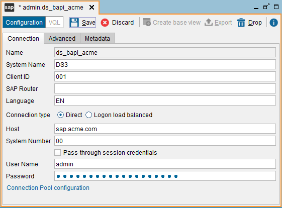
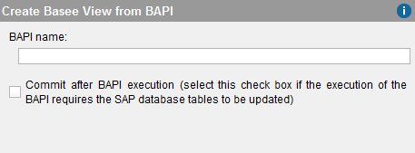

============
BAPI Sources
============

Virtual DataPort can invoke SAP BAPIs (Business Application Programming
Interfaces) to obtain data stored in SAP ERP and other SAP applications.

.. important:: Before creating any BAPI data source, follow the steps
   described in these sections of the Denodo Platform Installation Guide:

   #. :doc:`Installing the SAP JCo Connector <../../../../platform/installation/postinstallation_tasks/postinstallation_tasks_in_virtual_dataport/installing_the_sap_jco_connector>`
   #. :doc:`Grant Privileges on SAP for BAPI Sources <../../../../platform/installation/postinstallation_tasks/postinstallation_tasks_in_virtual_dataport/grant_privileges_on_sap_for_bapi_sources>`

To create a new BAPI data source, right-click on the Server Explorer and
click **New** > **Data source** > **BAPI**.

The Tool will display the dialog to create a new BAPI data source.

   Creating a new BAPI data source

In the tab **Connection**, enter the following details:

-  **Name**. Name of the new data source.

-  **System Name**. The SAP system ID of SAP ERP.

-  **Client ID**. Identifier of the client.

-  **SAP router** (optional). An SAP route string describes the stations of
   a connection required between two hosts. This string has the syntax

   ``(/H/host/S/service/W/pass)*``

   That is, any number of substrings in the form
   ``/H/host/S/service/W/pass``.

   This route has a substring for each SAP router and for the target
   server. Each substring contains the information required by each
   SAProuter to set up a connection in the route: the host name, the port
   name, and the password, if one was given.

   -  ``/H/`` indicates the host name
   -  ``/S/`` (optional) indicates the service (port). Default value:
      ``3299``.
   -  ``/W/`` (optional) indicates the password for the connection between
      the predecessor and successor on the route. Default value: “” (no
      password).

-  **Language** (optional). Language of the connection established with the
   SAP server.

-  **Connection type**:

   -  If the connection type is **Direct**, provide:

      i. **Host**. Host where SAP is running.
      #. **System Number**. Two-digit number that differentiates the SAP
         instances running on the same host.

   -  If the connection type is **Logon load balanced**, enter:

      i.  **Message Host**. Host of the SAP server that provides the data for
          choosing an appropriate application server.
      #.  **Message Service** (optional). Port where the “SAP Message server”
          listens to connections.
      #.  **SID**. System ID of the SAP system.
      #.  **Logon group** (optional). Name of the group of SAP application
          servers.

-  **Pass-through session credentials**. If selected, when a client queries
   a view that uses this data source, Virtual DataPort will use the
   credentials of the user to execute the BAPI, instead of the value of the
   fields “User name” and “Password”. The value of these fields will be
   used only when creating a base view from this data source, to connect to
   SAP to obtain information about the SAP BAPI of the base view.

   If you created the data source with this option, but you want to
   query a view of this data source with other credentials than the ones
   used to connect to the Server, add the parameters ``USERNAME``
   and ``USERPASSWORD`` to the ``CONTEXT`` of the query. These two
   parameters are only taken into account when the data source has been
   created with the option *Pass-through session credentials* enabled.

   For example, if ``view1`` has been created over a BAPI data source
   with this option enabled and you execute 
   
   .. code-block:: sql
   
      SELECT * 
      FROM view1
      CONTEXT(USERNAME = 'admin', PASSWORD = 'd4GvpKA5BiwoGUFrnH92DNq5TTNKWw58I86PVH2tQIs/q1RH9CkCoJj57NnQUlmvgvvVnBvlaH8NFSDM0x5fWCJiAvyia70oxiUWbToKkHl3ztgH1hZLcQiqkpXT/oYd' ENCRYPTED)

   the Server will connect to SAP with the username “admin” and the
   password “password”, ignoring the credentials that you used to connect
   to the Server.

   It is mandatory to add the token ``ENCRYPTED`` and enter the password encrypted. To encrypt the password, use the statement ``ENCRYPT_PASSWORD``. For example:
   
   .. code-block:: vql
   
      ENCRYPT_PASSWORD 'my_secret_password';

   When the data source is created with this option, the Server creates a
   pool of connections for each pair user/password. Initially, these pools
   only have one connection to prevent the creation of many connections.
   The maximum number of connections for each one of these pools is the
   value of the field “Max number of active connections” of the connection
   pool.

   .. warning::
      Be careful when enabling the cache on views that involve
      data sources with pass-through credentials enabled. The appendix
      :ref:`Considerations When Configuring Data Sources with Pass-Through
      Credentials` explains the issues that may arise.

-  **User Name** and **Password**. Credentials to access SAP ERP.

-  **Connection pool**. Click this to open the “Connections Pool
   Configuration” dialog and configure the pool of connections pool that
   Virtual DataPort uses to optimize access to the SAP ERP:

   -  **Maximum number of active connections**: maximum number of active
      connections in the pool.
   -  **Maximum number of idle connections**: maximum number of idle
      connections in the pool.
   -  **Maximum waiting time (milliseconds)**: maximum time a thread will
      wait to obtain a connection from the pool. When a query reaches this
      limit, the query that is requesting the connection will fail.
   -  **Minimum time between evictions (milliseconds)**: minimum amount of
      time that a connection sits idle in the pool before it is eligible to
      be closed and removed from the pool.
   -  **Minimum time before eviction (milliseconds)**: the Server examines
      periodically the idle connections of the pool to close them. This
      parameter indicates the minimum interval between these examinations.

In the **Advanced** tab, you can enable Secure Network Communications
(SNC) between the Virtual DataPort server and SAP. SNC provides stronger
authentication and encryption mechanisms than the default security
options of SAP.

   1. Select **Enable SNC**.

   2. Enter the path to the SAP Cryptographic Library. That is, the path to
      the file ``sapcrypto.dll`` (if the Server runs on Windows) or to the
      path to ``libsapcrypto.so`` (if the Server runs on Linux). You can
      download this library from the SAP website.

   3. Enter the **Partner name**. That is, the distinguished name of the SAP
      server.

   4. Select the **Security level**: SAP offers three levels of configuration
      and in addition, you have these options:

      a. **Use the value from snc/data\_protection/use**: uses the default
         security level set by the SAP server.
      b. **Use the value from snc/data\_protection/max**: uses the maximum
         level of security offered by the SAP server.

In the **Metadata** tab, set the folder where the data source will be
stored and provide a description.

When editing the data source, you can also change its owner by clicking
the button |image1|.

Click **Save** to create the data source.

After creating the data source, click **Create base view** to begin
creating the base view.

   Creating a BAPI base view

In this dialog, enter the name of the BAPI and click **Ok**. If this
BAPI inserts/modifies/deletes data from SAP, select the check box
**Commit after BAPI execution**. By doing this, when this base view is
queried, Virtual DataPort will run the BAPI ``BAPI_TRANSACTION_COMMIT``
*after* running the BAPI of this base view.

If running the BAPI of the base view does not modify the data, do *not*
select this check box. That way, every time this base view is queried,
Virtual DataPort will execute one BAPI instead of two, thus putting less
overhead over SAP.

After clicking **Ok**, the Tool will display the schema of the result of
the BAPI invocation. You can change the name of the new view and its
fields and after that, click **Save** (|image3|) to create the view.

If you want to change the “Commit after BAPI execution” option
for a base view that has already been created, open the view, click
**Edit** and then, **Source refresh**. The Tool will display the same
dialog as when you create a new SAP base view.

.. |image1| image:: ../../common_images/edit.png
.. |image3| image:: ../../common_images/save.png

