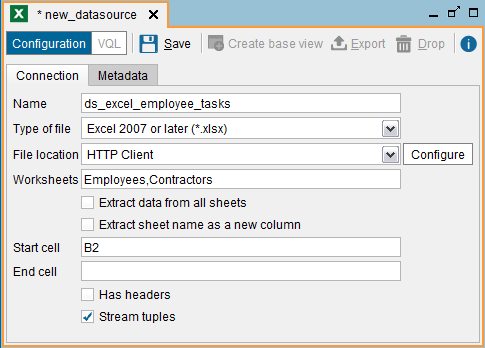

=============
Excel Sources
=============

The Excel data sources extract data from Excel files using the Apache
POI library (`Apache POI API - the Java API for Microsoft Documents
<http://poi.apache.org/>`_).

To create a new Excel data source, click **Excel** on the **File**
> **New** > **Data source** menu. The Tool will display the dialog to
create the data source.

   Creating an Excel data source

The following data are requested in this dialog:

-  **Name**. Name of the data source.

-  **Type of file**. Depending on the version of the file, the option
   “Stream tuples” will be enabled or not (see below).

-  **File location**. Path to the Excel file. This path can be
   parameterized according to the query made, using interpolation variables
   (see section :ref:`Paths and Other Values with Interpolation Variables`).
   The section :ref:`Path Types in Virtual DataPort` describes the formats of
   the available paths and how to use parameters in them.

-  **Worksheet** (optional). Name of the worksheet that you want to extract
   data from.

   If left empty, the base view will retrieve the data from the first sheet
   of the file.

   You can also enter a comma-separated list of sheets. E.g. “Sheet1,
   Sheet2”.

   
   If you want to extract data from all the worksheets of an Excel file,
   instead of just from one sheet, select **Extract data from all sheets**.
   In this case, the fields of the base view are determined by the columns
   of the first worksheet of the file. Therefore, you have to take into
   account the following:

   -  If the following sheets have more columns, they will be ignored.
   
      In the rows with data obtained from a worksheet that does not have a
      column that is present in the first worksheet, the values for this
      column will be NULL.

      For example, let us say we have an Excel file with two worksheets. The
      first sheet (Sheet1) has the columns A, B and C; and the second sheet
      (Sheet2) has the columns A, C and D.

      The base view will have will have the same columns as the first sheet
      of the file: A, B and C. When you query this view and Virtual DataPort
      extracts data from the second sheet of the file, it will do the
      following:

      -  It will return NULL for the values of the field B because the second
         sheet does not have it.
      -  The values of the column D will be ignored.

   -  These rules also apply when you enter more than one worksheet in the
      “Worksheets” box. In this case, the fields of the base view are
      determined by the columns of the first worksheet of this list.

-  Select **Extract sheet name as a new column** if you want the base
   view to have an extra column that will contain the name of the
   worksheet from which each row is obtained from. The default name of
   this extra column is “sheet\_name”.
   
   Knowing from which worksheet a row comes from is useful when the
   “Extract data from all sheets” option is selected.

-  **StartCell** and **EndCell** (optional): first and last cell of the
   sheet that will be processed.

   If “StartCell” is ``B2`` and “EndCell” is ``Z99``, the view will
   return the data in the range B2:Z99.
   
   If “StartCell” is ``B2`` and “EndCell” is empty, the view will
   retrieve all the data from the cell B2 to the end of the file.
   
   If “StartCell” is empty and “EndCell” is ``Z99``, the view will
   retrieve all the data in the range A1:Z99.
   
   If both parameters are empty, the view will retrieve all the data in
   the sheet.
   
   If you select the option “Extract data from all sheets”, the base view
   of this data source will return the data of this range of cells, of
   each worksheet of the file.

-  **Has headers**: select this check box if the first row of the retrieved
   data contains the name of the columns and not data.

-  **Stream tuples**: if selected, the file will be read using a SAX parser
   (only available for Excel 2007 files (\*.xslx)). If cleared, it will be
   read using a DOM parser.

   The benefit of the SAX parser over the DOM parser is that it has a very
   low memory footprint, which is important when working with big Excel
   files.
   
   Enabling or not “Stream tuples” affects the data types of the base view
   of this data source:

   -  If “Stream tuples” is cleared, the Server obtains the type of each field
      from the file’s metadata.

   -  If “Stream tuples” is selected, the Server infers the type of each
      column from the first rows of the file.

      The number of rows used to infer the types is controlled by the property
      ``com.denodo.vdb.contrib.wrapper.xls.event.content.introspection.maxrows``
      of the file :file:`{<DENODO_HOME>}/conf/vdp/VDBConfiguration.properties`.
      
      To change it, execute the following command from the VQL Shell:

.. code-block:: sql 

   SET 'com.denodo.vdb.contrib.wrapper.xls.event.content.introspection.maxrows'
   = '<number of rows>';

..

      When you select “Stream tuples”, the columns with date values will be
      always inferred as “text” fields. If you need to obtain “date” values,
      you have two options:

      i. Clear the “Stream tuples” check box. By doing this, the base view
         will infer columns with date values as fields of type “date”. The
         problem is that you lose the advantages of using the SAX parser
         (i.e. performance).
      
      #. Alternatively, create a Selection view over this base view and,
         using the ``TO_DATE`` function, convert the text value to a date
         value. See the appendix :ref:`date_processing_functions_to_date` of the VQL Guide for
         more information about this function.

In the **Metadata** tab, you can set the folder where the data source
will be stored and provide a description. When editing the data source,
you can also change its owner by clicking the button |image1|.

Click **Save** to create the data source. Then, click **Create base
view** to display the schema that the new base view will have. Click
**Save** to create the base view.

As opposed to other data sources, you can only create one base view over
an Excel data source. If you need to create another base view to obtain
data from the same file, create another Excel data source.

In the Administration Tool, the Excel data sources are considered a type
of data source. However, internally, they are Custom data sources. This
has several minor implications such as:

-  The VQL command to list the Excel data sources is LIST DATASOURCES
   CUSTOM, which returns a list of all the Custom data sources, not just
   the Excel ones.

-  When you export an Excel data source (right-click on the data source
   > Export), the selected type of source is “Custom”.

.. |image1| image:: ../../common_images/edit.png

