============
JDBC Sources
============

This section explains how to create JDBC data sources and later, create
base views over them. You will query these base views in order to
retrieve data from these data sources. It covers the following topics:

.. contents::
   :local:
   :depth: 1
   :backlinks: none

Importing JDBC Sources
=================================================================================

To create a data source that retrieves data from a JDBC source,
right-click on a database of the Server Explorer and click **New**
> **Data source** > **JDBC**.

The Tool will display the dialog to create the data source.

**“Connection” tab**

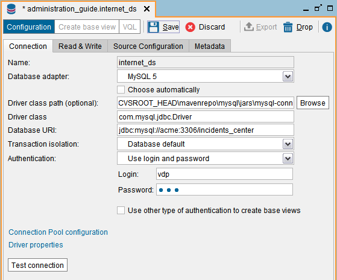

   JDBC data source: “Connection” tab

-  **Name**. Name of the new data source in Virtual DataPort. In our
   example, we will use the name ``phone_ds`` for the data source of the
   telephone service table. And ``internet_ds`` for the data source of the
   Internet service incidents table.

-  **Database adapter**. Adapter used to connect to the database.
   Virtual DataPort provides adapters to
   connect to Database Management Systems (DBMS). Each adapter
   knows the capabilities supported by the database: what operators and functions the database has, what clauses it supports, etc.

   The appendix :ref:`Supported JDBC Data Sources` lists the
   databases that are officially supported.

-  **Driver class path**. Unless you selected the adapter *Generic*, the default value is correct. Each adapter has a default value, which is the directory where Denodo will load the JDBC driver from.

   If the driver of the selected adapter is not included, copy it to the folder :file:`<DENODO_HOME>/lib-external/jdbc-drivers/{database name - version}`. For example, if you selected Teradata 15, copy the driver to :file:`<DENODO_HOME>/lib-external/jdbc-drivers/{teradata-15}`. You do *not* need to restart after copying the driver there. Sometimes a JDBC driver is a set of jars and in that case, you need to copy all of them to this folder.

   Check the table :ref:`JDBC Drivers supported by Virtual DataPort` of the appendix "Supported JDBC Data Sources" to see
   if Denodo includes the driver for the selected adapter.

   |

   Alternatively, you can enter a path to the jar file(s) of the JDBC driver. To do this, click **Browse** to select them. To select more than one jar, hold **Ctrl** and select each jar. You can also select a folder and all the jar files in it will be loaded. When clicking **Browse**, you browse the file system of the host where the Server is running and not where the Administration Tool is running.

   .. note:: Whenever possible, use the default value because it will facilitate migrating elements between environments (e.g. from development to testing). If you indicate the path to the driver instead of copying it to the appropriate folder, that path may not exist in the host to which you migrate this data source.

-  **Driver class**. Unless you selected the adapter *Generic*, the default value is correct. This is the Java class name of the JDBC driver.
   For example, for MySQL databases the value is ``com.mysql.jdbc.Driver``.

-  **Database URI**. Access URI to the database. In our example, we assume
   that both tables of incidents are stored in the database
   ``incidents_center`` of a MySQL server located in the machine “acme”.
   So, the URI is ``jdbc:mysql://acme/incidents_center``.

-  **Authentication**. The options are:

   -  **Use login and password**. The data source will connect to the database using the login and password you enter.

   -  **Use Kerberos**. The data source will connect to the database using Kerberos. Read the section `Connecting to a JDBC Source with Kerberos Authentication`_ for more information about this.

   -  **Use Pass-through session credentials**. If selected, when a client queries a view that uses this data source, the Virtual DataPort server will 
      use the credentials of the user to connect to this database. The behavior changes depending on the authentication method used to connect to the Server:

      -  If the client connects to the Virtual DataPort server using Kerberos authentication, the Server will request a Kerberos ticket to connect to the database 
         on behalf of this user. Note that for this option to work, the database must also support Kerberos authentication.

      .. important:: The queries involving this data source could fail if you enable pass-through
         session credentials, and on the Active Directory, the user account of the Virtual DataPort server is
         configured to use constrained delegation, and the user connects to the Server with Kerberos authentication.
         The section `Connecting to a JDBC Source with Kerberos Authentication`_ provides more details about this.

      -  If the client connects to the Virtual DataPort server using login and password, the Server will use this login and password to connect to the database.
         If the database only supports Kerberos authentication, select the option **This data source requires Kerberos authentication** and the Server will use
         the login and password to obtain a Kerberos ticket to connect to the database.

   The feature “pass-through session credentials” is only for queries. You have to provide the credentials that the Server will use to connect to the database during the introspection process (i.e. to display the tables/views of the database in the “Create base view” wizard of the data source). That is why, when you select this authentication method, the check box “Use other type of authentication to create base view” is automatically selected and cannot be cleared.

   If you created the data source with this option, but you
   want to query a view of this data source with other credentials than
   the ones you used to connect to the Server, add the parameters
   ``USERNAME`` and ``PASSWORD`` to the ``CONTEXT`` of the query.
   These two parameters are only taken into account when the data source
   has been created with the option *Pass-through session credentials*
   enabled.

   For example, if ``view1`` has been created over a JDBC data source
   with this option enabled and you execute

   .. code-block:: vql

      SELECT *
      FROM view1
      CONTEXT(
          USERNAME = 'admin'
        , PASSWORD = 'd4GvpKA5BiwoGUFrnH92DNq5TTNKWw58I86PVH2tQIs/q1RH9CkCoJj57NnQUlmvgvvVnBvlaH8NFSDM0x5fWCJiAvyia70oxiUWbToKkHl3ztgH1hZLcQiqkpXT/oYd' ENCRYPTED)

   the Server will connect to the data source of the view with the
   username “admin” and the password “password”, ignoring the credentials
   that you used to connect to the Server.

   It is mandatory to add the token ``ENCRYPTED`` and enter the password encrypted. To encrypt the password, use the statement ``ENCRYPT_PASSWORD``. For example:

   .. code-block:: vql

      ENCRYPT_PASSWORD 'my_secret_password';

   When the data source is created with this option, the Server creates a
   pool of connections for each new user that runs a query involving this data source. Initially, these pools
   only have one connection to prevent the creation of many connections.
   The maximum number of connections for each one of these pools is the
   value of the field “Max Active” of the connection pool. See information
   about the **Connections Pool Configuration** dialog below.

   .. warning:: Be careful when enabling the cache on views that involve
      data sources with pass-through credentials enabled. The appendix
      :ref:`Considerations When Configuring Data Sources with Pass-Through
      Credentials` explains the issues that may arise.

   .. note:: If the database is Oracle, consider enabling the option *Use Oracle Proxy authentication* instead of *Pass-through session credentials* because it will potentially reduce the number of connections opened to Oracle.

-  **Use other type of authentication to create base views**. Select if you want to use a
   different authentication method to connect to the database during the introspection
   process (i.e. to display the tables/views of the database in the “Create base view” wizard of the data source).

-  **Use Oracle Proxy Authentication** (only with the Oracle adapters). Select to use the feature "proxy authentication" of Oracle. The section :ref:`How Oracle Proxy Authentication Works` explains how this feature works.

   This option does not affect introspection. I.e. When you click *Create base view*, the data source will use the credentials of the data source to connect to the database and list the views, not the user name of the current user.

-  **Transaction isolation**. Isolation level of the transactions and
   queries executed in the database of this data source. The available
   options are:

   -  **Database default**. The Server uses the default isolation level of
      the database.
   -  **No transactions**. Disables transaction support.
   -  **Read uncommitted**. A transaction can read data that is not
      committed (dirty reads).
      For example, a transaction *A* inserts a row in a view, transaction
      *B* reads the new row and then, transaction A rollbacks.
   -  **Read committed**. The database keeps write locks until the end of
      the transaction so a transaction can read only committed data and
      dirty reads cannot occur. However, the database releases read locks as soon as the ``SELECT``
      operation ends, so the same ``SELECT`` query may return different
      results in the same transaction (non-repeatable reads).

      For example, transaction A reads a row and transaction B changes this
      row. If transaction A reads this row again, it will obtain different
      values.

   -  **Repeatable read**. The database keeps read and write locks until
      the end of the transaction. Therefore, it avoids dirty reads and
      non-repeatable reads. However, this isolation level does not avoid
      phantom reads. This problem occurs when one transaction executes a
      query over a range of rows using a condition, while another
      transaction can simultaneously insert a row in the same range.
   -  **Serializable**. This is the highest isolation level and avoids
      dirty reads, non-repeatable reads and phantom reads by locking range
      of rows or the entire tables.

-  If **Test Connection** is selected, the Server tries to connect to the
   source to verify that it can be accessed.

|

Optionally, you can set the driver properties of the connection. To do this, 
click **Driver properties**. This dialog shows all the properties supported by the driver with its default value. Some drivers also provide a description for each property and the values allowed for the property; the dialog displays this in the tooltip. To restore the default value of a property, clear its value.

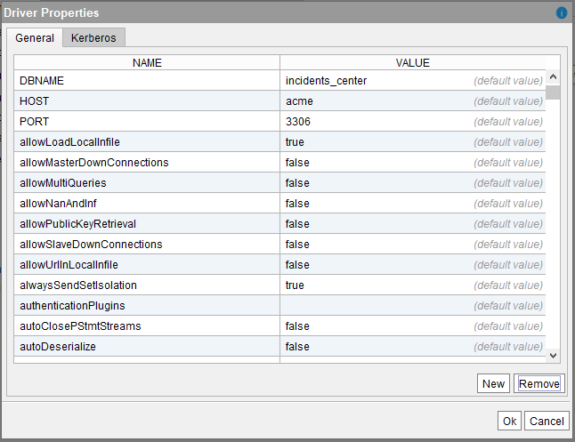
   
   JDBC data source: “Driver properties” dialog

|

In order to optimize the connections to the databases, by default
Virtual DataPort creates one pool of connections to the database of each
data source (one pool per JDBC data source). The benefit of having this
pool is that, instead of opening a new connection every time it has to
send a query to this database, the connection is already opened. This
improves the response time of the queries.

See more about information about this connection pool in the section :ref:`The Pool of Connections of the JDBC Data Sources` of the VQL Guide, including:

-  Information about settings of the pool that can only be modified with VQL statements, not graphically.
-  Options you should enable when there is a firewall between the host where the Denodo server runs and the database.

Open the **Connections Pool Configuration** dialog to configure several
parameters of the connections pool that Virtual DataPort will use to
optimize access to the external database:

-  **Initial Size**: number of connections with which the pool is to
   be initialized. A number of connections are established and created in
   “idle” state, ready to be used.

   .. note:: When the data source is created with “Pass-through session
      credentials” enabled, the value entered in this field is ignored. The
      Server will create one pool of connections for each user account that connects to this database
      and initially, these pools will only have one connection instead of
      “Initial size” connections, in order to prevent creating too many
      unnecessary connections.

-  **Maximum number of active connections**: maximum number of active
   connections to this database that the pool will open. Once this limit is
   reached, the next request that involves sending a query to this database
   will have to wait until another query finishes.

   -  Enter -1 to remove the limit of maximum number of active connections
      to this data source. There will not be a limit on the number of
      connections that the pool creates.
   -  Enter 0 to disable the pool.

-  **Ping Query**: SQL query executed over the connections returned by
   the pool of connections to verify that the connection returned is still
   valid and not stale.

-  **Test Connection**: if this check box is selected and there is a
   specified ping query, each connection retrieved from the connection pool
   will be validated by executing the ping query.

   .. important:: The connections will *only* be validated if the field
      “Ping query” contains a query. Otherwise, they will not even if this
      check box is selected.

.. note:: In production environments, we strongly recommend selecting
   the **Test connection** check box and defining a **Ping query**.

- **“Read & Write” tab**

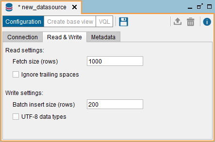

   JDBC data source: “Read & Write” tab

-  **Fetch size (rows)**: it gives the JDBC driver a hint as to the number
   of rows that should be fetched from the database when more rows are
   needed.
   This parameter is just a hint and some drivers ignore it. E.g. Microsoft
   JDBC driver for SQL server ignores this hint and as a workaround, you
   can use the jTDS adapter for SQL Server.

-  **Stream tuples** (only with the MySQL adapters): if selected,
   when querying a view of this data source, MySQL will stream the results
   to the Server one row at a time. Otherwise, MySQL does not send the
   results of the query to the Virtual DataPort server until the query
   finishes.

   Select this check box if you plan to execute queries over this data
   source that may return large data sets, which may not fit in the heap
   space of the Server’s Java Virtual Machine. If this is not the case,
   clear this check box because it will probably result in faster execution
   times.

-  **Ignore trailing spaces**: if selected, the Server removes the space
   characters at the end of ``text`` type values of the results returned by
   this data source’s views.

-  **Delimiter identifier (optional)** (only with the adapter *Generic*): with the adapter *Generic*, in the queries sent to the database, the character to surround identifiers is ``"`` (double quote) by default. To use a different character, enter it in this box.

-  **Batch insert size (rows)**: when this data source is the target of a
   Data Movement, the Server inserts data obtained from another data source
   into this one. To speed up the data movement, the INSERT statements are
   executed in batches. The value of this property is the number of INSERT
   statements in each batch.

   This value is ignored if the value of the source configuration property
   “Supports batch inserts” is “no” (the default value is “yes”).

   See more about Data Movement in the section :ref:`Data Movement`.

   This property does not affect ``INSERT`` requests sent to the base views
   of this data source because these requests are not executed in batches.

-  **UTF-8 data types**: when the Server performs a data movement and this
   data source is the target, the Server creates a table in the
   database of this data source to store the data obtained from the other
   data sources. The impact of selecting or clearing this check box depends
   on the types and subtypes of the fields:

   -  For the fields whose subtype is defined, the Server will define the
      field in the target table with the subtype of the field. For example, if
      the subtype of a text field is VARCHAR and its size is 200, the Server
      will define the field as VARCHAR(200).

   -  For the fields whose subtype is undefined:

      -  If the type of the field is *not* text, the data type to store them is
         always the same regardless of whether this check box is selected or not.
         The Server uses the appropriate type depending on the database used for
         caching, but for the same database, the type is the same.

      -  For the fields of type text whose subtype is undefined, one of this can
         happen:

         1. If “UTF-8 data types” is *selected*, the Server will define the field
            in the target table with a data type that can store all the UTF-8
            characters. These data types use more space in the database that
            regular text data types.
         #. If “UTF-8 data types” is *cleared*, the Server will define the field
            as VARCHAR.

   In the “Summary” tab of a view, the tooltip of the “Field type” column
   displays if the subtype of the field is defined or not: if it just shows
   a field type (int, text, date, etc.), the subtype is undefined. If the
   tooltip also has the label “Source type properties”, the subtype of the
   field is defined.

   The data types capable of storing all the UTF-8 characters use more disk
   space in the database.

-  **Use external tables for data movement** (only available for data
   sources of Netezza databases): if selected, Virtual DataPort will use
   the Netezza’s “external tables” feature to transfer data into the
   Netezza database, during data movements.

   This option should be enabled in all Netezza data sources, in both its
   “Read settings” and “Write settings”.

   The section :ref:`Data Movement` explains what data movements are.

   The section :ref:`Data Movements From/To Netezza Databases` explains the
   behavior of Virtual DataPort when the target of the data movement is a
   Netezza database.

-  **Use Bulk Data Load APIs** (only available for some database adapters): if
   selected, when this database is the target of a data movement, Virtual
   DataPort will use the proprietary API of the database to load data onto
   the database instead of executing ``INSERT`` statements.

   The section :ref:`Bulk Data Load` explains how Virtual DataPort uses these
   APIs.

-  **Query optimization settings** (only available for some database adapters): the options below control if the query optimizer is allowed to insert data obtained from other data sources into this database to be able to push more operations to this database instead of executing them locally, in the Virtual DataPort server.

   -  **Do not allow Denodo to create temporary tables in the data source for query optimization**: the query optimizer will not move data into this database to execute queries.

   -  **Allow creating temporary tables, only for the data movement optimization**: if selected, the optimizer
      may select this data source as the destination of :ref:`data movements<Data Movement>`.

   -  **Allow creating temporary tables to allow parallel processing of any operation** (only for some parallel databases): if selected, the optimizer
      may select this data source as the destination of data movements. In addition, it may create temporary tables with data to push down :ref:`massive parallel operations<Parallel Processing>` to this database. If selected, make sure that:

      i. The Virtual DataPort server and the database are in the same network segment to ensure the data is transferred fast between both systems.
      #. You selected the check box *Use bulk data load APIs* on this data source so the data is inserted as fast as possible into this database.

**“Source Configuration” tab**

This tab is only visible when editing a data source, not when creating a
new one.

In this tab, you can configure specific behaviors of the data source
such as:

-  Which operations are delegated to the database (executed in the
   database instead of in Virtual DataPort)
-  Which operations this data source has support for.

The section :doc:`/vdp/administration/creating_data_sources_and_base_views/data_source_configuration_properties/data_source_configuration_properties` explains these
properties in more detail.

.. note:: In most cases, the default value for these options is correct.
   Therefore, this dialog will only be useful in very specific
   environments.

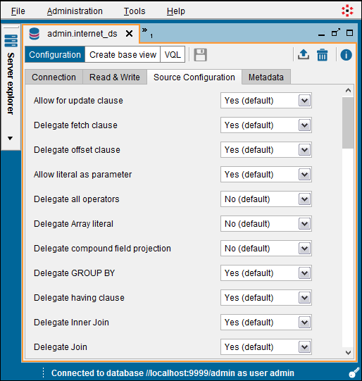

   JDBC data source: “Source Configuration” tab

**“Metadata” tab**

In the **Metadata** tab, you can set the folder where the data source
will be stored and provide a description.

When editing the data source, you can also change its owner by clicking
the button |image3|.

Database Specific Information
=================================================================================

This section contains information you have to take into account when
creating a data source to one of the following databases.

Amazon Athena and Presto
--------------------------

Amazon Athena and Presto do not support comparing numeric fields with text fields because they do not support
implicit casting of data types. This limitation occurs if you are comparing a field with a literal, or a field with another field.
If you compare two literals, the query is executed correctly. To solve this limitation, cast one of the values to the correct type.

For example, let us say we have the table ``customer`` with this schema:

.. csv-table:: 
   :header: "Field Name", "Field Type"
   
   "id", "VARCHAR(50)"
   "name", "VARCHAR(50)"
   "address", "VARCHAR(100)"

The following query fails because the field ``id`` is a ``VARCHAR`` (text) and the value ``200`` is an integer.

.. code-block:: sql

   SELECT * 
   FROM customer
   WHERE id < 200;

To make this work, modify the query or the definition of the view so the query delegated to the data source is like:

.. code-block:: sql

   SELECT * 
   FROM customer
   WHERE CAST(id as integer) < 200;

Cassandra
---------

Due to a limitation of the driver provided by Cassandra, the queries with a WHERE condition involving a field of type UUID fail.
However, obtaining the values of this type works well (they are processed as text values).

Elasticsearch
-------------

Elasticsearch has the following limitations:

-  **Filtering over GROUP BY results**: Elasticsearch does not support queries that have a subquery with a 
   GROUP BY and the outer query projects the fields involved in the GROUP BY.

   For example, let us say you have the view ``test`` with these fields:

+-------------------+--------------------------------------+
| id                | text                                 |
+===================+======================================+
| 1                 | Lorem ipsum dolor sit                |
+-------------------+--------------------------------------+
| 2                 | amet, consectetur                    |
+-------------------+--------------------------------------+
| 3                 | adipiscing elit. Nullam              |
+-------------------+--------------------------------------+
| NULL              | NULL                                 |
+-------------------+--------------------------------------+

   The following query fails:
   
   .. code-block:: sql
   
      SELECT *
      FROM (
          SELECT id
          FROM TEST
          GROUP BY id
      )
      WHERE id = 3

   Find more information at https://github.com/elastic/elasticsearch/issues/36939. 
  
-  **Aggregation over an empty result set**: the aggregation function ``sum`` returns 0 instead of ``null`` when is applied over a result set without rows.

  For instance, using the table ``test`` defined above, the following query returns ``0`` instead of ``null``:
  
  .. code-block:: sql
  
     SELECT SUM(id) FROM TEST WHERE id = 400;
  

   Find more information at https://github.com/elastic/elasticsearch/issues/31887

-  **COUNT takes into account null values**: in the versions prior to 6.6.0 of Elasticsearch, the aggregation function ``count(column)`` takes into account the ``null`` values when it should ignore them.

-  **Comparing null function results**: comparing the result of applying a null value to a function and the operators ``is null`` and ``is not null`` do not work for scalar functions (in the WHERE clause) and aggregate functions in the HAVING clause. 

   For instance, using the table ``test`` defined above:

   .. code-block:: sql
      
      -- It returns 0 rows but it should return 1
      SELECT id, AVG(id) FROM TEST GROUP BY id HAVING AVG(id) IS NULL;
      
   .. code-block:: sql
      
      -- This query returns four rows but it should return three.
      SELECT id, AVG(id) FROM TEST GROUP BY id HAVING AVG(id) IS NOT NULL;

  Find more information at https://github.com/elastic/elasticsearch/issues/35139 
      
-  Operators:

   -  **CONTAINS**: in Elasticsearch, this operator only can resolve exact searches. It is necessary that text field is defined with an analyzer which index individual terms.
   -  **LIKE**: this operator works as expected when text field is defined with modifier the ``"analyzer": "keyword"`` because field analyzer takes into account the whole text instead each term separately (the behavior by default when defining text fields).
   
-  Date/time pattern customization: VDP allows to customize date/time format which Elasticsearch source is using. You can customize format date/time fields for:

   -  **LocalDate**: ``com.denodo.vdb.engine.wrapper.raw.jdbc.adapter.plugins.ElasticSearchPlugin.LocalDatePattern`` (default: ``yyyy-MM-dd``)
   -  **Time**: ``com.denodo.vdb.engine.wrapper.raw.jdbc.adapter.plugins.ElasticSearchPlugin.TimePattern`` (default: ``HH:mm:ss.SSS``)
   -  **Timestamp**: ``com.denodo.vdb.engine.wrapper.raw.jdbc.adapter.plugins.ElasticSearchPlugin.TimestampPattern`` (default: ``yyyy-MM-dd HH:mm:ss.SSS``)
   -  **Timestamp with timezone**: ``com.denodo.vdb.engine.wrapper.raw.jdbc.adapter.plugins.ElasticSearchPlugin.TimestampZPattern`` (default: ``yyyy-MM-dd HH:mm:ss.SSS XXX``)
   -  **Date (deprecated)**: ``com.denodo.vdb.engine.wrapper.raw.jdbc.adapter.plugins.ElasticSearchPlugin.DatePattern`` (default: ``yyyy-MM-dd HH:mm:ss.SSS``)

   These properties can be set in file :file:`{<DENODO_HOME>}/conf/VDBConfiguration.properties`

IBM DB2
-------

When the database is IBM DB2 running on AS/400, make sure that the default collation of the database is "binary". If it is not, go to the **Source configuration** tab and set the property **Supports binary ORDER BY collation** to **no**. If you fail to do this, the queries with a merge join with data coming from this source could return incorrect results.

Azure SQL Data Warehouse
-----------------------------------------------------------------------------------------------------

Consider the following limitations of Azure SQL Data Warehouse when integrating data from this source:

-  You need to create a new data source for each database inside Azure SQL Data Warehouse. 
   A data source can only query tables/views within the same database of Azure SQL Data Warehouse.

- ``INSERT`` statements can only contain constant literal values or variable references in their
  values expressions. For example, the following statement will fail:

  .. code-block:: sql

     INSERT INTO table_name(int_column) VALUES (1+1);

-  This source does not support the ``ESCAPE`` clause of the operator ``LIKE``. The queries that use it fail.
-  DDL statements (statements that create/modify/delete tables) cannot be executed within a transaction. For example, you cannot create a remote table in this database within a transaction.
-  You cannot change the isolation level of the data source. This database only supports read uncommitted.

Microsoft SQL Server
-----------------------------------------------------------------------------------------------------

If you create a JDBC data source with the jTDS adapter and you select
the “pass-through session credentials” option, Virtual DataPort will
also use the domain of the users to log in to Microsoft SQL Server on
their behalf.

If a user that logs in to Virtual DataPort providing her domain (e.g.
logs in with ``user_name@domain``) and executes a query that involves
this data source, the domain will be used to log in to SQL Server on
behalf of this user. If the user does not provide the domain (e.g. logs
in with ``user_name``), Virtual DataPort will only use her user name and
password. In this case, either indicating the domain is not mandatory or
the URL of the data source has to include the domain.

If you add a domain to the URI of the data source and the user logs in
with her domain (i.e. indicating the user name as ``user@acme.com``),
the domain indicated by the user overrides the one set at the data
source.

To use pass-through session credentials with Microsoft SQL Server, it
must be configured to use authentication based on login and password
instead of Windows authentication.

Oracle
-----------------------------------------------------------------------------------------------------

When creating JDBC base views from the wizard of the administration tool, the data source 
tries to obtain the description of each column from the tables/views you are importing. 
Then, the data source sets the description of each field 
of the new base views so these fields have the same description as in the underlying database.

When the database is Oracle and you want to obtain these descriptions,
set the value of the driver property ``remarksReporting`` to ``true``. Otherwise, 
the descriptions will not 
be imported because by default, Oracle does not return them.

|

If you create a JDBC data source to retrieve data from Oracle and you
want this data source to list its synonyms, add the property
``includeSynonyms`` with the value ``true``.

|

Right after a JDBC data source opens a connection to Oracle, it executes the following command on that connection:

.. code-block:: sql

   ALTER SESSION SET NLS_DATE_FORMAT= 'YYYY-MM-DD';
   
By doing this, the pattern of datetime values does not depend on the configuration of Oracle. Note that if you create a base view from a SQL query, the conditions of this SQL query over datetime fields have to follow the pattern "YYYY-MM-DD" (<year>-<month>-<day>). E.g. ``hire_date >= DATE '2018-02-03'``.

How Oracle Proxy Authentication Works
~~~~~~~~~~~~~~~~~~~~~~~~~~~~~~~~~~~~~

The Oracle JDBC driver provides a featured called `proxy authentication <https://docs.oracle.com/database/121/JJDBC/proxya.htm>`_, also called N-tier authentication, by which the identity of the client application (the application that connects to Virtual DataPort) is maintained all the way through to the database.

When the option *Oracle proxy authentication* is enabled on the data source and a client application connects to Virtual DataPort to run a query, this occurs:

1. The execution engine requests a connection to the pool of connections of the data source. The pool selects a connection.
2. The pool creates a "proxy session" of "type user" on this active connection, with the user name of the application that opened the connection to Virtual DataPort. The proxy sessions are opened on existing connections, they are not new connections.
3. The pool returns this connection to the execution engine, which uses it to run a query in Oracle. As the query runs inside a proxy session, it is as if the query was executed on a connection opened by the user connected to Virtual DataPort and not with the service account set in the data source.
4. When this query finishes, the connection goes back to the pool and the pool closes the proxy session.

For example, let us say you create a data source and in the field *Login* of the data source you enter "denodo_svc_user" and enable this option. Then, you create the base view "employee" over this data source. Later, the user "scott" connects to Virtual DataPort and queries the base view "employee". The data source will retrieve a connection from the pool of connections of this data source and in that connection, will create a proxy session with the user name "scott". The data source will execute the query, retrieve the results, close the proxy session and return the connection to the pool.

This feature works as well if you disable the connections pool of the data source.

|

This feature only applies to queries. The credentials of the data source are used to connect to the database during the introspection process (i.e. to list the tables/views of the database in the “Create base view” wizard of the data source).

|

This option is an alternative to using *Pass-through session credentials* (you cannot configure the data source to use both). The benefit of the proxy session is that the data source only needs to maintain one pool of connections. With *Pass-through session credentials*, the data source keeps one pool of connections per username that executes a query to a base view of this data source (the pool only opens one connection regardless of the value of *Maximum number of active connections*).

With proxy authentication, there is a single pool of connections for all the queries of the data source, which increases the reutilization of the connections of the pool and potentially reduces the number of connections opened to Oracle.

|

If an application connects to Denodo using Kerberos authentication, the username used to open the proxy session depends on the setting *Avoid domain name for authorization* of the :ref:`Kerberos settings <Setting-Up the Kerberos Authentication in the Virtual DataPort Server>` of the Denodo Server. Let us say that the user ``scott@CONTOSO.COM`` connects to Denodo:

-  If *Avoid domain name for authorization* is selected, the user account for the proxy sessions will be ``scott``.
-  If cleared, the user account for the proxy session will be ``scott@CONTOSO.COM``.

.. note:: Before using this feature, the administrator of Oracle has to configure the user accounts of Oracle to make this is possible.

Spark SQL
-----------------------------------------------------------------------------------------------------

By default, the connection pool is disabled on data sources that use the Spark SQL adapter (that is, the fields Initial size and Maximum 
number of active connections are 0)

Due to Spark Parquet metadata caching at session level, queries executed on a session may not have access to data added after the session 
was started. To guarantee that queries always see fresh data, connection pooling is therefore disabled.

Enabling the pool to reuse connections might result in queries not being able to access the updated data in Thrift servers with multi-session 
mode enabled. Please check the Spark documentation for more details.

Teradata
-----------------------------------------------------------------------------------------------------

In the Teradata database, set the default collation to binary.
Otherwise, the results of the merge joins executed by Virtual DataPort
(not delegated to the database) using data obtained from Teradata may be
incorrect.

If you cannot set the default collation to binary, after creating the
data source, set the property “Supports binary ORDER BY collation” of
the data source’s source configuration to “no”.

Generic Adapter
---------------

When you need to connect to a database for which there is not a specific adapter, select the adapter *Generic* unless this database is heavily based on another database for which there is an adapter.

When using the "Generic" adapter, you may need to change some settings in the tab *Source configuration* to adapt it to this database. A common issue is that the execution engine may try to execute functions that the database does not support.

The fields *Delegate scalar functions list* and *Delegate aggregate functions list* of the tab *Source configuration* list the functions that the execution engine will push to the database. The names in these fields are the names of the functions in Virtual DataPort, not the names of the functions that are pushed down to the database. For example, the function ``getday`` is pushed down as ``day`` to the data sources with the "Generic" adapter.

When the database does not support a function that is in the list, do this:

1. Open the data source and go to the tab **Source configuration**.
#. Clear the check box next to the field *Delegate scalar functions list* (at the bottom of the dialog).
#. *Replace* the name of the function with ``<name of the function>(evaluate_literal)``.

   For example, if the database does not support the function ``ABS`` (obtain the absolute value of a number), replace ``abs`` with ``abs(evaluate_literal)``.
   
   Another example: let us say you want to use the function :ref:`GETSESSION('user') <GETSESSION>` on a query to filter by the username that executes the query. This function is not delegable to any database. However, if you add ``getsession(evaluate_literal)`` to *Delegate scalar functions list*, the result of "GETSESSION" - not the function itself - is delegated to the database.

The execution engine will never execute the functions of this list that have "(evaluate_literal)". Instead, if a query uses one of these functions and all the input parameters are a value - not a field of the view - or an expression formed with other values (e.g. the expression "3 - 5"), the execution engine will push down the result of the expression instead of the expression itself.

For example, if you have done this change with the function ``abs`` and you run this query:

.. code-block:: sql

   SELECT abs(-5), id, name 
   FROM customer;

the execution engine will execute ``abs(-5)`` and then, execute this query in the database:

.. code-block:: sql

   SELECT 5, id, name
   FROM customer

Although this mechanism is meant to be used with the *Generic* adapter it can be used with any of the adapters.

|

All the adapters send queries to the database using prepared statements. When you select the "Generic" adapter, you can choose if you want the data source to execute queries using prepared statements or regular statements.

By default, the "Generic" adapter also uses prepared statements. To change this, click the tab **Source Configuration** and in the box **Supports PreparedStatement**, select **No**. When doing this, the property *Allow literal as parameter*
is automatically set to *no*. The reason is that regular statements cannot be parameterized.

Connecting to a JDBC Source with Kerberos Authentication
========================================================

Virtual DataPort supports connecting to JDBC databases using Kerberos authentication. It also supports constrained delegation.

.. note:: To connect to databases with Kerberos authentication, you do *not* need to enable Kerberos authentication for the Denodo Server. However, if you do not do so, you will not be able to use Kerberos authentication with pass-through credentials.

When you select any of the following adapters, the data source is automatically configured with the "driver properties" required by the driver to use Kerberos authentication:

-  Hive for Cloudera
-  Hive for Hortonworks.
-  Impala
-  Oracle
-  Microsoft SQL Server (for the jTDS adapter and Microsoft driver one)

For the other adapters, check the vendor’s documentation. To define these properties, do the following:

1. Edit the data source
#. In the JDBC data source dialog, click **Driver properties**.
#. Click the **Kerberos** tab and click **New**.

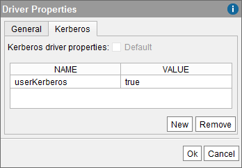

   Configuring the Kerberos driver properties to connect to Oracle

Kerberos Authentication with Constrained Delegation
---------------------------------------------------

Constrained delegation is a feature of Active Directory that allows you to configure a service account to obtain Kerberos tickets on behalf of a user but just for a subset of services instead of for any service. For example, the user account associated with the Virtual DataPort server may be configured to obtain on behalf of other users, tickets to connect to an instance of Impala but not to other databases.

Virtual DataPort provides support for constrained delegation when connecting to the following databases:

-  Apache Hive.
-  Cloudera Impala.
-  Microsoft SQL Server using the jTDS adapter or the Microsoft adapter.
-  SAP HANA.
-  Another Virtual DataPort Server (versions 7.0 and 6.0).

.. important:: The queries involving a JDBC data source will fail if *all*
   these conditions are met:

-  On Active Directory, the user account of the Virtual DataPort server has constrained delegation enabled.
-  And you enable pass-through session credentials on the JDBC data source.
-  And the adapter of the data source is not in the list above.
-  And the client connects to Virtual DataPort using Kerberos authentication.

The JDBC driver of the database has to support constrained delegation. If not, the driver will not be able to obtain the appropriate Kerberos ticket and the connection will fail.

.. important:: The support for constrained delegation only works if the tickets returned by Active Directory are "forwardable". To make sure they are, add the following property to the krb5 file of the host where the Denodo server runs:

   ::

      forwardable = true

|

If the database is Microsoft SQL Server and you select one of the jTDS adapters, copy the file
:file:`{<DENODO_HOME>}/dll/vdp/jtds/x64/ntlmauth.dll` to the folder :file:`{<DENODO_HOME>}/extensions/thirdparty/dll`.

.. note:: Select the dll appropriate to the Java Virtual Machine (JVM)
   used to run Denodo. If you are using the 64-bit JVM, copy the 64-bit dll.
   Otherwise, copy the 32-bit one.

.. important:: Copy this dll even if the Virtual DataPort server is running on
   Linux.

You do not have to do anything if you select the Microsoft adapter.

Creating Base Views from a JDBC Data Source
=================================================================================

After clicking **Save** (|image5|) to create the data source, create a
base view over it to be able to query this base view or combine its data
with data from other views.

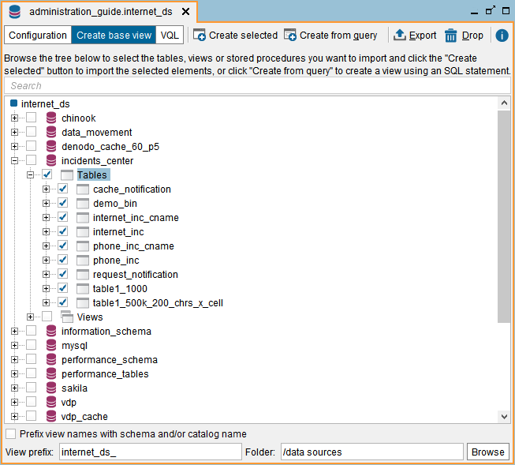

   Schemas, tables and views of a JDBC source

To create a JDBC base view follow these steps:

#. Open the JDBC data source by double-clicking it in the Server Explorer
   and click **Create base view**.

   The Tool will display a tree with the schemas of the database. Click on any
   schema to inspect its tables and their fields (see `Schemas, tables and views
   of a JDBC source`_). If the database is Oracle or Microsoft SQL Server, this
   dialog also lists its stored procedures. See more about creating base
   views over stored procedures in the section
   :ref:`Importing Graphically Stored Procedures from a Database`.

   To search a view or a schema, type its name in the box located at the top
   of the dialog. The list will only show the elements whose name contains the
   text you entered.

   When you open this dialog, the Administration Tool only retrieves the name
   of the schemas of the database. Once you expand a schema, it retrieves the
   list of views of this schema. Therefore, when you enter the name of a view,
   the Tool only searches in the schemas you already expanded.

   The names of the views of each schema are loaded upon request of the user
   because retrieving the names of all the views of the database at once could
   be a very time-consuming task.

#. Select the check boxes beside the tables that you want to create base
   views from.

#. Select the check box **Prefix view names with schema and/or catalog name**
   if you want to prefix the base view names with the schema and/or catalog name to which the table belongs. This is useful if you are going to create base views over tables with the same name, from different catalogs/schemas. With this option, you will avoid name conflicts.

#. In **View prefix**, you can enter a prefix for all the new views. For example, if you enter
   "internet\_ds\_", the name of the new views will start with "internet\_ds\_".

#. Click **Browse** to select the folder where the base view(s) will be
   created. In this dialog, you can create new folders or rename the
   existing ones (right-click on this dialog to display these two
   options).

#. Click **Create selected**.

#. If you selected two or more tables/views from the database, the Tool will show a dialog with a list of all the views it created.

   In this dialog, click **Create associations from foreign keys**. The Server will analyze if in the database of the JDBC data source, there are foreign key constraints between the tables/views of the base views of this data source. If there are, the Tool will show a dialog like the one below so you can automatically create associations that mirror these foreign key constraints.

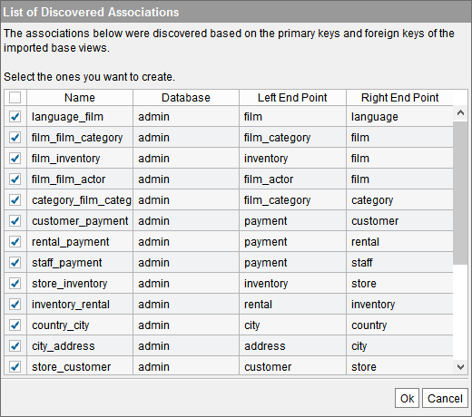

   Listing the associations that will be created after analyzing the foreign keys of the database

The table of this dialog has these columns:

   -  **Name**: name of the association. Click on the name to change it.
   -  **Database**: database where the association will be created.
   -  **Left End Point** and **Right End Point**: views involved in the associations.

   Click **Ok** to create the associations. If you do not want to create one of
   the associations, clear its check box.

   There are several reasons for which we strongly recommend creating these associations.
   Among others, that some queries will be executed much faster if the
   appropriate associations are created. The section :ref:`Why Associations are Useful?`
   provides a full list of reasons for why defining the appropriate associations are
   important.

|

After finishing with this process, the Tool will list the new base views in two places of the Server Explorer:

1. In the folder that the view has been created in. If you want to move the base view to another folder, drag it to that folder.

#. As a child node of the data source that the base view belongs to. This node cannot be moved to other folders. It is added to the tree to provide an easy way to see the base views created from a data source.

|

If you selected two or more tables/views from the database and there were already views with these names, the Tool will display a dialog like the one below.

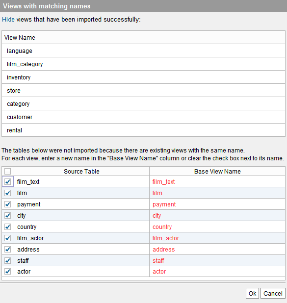

   Renaming new views with the same name as existing ones

In this dialog, you have to provide a new name for the views in red or clear its check box so when you click **Ok** the Tool either creates the view with the new name or does not to create it.

If you are creating several base views at once and many of them have the same names, there is an alternative to entering a new name for each view. Instead, select all the existing base views that have the same names as the ones you want to create, right-click on them and click **Prefix selected views/associations**. With this option, you will add a prefix to the name of all the selected views. Then, you can go back to create the base views and there will not be any conflict.

A common scenario where this feature is useful is when you have data on two databases with the same schemas but different data. E.g. an Oracle database that holds the up-to-date data and Hadoop database that holds historic data. Both will have the same tables and views so you need to rename the base views of one of the data sources to avoid the conflict of names.

|

As an example, we will create two base views:

1. One for the phone incidents table ``phone_inc`` over the JDBC data
   source ``phone_ds``. Its fields are:

   -  ``pinc_id``: the identifier of the incident.
   -  ``taxId``: the tax id of the client that reported the incident.
   -  ``description``: a description.
   -  ``ttime``: the time at which it occurred.
   -  ``inc_type``: an incident type.
   -  ``specific_field3``: an additional specific field.

#. Another for the internet incidents table ``internet_inc`` over the JDBC
   data source ``internet_ds``. Its fields are:

   -  ``iinc_id``: the identifier of the incident.
   -  ``taxId``: the tax id of the client that reported the incident.
   -  ``ttime``: the time at which it occurred.
   -  ``summary``: a description.
   -  ``specific_field1`` and ``specific_field2``: two additional specific
      fields.

To do this, open the appropriate data source, click **Create base
view**, select the table and click **Create selected**.

When selecting two or more tables to create base views, you may need to provide a new name for the views that have the same name as other existing views.

|

When importing only one table at a time, you have more control over the creation of the base view because you can:

-  Change the name of the new base view.
-  Change the name and type of the new base view’s attributes.
-  Edit the “Source type properties” of the field by clicking the button
   |image3|. In this dialog, you can define the exact type of the field and depending on the type,
   its length and number of decimals.

   For JDBC and ODBC base views, these properties are automatically defined because they
   are obtained from the database. For other types of base views, they have to
   be defined manually.

   See more about these properties in the section :ref:`Viewing the Schema of a Base View`.

-  The check boxes on the **Nullable** column indicate if the view will
   allow / forbid inserting ``NULL`` values into each field.

   I.e. the ``INSERT`` or ``UPDATE`` requests that set to ``NULL`` fields with “Nullable” selected, will fail immediately without trying to delegate the request to the database.

   The default value of this property is obtained from the metadata returned by the
   database and usually you should not change it.

   For example, let us say that we set a field to “Null allowed” but in the database,
   the field does not allow NULL values. Virtual DataPort will try to delegate to the
   database ``INSERT`` or ``UPDATE`` requests that set the field to NULL and they will fail.

-  Change the primary key definition of the view. When creating a JDBC
   base view, the Server obtains the primary key definition from the
   database and automatically sets the primary key of the view (fields
   marked with |image6|). For derived views and other types of base views, the primary
   key definition has to be established manually by selecting the appropriate fields and
   clicking **Set selected as PK**.

   See section :ref:`Primary Keys of Views` for more information about primary keys of views.

-  In the **Metadata** tab, you can set the folder where the base view
   will be stored and provide a description.

   When editing the data source, you can also change its owner by
   clicking |image3|.

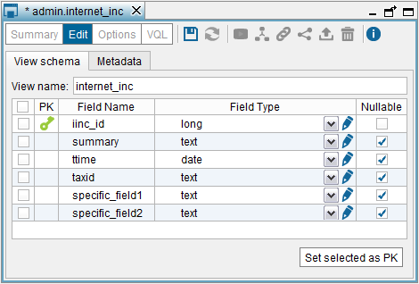

   Accepting the schema of a base view

.. note:: You can also create a base view from a SQL query instead of
   from a table by clicking **Create from query**. This option is explained
   in the section :ref:`Creating Base Views from SQL Queries`.

Importing Graphically Stored Procedures from a Database
=================================================================================

Virtual DataPort provides the capability of graphically creating base
views over the stored procedures of the following databases:

-  IBM DB2: see section :ref:`Importing Stored Procedures from IBM DB2`.
-  Microsoft SQL Server: see section :ref:`Importing Stored Procedures from
   Microsoft SQL Server`.
-  Oracle: see section :ref:`Importing Stored Procedures from Oracle`.

The process changes depending on the database.

For other databases, you have to do it by creating a “base view from a
query”. This is explained in the section :ref:`Creating Base Views from SQL
Queries`.

Importing Stored Procedures from IBM DB2
-----------------------------------------------------------------------------------------------------

During the process of creating a base view over a stored procedure of
IBM DB2, the Administration Tool displays a dialog where you configure
what data you want to obtain from the procedure. This dialog changes
depending on the characteristics of the selected stored procedure:

-  If the procedure does not declare to return any cursor nor any
   non-cursor parameter, the Tool displays a dialog like this one:

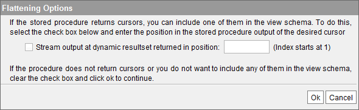

   Importing a stored procedure from IBM DB2

|
   If the procedure returns dynamic cursors, select
   **Stream output at dynamic resultset returned in position** and enter the
   index of the cursor. You have to enter this index because the database does
   not provide information about the dynamic cursors returned by a stored procedure.

-  If the selected procedure declares to return one or more cursors
   *and* one or more non-cursor output parameters, the Tool displays a
   dialog like this one:

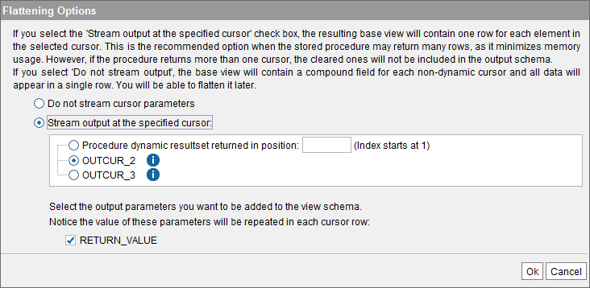

   Importing a stored procedure that returns cursors, from IBM DB2

In this dialog, select if you want the view to:

-  **Do not stream cursor parameters**: the base view will have an array
   field for each cursor declared by the procedure (the view will not
   return the data of dynamic cursors). Each of these arrays will
   contain all the data returned by each cursor. The result of querying
   this base view will have only one row.

-  Or, **Stream output at the specified cursor**: return the data of one
   of the cursors flattened. That is, the view will have one field per
   each field of the cursor and the result of querying this base view
   will have a row per each row of the selected cursor. The other
   cursors, if any, are ignored.

   The recommended option is “Stream output at the specified cursor” because by selecting the other option the result of the query will have arrays. If the number of rows inside the array is high, it has an impact on the memory consumption. The reason is that the Server cannot begin to process the rows inside an array until all the rows of the cursor have been received and thus the entire array is formed.

   On the other hand, if the number of rows returned by the cursors is small, by selecting “Do not stream cursor parameters” you will be able to obtain the data from all the cursors with just one query.

   You can either select one of the cursors declared by the procedure or a dynamic procedure. To select a dynamic one, select **Procedure dynamic resultset returned in position**
   and enter the index of the cursor. You have to enter this index because the database does not provide information about the dynamic cursors returned by a stored procedure.

   If the procedure also returns non-cursors parameters, you can add the value of
   these parameters to the base view. In `Importing a stored procedure that returns cursors, from IBM DB2`_,
   that is “RETURN_VALUE”. The base view will have one field for each selected output parameter. As the type of these output parameters is not compound, the procedure returns a single value for each one of these parameters. Therefore, when querying the view, the value of these parameters will be repeated in each row returned by the cursor.

Importing Stored Procedures from Microsoft SQL Server
-----------------------------------------------------------------------------------------------------

During the process of creating a base view over a stored procedure of
Microsoft SQL Server, the Tool displays a dialog where you configure
what data you want to obtain from the procedure.

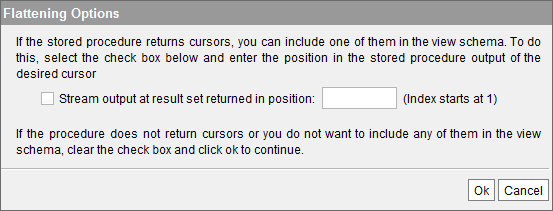

   Importing a stored procedure from Microsoft SQL Server

If the procedure returns hidden cursors, select the check box **Stream
output at result set returned in position** and enter the index of the
cursor. You have to enter this index because the database does not
provide information about the hidden cursors returned by a stored
procedure.

Importing Stored Procedures from Oracle
-----------------------------------------------------------------------------------------------------

During the process of creating a base view over a stored procedure of
Oracle, the Administration Tool displays a dialog where you configure
what data you want to obtain from the procedure. This dialog changes
depending on the characteristics of the selected stored procedure:

-  If the procedure only returns simple data types, the steps are the
   same as when you create a base view over a table: you select the
   procedure, click “Create selected base views” and the Tool will
   display the schema of the new view.
-  If the procedure returns one or more cursors, the Tool will display
   an intermediate dialog where you select if you want the view to (see
   `Importing an Oracle stored procedure that returns cursors`_):

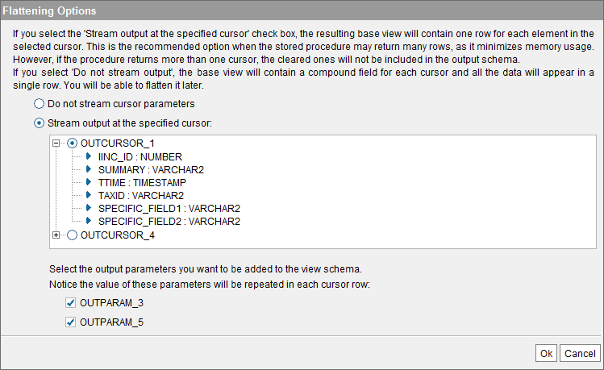

   Importing an Oracle stored procedure that returns cursors

In this dialog, select if you want the view to:

-  **Do not stream cursor parameters**: the base view will have an array
   field for each cursor returned by the procedure. Each of these arrays
   will contain all the data returned by each cursor. The result of
   querying this base view will have only one row.

-  Or, **Stream output at the specified cursor**: return the data of one
   of the cursors flattened. That is, the view will have one field per
   each field of the cursor and the result of querying this base view
   will have a row per each row of the selected cursor. The other
   cursors, if any, are ignored.

   The recommended option is “Stream output at the specified cursor” because by selecting the other option the result of the query will have arrays. If the number of rows inside the array is high, it has an impact on the memory consumption. The reason is that the Server cannot begin to process the rows inside an array until all the rows of the cursor have been received and thus the entire array is formed.

   On the other hand, if the number of rows returned by the cursors is small, by selecting “Do not stream cursor parameters” you will be able to obtain the data from all the cursors with just one query.

   If the procedure also returns non-cursor parameters, you can add the
   value of these parameters to the base view. In the
   figure above (`Importing an Oracle stored procedure that returns cursors`_),
   these are “OUTPUTPARAM_3” and “OUTPUTPARAM_5”. The base view will have one field for each selected output parameter. As the type of these output parameters is not compound, the procedure returns a single value for each one of these parameters. Therefore, when querying the view, the value of these parameters will be repeated in each row returned by the cursor.

There are some limitations regarding the importation of Oracle stored
procedures:

-  Compound non-PL/SQL types are not supported. I.e. Oracle table and
   record types.
-  Oracle PL/SQL records are not supported.
-  Oracle PL/SQL tables of records (i.e. tables with more than one
   column) are not supported.

Creating Base Views from SQL Queries
=================================================================================

We *strongly* recommend creating base views graphically (i.e. by
selecting the tables you need in the JDBC data source dialog and then,
clicking “Create selected base views”) because it is much easier to do. See more about this in the
section :ref:`Importing Graphically Stored Procedures from a Database`.

However, sometimes you need to create a base view that when queried, it
executes an arbitrary SQL query. For example:

-  When you need to execute a stored procedure of the database or a
   query that uses a stored procedure, to obtain the results.
   The section :ref:`Creating Base Views from a Query to a Stored Procedure`
   explains how to enter a query to a stored procedure.
-  When you have a SQL query that has been tuned to perform better than
   the query that Virtual DataPort will execute.

To create a SQL Query base view, click **Create from query** on the
“Create base view” dialog.

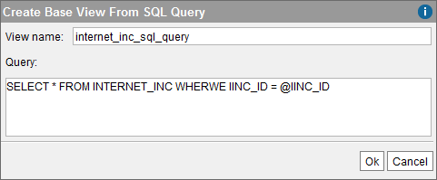

   Creating a base view from a SQL query

After entering the name of the base view and the SQL query, click
**Save** (|image5|) to create the base view. Its schema can be edited
as a regular base view.

About the SQL query of the base view, consider the following:

#. This SQL query has to use the syntax of the queried database and not
   the syntax of Virtual DataPort.
#. Remove single line comments from the query. That is, comments like ``-- <comment>``. E.g.

   .. code-block:: sql

      SELECT f1 as field1 -- Remove this type of comments from the queries you use to create base views.
      FROM view

#. The query may have *interpolation variables* (see section :ref:`Paths and
   Other Values with Interpolation Variables`), which allow the SQL
   query sent to the database to be parameterized according to the
   specified query conditions.

   If the query has interpolation variables, after clicking “Ok”, enter
   the values of the variables used in the query. With these values,
   Virtual DataPort will execute the query and obtain the metadata
   required to create the base view.

   Each interpolation variable must be related with an attribute
   belonging to the generated base view, so that the variable can obtain
   its value at run time. If the SQL query used to access the data
   source returns any field with the same name as the variable, then the
   variable will be associated to the corresponding base view attribute.
   If the SQL query does not return any field with the same name as the
   variable, Virtual DataPort will add a new attribute to the base view,
   with the same name.
#. Add an alias to all the columns of the query that are the result of a
   function that has one or more input parameters and at least one is an
   interpolation variable. E.g.
   ``SELECT ABS( ROUND( @value ) ) AS value_abs_round...``

   The reason is that if you do not indicate an alias, the name of the
   column in the query’s output schema may depend on the input value of
   the function. For example, in the database Oracle 11g, if you execute
   ``SELECT ABS(<value>) FROM Dual``, the name of the column
   ``ABS(<value>)`` depends on ``<value>``. In order to process the
   results correctly, the output schema of the query cannot change.

   In general, we recommend adding an alias to all the columns of the
   SQL query.
#. If the SQL query invokes a PL/SQL function using an interpolation
   variable, you need to assign an alias to the return value. For
   example:

   .. code-block:: sql

      SELECT function_test(@VAR1) AS value
      FROM internet_inc

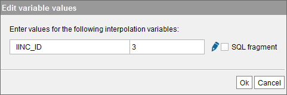

   Editing the value of the interpolation variables

.. note:: If the SQL query is a ``SELECT`` query, after creating the
   view, we recommend setting to “yes” the “Delegate SQL sentence as
   subquery” property of the view. By doing this, Virtual DataPort will
   delegate more queries over the base view, to the database.

To change the value of this property, follow these steps:

#. After creating the view, open it.
#. Click **Options**.
#. Click the **Search Methods** tab.
#. Scroll down to the bottom of the dialog and click **Wrapper source
   configuration**.
#. Select **yes** for the property “Delegate SQL sentence as subquery”.

The section :ref:`View Configuration Properties` explains this property in
detail.

Using the WHEREEXPRESSION Variable
-----------------------------------------------------------------------------------------------------

As we have explained in the previous section, the SQL Query used to
create a base view can contain *interpolation variables* (see section
:ref:`Paths and Other Values with Interpolation Variables`) to parameterize
the SQL Query.

Virtual DataPort provides a predefined interpolation variable called
``WHEREEXPRESSION`` that simplifies the process of creating a base view
from a SQL query. At runtime, the Server will replace
``WHEREEXPRESSION`` with the condition sent to the base view.

.. note:: The interpolation variable ``WHEREEXPRESSION`` cannot be used
   with ODBC data sources. Only in JDBC ones.

Let us say that we create a base view called ``VIEW1`` with the
following SQL query:

.. code-block:: sql

   SELECT StorProc(FIELD1), FIELD2, FIELD3, FIELD4 AS ALIAS4
   FROM TABLE1
   WHERE @WHEREEXPRESSION

Notice that the query uses a stored procedure in the ``SELECT`` clause,
so it is necessary to create the base view by using a SQL query.

After clicking **Ok**, the user will have to provide the values for the
variables used, so Virtual DataPort can execute a query to obtain the
metadata required for creating the base view. For example:

.. code-block:: sql

   FIELD2='f2' AND FIELD4='f4'

The Server will execute this query to obtain the required metadata from
the database. Then, the Tool will display the fields of the base view
that will be generated (see `Creating a JDBC base view from a SQL query
with WHEREEXPRESSION`_). The user has to specify the actual name of
the fields for the aliases used in the ``SELECT`` clause of the query.
For instance, the previous query defines the ``ALIAS4`` alias for
``FIELD4``. Therefore, the user must specify the ``FIELD4`` value for
the attribute named ``ALIAS4``.

Then, click **Save** (|image5|) to create the base view.

The use of ``WHEREEXPRESSION`` in the SQL statement of the base view may
benefit the performance of the queries to this base view. For example,
if a join view uses the NESTED execution method and the view on the right
side of the join is of the SQL statement type, this view should be
created using ``WHEREEXPRESSION`` in the query. That is because in this
case, the Server can apply optimizations that cannot be used if the SQL
statement does not use ``WHEREEXPRESSION``.

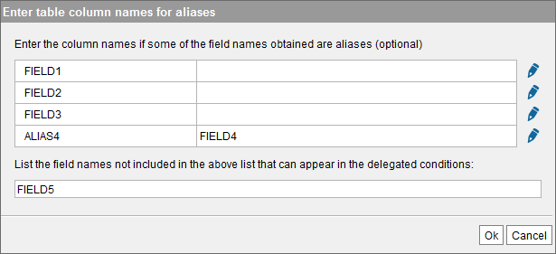

   Creating a JDBC base view from a SQL query with ``WHEREEXPRESSION``

Following our example, if you execute the following VQL query:

.. code-block:: sql

   SELECT *
   FROM VIEW1
   WHERE FIELD2 = 'f2' AND ALIAS4 = 'f4'

The Server will substitute the variable ``WHEREEXPRESSION`` with the
condition of the ``WHERE`` clause of the query:

.. code-block:: sql

   SELECT StorProc(FIELD1) AS ALIAS1, FIELD2, FIELD3, FIELD4 AS ALIAS4
   FROM TABLE1
   WHERE FIELD2 = 'f2' AND FIELD4 = 'f4'

If you need to filter the results of a SQL query base view with a
``WHERE`` condition that involves fields that cannot be projected, type
the name of these fields separated with commas, in the box at the bottom
of the dialog. These fields will belong to the base view but the Server
will not project their value. They should only be used in the ``WHERE``
clause of the queries that involve this base view and the values
provided for them will be used only to generate the query sent to the
database.

For example, if the SQL query is the following and we want to be able to
filter by the field ``FIELD1`` when querying this view, we have to add
``FIELD1`` to the box at the bottom of the dialog.

.. code-block:: sql

   SELECT COUNT(*)
   FROM TABLE1
   WHERE @WHEREEXPRESSION

In this example, the base view will have two fields: ``COUNT`` and
``FIELD1``.

If you query the new base view:

.. code-block:: sql

   SELECT *
   FROM TABLE1
   WHERE FIELD1 = 'f1'

The query sent to the database will be this one:

.. code-block:: sql

   SELECT COUNT(*)
   FROM TABLE1
   WHERE FIELD1 = 'f1'

In these examples, the queries to the base view ``VIEW1`` must have the
clause ``WHERE``. If not, the Server will try to execute this query:

.. code-block:: sql

   SELECT ... FROM TABLE1 WHERE

This query contains the ``WHERE`` clause but no condition so it will
fail.

To avoid forcing the queries to always have the ``WHERE`` clause,
Virtual DataPort provides the *interpolation function*
``ExecuteIfIsNotNull``. The syntax of the function is:

.. code-block:: sql

   ^ExecuteIfIsNotNull( <prefix if the variable is not NULL>
       ,@<variable name>
       ,<suffix if the variable is not NULL>
       [,<value if the variable is NULL> ] )

At runtime, if the value of the variable is not defined, the function
replaces ``@<variable name>`` with the value of the variable and adds a
prefix and a suffix to this value.

-  Do not leave any white space between the parameters of the function.
-  Use double quotes, not single quotes, to surround the parameters.
-  In the second parameter, the name of the interpolation variable has
   to be indicated with the syntax ``@VARIABLE_NAME``, without
   braces. In other scenarios, you can indicate variables with the
   syntax ``@{VARIABLE_NAME}``, but not in this function.

You can improve the previous example, by using this function in the SQL
query of the base view:

.. code-block:: sql

   SELECT StorProc(FIELD1), FIELD2, FIELD3, FIELD4 ALIAS4
   FROM TABLE1
   ^ExecuteIfIsNotNull("WHERE ",@WHEREEXPRESSION,"")

At runtime, if the query to this view has ``WHERE`` clause,
``@WHEREEXPRESSION`` will be substituted by the query condition,
prefixed by ``WHERE`` and with an empty string at the end.

The Server will execute a query like this:

.. code-block:: sql

   SELECT StorProc(FIELD1), FIELD2, FIELD3, FIELD4 ALIAS4
   FROM TABLE1 WHERE FIELD2 = 'f2'

If the query does not have ``WHERE`` clause, the function will not be
executed so the resulting query will be this:

.. code-block:: sql

   SELECT StorProc(FIELD1), FIELD2, FIELD3, FIELD4 ALIAS4
   FROM TABLE1

If you set the fourth parameter (optional) of ``ExecuteIfIsNotNull``, the
function will always be executed. If the value of the interpolation
variable is ``NULL``, the function returns the value of the fourth
parameter. For example, if the base view is built with this SQL query:

.. code-block:: sql

   SELECT StorProc(FIELD1), FIELD2, FIELD3, FIELD4 ALIAS4
   FROM TABLE1
   ^ExecuteIfIsNotNull('WHERE ',@WHEREEXPRESSION,'','WHERE FIELD2 is not NULL')

At runtime, if the query does not have the ``WHERE`` clause, the Server
will execute this query in the database:

.. code-block:: sql

   SELECT StorProc(FIELD1), FIELD2, FIELD3, FIELD4 ALIAS4
   FROM TABLE1 WHERE FIELD2 is not NULL

.. note:: In these examples, we have only used the interpolation
   function ``ExecuteIfIsNotNull`` with the variable ``WHEREEXPRESSION``,
   but it can be used with any other interpolation variable.

Creating Base Views from a Query to a Stored Procedure
-----------------------------------------------------------------------------------------------------

When you create a JDBC base view from a SQL query to invoke a stored
procedure, this SQL query has to meet the following conditions:

-  The value of an input parameter of the procedure can be a constant or
   an interpolation variable. E.g. ``@VARIABLE_NAME``
-  If the type of the input parameter is text, the constant or the
   interpolation variable has to be surrounded by quotes.
-  Use question marks for all the output fields of the stored procedure.
-  The SQL query used to build the view has to use the syntax of the
   database and not the syntax of Virtual DataPort. This is true when
   this query invokes a stored procedure of the database, but also for
   any other type of query.

The query below uses the syntax of DB2 and Oracle:

.. code-block:: sql
   :caption: Query to invoke a stored procedure in DB2 and Oracle
   :name: Query to invoke a stored procedure in DB2 and Oracle

   CALL schema.stored_procedure_name(
         @INPUT_VALUE_INTEGER, '@INPUT_VALUE_TEXT', ?, ?, ?)

-  The ``@`` character makes ``INPUT_VALUE_INTEGER`` and
   ``INPUT_VALUE_TEXT`` interpolation variables, which at runtime will
   be replaced with their value.
-  As the ``INPUT_VALUE_TEXT`` variable represents a string, it has to
   be surrounded by quotes.
-  The question marks represent the output fields of the stored
   procedure.

The base view created from this query will have two mandatory fields:
``INPUT_VALUE_INTEGER`` and ``INPUT_VALUE_TEXT``. At runtime, the value
of these fields will have to be provided in the ``WHERE`` clause of the
query.

.. note:: You can also create base views graphically that invoke a
   stored procedure of a Microsoft SQL Server or Oracle databases. To do
   this, open the data source, expand the schema that contains the
   procedure and expand **Stored procedures**. Then, select the procedure
   you want to import and click **Create selected**.

In other scenarios, the value of an input parameter may be ``NULL``. In
this case, use the function ``ExecuteIfIsNotNull`` explained in the
previous section.

The query below invokes a stored procedure with two optional parameters,
in Microsoft SQL server:

.. code-block:: vql
   :caption: Query to invoke a stored procedure in Microsoft SQL Server
   :name: Query to invoke a stored procedure in Microsoft SQL Server

   exec stored_procedure_name
        \@param1 = ^ExecuteIfIsNotNull("",@input_val_p1,"","null")
      , \@param2= ^ExecuteIfIsNotNull("",@input_val_p2,"","null")

Note that the character ``@`` has to be escaped with ``\``
when the word next to the ``@`` is not the name of an
interpolation variable.

In the base view created from this query, the fields “param1” and
“param2”, will be “nullable”. That is, a condition such as
``WHERE param1 = NULL and param2 = NULL`` will be valid.

However, even if their value can be ``NULL``, they are still being
mandatory. In order to make them optional, once the view is created,
open the “Options” dialog of the view, click the “Search Methods” tab
and, in the “Mandatory” column, select “OPT” for these two fields.

.. note:: This step needs to be done after any change on the view.

The section :ref:`Query Capabilities` explains what the “Search methods” of
a view are.

.. _jTDS website: http://jtds.sourceforge.net/

.. |image3| image:: ../../common_images/edit.png
.. |image5| image:: ../../common_images/save.png
.. |image6| image:: ../../common_images/primary-key.png
