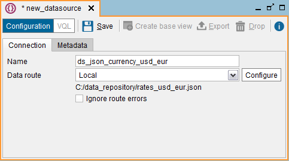
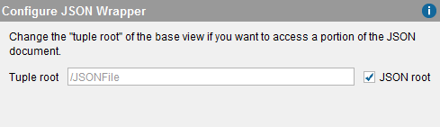

============
JSON Sources
============

To create a new JSON data source, right-click on the Server Explorer and
click **New** > **Data source** > **JSON**.

The Tool will display the dialog to create the data source.

   Creating a JSON data source

The following data are requested in this dialog:

-  **Name**. Name of the new data source.
-  **Data route**. Path to the JSON file that contains the data. This
   path can be parameterized according to the query made using
   interpolation variables (see section :ref:`Paths and Other Values with
   Interpolation Variables`). The section :ref:`Path Types in Virtual
   DataPort` describes the formats of the available paths and how to
   use parameters in them. The most common path type in this case is
   **HTTP client**.

-  **Ignore route errors**. If selected, the Server will ignore the errors occurred when accessing the file(s) to which the data source points.
   
   This option is not meant to be used when the data source reads a single file. Its main purpose is when the data source points to a collection of files and you know some of them may be missing. For example, you can create a JSON data source to read a set of log files with this local path: ``/opt/application/logs/log-^DateRange("yyyy/MM/dd",@start_date,@end_date,"yyyy-MM-dd").json`` (see more about the function "DateRange" in the section :ref:`Paths Using Date Ranges`).

   When you query a base view created over this data source, the data source will read all the log files in order. For example, if in the query you put the condition ``start_date='2018/05/01' AND end_date = '2018/05/04'``, the data source will try to read the files "log_2018-05-01.json", "log_2018-05-02.json", "log_2018-05-03.json" and "log_2018-05-04.json". If one these files is missing, the query will fail.
   
   If you want to ignore this error, select the check box *Ignore route errors*. With this option if one of the files does not exist or cannot be read, the data source will skip it and read the next one. If you run the query from the administration tool, you can identify which files could not be read in the *Execution trace*. In the trace, click on the nodes with *Type = Route*. The ones that could not be read will have the attribute *Exception* followed by an error message.

In the **Metadata** tab, you can set the folder where the data source
will be stored and provide a description.

When editing the data source, you can also change its owner by clicking
the button |image1|.

Click **Save** to create the data source.

| 

After creating the data source, click **Create base view** to begin
creating the base view. The Tool will display the “Configure JSON
Wrapper” dialog where you can change the “tuple root” of the base view
if you only want to access a portion of the JSON document.

We recommend leaving the **JSON root** check box selected and click
**Ok**.

   Creating a JSON base view

If the path to the data file includes interpolation variables, there is
an intermediate step where you have to provide a value for these
variables. See section :ref:`Paths and Other Values with Interpolation
Variables`.

After this, the Tool will display the schema of the new base view. At
this stage, you can do the following:

-  Change the name of the view.
-  Change the name of each field by double-clicking it and its type, by
   using the drop-down list to the right.
-  Set the primary key of the new view (see the section :ref:`Primary Keys of
   Views`).
-  In the **Metadata** tab, you can set the folder where the base view
   will be stored and provide a description.
-  When editing the base view, you can also change its owner by clicking
   the button |image1|.

After this, click **Save** (|image3|) to create the base view.

In the Server Explorer, double-click the new base view to display its
schema (see section :ref:`Creating Derived Views`). Click **Edit** to modify
the base view.

.. |image1| image:: ../../common_images/edit.png
.. |image3| image:: ../../common_images/save.png

