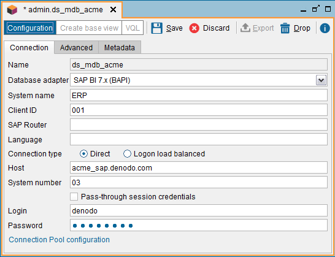
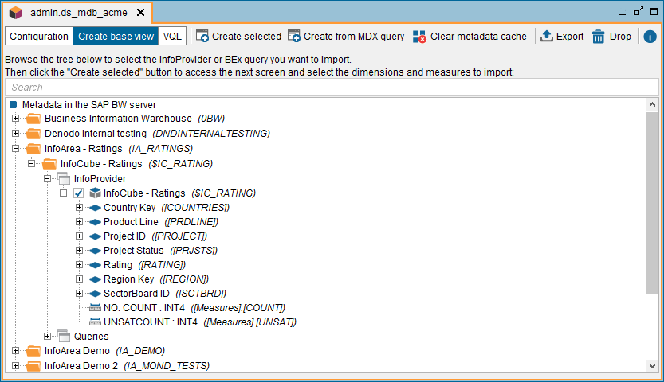
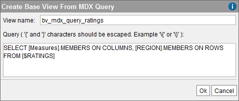

=================================
Multidimensional Database Sources
=================================

Virtual DataPort can obtain data from multidimensional databases such as
SAP BW 3, SAP BI 7, Mondrian, Oracle Essbase and Microsoft SQL Server
Analysis Services (SSAS).

For SAP, Virtual DataPort provide two BAPI adapters, both use the SAP JCo connector. Whenever possible, select the SAP BI 7.x adapter instead of the SAP
BW 3.x. The BAPIs provided by SAP BW 3.x cannot return more than one
million cells. SAP BI 7.x provides new BAPIs that do not have this
limitation.

Before creating any multidimensional data source, do the following:

-  If you are going to connect to SAP (*SAP BW 3.x (BAPI)* or *SAP BI
   7.x (BAPI)*), follow the steps described in these sections of the Installation Guide:

   1. :doc:`Installing the SAP JCo Adapter <../../../../platform/installation/postinstallation_tasks/postinstallation_tasks_in_virtual_dataport/installing_the_sap_jco_connector>`.
   #. :doc:`Grant Privileges in SAP BW to the Virtual DataPort User Account <../../../../platform/installation/postinstallation_tasks/postinstallation_tasks_in_virtual_dataport/grant_privileges_in_sap_bw_to_the_virtual_dataport_user_account>`.

-  For the Essbase adapters (*Essbase 9* or *Essbase 11*), read the
   section :ref:`Multidimensional Data Sources to Oracle Essbase`, which lists
   the connection modes supported by Essbase. You need to know the mode you
   want use because the set of drivers you have to install depend on the
   connection mode used. Once you know this, follow the steps described in
   the section :doc:`Installing the Connector for Oracle Essbase <../../../../platform/installation/postinstallation_tasks/postinstallation_tasks_in_virtual_dataport/installing_the_connector_for_oracle_essbase>`
   of the Installation Guide.

-  For the *Microsoft SQL Server Analysis Services* adapter, read the
   section :doc:`Enable XMLA on Microsoft SQL Server Analysis Services
   (Multidimensional Sources) <../../../../platform/installation/postinstallation_tasks/postinstallation_tasks_in_virtual_dataport/enable_xmla_on_microsoft_sql_server_analysis_services_multidimensional_sources>` of the Installation Guide.

-  For the other adapters, you do not have to install any connector because
   they already are included in the Denodo Platform.

To create a new data source to retrieve data from a multidimensional
database, right-click a database, on the Server Explorer and click
**File** > **New** > **Data source** > **Multidimensional DB**.

   Creating a data source to a multidimensional database

The following data are requested:

-  **Name**. Name of the new data source.

-  **Database adapter**. Select the adapter you want to use to connect to
   the source. The details you have to provide below depend on the
   selected adapter.
   
   When you are creating the data source, you can select any adapter.
   Once the data source is created, it cannot be changed.

-  For **SAP BW 3.x (BAPI)** and **SAP BI 7.x (BAPI)**:

   -  **System name**. Name of the instance of the database.

   -  **Client ID**. Identifier of the client.

   -  **SAP router**. An SAP route string describes the stations of a
      connection required between two hosts. A route string has this syntax: 
      
      ``(/H/host/S/service/W/pass)*``
 
      That is, any number of substrings in the form ``/H/host/S/service/W/pass``     
 
      This route has a substring between each SAP router and to the target
      server. Each substring contains the information required by an SAProuter
      to set up a connection in the route: the host name, the port name, and
      the password, if one was given.

      -  ``/H/`` indicates the host name
      -  ``/S/`` (optional) indicates the service (port). Default value:``3299``
      -  ``/W/`` (optional) indicates the password for the connection between
         the predecessor and successor on the route. Default value: “” (no password)

   -  **Language** (optional). Language of the connection established with the
      SAP server.

   -  **Connection type**:

      -  If the connection type is **Direct**, enter:

         -  **Host**. Host where SAP is running.
         -  **System Number**. Two-digit number that differentiates the SAP instances running on the same host.

      -  If the connection type is **Logon load balanced**, enter:
   
         -  **Message Host**. Host of the SAP server that provides the data for
            choosing an appropriate application server.
               
         -  **Message Service** (optional). Port where the “SAP Message server”
            listens to connections.
              
         -  **SID**. System ID of the SAP system.
           
         -  **Logon group** (optional). Name of the group of SAP application
              servers.

   -  **Pass-through session credentials**. If selected, when a client queries
      a view that uses this data source, Virtual DataPort will use the 
      credentials of this client to connect to SAP, instead of the values of
      the fields “Login” and “Password” of the data source. The value of these
      fields is used only when you open this data source and the
      Administration Tool connects to SAP to display information about the SAP
      elements (cubes, dimensions, etc.).

      If you have created a data source with this option, but you want to
      query a view of this data source with other credentials than the ones
      you have used to connect to Virtual DataPort, add the parameters
      ``USERNAME`` and ``USERPASSWORD`` to the ``CONTEXT`` of the query.
      These two parameters are only taken into account when the data source
      has been created with the option “Pass-through session credentials”
      enabled.
      For example, if the base view ``cube1`` has been created over a data
      source with an SAP BAPI adapter and you execute

      .. code-block:: sql
      
         SELECT * 
         FROM cube1 
         CONTEXT(USERNAME = 'admin', PASSWORD = 'd4GvpKA5BiwoGUFrnH92DNq5TTNKWw58I86PVH2tQIs/q1RH9CkCoJj57NnQUlmvgvvVnBvlaH8NFSDM0x5fWCJiAvyia70oxiUWbToKkHl3ztgH1hZLcQiqkpXT/oYd' ENCRYPTED)

      Virtual DataPort will connect to SAP with the username “admin” and the
      password “password”, ignoring the credentials that you used to connect
      to the Server.

      It is mandatory to add the token ``ENCRYPTED`` and enter the password encrypted. To encrypt the password, use the statement ``ENCRYPT_PASSWORD``. For example:
      
      .. code-block:: vql
      
         ENCRYPT_PASSWORD 'my_secret_password';

      When the data source is created with this option, the Server creates a
      pool of connections for each pair user/password. Initially, these
      pools only have one connection to prevent the creation of many
      connections. The maximum number of connections for each one of these
      pools is the value of the field “Maximum number of active connections”
      of the connection pool.

      .. warning::  
         Users should be careful when enabling the cache on views
         that involve data sources with pass-through credentials enabled. The
         appendix :ref:`Considerations When Configuring Data Sources with
         Pass-Through Credentials` explains the issues that may arise.

   -  In the **Advanced** tab, you can enable Secure Network Communications
      (SNC) between the Virtual DataPort server and SAP. SNC provides
      stronger authentication and encryption mechanisms than the default
      security options of SAP.
      To enable SNC, do the following:

      1. Select **Enable SNC**.
      #. Enter the path to the SAP Cryptographic Library. That is, the path to
         the file ``sapcrypto.dll`` (if the Server runs on Windows) or to the
         path to ``libsapcrypto.so`` (if the Server runs on Linux). You can
         download this library from the SAP website.
      #. Enter the **Partner name**. That is, the distinguished name of the SAP
         server.
      #. Select the **Security level**. SAP offers three levels of configuration
         and in addition, you have these options:

         1. **Use the value from snc/data\_protection/use**: uses the default
            security level set by the SAP server.
         2. **Use the value from snc/data\_protection/max**: uses the maximum
            level of security offered by the SAP server.

   -  In the **Advanced** tab, you can set the **Read block size**. The BAPI
      adapter retrieves the data in blocks. This is the maximum size of these
      blocks.

-  For **Mondrian 3.x**, **Microsoft SQL Server Analysis** and **Generic**:
   
   -  **XMLA URI**. The XMLA URI to access the database. For example,  
   
      -  For Mondrian: \https://acme:8080/mondrian/xmla;Catalog=FoodMart
      -  For Microsoft SQL Server Analysis: \http://acme.denodo.com/olap/msmdpump.dll

-  For **Essbase 9** and **Essbase 11**:

   -  **URI**. The URI of the Essbase server. For example, \https://essbase-server.acme.com:13080/aps/JAPI
   -  **Login** and **Password**. Credentials to access the database.

Virtual DataPort uses a pool of connections to manage the connections to
the database when the adapter is one of the following:

-  Generic
-  Microsoft SQL Server Analysis
-  Mondrian 3.x
-  SAP BW 3.x (BAPI)
-  SAP BI 7.x (BAPI)

If the adapter supports using a connection pool, click **Connection pool
configuration** to configure it. The parameters available depend on the
selected adapter:

-  For SAP BW 3.x (BAPI) and SAP BI 7.x (BAPI):

   -  **Maximum number of active connections**: maximum number of active
      connections in the pool.
      
   -  **Maximum number of idle connections**: maximum number of idle
      connections in the pool.
      
   -  **Maximum waiting time (milliseconds)**: maximum time a thread will
      wait to obtain a connection from the pool. When a query reaches this
      limit, the query that is requesting the connection will fail.
      
   -  **Minimum time between evictions (milliseconds)**: minimum amount of
      time that a connection sits idle in the pool before it is eligible to
      be closed and removed from the pool.
      
   -  **Minimum time before eviction (milliseconds)**: the Server examines
      periodically the idle connections of the pool to close them. This
      parameter indicates the minimum interval between these examinations.

-  For Mondrian 3.x, Microsoft SQL Server Analysis and Generic:

   -  **Initial size**: the initial number of connections of the pool.
   
   -  **Maximum number of active connections**: maximum number of active
      connections in the pool.

In the **Metadata** tab, you can set the folder where the data source
will be stored and provide a description.

When editing the data source, you can also change its owner by clicking
the button |image1|.

Click **Save** to create the data source.

After creating the data source, you have to create base views over it,
so you can query the data of its base views and combine them with data
from other views.

There are two options to create base views over multidimensional
database sources:

   -  Graphically, by selecting the hierarchies of the dimensions,
      measures, attributes, etc., that will form the base view. See section
      :ref:`Creating a Base View over a Multidimensional Data Source,
      Graphically`.
   -  Or, writing an MDX query. See section :ref:`Creating a Base View over a
      Multidimensional Data Source with an MDX Query`.

Creating a Base View Over a Multidimensional Data Source, Graphically
=====================================================================

To create a multidimensional base view graphically, open the data
source, click **Create base view** and select at least, a hierarchy of a
dimension and a measure.

   Creating an SAP multidimensional base view

Each node of the tree displays the business name of the element and its
technical name in brackets.

To search an element by its business or technical name, type it in the
box located at the top of the dialog.

When you open this dialog, the Administration Tool only retrieves the
name of the cubes of the database. Once you expand a cube, it retrieves
the elements of this cube. Therefore, when you enter the name of an
element, the Tool only searches in the schemas and cubes you already
expanded.

The cubes and their elements are loaded upon request of the user because
retrieving all of them at once could be a very time-consuming task.

.. note::
  
   The process of creating a base view over an SAP BW or SAP BI source has three steps:
  
   1. Selection of a cube or query to import.
   2. Selection of hierarchies, measures, attributes and variables. 
   3. Configuration of access options (*Include empty rows*, *Include leaf levels*, etc.)

After selecting the appropriate elements, click **Import**. The Tool
will create a base view for each group of elements of a cube (|image3|). For example, if you select a hierarchy and a measure of a cube
“cubeA”, and a hierarchy and a measure of another cube “cubeB”, the Tool
will create two base views. The appendix :ref:`Mapping Multidimensional Data
to a Relational Model` explains in more detail how the structure of a
multidimensional database is mapped to a relational structure (base
views).

.. important::
   When you select hierarchies from two or more dimensions,
   these dimensions are cross-joined, resulting in a cartesian product of
   all the selected hierarchies. Because of this, be careful when selecting
   many hierarchies as it could lead to queries that the multidimensional
   database cannot handle or are too slow.

If the **Include empty rows** check box is selected, when the base view
is queried, the Server will not return the combinations of members whose
measures do not have value. See more about this in the section :ref:`“Leaf Members Only” Option`.

If the **Include leaf levels of hierarchies only** check box is
selected, the base view, instead of having one field for each level of
the hierarchy, it will only have one field for the leaf of each
hierarchy. That is, the levels of the hierarchies that are not leaf will
be ignored. 
This option is not available for SAP BW (BAPI) and SAP BI
(BAPI) sources.

If the **Leaf Members Only** check box is
selected, the base view will aggregate data only by the leaf level of the hierarchy.
This option is related with check box **Leaf Label Only** Option.
See more about this in the section :ref:`“Leaf Members Only” Option`.
This option is available only for SAP BW (BAPI) and SAP BI
(BAPI) sources and configurable per hierarchy.

If the **Leaf Label Only** check box is
selected, the base view, instead of having one field for each level of
the hierarchy, it will only have one field for the leaf of each
hierarchy. That is, the levels of the hierarchies that are not leaf will
be ignored. 
See more about this in the section :ref:`“Leaf Label Only” Option`.
This option is available only for SAP BW (BAPI) and SAP BI
(BAPI) sources and configurable per hierarchy.

If you select the check box **Member captions**, the members will be 
represented by using its caption. 
Captions usually have more business-friendly 
values but may not be unique (duplicated captions could exist). 
This option is available only for SAP BW (BAPI) and SAP BI
(BAPI) sources and configurable per hierarchy.

If you select the check box **Technical keys**, the members will be represented
with its technical key. If the check box is clear, the members' 
caption will be used. If you also select **Member captions**, 
the new base view will have an extra field for each selected hierarchy. 
The name of this extra field will be like “<level name>_tech_key”. Captions usually have more business-friendly values but
may not be unique (duplicated captions could exist).  
This option is available only for SAP BW (BAPI) and SAP BI (BAPI) sources and configurable per hierarchy. 

If you select **Member leaves**, the schema of the new base view will have an extra field for each selected hierarchy. This field will hold the value of the leaf level of the row. 
This is useful if you are working with “ragged dimensions”. In ragged dimensions, each value of the dimension can have different depth. The implication is that when you query a base view created over a ragged dimension, you do not know which field of the view will hold each leaf value. This makes it difficult to execute queries in which you want to filter by the leaf value of the dimension. Thanks to this option, you can filter by the leaf values of a dimension using this extra field. 
The name of this extra field will be like “<dimension name>_member_leaf”. 
You can only select this option if you clear “Include leaf levels of hierarchies only”. 
This option is available only for SAP BW (BAPI) and SAP BI (BAPI) sources and configurable per hierarchy. See more about this in the section :ref:`“Leaf Members Only” Option`.

If you select **Member keys**, the schema of the
new view will have an extra field for the leaf level of each hierarchy.
In each row, the value of this extra-field will be the technical name of
each member. This option is available only for SAP BW (BAPI) and SAP BI
(BAPI) sources and configurable per hierarchy. 

If you select **Include member comments**, the schema of
the new view will have a field for each selected hierarchy that
represents the comment of the hierarchy. By default, the name of these
fields is the name of the hierarchy followed by the suffix “\_comments”,
but as with any other field, their name can be changed. This option is
available only for Oracle Essbase sources.
 

.. note::

   When creating a base view over an SAP BW (BAPI) or SAP BI data source, you cannot deselect the mandatory variables of the cubes.

The process of creating a multidimensional base view is slightly
different depending on the multidimensional database:

-  *Data sources SAP BW (BAPI) and SAP BI (BAPI)*. To create a base view from a data source that
   uses one of these adapters, follow these steps:
   
   1. Open the data source and click **Create base view**.
   2. Select the cube or the query you want to import.
      The cubes and the queries are presented in a hierarchical fashion
      where the root elements are InfoAreas that may contain other
      InfoAreas, cubes or queries. After locating the cube or query you
      want to import, select it.
   3. Click **Create selected**.
      The Tool jumps to the next step of the wizard, which shows the
      dimensions, measures, etc. of the selected cube or query.
   4. Select the elements that you want to be part of the base view.
   5. Select or clear the check boxes **Include empty rows**, **Include
      leaf levels of hierarchies only** and **Include member keys**
      (described above).
   6. Click **Ok**.

-  *Oracle Essbase adapters*. To create a base view from a data source that
   uses one of these adapters, follow these steps:
   
   1. Open the data source and click **Create base view**.
   #. Enter the **server name**. See more about what you have to enter in
      “server name” in the section :ref:`Multidimensional Data Sources to Oracle
      Essbase`.
   #. The Tool will display all the schemas on Essbase. Expand them and
      select the elements that you want to be part of the base view
      (dimensions, attributes, etc.).
   #. Select or clear the check boxes **Include empty rows**, **Include
      leaf levels of hierarchies only**, **Include member alias** and
      **Include member comments** (described above).
   #. Click **Create selected**.
   
-  *For the other multidimensional adapters*. To create a base view from a
   data source with these adapters, follow these steps:
   
   1. Open the data source and click **Create base view**.
   #. Expand the schemas and select the elements that you want to be part
      of the base view (dimensions, attributes, etc.).
   #. Click **Create selected**.

Creating a Base View Over a Multidimensional Data Source with an MDX Query
==========================================================================

The other option to create a base view over a multidimensional data
source is writing an MDX query.

To do this, open the data source, click **Create base view** and click
**Create from MDX query** (see `Create a base view from an MDX query
(multidimensional data source)`_).

   Create a base view from an MDX query (multidimensional data source)

In this dialog, you have to provide the following:

-  The name of the new view.
-  An MDX query.

The appendix :ref:`Mapping Multidimensional Data to a Relational Model`
explains how the result of an MDX query is mapped to a relational
structure.

Multidimensional Data Sources to Oracle Essbase
=================================================================================

To connect to Essbase, Virtual DataPort uses the Analytic Services Java
API of Essbase (JAPI). This API offers two modes of connecting to
Essbase servers:

#. *Three-tier APS mode*: in this mode, Virtual DataPort uses the
   “three-tier APS JAPI” to establish the connection with the Essbase
   server. In this mode, the connection is established through an
   Analytic Provider Server (APS).
   
   To connect to Essbase in this mode, in the wizard to create the data source, in the “URI” box, enter the URI of the APS.

   After creating the data source, click “Create base view” and in the “Choose the server name” box, select the host of the Essbase server. If the Essbase server that you want to connect to is not in this list, enter its host name.
   
#. *Embedded mode*: in this mode, Virtual DataPort uses the Embedded
   JAPI to establish a direct connection with the Essbase server.

   To connect to Essbase in this mode, in the wizard to create the data source, in the “URI” box, enter ``embedded``.
   
   After creating the data source, click “Create base view” and in the “Choose the server name” box, enter 
   the host name in which the Essbase server runs.

You need to know which mode you want use because the set of drivers you
have to install, depend on the connection mode used. Then, follow the
steps described in the section 
:doc:`Installing the Connector for Oracle Essbase <../../../../platform/installation/postinstallation_tasks/postinstallation_tasks_in_virtual_dataport/installing_the_connector_for_oracle_essbase>`
of the Denodo Platform Installation Guide.

In the Essbase “create base view” dialog, when the check box **Include
leaf levels of hierarchies only** is selected and you select a
hierarchy, only the leaf levels of the hierarchy are included as fields
of the view. When the check box is cleared, you can add any level of the
hierarchies to the base views. The advantage of creating Essbase base
views with this option selected is that when these views are queried,
the queries that Virtual DataPort sends to Essbase is more efficient.
The reasons are:

#. Essbase does not have to return the aggregations for the non-leaf
   levels of the hierarchies.
#. The number of rows processed by Virtual DataPort is lower.

In Essbase, each member of a hierarchy may have two fields called
“alias” and “comments”.

If you want an Essbase base view to include the field “alias”, select
the check box **Include member alias** before clicking “Create selected
base views”. If you do this, the base view will have a field for each
selected hierarchy that represents the alias of the hierarchy. By
default, the name of these fields is the name of the hierarchy followed
by the suffix “\_alias”, but as with any other field, their name can be
changed.

If you want an Essbase base view to include the field “comments”, select
the check box **Include member comments** before clicking “Create
selected base views”. If you do this, the base view will have a field
for each selected hierarchy that represents the comment of the
hierarchy. By default, the name of these fields is the name of the
hierarchy followed by the suffix “\_comments”, but as with any other
field, their name can be changed.

Virtual DataPort cannot push the conditions over the field “comments” to
Essbase.

.. |image1| image:: ../../common_images/edit.png
.. |image3| image:: ../../common_images/multidimensional_cube.png

