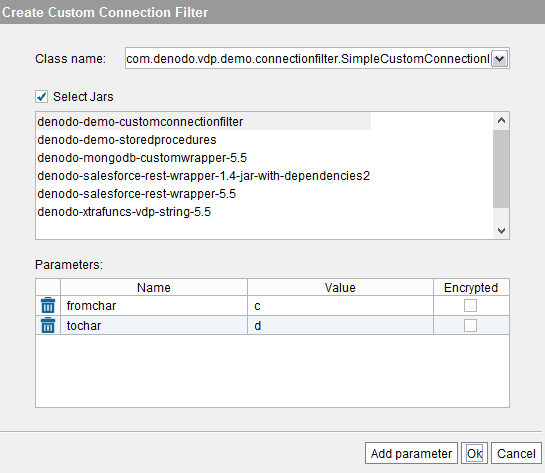
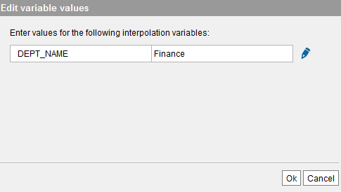

==============================
Path Types in Virtual DataPort
==============================

.. toctree::
   :hidden:
   
   local_path.rst
   from_variable_path.rst
   http_path.rst
   denodo_browser.rst
   ftp_sftp_ftps_path.rst

When you create a data source of the type XML, JSON or delimited text
file (DF), you have to specify a path to the data files. Virtual
DataPort supports five types of paths to access a file:

1. **Local**: retrieves the file from the local file system.
   See section :ref:`Local Path`.
#. **From Variable**: the data is not obtained from any file, instead
   the content of the file is provided by the client in the request.
   See section :ref:`Path From Variable`.
#. **HTTP**: retrieves the file sending an HTTP request.
   See section :ref:`HTTP Path`.
#. **Denodo Browser**: retrieves the file executing an ITPilot sequence.
   See section :ref:`Denodo Browser Path`.
#. **FTP / SFTP / FTPS**: retrieves the file from an FTP server.
   See section :ref:`FTP / SFTP / FTPS Path`.

For all these path types except for “From Variable”, you can click the button **Test Connection** (next to “Ok”) to check that the path is accessible. If you entered interpolation variables in the path to the file, you will have to provide their values before creating the data source, to be able to test the connection.

The DF (delimited files) and JSON data sources have an option to
specify the encoding of the data. If the check box **Autodetect encoding**
is selected, the Server will try to detect the
encoding of the file when the base views of the data source are queried. If you clear this check box, select the encoding of the file in the **Charset Encoding** drop-down list.

Compressed or Encrypted Data Sources
=================================================================================

Virtual DataPort can access data files that are:

-  Compressed with ZIP
-  Compressed with GZIP.
-  Encrypted with the algorithm “Password-Based Encryption with MD5 and
   DES” (PBE with MD5 and DES). This encryption method is described in
   the `Java Cryptography Architecture (JCA) Reference Guide <https://download.oracle.com/javase/7/docs/technotes/guides/security/crypto/CryptoSpec.html>`_.

This applies to all the types of paths except from "from variable". In their configuration, the available options are:

-  **Decompress (zip format)**. Select if the data file is a ZIP
   compressed file.
-  **Decompress (gzip format)**. Select if the data file is a GZIP
   compressed file.
-  **Decrypt**. Select this option if the data file is encrypted with
   *PBE with MD5 and DES*. In this case, you can also fill in the
   “Password” box.
-  **Custom**. You can develop your own custom filters to preprocess the
   data before is processed by Virtual DataPort. See more about custom
   filters in the section :ref:`Custom Input Filters`.

If an external application generates a DF, JSON or XML file to be read
by Virtual DataPort, you can encrypt it for security reasons. Then, when
creating the data source to access these data, select the “Decrypt”
filter.

Virtual DataPort provides a tool to encrypt the data with the “PBE with
MD5 and DES” algorithm. To do this, uncompress the file
``denodo-crypt-tools.zip`` located in the
:file:`{<DENODO_HOME>}/tools/db/denodo-crypt-tools` directory. Then, you have
two options:

#. Write the file to disk in plain text and encrypt it with the script
   ``encrypt`` of the :file:`{<DENODO_HOME>}/tools/db/denodo-crypt-tools/bin`
   directory.
#. Or, use the library ``denodo-crypt-tools.jar`` (located in
   :file:`{<DENODO_HOME>}/tools/db/denodo-crypt-tools/lib`) to encrypt the
   data from your Java application. That way, you can avoid writing the
   file to disk in plain text.

The ``README`` file in the directory
:file:`{<DENODO_HOME>}/tools/db/denodo-crypt-tools` provides more details
about both options.

Custom Input Filters
=================================================================================

Besides the input filters listed above, Virtual DataPort provides a Java API that allows you to
develop filters that preprocess the data from the source in any way you
need. This allows you to transform the input data in any way you like
before it is processed by Virtual DataPort.

To develop a custom filter, see the section :doc:`Developing Custom Input
Filters <../../../developer/developing_extensions/developing_custom_input_filters/developing_custom_input_filters>` 
of the Developer Guide.
Once you have developed and imported the
filter, you can assign it to a DF, JSON or XML data source.

To assign a filter to a data source, open the dialog to configure the
path to the data file (delimited file, XML or JSON data sources). In
this dialog, click the **Custom** option button (for “HTTP client”
routes, this button is located in the **Filters** tab) and then,
**Edit**. The Tool will display a dialog like the `Assigning a custom
filter to a DF data source`_.

   Assigning a custom filter to a DF data source

Select the **Select jars** check box and then, select the class name of
the custom filter from the **Class name** box.

.. If the custom filter was imported into Virtual DataPort by copying its
   jar file to :file:`{<DENODO_HOME>}/extensions/thirdparty/lib` directory, clear
   the **Select jars** check box and enter the name of the class in the
   **Class name** box.

If the custom filter has input parameters, click **Add parameter** and
then, enter a name and a value for each parameter. If you select the
**Encrypted** check box for a parameter, the value of the parameter will
be hidden and sent encrypted to the Server. To remove a parameter, click
|image7|.

Once you have finished, click **Ok** to close the dialog and continue
configuring the data source as usual.

Paths and Other Values with Interpolation Variables
=================================================================================

Paths and other parameters of data sources can be parameterized by
adding *interpolation variables* to their value. By using these
variables, you do not have to provide the value of a field at design
time (when creating the data source). Instead, you will provide the
values of these variables at runtime, when you query a view that uses
the data source.

For instance, if you create an XML data source that retrieves the XML
file from a Web server and you do not know the full path of the file
when creating the view, you can enter an URL like \http://acme.com/reports/@{DEPT\_NAME}.xml

In this URL, ``DEPT_NAME`` is an interpolation variable, which means
that the string ``@{DEPT_NAME}`` will be replaced at runtime by the
value of the variable. The clients that query the views over this data
source will have to provide this value in the ``WHERE`` clause of the
query.

When you create a data source with interpolation variables, the base
views created over this source will have a field for each interpolation
variable. The name of the field will be the same as the name of the
variable. If the data obtained from the source has a field that
conflicts with the name of the variable, the field from the source will
be renamed.

In our example, the base views created over this XML data source will
have an extra field called ``DEPT_NAME``. When a client executes a query
that access this source:

.. code-block:: sql

   SELECT * 
   FROM ... 
   WHERE DEPT_NAME = 'it'

the string ``@{DEPT_NAME}`` will be replaced by ``it``. So, the Server
will retrieve the XML file from the URL \http://acme.com/reports/it.xml

When you begin creating a base view over a data source that has
interpolation variables, the Tool will display a dialog to enter the
value of these variables (see `Providing input values to interpolation
variables`_). The Server will use these values to query the source and
calculate the schema of the new base view.

   Providing input values to interpolation variables

.. note:: If you enter a literal that contains one of the special
   characters used to indicate interpolation variables (``@``, ``{`` or
   ``}``), in a parameter that accepts interpolation variables, you have to
   escape these characters with ``\``.

For example, if the path to a file is like this ``C:/dir}/file.xml``,
you have to escape the brace like this: ``C:/dir\{/file.xml``

In Windows systems, the character ``\`` is used to specify file
paths, causing some ambiguous situations. For example, the Server could
interpret that the path ``C:\tmp\@{var}`` references a file named
``tmp@{var}`` in the ``C:\`` directory because the second
``\``, due to its appearance just before ``@``, is
considered an escape character. Therefore, you have to escape the
``\`` character.

For example, the ``C:\\tmp\\@{var}`` path references a file which
name is the value of the ``var`` variable and it is located at
``C:\tmp``.

The section :ref:`Execution Context of a Query and Interpolation Strings` of
the VQL Guide explain this in more detail.

.. |image5| image:: ../../common_images/icon-plus3.png

