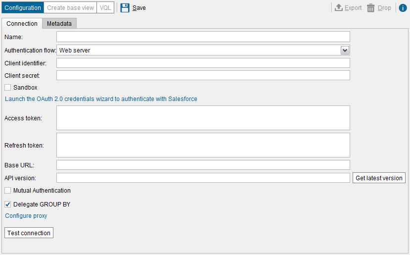
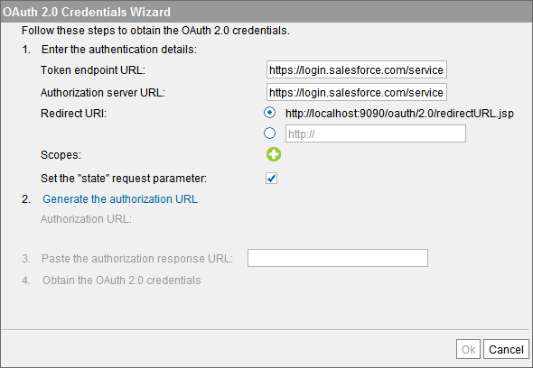
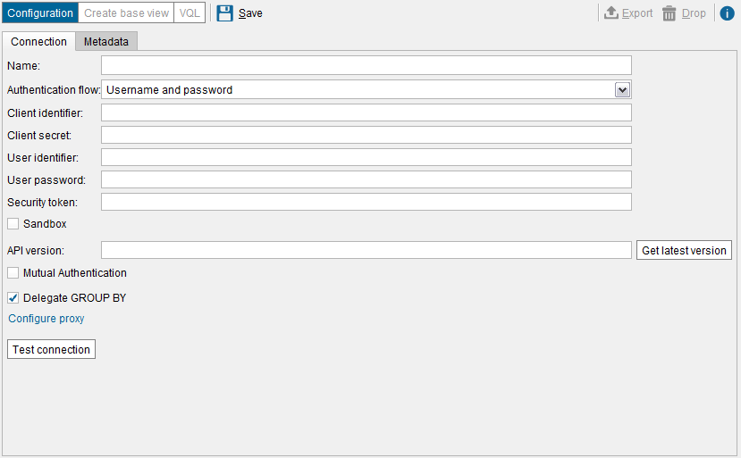
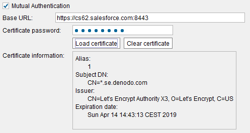
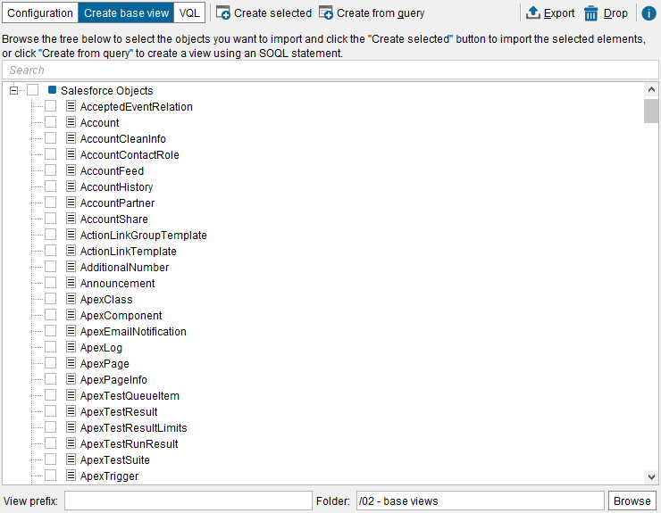
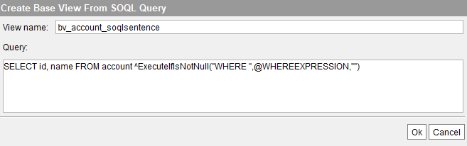

==================
Salesforce Sources
==================

Denodo provides a connector to Salesforce.com. With this connector you can query the data of your Salesforce account, and insert, update and delete records from it.

This connector can work with any Salesforce object. That is, the objects created in Salesforce by default (accounts, contacts, etc.) as well as with custom objects.

|

This connector uses the REST API of Salesforce. To establish the connections, it uses HTTPs and the OAuth 2.0 
authentication protocol to securely access data without having to reveal your username and password.
 
It supports two "OAuth 2.0 authentication flows". These flows define how the Denodo server authenticates itself with Salesforce.

1. *Web server flow*:  with this flow, the connector provides a wizard so you can obtain the *Access token* and *Refresh token*.

#. *Username-password flow*: you will have to provide your Salesforce credentials.

The second flow is easier to configure than the "web server flow" because you do not have to obtain any token. However, you have to indicate your user name and password of Salesforce. The other flow is more secure because you can limit the operations this data source will be able to do (e.g. only allow read access to Denodo). In addition, if the access token or the refresh token ever get compromised, they can be revoked without having to change the password of your Salesforce user account.

|

As Salesforce is not on your premises, queries to this source can be slower than queries to other sources 
like databases or local files. To improve the performance of the queries involving Salesforce base views, consider enabling cache on these types of views:

-  For objects that rarely change, you can enable the cache mode full on the base view, and preload its cache periodically, with a Scheduler job.

-  For objects whose records are never deleted, only added and updated, you can enable the incremental cache mode. The section :ref:`Incremental Mode` explain what this is and has an example of how to use this cache mode with Salesforce.

Registering Denodo as a Connected Application
=============================================

Before creating a Salesforce data source in Denodo, you have to `set up a connected application <https://developer.salesforce.com/docs/atlas.en-us.api_rest.meta/api_rest/intro_defining_remote_access_applications.htm>`_ in Salesforce. When registering the application, you need to:

-  Enable *OAuth settings*. This connector uses the OAuth authentication protocol to connect to Salesforce.
-  The *Callback URL*, has to be "\https://<host name of the Denodo server>:9090/oauth/2.0/redirectURL.jsp". Salesforce mandates this URL to be \https://, not \http://.

   This URL does not need to be accessible from outside your organization or not accessible at all (that is, you did not enable TLS on the Denodo web container).

   Later, during the configuration of the data source, if you set *Authentication flow* to *Web server* and use the wizard to obtain the OAuth credentials,
   the wizard will open a browser where you have to enter your credentials. If they are correct, Salesforce will redirect your browser to this URL. 
   This redirection will occur regardless of Salesforce has access to this URL or not.

-  You need to grant certain *OAuth scopes* to this application. If you select "full" and "refresh token", this data source will be able to execute any query and when the current access token expires, it will be able to obtain a new one.

Creating a Salesforce Data Source
=================================

To create a Salesforce data source, click the menu **File** > **New** > **Data source** > **Salesforce**.

The main aspect to configure in a Salesforce data source is the authentication flow. This connector uses the protocol OAuth 2.0 and it supports these authentication flows:

-  :ref:`Web server<Web Server Flow>` flow
-  :ref:`Username and password <Username and Password Flow>` flow

The information needed to create the data source is different depending on the authentication flow you want to use.

Web Server Flow
---------------

The *web server flow* authentication flow corresponds to the *Authorization Code Grant* defined by the OAuth 2.0 standard.

This authentication flow provides one important security benefit over the *Username and password* flow; Denodo is never exposed to the credentials of the user account of Salesforce. Instead, it just knows the credentials of the registered application.

   Creating a Salesforce data source using the *Web server* flow

For this flow, enter the following details:

-  **Name**. Name of the new data source.
-  **Authentication flow**. Select **Web Server**.
-  **Client identifier** and **Client secret**. These are the *Consumer Key* and *Consumer Secret* of the connected app in Salesforce.
-  **Sandbox**. Select this if you are going to connect to a `Sandbox environment <https://developer.salesforce.com/page/An_Introduction_to_Environments>`_. This changes the host name that Denodo will use to perform the OAuth authentication.

   -  If selected, the host name is \https://test.salesforce.com.
   -  If cleared, the host name is \https://login.salesforce.com.

   This is the host name that is used for authentication purposes. The requests to obtain actual data are sent to the host indicated in the field *Base URL*.
   
-  **Mutual Authentication**. Select this to use "Mutual Authentication". See more about this below, in the section 
   :ref:`Mutual Authentication <vdp_admin_guide_salesforce_sources_mutual_authentication>`).

-  If you already obtained the **Base URL**, **Access token** and **Refresh token**, enter them in the boxes below and click **Ok**. You do not need to use the credentials wizard. 

   If you do not have this information, click **launch the OAuth 2.0 credentials…** to open the wizard that will help you obtain them.

   OAuth 2.0 credentials wizard

..

   a. The default value of the fields **Token endpoint URL** and **Authorization server URL** is correct. Note that it changes depending on if you selected the check box *Sandbox* or not.

   #. In **Redirect URI**, enter the *Callback URL* you entered when setting up the "Connected App" in Salesforce.

   #. "Scopes" are the actions that Denodo will be able to execute on Salesforce. If you do not add any **Scopes** here, Denodo will be authorized to perform all the actions you selected in the *Selected OAuth Scopes*, in the configuration of the "Connected App" in Salesforce.

      If you want to define the scopes, click the button |image5| for each scope you want to add and enter its name.

   #. Select the check box **Set the “state” request**.

   #. Click **Generate the authorization URL** and then, **Open URL**. If the browser is not launched, copy the URL and open it manually.
   
      On this page, you have to enter the credentials of your Salesforce account to authorize this connected application. 
      That is, enter the user name and password of the Salesforce account, not the registered application. 

      If the credentials are correct, Salesforce will redirect your browser to the *Redirect URL* 
      (this is the *callback URL* you set up when registering Denodo on your Salesforce account).

   #. Copy the URL you have been redirected to and go back to the wizard. In the box of *step 3*, paste this URL.

      It does not matter if the browser shows an error saying that the page does not exist; copy the URL and paste it in the wizard. You can ignore this error because this page only displays an informational message saying that you have to paste this URL into the wizard.

   #. Click on **Obtain the OAuth 2.0 credentials**.

      The Server will request the OAuth credentials using all the details
      you have provided and the parameters of the URL you have pasted in
      the previous step. If authenticated successfully, the *Access token*, *Refresh token*, *Base URL* and *API version* fields will be filled automatically.

      The response will be the access token, the Salesforce host name to which this data source will have to send requests to and, depending on the configuration of the connected app, the refresh token.

   #. Click **Ok** to close the wizard.

      The wizard will fill the text areas and text fields with the information obtained in the previous step.

-  Click **Ok** to close the “Edit HTTP Connection” dialog and then,
   **Save** to create the data source.

-  **Access token**. OAuth 2.0 access token.
-  **Refresh token**. OAuth 2.0 refresh token.
-  **Base URL**. URL of the Salesforce instance to access.
-  **API version**. Version of the Salesforce REST API version to use. This has to be something like "v41.0". Click **Get latest version** to send a request to Salesforce to obtain the latest version of the API.
-  **Delegate GROUP BY**. Select to push down the GROUP BY clause to Salesforce. Take into account that Salesforce limits to 2,000 the number of rows a query with GROUP BY can return.
-  **Include deleted and archived data**. Select to include deleted and archived data in the result of queries. By default, Salesforce filters out deleted and archived data.
-  In **Configure proxy** you can set the proxy configuration for this data source. If in this dialog, you select **Default**, the data source will use the :ref:`default proxy <Default Configuration of HTTP Proxy>` of the Virtual DataPort server.

Username and Password Flow
--------------------------

The *username and password flow* corresponds to the *Resource Owner Password Credentials Grant* defined by the OAuth 2.0 standard.

.. note:: Although the connection is encrypted with https, this OAuth authentication flow passes the user's credentials back and forth. Use it only if the other authentication flow is not possible.

   Creating a Salesforce data source using the *Username and password* flow

The following fields are requested when *Username and password* flow is selected:

-  **Name**. Name of the new data source.
-  **Authentication flow**. Select **Username and password**.
-  **Client identifier** and **Client secret**. These are the *Consumer Key* and *Consumer Secret* of the connected app in Salesforce.
-  **User identifier** and **User password**. These are the credentials of the Salesforce user account.
-  **Security token**. This is the `security token <https://help.salesforce.com/articleView?id=user_security_token.htm>`_ of this Salesforce account.
-  **Sandbox**. Select this if you are going to connect to a `Sandbox environment <https://developer.salesforce.com/page/An_Introduction_to_Environments>`_. This affects the host name that Denodo will use to perform the OAuth authentication.

   -  If selected, the host name is \https://test.salesforce.com.
   -  If cleared, the host name is \https://login.salesforce.com.

   This is the host name that is used for authentication purposes. The requests to obtain actual data are sent to a different host name.

-  **API version**. Version of the Salesforce REST API version to use. This has to be something like "v41.0". Click **Get latest version** to send a request to Salesforce to obtain the latest version of the API.
-  **Mutual Authentication**. Select this to use "Mutual Authentication". See more about this below, in the section :ref:`Mutual Authentication <vdp_admin_guide_salesforce_sources_mutual_authentication>`).
-  **Delegate GROUP BY**. Select to push down the GROUP BY clause to Salesforce. Take into account that Salesforce limits to 2,000 the number of rows a query with GROUP BY can return.
-  **Include deleted and archived data**. Select to include deleted and archived data in query results. By default, Salesforce filters out deleted and archived data.
-  In **Configure proxy** you can set the proxy configuration for this data source. If in this dialog, you select **Default**, the data source will use the :ref:`default proxy <Default Configuration of HTTP Proxy>` of the Virtual DataPort server.

Click **Save** (|image3|) to create the data source.

|

In the **Metadata** tab, set the folder where the data source will be stored and provide a description. When editing the data source, you can change its owner by clicking the button |image1|.

|

With the flow *Username and Password*, you do not have to enter the "Base URL" as you have to do with the *Web server* flow. The reason is that with the former, when you create the data source, the Server follows this process:

1. It sends a request to Salesforce to obtain an access token.
#. The response contains the access token and the base URL.
#. The Server saves the information you entered and this URL. If you see the VQL of the data source, you will see these values.

.. _vdp_admin_guide_salesforce_sources_mutual_authentication:

Mutual Authentication
---------------------

You can add an additional level of security to the connections with Salesforce by enabling *Mutual authentication*. With this type 
of authentication (also known as "two-way SSL/TLS"), the client application that connects to 
Salesforce (in this case Denodo) has to present a certificate to validate its identity.

Before enabling this authentication method, you have to 
`set up a mutual authentication certificate <https://help.salesforce.com/articleView?id=security_keys_uploading_mutual_auth_cert.htm>`_ 
in your Salesforce account.

   
   Mutual authentication configuration for a Salesforce data source

Once mutual authentication is enabled in Salesforce, you need to provide the following:

-  **Base URL**: enter the URL to your Salesforce instance with the port 8443. E.g. "\https://c15.salesforce.com:8443". Client applications (i.e. Denodo) that use this type of authentication have to present their certificate on this port.
-  **Certificate password**: enter the password of the file containing the private key that Denodo will use.
-  Click **Load certificate** and select the file that contains the private key. The supported formats are PKCS#12 and JKS.

.. note:: With the flow *Username and Password*, set the **Base URL** to your specific Salesforce instance. See more about this in `this article <https://help.salesforce.com/articleView?id=000002889&language=en_US&type=1>`_ of the Salesforce Knowledge Base.

Creating Base Views from a Salesforce Data Source
=================================================

Once you create the data source, you can begin creating base views. Each base view will represent a Salesforce object. You can later combine the base views of this data source with views from other sources.

   List of available objects of a Salesforce source

To create Salesforce base views, follow these steps:

#. In the *Server Explorer*, double-click the data source to open it, and click **Create base view**.

   The tool will display a list of the available Salesforce objects (the default and the custom ones).

   To search for an object, type its name in the box located at the top of the dialog. The list will only show the objects whose name contains the text you entered.

#. Select the check boxes next to the objects for which you want to create a base view.

#. In **View prefix**, you can enter a prefix for all the new views. For example, if you enter
   "salesforce\_", the name of all the new views will start with "salesforce\_".

#. Click **Browse** to select the folder where the base view will be created. In this dialog, you can create new folders or rename the existing ones (right-click on this dialog to display these two options).

#. Click **Create selected**.

#. If you only selected one object, the Tool will open a tab with the schema that the base view will have. In this tab, you can:

   -  Change the name of the new base view.
   -  Change the name and type of the new base view’s field.
   -  Edit the “Source type properties” of the field by clicking the button |image1|. In this dialog, you can define the exact type of the field and depending on the type, its length and number of decimals.

   Click **Save** (|image3|) to create the base view.

#. If you selected two or more objects, the Tool will show a dialog with a list of all the views it created. If there were already views with the names of the selected objects, the Tool will display a dialog like the one below.

   .. figure:: salesforce-new_bv_duplicates.png
      :align: center
      :alt: Renaming new views with the same name as existing ones
      :name: Renaming new views with the same name as existing ones

      Renaming new views with the same name as existing ones

   In this dialog, you have to provide a new name for the views in red or clear its check box. When you click **Ok**, the Tool will create the selected views with the new name.

   If you are creating several base views at once and many of them have the same name as other existing views, there is an alternative to entering a new name for each view. Instead, select all the existing base views that have the same names as the ones you want to create, right-click on them and click **Prefix selected views/associations**. With this option, you will add a prefix to the name of all the selected views. Then, you can go back to create the base views and there will not be any conflict.

The Tool lists the new base views in two places of the Server Explorer:

#. In the folder that the view has been created in. If you want to move the base view to another folder, drag it to that folder.

#. As a child node of the data source that the base view belongs to. This node cannot be moved to other folders. It is added to the tree to provide an easy way to see the base views created from a data source.

In the Server Explorer, double-click the new base view to display its schema. Click **Edit** to modify the base view.

Creating Base Views from SOQL Queries
===========================================================================

Instead of creating a base view that represents an object, you can create a base view that represents a *Salesforce Object Search Language* (SOQL).

To do this, in the "Create base view" dialog, click **Create from query**.

   Creating a base view from a SOQL query

Enter the name of the base view and the SOQL query and click **Save** (|image3|). Its schema can be edited as a regular base view.

About this SOQL query, consider the following:

#. This SOQL query has to use the syntax of the Salesforce Object Query Language and not the syntax of Virtual DataPort.

#. SOQL does not support ``SELECT * FROM ...``. You have to enter the names of the columns (e.g. ``SELECT name FROM...``)

#. The query may have :ref:`interpolation variables <Paths and Other Values with Interpolation Variables>`, which allow the SOQL query to be parameterized according to the specified query conditions.

   If the query has interpolation variables, after clicking “Ok”, enter the values of the variables used in the query. With these values, Virtual DataPort will execute the query and obtain the metadata required to create the base view.

   Each interpolation variable must be related with an attribute belonging to the generated base view, so that the variable can obtain its value at run time. If the SOQL query used to access the data source returns any field with the same name as the variable, then the variable will be associated to the corresponding base view attribute. If the SOQL query does not return any field with the same name as the variable, Virtual DataPort will add a new attribute to the base view, with the same name.

   .. figure:: salesforce-new_bv_soqlsentence_edit_interpolation_variables.png
      :align: center
      :alt: Editing the value of the interpolation variables
      :name: Editing the value of the interpolation variables

      Editing the value of the interpolation variables

Using the Variable WHEREEXPRESSION in SOQL Queries
---------------------------------------------------

As explained above, the SOQL Query used to create a base view can contain interpolation variables to parameterize the SOQL Query.

Virtual DataPort provides a predefined interpolation variable called ``WHEREEXPRESSION`` that simplifies the process of creating a base view from a SOQL query. At runtime, the Server will replace ``WHEREEXPRESSION`` with the condition sent to the base view.

After clicking **Ok**, you have to provide the values for the variables used, so Virtual DataPort can execute a query to obtain the metadata required for creating the base view.

Then, click **Save** (|image3|) to create the base view.

If you need to filter the results of a SOQL query base view with a ``WHERE`` condition that involves fields that cannot be projected, type the name of these fields separated with commas, in the box at the bottom of the dialog. These fields will belong to the base view but the Server will not project their value. They should only be used in the ``WHERE`` clause of the queries that involve this base view and the values provided for them will be used only to generate the query sent to the database.

To avoid forcing the queries to always have the ``WHERE`` clause, Virtual DataPort provides the *interpolation function* ``ExecuteIfIsNotNull``. The syntax of the function is:

.. code-block:: sql

   ^ExecuteIfIsNotNull( <prefix if the variable is not NULL>
       ,@<variable name>
       ,<suffix if the variable is not NULL>
       [,<value if the variable is NULL> ] )

At runtime, if the value of the variable is not defined, the function replaces ``@<variable name>`` with the value of the variable and adds a prefix and a suffix to this value.

-  Do not leave any white space between the parameters of the function.
-  Use double quotes, not single quotes, to surround the parameters.
-  In the second parameter, the name of the interpolation variable has to be indicated with the syntax ``@VARIABLE_NAME``, without braces. In other scenarios, you can indicate variables with the syntax ``@{VARIABLE_NAME}``, but not in this function.

.. code-block:: sql

   SELECT id, name FROM account ^ExecuteIfIsNotNull("WHERE ",@WHEREEXPRESSION,"")

At runtime, if the query to this view has ``WHERE`` clause, ``@WHEREEXPRESSION`` will be substituted by the query condition, prefixed by ``WHERE`` and with an empty string at the end.

If you set the fourth parameter (optional) of ``ExecuteIfIsNotNull``, the function will always be executed. If the value of the interpolation variable is ``NULL``, the function returns the value of the fourth parameter. For example, if the base view is built with this SQL query:

.. code-block:: sql

   SELECT id, name
   FROM account ^ExecuteIfIsNotNull('WHERE',@WHEREEXPRESSION,'','WHERE name <> NULL')

At runtime, if the query does not have the ``WHERE`` clause, the Server will execute this query in the database:

.. code-block:: sql

   SELECT id, name FROM account
   WHERE name <> NULL

.. note:: In these examples, we have only used the interpolation function ``ExecuteIfIsNotNull`` with the variable ``WHEREEXPRESSION``, but it can be used with any other interpolation variable.

Binary Fields
==============================================

The Denodo connector for Salesforce supports querying, inserting and updating records with binary fields.

When you create a base view over a Salesforce object that has a binary field, the type of the field in the base view is "blob". When a query projects a blob field of a Salesforce base view, Salesforce will return the URL for each blob value. The connector, transparently will send a request to these URLs and include the binary value in the result.

If you do not want a view to behave this way, change the type of the field to "text". After doing this, when a query projects this field, the value of the field will be the URL of the blob value and not its actual binary value.

To change the type of a field to "text", do this:

1. Edit the view and on the field, select the type "text"
#. Click |image1| to open the *Source Type Properties* dialog
#. In this dialog, in **Type**, select **VARCHAR**.
#. Click **Ok** and then, **Save** (|image3|).

Insert or Update Binary Fields
------------------------------

To insert or update a binary field on a Salesforce record, you have to provide its value encoded in Base64. Example:

.. code-block:: sql

   UPDATE contentversion
   SET versiondata = 'VGhpcyB0ZXh0IGlzIGVuY29kZWQgaW4gQmFzZTY0dkldkldklklaUUIII....'
   WHERE id = '0680Y000002H9KfQAK'
   
.. |image1| image:: ../../common_images/edit.png
.. |image3| image:: ../../common_images/save.png
.. |image5| image:: ../../common_images/icon-plus3.png

Limitations of Salesforce
=========================

This section lists some of the limitations imposed by Salesforce:

- If the option "Delegate Group BY" is selected, it is not possible to group by a field of the entity and aggregate over it.
- If the option "Delegate Group BY" is selected, the maximum number of rows returned is 2000.   

Additional Settings
=========================

The connections against Salesforce have a default timeout of 120000 milliseconds. To change its value, for example to 240000 milliseconds, do this:

1. Execute

    .. code-block:: sql

      SET 'com.denodo.vdb.catalog.datasource.salesforce.timeout'='240000'
    
2. Restart the server.

 
