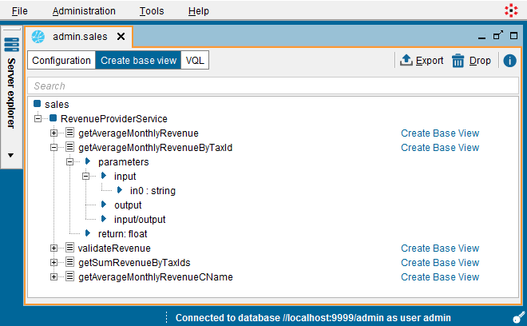

========================
SOAP Web Service Sources
========================

This section explains how to:

-  Create a data source that points to a SOAP Web service
-  Create a base view to sends requests to its operations.

Importing SOAP Web Service Sources
=================================================================================

To create a new Web service data source, right-click on a database of
the Server Explorer and click **New** > **Data source** > **Web
service**.

The Tool will display the dialog to create a new Web service data
source.

   Creating a Web service data source

Fill in the following fields:

-  **Name**: Name of the new data source. In our example, the name of the
   new data source is “sales”.

-  **WSDL**: Path to the WSDL file containing the Web service
   specification. We can provide a URL or select a local file by clicking
   **Browse**.
   In our example, the path is
   :file:`{<DENODO_HOME>}/samples/vdp/incidents/sales.wsdl`.

-  **End Point**: URL to access the Web service. E.g.
   ``http://localhost:8080/sales/services/RevenueProvider``. Usually, the
   WSDL contains this URL, but sometimes it does not or it does not point
   to the right location.

   -  **From WSDL**: The end point is obtained from the WSDL.
   -  **From Variable**: The end point is obtained from an *interpolation
      variable*. This means that the base views created over this data
      source will have an extra field with the name specified in the field
      “Variable”.
      When querying these views, indicate the end point of the Web service
      in the ``WHERE`` clause of the query. For example,
      
      .. code-block:: sql
      
         SELECT * 
         FROM v_revenue 
         WHERE endpoint = 'http://acme:8080/sales/services/RevenueProvider'
         
      This option is useful when the end point changes regularly or is
      obtained from another source at runtime.
      See section :ref:`Paths and Other Values with Interpolation Variables`
      for more information about interpolation variables.
   -  **Specify**: Indicate the URL of the end point in the box below.
      This option is useful when the WSDL does not contain and end point,
      or it is not correct. E.g. if you deploy the “sales” Web service in a
      Web container that does not listen to connections at
      ``localhost:8080``.

-  **Authentication**: Virtual DataPort can access Web services that
   require authentication. It supports five authentication protocols:

   -  **HTTP Basic** and **HTTP Digest**. The `RFC 2617: HTTP
      Authentication: Basic and Digest Access Authentication <https://www.ietf.org/rfc/rfc2617.txt>`_ describes these authentication
      methods.

   -  **HTTP NTLM**. Uses the NTLM Authentication Protocol (`NT LAN Manager (NTLM) Authentication Protocol
      Specification v1 and v2 <https://msdn.microsoft.com/en-us/library/cc236621(PROT.10).aspx>`_) 
      to
      access Microsoft Windows servers. Virtual DataPort supports NTLM v1 and
      NTLM v2.

   -  **HTTP SPNEGO (Kerberos)**. Uses Kerberos tickets to sign the HTTP
      requests sent to the Web service (see section :ref:`Connecting to a SOAP Web
      Service with Kerberos Authentication`).

   -  **WSS Basic** and **WSS Digest**. `Web Services Security (WS-Security) <https://www.oasis-open.org/committees/wss/>`_
      is a standard for the
      implementation of security features in applications using Web services.
      Currently, Denodo supports the authentication profile “Username Token”
      (`WSS - Web Services Security Username Token Profile 1.1 <http://docs.oasis-open.org/wss/v1.1/>`_).

   -  There are three ways to provide the credentials of the Web service:

      -  **Specify**. Fill in the fields **Login** and **Password** and if you
         have selected “HTTP NTLM” fill in the field **Domain**. These
         credentials are used to connect to the Web service server, in order to:

         1. Execute queries that use this data source.
         2. Obtain WSDL of the Web service and display its operations.            

      -  **Pass-through session credentials**. Fill in the fields **Login** and 
         **Password** and if you have selected “HTTP NTLM”, fill in the field
         **Domain**. When a client executes a query that uses this data source,
         the credentials used to connect to the Web service and execute an
         operation are the credentials of the user. Not the credentials of the
         fields “Login” and “Password”.
         
         When this option is selected, the credentials of the fields “User” and
         “Password” are used only to connect to the Web service server in order
         to obtain the WSDL of the Web service and display its operations.
         
         If you created the data source with this option, but you want to
         query a view of this data source with other credentials than the ones
         used to connect to the Server, add the parameters ``USERNAME``
         and ``USERPASSWORD`` to the ``CONTEXT`` of the query. These two
         parameters are only taken into account when the data source has been
         created with the option *Pass-through session credentials* enabled.
      
         For example, if ``view1`` has been created over a web service data source
         with this option enabled and you execute this: 
         
         .. code-block:: sql
         
            SELECT * 
            FROM view1
            CONTEXT(USERNAME = 'admin', PASSWORD = 'd4GvpKA5BiwoGUFrnH92DNq5TTNKWw58I86PVH2tQIs/q1RH9CkCoJj57NnQUlmvgvvVnBvlaH8NFSDM0x5fWCJiAvyia70oxiUWbToKkHl3ztgH1hZLcQiqkpXT/oYd' ENCRYPTED)
      
         the Server will send a request to the service with the username “admin” and the
         password “password”, ignoring the credentials that you used to connect
         to the Server.
      
         It is mandatory to add the token ``ENCRYPTED`` and enter the password encrypted. To encrypt the password, use the statement ``ENCRYPT_PASSWORD``. For example:
         
         .. code-block:: vql
         
            ENCRYPT_PASSWORD 'my_secret_password';

     
         .. warning:: 
            Users should be careful when enabling the cache for views
            that involve data sources with pass-through credentials enabled. The
            appendix :ref:`Considerations When Configuring Data Sources with Pass-Through
            Credentials` explains the issues that may arise

.. _vdp_admin_guide_soap_web_service_from_variables:

      -  **From variables**. Instead of providing the credentials when creating
         the data source, you can assign *interpolation variables* (see section
         :ref:`Paths and Other Values with Interpolation Variables`) to the
         credentials and supply them at runtime. To do that, select the check box 
         **Obtain credentials from variables** and fill in the boxes below (“Name
         variable” and “Test variable”).
          
         E.g. you select “HTTP Basic” authentication, check the box “Obtain
         credentials from variables” and fill in the field Login “Name variable”
         with “user\_name” and Password “Name variable” with “password”. The
         views created over this data source will have two extra fields called
         “user\_name” and “password”. When querying these views, provide their
         value in the WHERE clause of the query:
          
         .. code-block:: sql

            SELECT * 
            FROM average_monthly_array 
            WHERE user_name = 'admin' and password = 'admin'
          
         The values of the fields “Test value” are used to retrieve the WSDL from
         the server.

-  **Proxy**: If the connection with to the Web Service is established
   through a proxy, you have three options:

   -  Select **Manual** and enter the host name and port of the proxy
      server. If it is an authenticated proxy, the user identifier and a
      valid password must be also specified.
   -  Select **Default**. The Server will use the default HTTP proxy
      configuration of the Server (see section :ref:`Default Configuration of
      HTTP Proxy`).
   -  Select **Automatic** and enter the URL of a ``proxy.pac`` file that
      contains the configuration parameters of the proxy.   

   
-  **Check certificates**: select this check box if you are in one of these
   scenarios:

   -  The Web service uses SSL/TLS (i.e. the URL starts with ``https``) and you
      want Virtual DataPort to validate that the certificate presented by
      this service was issued by a Certificate Authority (CA) trusted by
      the Java Virtual Machine (JVM) included with the Denodo Platform.
      This validation will be performed for every connection established
      with the service.
      
      If the certificate presented by this service was not issued by a trusted CA
      or it was self-signed, but you still want Virtual DataPort to validate it, 
      import the certificate into the list of trusted certificates of the JVM. 
      The section 
      :doc:`Importing the Certificates of Data Sources (SSL Connections) <../../../../platform/installation/postinstallation_tasks/postinstallation_tasks_in_virtual_dataport/importing_the_certificates_of_data_sources_ssl_connections>`
      of the Installation Guide explains how to do this.
      
   -  Also, select this check box if the service requires SSL client
      authentication.

   Clearing the check box has two implications:

   1. Virtual DataPort will accept any certificate presented by the service
      without checking who issued it.
   #. And, all the requests will fail if the service requires SSL client
      authentication.

   
-  **Connection pool configuration**: In this dialog, you can configure the
   connections opened to the target host and the pool where they are
   stored.
   
   The Web service data sources use a pool of connections to retrieve the
   data. That is, each data source has its own pool of HTTP connections, in
   order to avoid creating a new one for each request and reuse the
   existing ones.
   When a user executes a query that involves a base view of this data
   source, the Server, instead of creating a connection for each request,
   it reuses a connection of the pool. The benefit of this is that if the
   connection already is established, the Server will obtain the response
   much faster.

   -  **Maximum number of connections** is the maximum number of
      connections that the pool of this data source will store.
      
      If the Server has to execute a request and there are no free
      connections in the pool, the pool creates a new one. If the pool
      reaches the “Maximum number of connections” and the Server needs
      another connection, it will wait the number of milliseconds set by
      **Connection pool timeout (milliseconds)**. If this timeout is
      reached, the request will fail. If the value of this timeout is zero,
      the Server will wait indefinitely to obtain a new connection.
      
      If the data source uses “Pass-through session credentials”, the
      Server creates a pool of connections for each user name of each data
      source.
   -  **Read timeout (milliseconds)**: timeout of the connections.
   
      Once the Server has obtained a connection from the pool, it sends an
      HTTP request to the target host. This property controls how much time
      the connection will wait for the source to begin returning data. If
      this timeout is reached, the query fails.

   Web service data sources: Connection Pool configuration

In the **Metadata** tab of the dialog, you can set the folder where the
data source will be stored and provide a description. When editing the
data source, you can also change its owner by clicking the button |image2|.

Connecting to a SOAP Web Service with Kerberos Authentication
-------------------------------------------------------------

To connect to a SOAP Web service with Kerberos authentication, select
the option “HTTP SPNEGO (Kerberos)” in the “Authentication” box.

The exact behavior of Virtual DataPort depends on the options selected
below the “Authentication” box.

- **From variables**: if selected, when executing a query involving this
  data source, Virtual DataPort will use the values of the login and
  password variables to connect to the Key Distribution Center (KDC) and
  obtain a service ticket. This ticket will be used to add an
  authentication header to the HTTP requests sent to the SOAP service.

  The :ref:`previous section <vdp_admin_guide_soap_web_service_from_variables>` explains in more detail how the option “From
  variables” works.

-  **Specify**: if selected, when executing a query involving this data
   source, Virtual DataPort will use the credentials you enter in the
   “Login” and “Password” boxes to connect to the KDC and obtain a service
   ticket. This ticket will be used to add an authentication header to the
   HTTP request sent to the SOAP service.

-  **Pass-through session credentials**: if selected, the behavior changes
   depending on the authentication method used by the client that is
   executing the query, to connect to Virtual DataPort:

   -  If the client uses Kerberos authentication to connect to Virtual
      DataPort, Virtual DataPort will request a service ticket using the
      ticket-granting ticket (TGT) obtained when this client opened the
      connection to the Server. Then, it will use this service ticket to
      add an authentication header to the HTTP requests sent to the SOAP
      service.
   -  If the client uses standard authentication to connect to Virtual
      DataPort, Virtual DataPort will request a service ticket using the
      user and password of the client. Then, it will use this service
      ticket to add an authentication header to the HTTP requests sent to
      the SOAP service.

In all these scenarios, if Kerberos authentication is not enabled in the
Server, take into account the following:

#. If the Virtual DataPort server is running on Windows but the host
   does not belong to a Windows domain, define the system properties
   “java.security.krb5.realm” and “java.security.krb5.kdc” as explained
   in the section :doc:`Using Kerberos Authentication in Virtual DataPort Without Joining a Kerberos Realm </platform/installation/appendix/using_kerberos_authentication_in_virtual_dataport_without_joining_a_kerberos_realm/using_kerberos_authentication_in_virtual_dataport_without_joining_a_kerberos_realm>` of the Installation Guide.
#. If the Virtual DataPort server is running on Linux, you need the
   system to have a ``krb5.ini`` file. See the section :doc:`Providing a Krb5 File for Kerberos Authentication</platform/installation/appendix/providing_a_krb5_file_for_kerberos_authentication/providing_a_krb5_file_for_kerberos_authentication>`
   of the Installation Guide for more
   information about how to check if there is already one in your
   system.

.. note:: Selecting the option “Pass-through session credentials” only
   affects how Virtual DataPort connects to the Web service when executing
   a query. During the process of creating base views over Web service data
   sources, Virtual DataPort sends a request to retrieve the WSDL. To do
   so, it uses the credentials set in the data source. That is, for the
   options “Pass-through session credentials” and “Specify”, the values of
   the “Login” and “Password” boxes and for “From variables”, the values of
   the “Test value” boxes.

Creating Base Views from a SOAP Web Service
=================================================================================

After creating the SOAP Web Service data source, you have to create base
views in order to invoke the operations of the Web service. To do this,
double-click the data source on the Server Explorer to open it and then,
click **Create base view**. The Tool will display a tree with the Web
services contained in the WSDL file and their ports, operations and
parameters (see `Operations and parameters of a Web Service`_).

   Operations and parameters of a Web Service

To create a base view over an operation, click **Create base view**
beside the name of the operation. The Tool will display how the schema
of the view will be (see `Creating the Web service base view
average_monthly_sales`_). In this dialog, you can do the following:

-  Modify the name of the base view.
-  Change the name and type of its fields.
-  Edit the “Source type properties” of the field by clicking the button
   |image2|. In this dialog, you can define the exact type of the field and depending on the type, its length and number of decimals. 
   
   For JDBC and ODBC base views, these properties are automatically defined because they are obtained from the database. For other types of base views such as Web service base views, they have to be defined manually.

-  Change the primary key definition of the view. When creating a JDBC
   base view, the Server obtains the primary key definition from the
   database and automatically sets the primary key of the view (fields
   marked with the icon |image1|). For other types of views such as Web service base views, 
   the primary key definition has to be established manually by selecting the 
   appropriate fields and clicking **Set selected as PK**. 
   
   See section :ref:`Primary Keys of Views` for more information about primary keys of views.

-  In the **Metadata** tab, you can set the folder where the base view
   will be stored and provide a description.
   
   When editing the base view, you can also change its owner by clicking
   the button |image2|.

To search an operation, type its name or the name of one of its
parameters in the box located at the top of the dialog. The list will
only show the elements whose name contains the text you entered.

Then, click **Save** (|image4|) to create the base view. The new base
view will be displayed in the Server Explorer.

In our example, we have to create a base view over the operation
``getAverageMonthlyRevenueBytaxId`` of the ``sales`` Web service. This
operation returns the average monthly volume of sales of a client. We
rename the base view to ``average_monthly_sales``, the field ``in0`` to
``taxId`` and the field ``return``, to ``revenue``.

   Creating the Web service base view ``average_monthly_sales``

To open the new Web service base view and see its schema, double-click
on the view, in the Server Explorer (see `Schema of the base view
average_monthly_sales`_).

   Schema of the base view ``average_monthly_sales``

Dealing with Web Service Operations that Return Compound Values
---------------------------------------------------------------

Some Web service operations return compound values such as arrays of
elements. There are two options to create base views over this type of
operations (see `Web service operation that returns an array`_):

-  **Do not stream output**. With this option, the new base view
   represents the compound values with fields of the compound types
   array and register. Then, you can create a Flatten view (see section
   :ref:`Creating Flatten Views`) over this base view to transform the
   results in a way that is easy to combine with data from other
   sources.
-  **Stream output at the specified level**. With this option, the
   Server optimizes the processing of the SOAP response so it does not
   require the entire response to be realized in memory before
   processing it. Therefore, the memory consumption is much lower. When
   the base view is created with the first option (“Do not stream
   output”), the Server receives the entire SOAP message from the Web
   service and then parses it thus having to store the whole message in
   memory.

   Web service operation that returns an array

The drawback of selecting **Stream output at the specified
level** over the other one is that with this option, the fields of
the SOAP message “below” the selected level are ignored (see the example
below).

.. code-block:: xml
   :name: Sample SOAP response of a Web service operation
   :caption: Sample SOAP response of a Web service operation

   <DataSampleResult_array>
       <DATASAMPLE>
           <INTSAMPLE>1</INTSAMPLE>
           <ARRAYSAMPLE>
               <ARRAYSAMPLE>
                   <r1>10</r1>
                   <r2>20</r2>
               </ARRAYSAMPLE>
           </ARRAYSAMPLE>
           <TEXTSAMPLE>Sample text 1</TEXTSAMPLE>
       </DATASAMPLE>
       <DATASAMPLE>
           <INTSAMPLE>2</INTSAMPLE>
           <ARRAYSAMPLE>
               <ARRAYSAMPLE>
                   <r1>30</r1>
                   <r2>40</r2>
               </ARRAYSAMPLE>
               <ARRAYSAMPLE>
                   <r1>50</r1>
                   <r2>60</r2>
               </ARRAYSAMPLE>
           </ARRAYSAMPLE>
           <TEXTSAMPLE>Sample text 2</TEXTSAMPLE>
       </DATASAMPLE>
       <DATASAMPLE>
           <INTSAMPLE>3</INTSAMPLE>
           <ARRAYSAMPLE />
           <TEXTSAMPLE>Sample text 3</TEXTSAMPLE>
       </DATASAMPLE>
   </DataSampleResult_array>

For example, if the response of a Web service operation is like `Web
service operation that returns an
array`_,
you select **Stream output at the specified level** and select the level
``ARRAYSAMPLE`` of the array, the result is transformed into something
like the following:

.. table:: How the Server streams a SOAP response at a specified level
   :name: How the Server streams a SOAP response at a specified level

   +-------------------------+-------------------------+-------------------------+
   | INTSAMPLE               | r1                      | r2                      |
   +=========================+=========================+=========================+
   | 1                       | 10                      | 20                      |
   +-------------------------+-------------------------+-------------------------+
   | 2                       | 30                      | 40                      |
   +-------------------------+-------------------------+-------------------------+
   | 2                       | 50                      | 60                      |
   +-------------------------+-------------------------+-------------------------+

Note that the elements ``TEXTSAMPLE`` are ignored. In addition, the
third ``DATASAMPLE`` element is ignored because its level
``ARRAYSAMPLE`` is empty.

In conclusion, although this option is more efficient, it is not
suitable for every scenario.

Dealing with Web Service Operations with Polymorphic or “Any” Types
-------------------------------------------------------------------

The Web service operations that have output parameters of the type
``any`` or a polymorphic type are treated differently than other Web
service operations. During the process of creating the base view, the
Server invokes the operation and infers the data types of the ``any``
fields from the response. If the Web service has input parameters, the
user has to provide them.

In the “Create base view” dialog, these operations are marked with the
icon |image8|. When you click **Create base view** of these operations,
the Tool displays the dialog where you have to provide sample values for
the input parameters, to invoke the operation. After
this, the process of creating the Web service base views continues as
usual.

   Creating a base view over a Web service operation with anyType or polymorphic types

.. |image1| image:: ../../common_images/primary-key.png
.. |image2| image:: ../../common_images/edit.png
.. |image4| image:: ../../common_images/save.png

