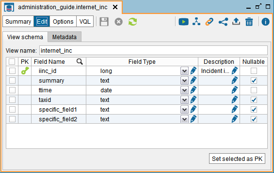
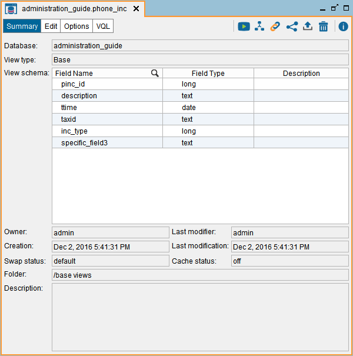
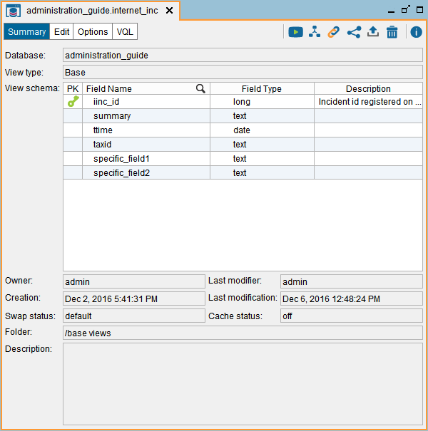
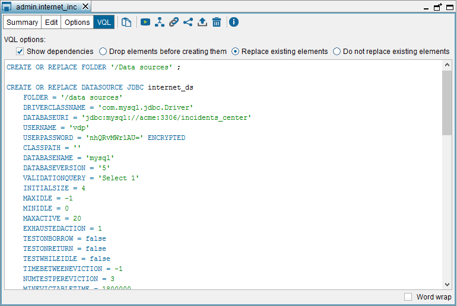

=================================
Viewing the Schema of a Base View
=================================

To open a base view and view its schema, double-click the view in the
Server Explorer. Click **Edit** to modify it.

   “Edit view” dialog of a base view

In this dialog, you can do the following:

-  Renaming the view.

-  Renaming the view’s attributes.

-  Changing the types of the view’s attributes.

-  Define the primary key of the view. To do this, select the check box
   beside the type of the fields that form the primary key and click **Set
   selected as PK**. The fields will be marked with the icon |image1|. 
   To remove the current primary key definition, clear all the
   check boxes and click **Set selected as PK**.

-  Edit the “Source type properties” of the field, by clicking the button |image2|. See more about this below, in the section :ref:`Source Type Properties`.   

-  Add a description to a field by clicking its button |image2| on the “Description” column.
   
   The description of a field of a base view is propagated to its derived views. If you change the description of a field, the change is propagated to all the derived views that project this field.
   
   For example, let us say you created these views:
   
   1.  The base view BV1 with the field F1.
   
   2.  A selection view V2 created over the base view BV1.
   
   3.  A selection view V3 created over V2.
   
   4.  A selection view V4 created over V3.
   
   If you set the description of the field F1 in the base view BV1, this change is propagated to the field F1 of the views V2, V3 and V4.
   
   If then, you change the description of F1 in the view V3, the change is propagated to V4.
   
   If then, you change the description of F1 in the view BV1, the change is propagated to V2, but not to V3 nor V4 because you explicitly change the description of the field in V3.
   
   You can obtain the description of the fields from:
   
   -  The JDBC interface. 
   -  The ODBC interface.
   -  By executing stored procedure :ref:`CATALOG_VDP_METADATA_VIEWS`.

Besides editing the view, you can also do the following:

-  **Execute**: opens the “Execute view” dialog where the user can
   execute the default query ``select * from viewname`` or add
   conditions to the ``WHERE`` clause. See section :ref:`Querying Views` for
   more details about execution of queries.
-  **Drop**: deletes the view. If there are other derived views using
   the view, these views will also be deleted.
-  **VQL**: see the VQL code generated to create the view. See section
   :ref:`View the VQL of an Element`.
-  **Options**: opens a dialog to change the settings of the view. See
   section :doc:`/vdp/administration/creating_derived_views/materialized_tables/materialized_tables`.
-  **Properties**: display information about the view such as the owner,
   last modifier, creation and modification date, cache status, etc.
-  **Associations**: displays a dialog listing the associations in which
   the view participates. See section :doc:`Associations <../../restful_architecture/associations/associations>`.
-  **Used by...**: displays a diagram with the views that depend on the
   current one. See section `Used By...`_.
-  **Publish**: opens the Web service wizard to publish the view as a
   SOAP Web service or a RESTful Web service. See section :doc:`/vdp/administration/publication_of_web_services/publication_of_web_services`.
-  **Edit Remote** (only available for base views created over *remote tables*): opens the :ref:`remote table dialog <Editing Remote Tables>`.

-  Press **Ctrl+F** to search a field.

   Schema of the base view phone\_inc

   Schema of the base view internet\_inc

View the VQL of an Element
=================================================================================

Several dialogs have a **VQL** button and by clicking it, the Tool
displays the VQL of the element. You can find this button in the
following dialogs:

-  In the dialog of data sources
-  In the dialog that displays the schema of a view
-  In the dialog to create/edit a SOAP or a REST Web service
-  In the dialog to create/edit a widget

This dialog displays the VQL code generated to create the view.

   VQL of the base view ``internet_inc``

The following options control how the VQL code of the view is generated:

-  **Show dependencies**. If selected, the Tool displays the VQL code to
   create the view and the elements that the view depends on. Otherwise,
   it shows only the code to create the view but not the elements that
   it depends on.
   For example, if we are viewing the VQL of a view and this option is
   selected, the Tool will display the VQL code to create the data
   sources that this view depends on.
-  **Include statistics** (only for views). If selected, the Tool displays the statements to recreate the statistics gathered for the view. 
-  **Drop elements**. If selected, all the ``CREATE...`` statements are
   preceded by a ``DROP... CASCADE`` statement. Therefore, the generated
   VQL code will delete, if exists, the element with that name and all
   the elements that depend on it.
   
   E.g. when a server imports a JDBC data source ``ds_jdbc_acme``, first
   it will delete the existing JDBC data source ``ds_jdbc_acme`` and all
   the views that depend on this data source.
-  **Replace existing elements**. If selected, the statements to create
   elements will be like this: ``CREATE OR REPLACE...`` As a result, the
   generated VQL code does not delete the elements that depend on the
   one that the ``CREATE`` statement is creating.
   
   E.g. when importing an LDAP data source ``ds_ldap_activedirectory``
   and the server already has an LDAP data source with that name, the
   Server will replace this data source with the new one. However, it
   will not modify or delete the views that depend on the existing data
   source.
-  **Do not replace existing elements**. If selected, the statements to
   create elements will be like this: ``CREATE...`` As a result, if
   there is already an element with the same name and type, the existing
   element will not be replaced nor deleted and the statement will fail.

To copy all the VQL statements to the clipboard, press **Ctrl+A** and click
**Copy**.

If **Word wrap** is selected, the lines will be wrapped at word
boundaries (i.e. whitespace) if they are too long to fit.

If the view is a derived view, click the button |image2| to edit the VQL
of the view manually, instead of editing the view from the “Edit view”
dialog. In this dialog you can enter any VQL. However, if later you edit
the view from the “Edit view” dialog, you will lose these changes.

Used By...
=================================================================================

This dialog displays a diagram with all the views that depend on the
current one. On the left side, there is a list of the top-level views
that use the current one in their definition. Top-level views are those
that are not used to define any other view. Click on one view to display
how it is constructed and then, on the right side of the dialog, you
can:

-  Click on the nodes of the tree that represent combining operations
   (joins, unions, selections, etc.) to display their main properties.
-  Click on a data source to view its details.
-  Click on a view or a base view to open the dialog showing its schema.
-  Click on **Save image** to export this “tree” into an image file.

Source Type Properties
======================

The "source type properties" of a field define the exact type of the field in the source,
and depending on the type, its length and number of decimals. In
derived views, you can also define the properties of the derived
fields.

For example, let us say the type of a field is "text". If this fields belongs to a JDBC base view, the source type will say if in the database, the field is "VARCHAR", "CHAR", "LONGVARCHAR", "NVARCHAR", etc.

In the administration tool, the "Source type properties" of the view's fields are displayed in the tooltip of the field, in the dialog that shows the schema of the view.

For JDBC and ODBC base views, these properties are imported automatically from the database. For other types
of base views and for fields defined in a derived view (not propagated from a base view), you have to define them manually (in the "Edit View" dialog). The API to develop custom data sources also has support to indicate these properties for the fields returned by the source.

These properties are used for two things:

1. When enabling the cache on a view, the Server uses the properties of the fields of the view to
   define the tables that will store the cached data. This may speed up loading the cache of this view and
   retrieving data from it.
   
   For example, if the type of a field is ``text`` and the source type properties are undefined (e.g. if this is a JSON base view), the cache engine will store the values of this field in a column of type ``VARCHAR``. If the source type properties indicate that the type is ``CHAR`` of length 3, the cache engine will create a column of type ``CHAR(3)`` for this field. Very probably the database will use less space to store the values of this field and these values will be stored and retrieved faster.
   
2. The metadata of the views’ fields are shared with the clients that
   connect to Virtual DataPort via JDBC or ODBC. If these properties are
   defined, these metadata are more accurate.

