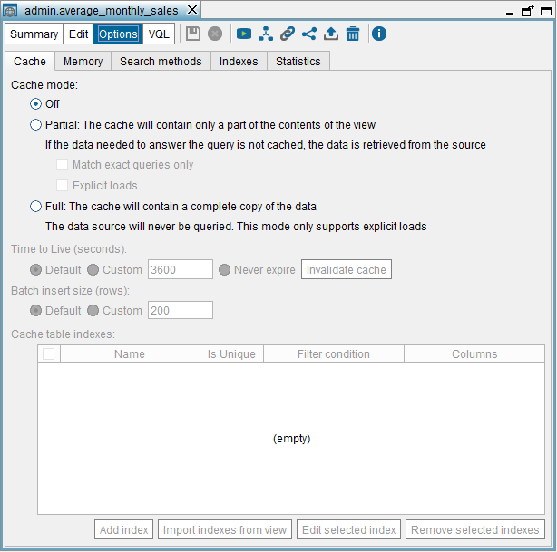

===============================
Advanced Configuration of Views
===============================

.. toctree::
   :hidden:
   
   configuring_the_cache_of_a_view.rst
   memory_usage_and_swapping_policy_of_views.rst
   internationalization_configuration.rst
   query_capabilities.rst
   view_configuration_properties.rst
   indexes_of_views.rst
   statistics_of_the_view.rst
   editing_the_execution_plan.rst
   defining_the_data_movements_of_the_view.rst

In the “Options” dialog of a view, you can configure the following
settings of the view:

-  The cache configuration: see section :ref:`Configuring the Cache of a View`.
-  The memory usage and swapping policy: see section :ref:`Memory Usage and
   Swapping Policy of Views`.
-  Internationalization configuration (only for base views): see section
   :ref:`Internationalization Configuration`.
-  The query capabilities: see section :ref:`Query Capabilities`.
-  Properties regarding the access to the data source (only for base
   views): see section :ref:`View Configuration Properties`.
-  Indexes of the view: see section :ref:`Indexes of Views`.
-  Statistics of the view. Used by the cost-based optimization: see
   section :ref:`Statistics of the View`.
-  Execution plan (see section :ref:`Editing the Execution Plan`) and Data
   movements (see section :ref:`Defining the Data Movements of the View`) of
   the view (only for derived views).

To open this dialog, open the view and click **Options**.

   Cache settings of the view ``average_monthly_sales``

