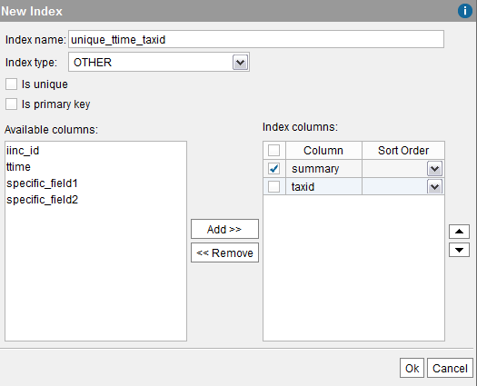
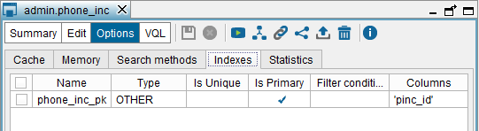

================
Indexes of Views
================

In database management systems, indexes may help queries to run faster.

In Virtual DataPort, you can define indexes in the base views (not in
the derived views). These indexes represent the indexes defined in the
source. Note that Virtual DataPort does not actually create the indexes
in the source.

At runtime, clients that connect to Virtual DataPort using the JDBC or
the ODBC driver can get the information of the indexes of the views
using the appropriate methods of the API. Some business intelligence
tools use this information to generate more efficient queries.

The indexes of the views have to be defined manually following the steps
of section :ref:`Defining an Index of a Base View`, except when dealing with
JDBC base views. When creating JDBC base views using the Administration
Tool, the indexes of the tables in the database are imported
automatically.

The indexes are propagated to the derived views of the view where the
index has been defined. For example, if you define an index *IDX* in a
base view and then, you create a selection view over this view, the
index *IDX* is propagated to the selection view. At runtime, if a client
obtains the indexes of the selection view, the Server will return the
information of the index *IDX*.

There are certain situations where the indexes cannot be propagated. For
example,

-  Flatten views
-  Union views
-  In a derived view with Group By, only the indexes whose fields are in
   the ``GROUP BY`` clause are propagated.

When the cache is enabled for a view and its cache mode is “Full”, the
indexes propagated to its derived views and to the ODBC and JDBC
clients, are the “Cache indexes” and not the indexes defined in the
“Indexes” tab. That is because the queries of the view will always
retrieve the data from the cache and not from the source.

Defining an Index of a Base View
=================================================================================

To create an index in a base view (indexes cannot be defined in derived
views), follow these steps:

#. Click on the tab **Indexes**.

   If the base view is JDBC, its indexes are automatically imported from
   the database (they are displayed in italics). These indexes can be
   edited, but not deleted.
   
   .. note:: When you execute a “Source Refresh” on a base view (see
      section :ref:`Source Refresh`), the Server also updates the information
      about the indexes of the table.
      
#. Click **Add index** and follow these steps:

   Defining a new index for a base view

|

   a. Enter the name of the index.
   
   #. Select the **Index type**: **Cluster**, **Hash** or **Other**.
   
   #. Select **Is unique** if the index represents a unicity index.
   
   #. Select **Is primary key** if the index represents the primary key of
      the view.
      
   #. In the left side of the dialog, there is a list of the fields of the
      view.
      
      Select the ones that belong to the index and press **Add >>**. To
      select several fields at once, hold Ctrl or Shift and click on the
      fields you want to select.
   
      To change the order of the fields in the index, select the check box
      of the field you want to move and click on |image1| and |image2|.

      To remove a field from the index, select its check box in the list of
      the right side and click **<< Remove**.

3. Click **Ok** to create the index.
#. To edit an index, select its check box and click **Edit selected
   index**.
#. To remove an index, select its check box and click **Remove selected
   index**.
   The indexes imported from the database are displayed with italics and
   cannot be deleted. However, if you have edited one of these indexes,
   you can select it and click “Remove selected index”. By doing this,
   you will replace the current definition of the index with the
   definition obtained from the database.

   Indexes of the JDBC base view ``phone_inc``

For derived views, the “Indexes” tab of the “Options” dialog, lists the
indexes that are propagated from the base views that this view is built
upon.

.. |image1| image:: ../../common_images/icon-black-arrow-down.gif
.. |image2| image:: ../../common_images/icon-black-arrow-up.gif

