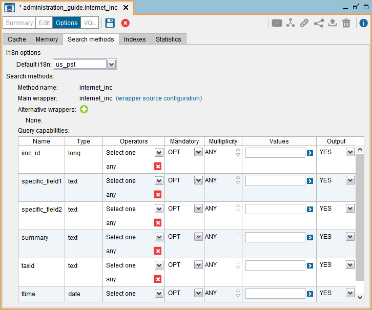
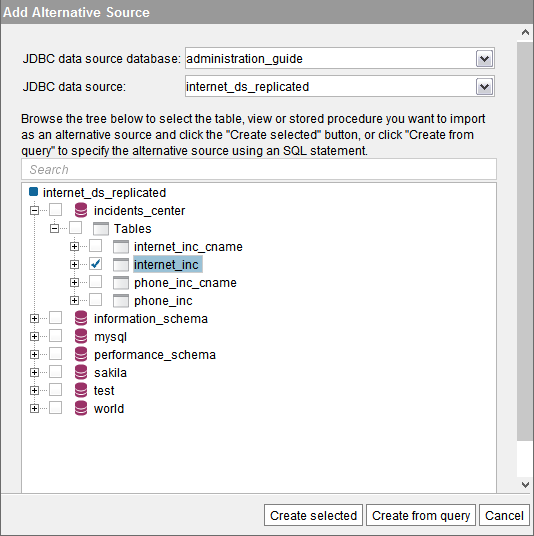
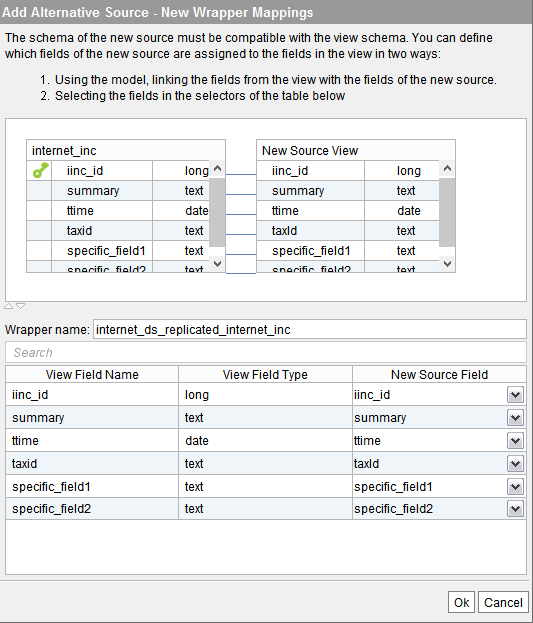
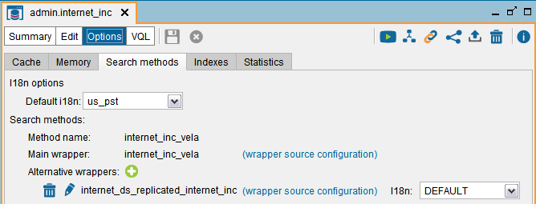
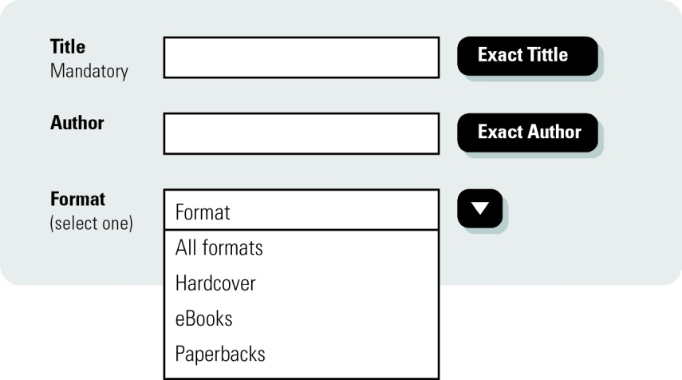

==================
Query Capabilities
==================

Some data sources such as Web sites or systems that offer a Web Service
interface do not allow any query to their data, instead they present
interfaces with limited query capabilities (e.g. HTML forms in the case
of a Web site and a list of parameters in the case of a Web Service
operation). For this reason, Virtual DataPort allows the administrator
to explicitly specify the query capabilities of the base views. In
addition, the execution engine automatically calculates the query
capabilities of the derived views according to the capabilities of its
base views.

The “Search methods” tab of the view displays the list of search methods
of the view. You can modify the search methods of the base views, not
those of derived views.

The query capabilities are expressed using a list of *search methods*.
Each search method specifies a different way to query the view (or base
relation). See the next section for a detailed description of how to
interpret search methods of a view (or base relation).

When you create a base view using the administration tool, the tool
automatically defines the search methods of the view. While almost
always, these search methods automatically created do not need to be
modified, this may not always be the case, particularly in sources of
the type Web and Web Service.

Once in the advanced configuration view of a base view, the generated
search methods can be changed easily. As can be seen in the figure, a search
method specifies for each attribute of the view (see the subsection
below for more details):

   Search methods of a base view

-  Its data type.
-  A *list of operators* for which the field can be queried. “any”
   indicates any operator. New operators may be added for the attribute
   using the drop-down menu in its “Operators” column. Click on
   |image0|, beside an operator, to remove it.
   
-  Whether it is obligatory (**OBL**), optional (**OPT**) or not
   supported (**NOS**) in the queries to the view.
-  The *multiplicity* supported for the attribute in queries to the
   view.
-  A *list of the possible values* for the attribute that may appear in
   a condition of a valid query to the view. If no value is specified,
   it is assumed that every value of the attribute data type is valid.
   To add new values simply enter them into the box that appears in the
   “Values” column of the attribute and press the button that appears on
   the right. Click on |image0|, beside a value, to remove it.
-  Whether the attribute appears in the response of the queries made to
   the view.

There is no graphical support to add or delete search methods from a base view; just to 
modify the existing ones.

Alternative Sources
=================================================================================

When the data of a table of a database is replicated in other databases,
you should configure this base view to indicate the databases where the
same data can be located.

The section :ref:`Selecting the Most Optimal Source When the Data is
Replicated in Several Sources` explains in more detail why defining
where the data of a base view is replicated can increase the performance
of the queries involving this base view.

This feature is only available for JDBC base views.

To define additional sources for the same base view, do the following:

#. Create a JDBC data source for each database in which the table of
   this base view is replicated. Each data source has to point to one of
   the databases. If you already have data sources that point to these
   databases, you do not need to create them again.
#. Go to the **Search methods** tab of the **Options** dialog of the
   view.
#. Click on |image1|, next to **Alternative wrappers**.

   Add alternative sources for a base view: selecting an alternative table

4. In the wizard “Add alternative source”, on the **JDBC data source
   database** list, select the database where you have created one of
   the alternative data sources.
#. In the **JDBC data source** list, select the data source that points
   to the database with the table.
#. Below, the Tool will populate a tree of the schemas of this data
   source. In this dialog, select the table/view that contains a copy of
   the data of the base view you are currently editing. In this tree,
   you can only select *one* table or view.
#. Click **Create selected**. The Tool will display a dialog like the
   one below.

   Add alternative sources for a base view: defining the mappings

8. In this dialog you can define mappings between the fields of the base
   view and the table of the database. This is useful if the names of
   the tables in the alternative source are different from the fields of
   the base view.
   
   The base view automatically links the fields of the base view with the fields of the table when their name is the same.
   
#. After clicking **Ok**, there will be a new entry in the “Alternative
   wrappers” section of the search methods tab.

   Add alternative sources for a base view

10. Repeat these steps for each database that contains a replica of the
    table of this base view.
#. For each alternative wrapper, you can define its i18n, which affects
   how the timestamp values are treated. However, the default value
   (“DEFAULT”) is almost always the correct one.

.. _administration_guide_search_methods:

Search Methods
=================================================================================

Each *base relation* explicitly describes its query capabilities through
what are known as *search methods*. If a relation has no search method,
then no query can be made to it.

Each search method is comprised of a series of 5-tuples. Each 5-tuple
represents a restriction that a specific query should comply with to be
executed on the source using this search method. In this sense, a search
method that has no 5-tuple allows every query (this is the case of
sources that have no limitations in their query capabilities such as,
for example, conventional relational databases).

The format of a 5-tuple is (**attribute**, **operators**,
**obligatoriness**, **multiplicity**, **possible\_values**) where:

-  **attribute** is an attribute of the relation.
-  **operators** is the group of operators that can be used in
   conditions with this attribute in the queries to this view and with
   this search method. “ANY” represents any operator allowed by the
   attribute data type.
-  **obligatoriness** can have three values: “OBL” indicates that the
   attribute should mandatorily appear in any query to the source. “OPT”
   indicates that the attribute may or may not appear in the query (it
   is optional) and “NOS” indicates that the queries for this attribute
   are not allowed in the source.
-  **multiplicity** indicates how many values can be included in the
   source query for the given attribute and operator. If it is not
   possible to make queries for this attribute (“NOS” value in the
   obligatoriness field), the value is necessarily 0. “ANY” indicates
   that a query, for any given attribute and operator, could have any
   number of values.
-  **possible\_values** is the list of values that can be used to query
   the attribute. If the value “ANY” is contained in it, this means that
   the search range is not limited (within the range associated with the
   attribute data type), and the attribute can be queried about any
   value. If the obligatoriness field is set in the 5-tuple to the “NOS”
   value, then it necessarily takes the value of an empty set.

*Example*: Consider the example of a virtual bookshop on the Internet
offering the search form of shown in `Search form for a bookshop`_.

   Search form for a bookshop

The form requires the user to specify a value for the ``TITLE``
attribute and gives the option to set a value for the ``AUTHOR``
attribute and for the ``FORMAT`` attribute (restricted to a group of
values). Searches by title and author are searches by keyword (operator
``like``). A search by exact phrase (operator ``=``) is indicated by
selecting the box next to the search box of the field. For each
attribute, a search can specify one value only. In addition to the
fields ``TITLE``, ``AUTHOR`` and ``FORMAT``, the shop returns as output
a ``PRICE`` attribute, which cannot be queried using the form.

Let us model this source as a relation ``R={TITLE, AUTHOR, FORMAT, PRICE}`` with a search method containing the 5-tuples
shown in `Search method for a bookshop`_.

 

.. code-block:: none
   :caption: Search method for a bookshop
   :name: Search method for a bookshop

   (TITLE,{like,=}, OBL, 1, Any)
   (AUTHOR, {like,=}, OPT, 1, Any)
   (FORMAT, {=}, OPT, 1, 
   {'All formats', 'Hardcover', 'eBooks', 'Paperbacks'})
   (PRICE, {}, NOS, 0, {})

Note that the first 5-tuple has the value ``{like, =}`` in the
``OPERATORS`` field and ``OBL`` in the ``OBLIGATORINESS`` field, this
does not mean that it is obligatory to query the ``TITLE`` attribute
with both operators, but that it is obligatory to query it at least with
one of them. In order to have the ``TITLE`` attribute appear
obligatorily in the query with both operators (this is not possible in
the form in the example), this should be done with two different
5-tuples for the ``TITLE`` attribute, one for each operator:

``{(TITLE, {like}, OBL, 1, ANY) (TITLE, {=}, OBL, 1, ANY)}``

Thus, as can be seen, when you want to differentiate the treatment of a
specific attribute according to the operator with which it is used, more
than one 5-tuple can exist for each attribute.

When views or relations of the global schema are created, Virtual
DataPort can automatically calculate its search methods from those of
the sources and the expression used to define the view. This allows the
system to know *a priori* whether a specific query can be responded to.
Therefore, for derived views, Virtual DataPort allows the query
capacities to be consulted, but they cannot be modified directly.

.. |image1| image:: ../../common_images/icon-plus3.png