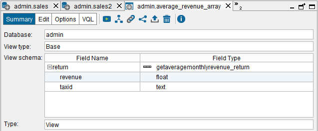
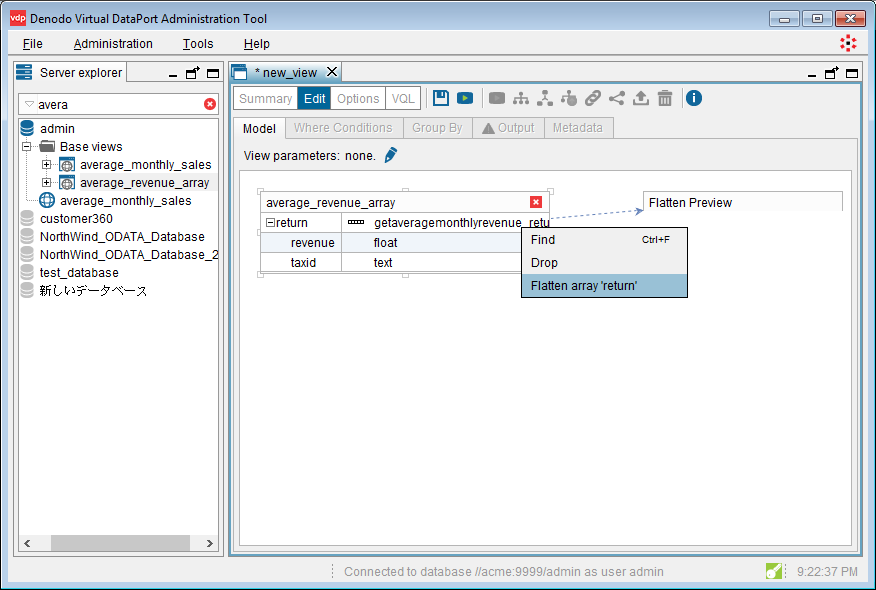
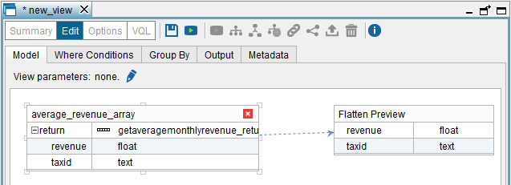
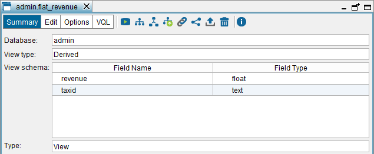

======================
Creating Flatten Views
======================

Virtual DataPort supports modeling data types with a complex structure
using the types “register” and “array”. An element of the type array can
be considered a sub-view and an array type always has an associated
register type that acts like the schema of the sub-view it is modeling.

Sometimes you may need to “flatten” a compound field that contains an
array of registers. This is particularly frequent when processing XML
and Web service base views. This section describes how to do it.

.. note:: It is also possible to perform the inverse operation of
   “flatten” to create array elements from sets of tuples or register
   elements from several fields. This can be done by defining a ``GROUPBY``
   operation using the ``NEST`` or ``REGISTER`` functions. See information
   about the :ref:`NEST` and :ref:`REGISTER` aggregation functions in the VQL Guide.

.. note:: If you need to “flatten” the fields of a register and not an
   array, do not create a Flatten view. Instead, create a Selection view
   and in the “Output” tab of the view, right-click on the register and
   click **Project subfields of…**

To follow the examples of this guide, before explaining how to create a Flatten view you have to create a Web
service base view over the “sales” Web service data source (this data
source was created in the section :ref:`Importing SOAP Web Service Sources`):

#. Double-click on the data source “sales”, in the Server Explorer and
   then, click **Create base view**.
#. Click **Create base view** beside the operation
   ``getAverageMonthlyRevenue`` and select **Do not stream output**.
#. Rename the base view to ``average_revenue_array``.
#. Click **Save** (|image3|).

This view returns an array of elements.
Therefore, it is very difficult to combine its data with data from other
views. Thus, you will create a “flatten” view with the two attributes of
the array: ``taxId`` and ``revenue``.

    
   Default base view created for the Web Service operation ``getAverageMonthlyRevenue``

The Flatten view dialog is very similar to the Union view dialog, except
that it does not have the **Associations** tab. Read the section
:ref:`Creating Union Views` to learn how the tabs of the Flatten view work.

Follow these steps to create the Flatten view of the example:

#. Right-click on the view ``average_revenue_array`` and click
   **Flatten** on the menu **New**.
   
   You can see that the Tool has added this view to the **Model** tab.
   You can add a view from another database.
#. In the "Model" tab, right-click on the array ``revenue`` and click
   **Flatten array ‘return’**. After this, the
   target view has two attributes: ``taxId`` and ``revenue``.
#. In the **Output** tab, rename the new view to ``flat_revenue``.
#. Click **Save** (|image3|) to create the view.

.. note:: On each “flattening” operation, it is possible to select just
   one array. If there is more than one array, this operation must be
   repeated for each one.

In the "Model" tab of the view, you can add “View parameters”. See more
about this in the section :ref:`Parameters of Derived Views`.

    
   Flattening the array of the base view ``average_revenue_array`` ("Model" tab)
  

    
   Flattening the array of the base view ``average_revenue_array`` ("Model" tab) (2)

   Schema of the ``flat_revenue`` view

.. |image3| image:: ../../common_images/save.png

