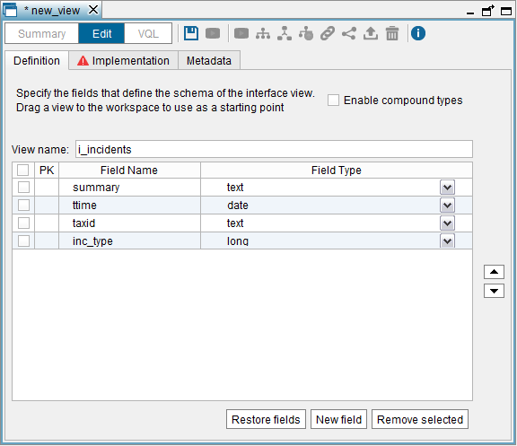
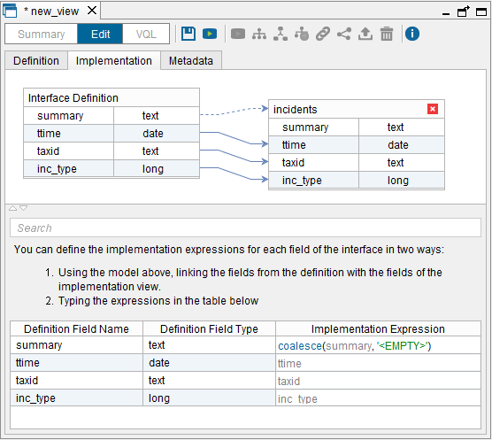

========================
Creating Interface Views
========================

Interface views are a special type of views that consist only of a
definition of fields and a reference to another view. You can use them
to do top-down design where you first define the fields of the interface
and at a later stage, associate the “implementation view” of the
interface.

When the Server executes a query that involves the interface, the query
is delegated to the implementation view. Therefore, the operations that
can be executed on an interface view (``SELECT``, ``INSERT``, ``UPDATE``
or ``DELETE``) are the same that can be performed on its implementation
view.

The status of an interface view can be:

-  **Ok**: all the fields of the interface view have a valid
   “implementation expression”. The queries involving this view will
   work.
-  **Without implementation**: the interface was created without an
   implementation view or the implementation view has been deleted. The
   queries involving this view will fail.
-  **Invalid**: the interface has an implementation view, but some of
   the fields of the interface do not have an implementation expression
   or it is invalid. This may happen if you create an interface with an
   implementation view and later, the implementation is modified so the
   expressions are no longer valid.
   The queries involving this view will fail.

The fields of the interface views do not have their own “Source type
properties”. At runtime, Virtual DataPort propagates these properties
from the implementation view to the interface view. Thus, if the
implementation view changes, the properties of the fields of the
interface view will change as well.

For example, let us say we have an interface view ``I_1`` with a field
called ``f_1`` of type ``text`` and that in its implementation view, the
source type of ``f_1`` is ``VARCHAR`` with length 15. If you query
``I_1``, the type of ``f_1`` reported by the Denodo JDBC driver will be
``VARCHAR(15)``.

To change the “Source type properties” of a field, do it in the “Edit
view” dialog of the implementation view and not in the interface view.
See more about these properties and why are they useful in the section
:ref:`Viewing the Schema of a Base View`.

| 

To create an interface view, click **Interface** on the **File** >
**New** menu, or right-click on the Server Explorer and click
**Interface** on the **New** menu. The definition of the interface will
be populated with the fields of the selected view.

   Creating a new interface view: “Definition” tab

The Interface View wizard has three tabs:

#. **Definition**: in this tab you can configure the definition of the
   view:

   a. Change the name of the interface view.

   #. Manage the name and type of the fields of the interface:

      i. If you want to base the definition of the interface on the schema
         of an existing view, drag a view to this tab; the existing schema
         will be replaced with the schema of the dragged view.
         
      #. To add a new field to the interface, click **New field**.
      
         In the box beside the name of the field, you can select the type of
         the field. By default, this box only contains the basic data types
         (``int``, ``float``, ``text``, etc.). If you want to select a
         compound field, select the **Enable compound types** check box.
         
      #. To delete a field from the interface, select its check box and
         click **Remove selected**.
         
      #. If you have deleted a field accidentally and you want to restore
         it, click **Restore fields**. The Tool will display the “Restore
         Fields” dialog where you have to select the fields that you want to
         add again to the interface view.

   Creating a new interface view: “Implementation” tab

2. **Implementation**: in this tab, you define how the fields of the
   interface view are mapped to the fields of the implementation view.

   First, you have to add an implementation view by dragging it from the
   Server Explorer. The implementation view can belong to a different
   database than the interface view.
   
   When adding the view, the fields with the same name are automatically
   linked. You can link the others by dragging a field of the definition to
   the field you want to link in the implementation view. Alternatively,
   enter a field name or an expression below, in the “Implementation
   Expression” column.
   
   In the figure `Creating a new interface view: “Implementation” tab`_ you
   can see the following:
   
   -  A field can be mapped to a field of the implementation (ttime and
      taxid) or to a complex expression (summary).
      
      The implementation expressions must have the same type or compatible with the types of the definition. 
      For example, if the interface has a field ``F_1`` of type ``double``, the implementation
      expression must have type ``double`` or a compatible type: ``int``, ``long`` or ``float``. 
      If, for example, the field is type int, at runtime the values of this field are converted to 
      the type of the interface, ``double``.
      
   -  The fields of an interface view that are mapped to a complex
      expression are not updateable. That is, ``INSERT``, ``UPDATE`` or
      ``DELETE`` operations that involve these fields will fail.
   -  The implementation view can have more fields than the definition. The
      extra fields are just ignored. In the figure `Creating a new
      interface view: “Implementation” tab`_, the field “inc\_type” of the
      implementation view is not mapped to any field of the definition.

   When there is an error in the interface view, this tab is marked with
   the icon |image2| and a tooltip explaining the error. The possible reasons are:

   a. The interface view does not have implementation view.
   b. Some fields of the definition do not have an “Implementation
      expression”.

#. **Metadata**: tab that allows you to define the folder where the
   interface will be stored and provide a description.

.. |image2| image:: ../../common_images/icon-related-error.png
