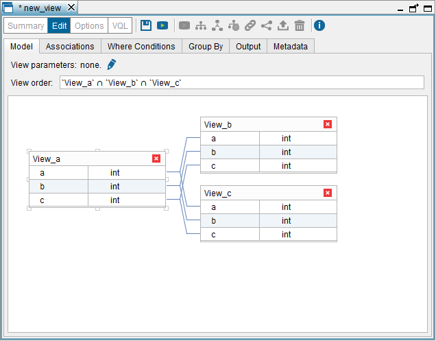

===========================
Creating Intersection Views
===========================

An Intersect view executes the intersection operation, which selects the
common rows of two or more input views. These views can belong to other
databases.

For example, if we have three views with the following contents:

.. TODO: put these tables in the same row.

.. table:: 

   +--------+--------+
   | View_A          |
   +========+========+
   | **A**  | **B**  | 
   +--------+--------+
   | 1      | a      |
   +--------+--------+
   | 2      | b      |
   +--------+--------+
   | 4      | d      |
   +--------+--------+
 
.. table:: 

   +--------+--------+
   | View_B          |
   +========+========+
   | **A**  | **B**  | 
   +--------+--------+
   | 1      | a      |
   +--------+--------+
   | 2      | b      |
   +--------+--------+
   | 6      | f      |
   +--------+--------+
   
.. table:: 

   +--------+--------+
   | View_C          |
   +========+========+
   | **A**  | **B**  | 
   +--------+--------+
   | 2      | b      |
   +--------+--------+
   | 5      | e      |
   +--------+--------+
   | 6      | f      |
   +--------+--------+

If we create an intersection view over the views "View_A", "View_B"
and "View_C" and query this new view, the result will be the
following:

.. table:: 

   +-------------------------------------------+
   | View_A Intersect View_B Intersect View_C  |
   +=====================+=====================+
   | **A**               | **B**               | 
   +---------------------+---------------------+
   | 2                   | b                   |
   +---------------------+---------------------+
   

The result of querying this view is the common rows of the three input
views.

The wizard to create new intersect views is very similar to the wizard
of union views (see section :ref:`Creating Union Views`)

To create an intersect view, click **Intersect** on the **File** >
**New** menu or right-click the Server Explorer and click **Intersect** on
the **New** menu.

The Tool will open the “Intersect view” dialog and it will add the
view(s) that are currently selected in the Server Explorer. To add more
views, click the **Model** tab and drag the views from the Server Explorer
to this tab.

.. important:: All the input views of an intersect view must have the
   same number of fields.

The “Intersect view” dialog has six tabs:

#. **Model**: tab where you drag the input views and associate their
   fields. The wizard automatically associates the fields with the same
   name, but you have to associate the rest.
   
   It is mandatory to add associations between *all* the fields of the
   input views.
   
   In the **View order** box, you have to indicate the order in which the 
   intersection(s) are performed. The view order does not affect the results 
   of the query, but can have a great impact over its performance. 
   
   E.g. if the 
   view order is ``View_a ∩ View_b ∩ View_c``, the Server performs the 
   intersection between ``View_a`` and ``View_b`` and then, between this intermediate 
   result and ``View_c``.
   
   If the view order is ``View_a ∩ (View_b ∩ View_c)``, the 
   Server performs the intersection between ``View_b`` and ``View_c`` and then, between 
   this intermediate result and ``View_a``.
   
   In this tab, you can add "View parameters". See more about this in the 
   section :ref:`Parameters of Derived Views`.
   
#. **Associations**: tab that lists the associations between fields. To
   delete one, click on |image0|.
#. **Where Conditions**: tab that allows you to add WHERE conditions to
   the definition of the view.
#. **Group By**: tab that allows you to add GROUP BY fields to the view.
#. **Output**: tab that allows you to configure the output of the view.
   That is, renaming the view and its fields, add derived attributes,
   etc.
#. **Metadata**: tab that allows you to define the folder where the new
   view will be stored and provide a description for the new view.

The tabs **Where Conditions**, **Group By**, **Output** and **Metadata**
work in the same way as in the Union view dialog. The section :ref:`Creating
Union
Views`
explains in more detail how to use them.

   Creating an intersection view with three input views

.. |image0| image:: ../../common_images/drop.png
