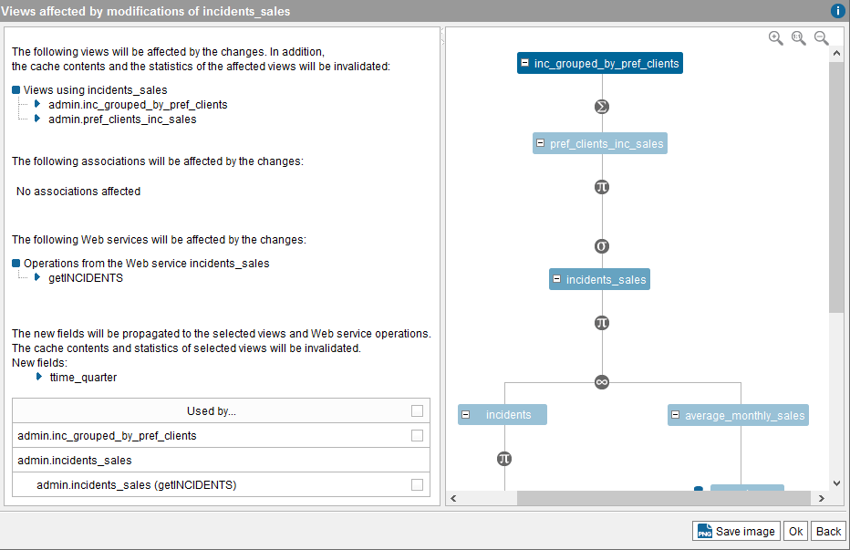

==========================
Editing / Replacing a View
==========================

Sometimes, it is necessary to modify a Virtual DataPort view.

If you need to edit an existing view because the underlying data source
has changed, click **Source refresh** (|image0|) (see section :ref:`Source
Refresh`).

If you only need to rename the view, in the Server Explorer, right-click
on the view and then click **Rename**.

In some cases, you can modify a view without recreating the views that
use the modified view. This can be done in two ways:

#. Opening the schema of the view and clicking **Edit**. If you are
   editing a base view, you can change its name and modify the name and
   type of the view’s attributes. If you are editing a derived view, you
   can rename it and change the specific configuration of the view.
   
   For instance, in join views, you can change the join condition, the
   join strategy, etc.

#. Creating a new view with the same name as the view to be replaced. You
   have to do this if you want to:
   
   -  Change the operation used to create the view. For example, to convert
      a join view into a union view.
   -  Change the data source of a base view. That is, if the data has to be
      obtained from a different data source.

When a change in a view affects other views, the Tool will display a
list of the changes that will be done before applying them (see section
:ref:`Views Affected by Modifications`). If the changes are applied but they
are incoherent with the derived views (e.g. on updating a view taking
part in a join operation in which any of the join attributes
disappears), the |image1| icon will be displayed beside the view’s name
in the Server Explorer.

When you change the output schema of a view (i.e. the fields of the view
change) and the cache is enabled for this view, the cached data will be
marked as invalid.

When the output schema does not change, but the definition of the view
changes (i.e. the Where condition changes, the Group by fields change,
etc.) and the cache is enabled for this view, you can decide if you want
to mark the cached data as invalid.

Views Affected by Modifications
===============================

When you change a view that can affect other views or operations of Web
services published from Virtual DataPort, the Administration Tool
displays the dialog “Views Affected by Modification”. This dialog helps
you to know how these changes affect other views.

This dialog displays different things depending on the changes in the
view:

-  If you have added new fields, you can select to which views and
   operations of Web services you want to propagate the new fields to.
   For example, if you add a field ``A`` to the view ``V`` you can add
   this new field ``A`` to the views that “use” this view and to the
   operations of Web services that publish this view.
   
   .. note:: New fields cannot be propagated to operations of Web
      services that were created using the dialog **Publish from vql
      expression**.

-  If you have deleted fields, the dialog lists the views and Web
   services that will be affected by this change. In this list, you can
   click on each view to see how it is related to the view you are
   editing.

After applying the changes, the views that are left in an inconsistent
state are marked with the icon |image3|. You have to edit them in order to fix them.

When a change in a view affects a widget, the widget is automatically
updated. However, you have to redeploy this widget and its auxiliary Web
service in order to apply the changes.

   Views and Web services affected by modifications of another view

In the scenario captured in :ref:`Views and Web services affected by
modifications of another view`, we have deleted a field and added
another one to the view ``incidents_sales``. This change affects:

-  The views ``inc_grouped_by_pref_clients`` and
   ``pref_clients_inc_sales``.
-  And the operation ``getINCIDENTS_SALESBySUMMA`` of the Web service
   ``incidents_sales``.

About the added a new field (``ttime_quarter``), the new field can be
propagated to the elements that rely on this view:

-  The view ``inc_grouped_by_pref_clients``.
   Note that the view ``pref_clients_inc_sales`` is not in this list.
   That is because if the field is added to the view
   ``inc_grouped_by_pref_clients`` it has to be added to the
   ``pref_clients_inc_sales`` view as well because
   ``inc_grouped_by_pref_clients`` is a selection of the other view.
-  The operation ``getINCIDENTS_SALESBySUMMA`` of the Web service
   ``incidents_sales``.

