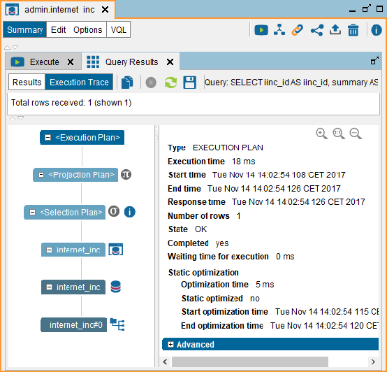
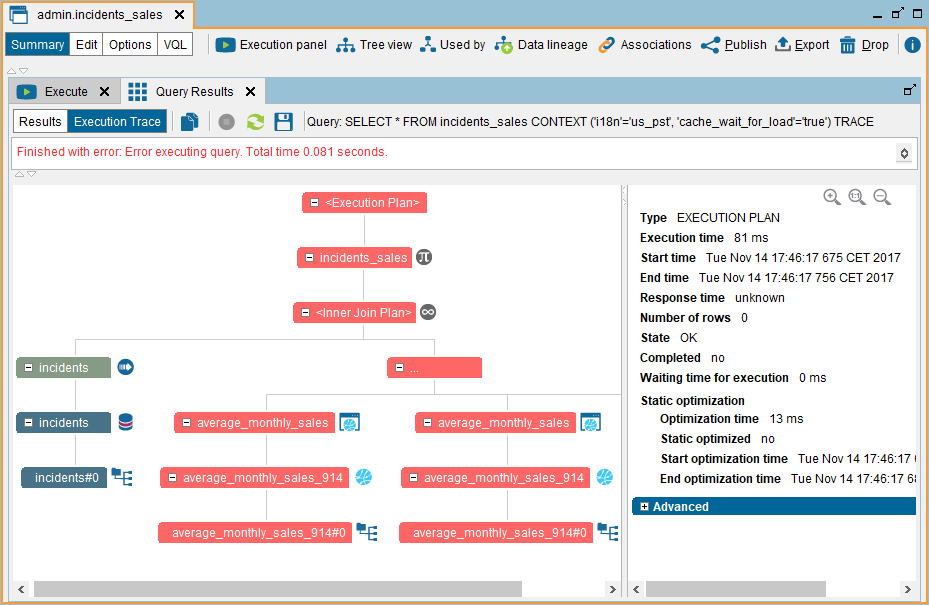

==============================
Execution Trace of a Statement
==============================

After executing a statement, you can request the trace of its execution.
It is also possible to obtain the execution plan before executing the
query. In both cases, the information displayed is the same, except for
certain parameters that are only known at run time (e.g. execution
time).

The execution plan is displayed in a tree diagram, where each node
represents one of these elements:

-  The tree root, which is called the “Execution node”. It contains
   information about the query.
-  An intermediate view involved in the execution of the statement
-  Or, a retrieval of data from a source.

The main attributes of these nodes are the following:

-  *Type*. If the node is a view, it indicates the type of the view (base
   view, union, join, selection, projection, etc.). If it is an access to
   a data source (wrapper), this indicates the type of source (JDBC,
   ODBC, Web Service, etc.).

   The main node of the trace is “Execution” (the node at the top of the
   trace), whose attributes represent the state of the entire query.

-  *Execution time*. Time (milliseconds) spent executing this node and its
   subnodes. In the “Execution” node, this is execution time of the query.

-  *Start time*. Instant at which the Server began executing this node. In
   the “Execution” node, is the instant at which the Server received the
   query.

-  *End time*. Instant at which the Server finished executing this node and
   its subnodes. In the “Execution” node, is the instant at which the
   Server finished the execution of the query.

-  *Response time*. Instant at which the node received the first row to
   process. In the “Execution” node, is the instant at which the Server
   obtained the first row of the query’s result.

   If the node did not process any row, the value of this attribute is
   *unknown*.

-  *Effective time*. Time spent to execute this node. It does not include the time 
   spent waiting for other nodes of the execution tree to complete their work.

-  *Number of rows*. Number of rows returned by the node. In the
   “Execution” node, it is the number of rows returned by the query.

-  *State*. It indicates whether the node was correctly executed or
   whether an error occurred during its execution of the execution of one
   of its subnodes.

   The table :ref:`Values of the "State" attribute of the nodes of a query's execution
   trace` of the appendix :ref:`Execution Trace Information` lists the
   possible values for this attribute.

-  *Completed*. If *yes*, the node finished correctly. If *no*, there was
   an error during its execution or the execution of one of its subnodes.

-  *Waiting time for execution* (only in the “Execution” node). Time
   (milliseconds) the query was waiting in the queue of queries before
   the Server began executing it.

   A query is hold in the queue of queries when the limit of concurrent
   requests is reached. This limit is configured on the tab “Concurrent
   requests” of the menu “Administration > Server configuration”. See
   more about this limit in the section :ref:`Limiting the Number of
   Concurrent Requests`.

   The *Execution time* includes the *Waiting time for execution*.

-  *Static optimization* (only in the “Execution” node). Parameters
   regarding the Automatic simplifications described in the section
   :ref:`Automatic Simplification of Queries`.

   -  *Optimization time*. Time spent by the Execution Engine to analyze
      the query plan.
   -  *Static optimized* is *yes* if the query plan was simplified after
      being analyzed.
-  *Cost optimization* (only in the “Execution” node). Parameters regarding
   the usage of the Cost-based optimizations described in the section
   :ref:`Cost-Based Optimization`. If the execution engine uses the cost optimizer to 
   select an execution plan, the trace also contains some information about its
   decision:

   -  *Estimated number of rows, row size in bytes and data volume*: displayed
      when the execution plan was obtained without executing the query. It shows
      how many rows the optimizer expected this node to return. For join nodes,
      the right branch always assumes the strategy hash or merge.
   -  *Indexes*: indexes that the optimizer expects to be used by the underlying data source
      for retrieving data.
   -  *Total, Left Branch and Right Branch cost* (displayed only in join nodes): 
      total cost of the join operation and the costs for its branches.

-  *Advanced parameters*. These provide further details on each node type.
   For example:

   -  In the case of “route” nodes, the queries executed on the data source
      and the connection Uri to the source.

   -  *Swapping and number of swapped rows*: for each node of the query,
      whether the data has been swapped to disk and the number of rows
      swapped to disk during the execution of the node.

   -  “No delegation cause” explains why a query was not delegated to the
      source database.

      When a query uses two or more views that rely on the same JDBC or
      ODBC data source, Virtual DataPort will try to delegate the entire
      query to the source database. This way, it can obtain the whole
      result executing a single query. When Virtual DataPort cannot delegate the
      entire process of the query to a source database, it will show the
      icon |image0| beside the view that could not be delegated and the “No
      delegation cause” parameter will show the reason why the delegation
      was not possible. For example, the query may use a function that is
      not supported by the source database, which will force Virtual
      DataPort to post-process the results obtained.

      The “No delegation cause” message will help us to rewrite the view so
      it can be delegated.

The most relevant parameters are displayed for each node on the query
execution tree. You can copy the value of each parameter by
right-clicking it and then, clicking **Copy** or copy the entire trace
by clicking **Copy trace to clipboard** (|image1|)

To save the execution trace and the diagram, click **Save** (|image2|).

|

The figure :ref:`below <internet_inc view execution trace>` displays the execution
trace of this query:

.. code-block:: sql

   SELECT *
   FROM internet_inc
   WHERE summary REGEXP_LIKE '.*(Incident)|(Error).*'

If the database does not support the operator ``REGEXP_LIKE``, the query
cannot be delegated to the database and the selection node is marked
with this icon |image0|, meaning that the selection condition will be
executed by Virtual DataPort.

The main usage of the trace is debugging. When there is an error during
the execution of a query, the nodes that caused the error are marked in
red. By clicking on them, you can see more information about the error.
The appendix :ref:`Execution Trace
Information`
explains the meaning of the icons and colors of the execution trace of a
query.

If the Automatic simplification of queries (see section :ref:`Automatic
Simplification of Queries`) is enabled, the Execution trace may be very
different to the hierarchy defined by the queried view.

   ``internet_inc`` view execution trace

The figure :ref:`below <Join view execution trace with errors>` shows the execution trace of
the ``incidents_sales`` join view in the case where the Web Service data
source is not accessible.

   Join view execution trace with errors

Besides displaying the execution trace of the query, you can see the
“query plan” of a query before executing it, to know how the Server will
execute the query, without executing it. This is very useful when
dealing with a complex hierarchy of views because you can see the join
strategy that the Server will use in each join operation (merge, hash,
nested, etc.), how a query will be delegated to a database, etc.

To display this, click **Query Plan** in the “Execute view” dialog. The
process of calculating a query plan is very similar to the actual
execution of the query but without actually “hitting” the actual data
sources. For example, to simulate the execution of the right branch of a
nested join, the Server has to generate a value for the attributes of
the right side of the join condition. That is because these values are
mandatory and at runtime, the Server uses the values obtained from the
left side of the join. However, when obtaining the query plan, it does
not have the actual values so it uses the values listed in this table:

.. table:: Values used to generate query plans
   :name: Values used to generate query plans

   +--------------------------------------+--------------------------------------+
   | Data type                            | Values used to generate the query    |
   |                                      | plan                                 |
   +======================================+======================================+
   | boolean                              | false                                |
   +--------------------------------------+--------------------------------------+
   | date                                 | The current date                     |
   +--------------------------------------+--------------------------------------+
   | decimal                              | 0.0                                  |
   +--------------------------------------+--------------------------------------+
   | double                               | 0.0                                  |
   +--------------------------------------+--------------------------------------+
   | float                                | 0.0                                  |
   +--------------------------------------+--------------------------------------+
   | int                                  | 0                                    |
   +--------------------------------------+--------------------------------------+
   | long                                 | 0                                    |
   +--------------------------------------+--------------------------------------+
   | text                                 | .. raw:: html                        |
   |                                      |                                      |
   |                                      |    '' (empty string)                 |
   +--------------------------------------+--------------------------------------+
   | xml                                  | .. raw:: html                        |
   |                                      |                                      |
   |                                      |    '' (empty string)                 |
   +--------------------------------------+--------------------------------------+
   | array                                | { } An empty array                   |
   +--------------------------------------+--------------------------------------+
   | register                             | A register with all its elements set |
   |                                      | to NULL                              |
   +--------------------------------------+--------------------------------------+

Storing the Execution Trace of Queries
======================================

You can configure the logging engine of Virtual DataPort to store the execution trace of the queries. This is useful to troubleshoot queries that are executed from an external application, not the administration tool. You can choose to store the execution traces in files that can be opened from the Trace Viewer or in a plain text file. 

To enable this feature, execute the following command:

.. code-block:: vql

   SET 'com.denodo.vdb.interpreter.execution.saveTrace' = '<save trace configuration>';

.. csv-table:: Possible values of the parameter "<save trace configuration>"
   :header: "Value", "Meaning of the Parameter"
   
   "ALL_LOG", "Store the trace of all the queries in plain text."
   "ALL_FILE", "Store the trace of all the queries on a file for the Trace Viewer."
   "ALL_FULL", "Store the trace of all the queries in plain text and on a file for the Trace Viewer."
   "ERROR_LOG", "Only store the trace of the queries that fail. Store the trace in plain text."
   "ERROR_FILE", "Only store the trace of the queries that fail. Store the trace on a file for the Trace Viewer."
   "ERROR_FULL", "Only store the trace of the queries that fail. Store the trace in plain text and on a file for the Trace Viewer."
   "DISABLED", "Disable this feature (default value)."

.. note:: If you store the execution trace of all the queries, not just the ones that fail, consider the amount of disk space required. The execution trace of one simple query in plain text uses about 4 kilobytes of disk space.

.. rubric:: Storing the execution traces in plain text

When the execution traces are stored in plain text (this is with the options ``ALL_LOG``, ``ALL_FULL``, ``ERROR_LOG`` or ``ERROR_FULL``), all the traces are stored on the same file. The file where the traces are stored can be:

a. The vdp.log file (:file:`{<DENODO_HOME>}/conf/vdp/`). This option is appropriate for a quick test because it is easy to set up and you do not have to restart Virtual DataPort to enable it. However, if you plan on storing the execution traces all the time, we recommend option b). That is because with option a), the execution traces will be mixed with the error messages of Virtual DataPort, which will make the detection of future issues more difficult.

   To enable this option, also execute the following command (in addition to the command ``SET 'com.denodo.vdb.interpreter.execution.saveTrace'...``)
   
   .. code-block:: vql
   
      CALL LOGCONTROLLER('com.denodo.vdp.traces', 'DEBUG');
      
   If you restart Virtual DataPort, you have to execute this command again. If not, the execution traces will not be stored.
   
b. Store the execution traces on another file, not in vdp.log (*recommended option*). To do this, modify :file:`{<DENODO_HOME>}/conf/vdp/log4j2.xml` with the configuration below.

   You have to add the following fragments (``RollingFile`` and ``Logger``) inside the sections ``Appenders`` and ``Loggers`` respectively so the file ends up looking like this:

   .. code-block:: xml

      <Appenders>
      
      [...]
      
          <RollingFile name="TRACESOUT" fileName="../logs/vdp/vdp-traces${env:vdp.instance.log}.log" filePattern="../logs/vdp/trace/vdp-traces${env:vdp.instance.log}.log.%i">
              <Policies>
                  <SizeBasedTriggeringPolicy size="10 MB" />
              </Policies>
              <DefaultRolloverStrategy max="7" />
              <PatternLayout pattern="%-4r [%t] %d{yyyy-MM-dd'T'HH:mm:ss.SSS} %x -\t%m  %n" />
          </RollingFile>
      
      [...]
      
      </Appenders>
      
      <Loggers>
      
      [...]
      
          <Logger name="com.denodo.vdp.traces" level="debug" additivity="false">
              <AppenderRef ref="TRACESOUT" />
          </Logger>
      
      [...]
      
      </Loggers>

   After saving this file, restart Virtual DataPort to apply the changes.
   
   Explanation of this configuration:
   
   -  The execution traces are stored on the file :file:`{<DENODO_HOME>}/logs/vdp/trace/vdp-traces.log`. If needed, you can change this path.
   -  When the size of the file reaches 10 megabytes, the file is renamed to "vdp-traces.log.1" and a new file "vdp-traces.log" is created. This process is repeated until there are seven files. After that, the oldest file is deleted. The goal of this setting is to avoid filling the disk with execution traces.

.. rubric:: Storing the execution traces on a zip file

Instead of storing the execution traces in plain text, you can store them on files that can be opened with the :ref:`Trace Viewer <Trace Viewer>` of the administration tool (menu *Tools*). This is with the options ``ALL_FILE``, ``ALL_FULL``, ``ERROR_FILE`` or ``ERROR_FULL``. From the Trace Viewer, you can graphically see the trace, click each node to see its execution details, etc. The zip file also contains the execution trace in plain text.

In this mode, the trace of each query is stored in a different zip file.

If you choose this option, you do not need to restart Virtual DataPort; just execute the command ``SET 'com.denodo.vdb.interpreter.execution.saveTrace'...``.

By default, these files are stored in the directory :file:`{<DENODO_HOME>}/logs/vdp/trace`. To change this, execute the following command:

.. code-block:: vql

   SET 'com.denodo.vdb.interpreter.execution.saveTraceDir' = '<directory to store the traces>';

If the directory does not exist, Denodo will create it. You do not need to restart to apply the change.

