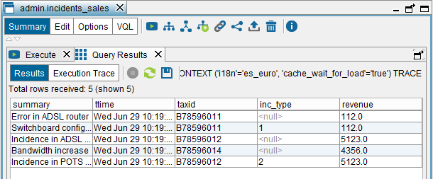
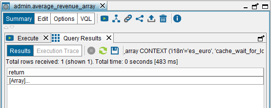
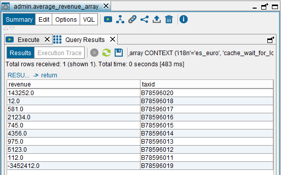
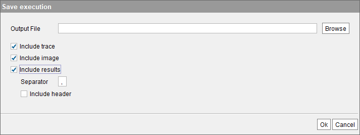

==============
Querying Views
==============

.. toctree::
   :hidden:

   execution_trace_of_a_statement.rst

To query a view, open it and click **Execution panel** (|image0|).

The default query is ``SELECT * FROM viewname``.

Click on |image1| beside “Conditions” to add AND conditions to the
query. For each condition, you have to indicate:

-  One of the attributes of the view.
-  The operator of the condition: =, <>, contains, etc.
-  The operand. It can be any expression using constants, view
   attributes and functions (see :ref:`Functions for Conditions and
   Derived Attributes` of the VQL Guide).

   Click on the menu **Help > Functions** list to display the list of
   existing functions.

   If the selected attribute is of a compound type or of xml type, click
   on the icon beside the box to open, respectively, the “Compound
   values editor” or the “XML editor”.

You can also select the **Specify Where expression** option to write a
more complex query. In the box for writing the query, press Ctrl+Space
to display the auto-complete list that will help you form syntactically
valid expressions.

|

When writing queries, keep in mind that the query conditions have to
fulfill the view’s mandatory capabilities. The section :ref:`Query
Capabilities` explains what mandatory capabilities are.

The following options are available in this dialog:

-  **Do not use cache**. If selected, this execution of the query
   ignores the contents of the cache and obtains the data from the
   original sources even if the cache has been enabled for this view. If
   this view is a combination of views, the contents of their caches
   will also be ignored.
-  **Store results in cache**. If selected, "Retrieve all rows"
   will be automatically selected and the results of the query will be stored
   in the view’s cache.
   It is equivalent to adding the ``'cache_preload' = 'true'`` parameter
   to the ``CONTEXT`` clause of the query.

   .. note:: This option is only enabled if the cache mode of the view
      is “Full” or “Partial with explicit loads”. With cache “Full”, if "Store results in cache"
      is selected and "Retrieve all rows" is not, the maximum number of results stored in cache will be limited by "Display rows".

-  **Wait for cache load**. If selected, the query will not finish until
   the entire result have been returned to the Administration Tool *and*
   stored in the cache database. If this check box is cleared, once all
   the results are returned to the Administration Tool, the query
   finishes without waiting for the entire data to be cached correctly.

   When the Server executes a query whose result has to be cached,
   usually the entire result has been processed by the Administration
   Tool before it is completely stored in the cache database. The reason
   is that inserting data in a database is usually a slower task. If you
   clear this check box and after the query has finished, there is an
   error while inserting the data into the cache database, the Server
   cannot notify the Administration Tool of this error. By selecting
   this check box, you will see the error if there is one.
   Selecting this check box is equivalent to adding the
   ``'cache_wait_for_load' = 'true'`` parameter to the ``CONTEXT``
   clause of the query.

   If you select this check box and also select the check box “Execute
   with TRACE”, the execution trace of the query will contain
   information about the process of storing the data in the cache
   database.

   To see more information, search for the option
   ``cache_wait_for_load`` in the section :ref:`Cache Modes`.

-  **Invalidate existing results**. If selected, the cached data of this
   view will be invalidated before storing the new data.
   It is equivalent to adding the ``'cache_invalidate' = 'matching_rows'``
   parameter to the ``CONTEXT`` clause of the query.

   .. note:: This option is only enabled if the cache mode of the view
      is “Full”.

-  **Display rows**. The Tool only displays the first N rows of the result.
-  **Retrieve all rows**. If selected, the Tool does not display more rows
   than “Display rows”, but the Tool keeps processing the rest of the result set.

   If this check box is cleared, the Tool adds clause ``LIMIT`` to the query sent to the Server. E.g. if
   "Display rows" is set to 100 and you execute the query ``SELECT * FROM view``, the Tool sends the query
   ``SELECT * FROM view LIMIT 100``. That means that the query will finish after processing 100 rows.

   .. note:: It is important to highlight that in case of executing a
     view configured with cache "Partial", if "Retrieve all rows" is not
     selected, the query will not be cached.

-  **Execute with TRACE**. If selected, it will enable the “View
   execution trace” button of the dialog with the results of the query.
-  **Do not use swap**. If selected, this execution of the query will
   not swap the intermediate results to disk even if swapping has been
   enabled. If this view is a combination of views, their intermediate
   results will not be swapped to disk either.

Before executing the query, you can click **Query plan** to obtain a
look ahead at the execution plan that Virtual DataPort will use to run
the query (see section :ref:`Execution Trace of a Statement`).

Any query execution can be cancelled at any moment by clicking **Stop**
(|image2|).

The `Executing the view incidents_sales`_ shows the result of
executing the view ``incidents_sales``.

Once the execution has finished, you can see the trace of the execution
(see section :ref:`Execution Trace of a
Statement`)
by clicking **Execution trace** (only enabled if the “Execute with
TRACE” check box was selected in the previous dialog).

   Executing the view ``incidents_sales``

If the response to the query execution contains a compound field (a
register or an array), double-click the field to navigate its
subcomponents. The figure :ref:`below <Result comprised of one tuple with a field of the
type array of registers>` shows the result of executing the base view
``average_revenue_array`` (created in the section :ref:`Creating Flatten
Views`). The result of querying this view only has one tuple, which
contains one field of the type array of registers. Each register
contains the ``taxId`` and the average monthly sales of a client.
Double-click on the field “[Array]” to display its contents and then,
click **RESULT** to return to the previous level.

   Result comprised of one tuple with a field of the type array of registers

   Content of a field of the type array of registers

.. _export-result-to-zip:

To export the result of the query to a zip file, click **Save**
(|image4|). You can select the information to export:

-  **Include trace**: if the statement returns an
   execution trace, it will be added to the zip file in
   binary and text file format.
-  **Include image**: if the statement returns an execution trace, the file will include the trace as an image.
-  **Include results**: stores the results in a CSV file. The CSV file will only contain the rows displayed by the tool, not all the rows of the result. For example, if *Display rows* is set to 150 but the query returns 200 rows, the Tool will only save those 150 rows.

   Export the result of the query

Later, you can load this file with the :ref:`Trace Viewer` (menu **Tools** > **Trace viewer**). You will be able to see the results and the trace as you if have just executed the query.

