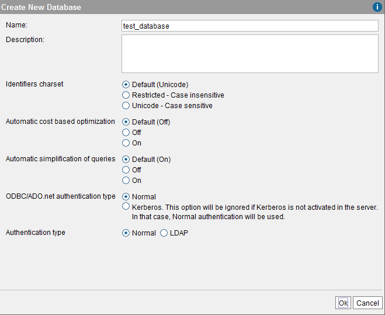
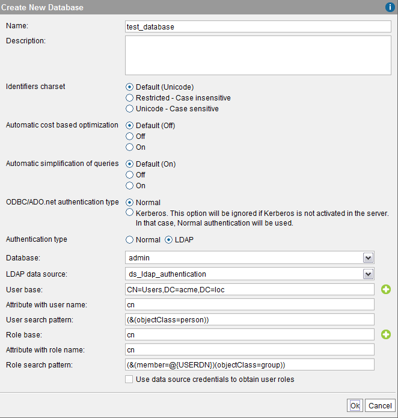

==================
Creating Databases
==================

In the following section, we will explain how to create a database in
Virtual DataPort.

There are two types of databases depending on the method used to
authenticate users:

#. **Normal authentication**: the database relies in the Virtual
   DataPort access control, which means that the users that access
   Virtual DataPort have to be created in Virtual DataPort.
   See section :ref:`Creating a Database with Normal Authentication`.
#. **LDAP** authentication: the database delegates the authentication of
   users to an LDAP server.
   See section :ref:`Creating a Database with LDAP Authentication`.

.. note::
   The authentication type of the database does not matter if the
   client connects to Virtual DataPort using Kerberos authentication. The
   reason is that in this case, the privileges granted to the user will
   depend on the roles obtained for this user, from the LDAP server
   selected in the Kerberos configuration dialog (see section :ref:`Setting-Up
   the Kerberos Authentication in the Virtual DataPort Server`).

For both types of databases, you can configure the following settings:

#. Enable the support for Unicode identifiers.
#. Enable the **automatic cost-based optimization**. See more
   information about this feature in the section :ref:`Cost-Based
   Optimization`.
#. Enable or disable the **automatic simplification of queries**. See
   more information about this feature in the section :ref:`Automatic
   Simplification of Queries`.

If you select **Default** for any of these options, the database will use
at all times the *current value* configured for the Server. For example,
if in a database you set the “automatic cost-based optimization” to
“Default” and this feature is disabled globally (see the global value of
this feature in the dialog “Queries Optimization” of the menu
Administration > Server configuration), it will be also be disabled for
this database. If later you enable this feature globally, it will be
also enabled for this database without you having to change the specific
configuration of the database.

To enable Kerberos authentication for ODBC/ADO.net clients, set
**ODBC/ADO.net authentication type** to **Kerberos**.

.. important:: If you do this, the ODBC/ADO.net clients that connect to this
   database will only be able to use Kerberos authentication; the authentication with login/password will be refused.

Creating a Database with Normal Authentication
=================================================================================

To create a database with normal authentication, click **Database
management** on the **Administration** menu. In this dialog, click **New
database**. The Tool requests the following data (see `Creating a new
database with "Normal" authentication type`_):

-  **Name** of the database.
-  **Description** of the database (optional).
-  **Identifiers charset**: if you select **Default**, the database will
   use the setting configured for the entire Server (see :ref:`Identifiers
   Charset`).
-  Authentication type: **Normal**.
-  Click **Ok** to create the database.

When a user tries to connect to this database, Virtual DataPort will
check the credentials of this user with the “list” of users created in
Virtual DataPort. These users are the ones created in the “User
Management” dialog (see section :doc:`./creating_users`).

   Creating a new database with "Normal" authentication type

Creating a Database with LDAP Authentication
=================================================================================

A database with LDAP authentication delegates the authentication of
users to an LDAP server. The benefit over the *Normal* authentication is
that you rely on an LDAP server such as Microsoft Windows Active
Directory to authenticate users. This simplifies the management of users and their
privileges.

When creating a Virtual DataPort database with LDAP authentication, you
have to define roles in Virtual DataPort with the names of the groups
that a user may have assigned in the LDAP server. Then, assign
privileges to these roles.

At runtime, when a user connects to this database, the Server will
connect to the LDAP server to check her credentials. If the credentials
are correct, the Server will obtain the names of the roles assigned to
this user. The actions that the user will be authorized to do, will be
defined by the privileges assigned to the roles defined in Virtual
DataPort.

.. note::
   The authentication type of the database does not matter if the
   client connects to Virtual DataPort using Kerberos authentication. The
   reason is that the privileges granted to the user will depend on the
   roles obtained for this user, from the LDAP server selected in the
   Kerberos configuration dialog (see section :ref:`Setting-Up the Kerberos
   Authentication in the Virtual DataPort Server`).

When a user tries to connect to a LDAP database, the Server does the
following:

#. It checks if the user name belongs to a Virtual DataPort user and if
   it does, it checks that its password is correct. If it is not
   correct, it returns an error.
#. If the user name is not a Virtual DataPort user, it connects to the
   LDAP server to check her credentials.
   If the credentials are correct, it obtains the roles of the user.
   If the credentials are incorrect, it returns an error.

If there is a Virtual DataPort user called “user1” and a user in the
LDAP server with the same user name, the Server will use the privileges
assigned to the local user “user1”.

To create a database with LDAP authentication, first you need to do the
following:

#. In the LDAP server, do the following:

   a. Create a node for each Virtual DataPort role that you want to assign
      to the users of this database. These nodes have to be children of the
      same parent node.
   b. In each one of these nodes, create an attribute that stores the name
      of the role it represents.
      The name of this attribute has to be the same in all these nodes.
   
      .. note:: At runtime, when a user tries to connect to a database with
         LDAP authentication, the Server obtains the name of the roles
         assigned to the user, from the LDAP server. The role names obtained
         from the LDAP server that do not exist in Virtual DataPort are
         ignored. The comparison of role names is case insensitive or case
         sensitive depending on the “Identifiers charset” of the Server
         (“Identifiers charset” tab on the menu Administration > Server
         configuration).
         If the “Identifiers charset” is “Restricted”, the comparison is
         case-insensitive.
         If the “Identifiers charset” is “Unicode”, the comparison is
         case-sensitive.

   c. In each one of these nodes, create an attribute whose value is the
      Distinguished Name of a user that has this role. That is, a node of a
      role has to have N attributes with the same name and the value of
      each of them has to be the Distinguished Name of a user.

   Virtual DataPort defines a special role called ``serveradmin``. Having
   this role is equivalent to being an administrator user of the Virtual
   DataPort server, except that it does not grant the privilege of
   connecting to Virtual DataPort via JMX.

   If you want to grant this role to a user of this database, follow the
   steps above, for the role ``serveradmin``.

2. Create an LDAP data source that connects to the LDAP server you want to
   use to check the credentials of users (the section :ref:`LDAP Sources`
   explains how to create an LDAP data source).

   .. note:: If the organization adopted a multi-domain environment, you have to
      select the check box *Use GSSAPI SASL authentication mechanism* in the LDAP data source.
      
      Also, the administrator of the LDAP server (usually, Active Directory) has to establish
      a trust relationship between the domains, to 
      allow authentication of users from all domains.      

3. Create roles in Virtual DataPort (explained in the section :ref:`Creating
   Roles`) and assign them privileges.
   
   The name of these roles has to match the names that will be obtained
   from the LDAP server when authenticating the users of this database.
   
   With the :ref:`Wizard "Import Roles from LDAP"` wizard, you can easily create in
   Virtual DataPort all the roles that have been defined in the LDAP
   server. Note that you still need to assign privileges to the imported
   roles.
   The section :ref:`Creating Roles` explains how to use this wizard.

After this, click **Database management** on the **Administration**
menu. In this dialog, click **New database**.

   Creating a new database with LDAP authentication

You have to provide the following data:

-  **Name** of the database.
-  **Description** of the database (optional).
-  **Identifiers charset**: if you select **Default**, the database will
   use the setting configured for the entire Server (see section
   :ref:`Identifiers Charset`).The section :doc:`/vdp/vql/language_for_defining_and_processing_data_vql/unicode_identifiers/unicode_identifiers` of the
   VQL Guide explains in detail the differences between the
   **Restricted** and the **Unicode** charset.
-  Authentication type: **LDAP**.
-  **Database**: select the database of Virtual DataPort where you have
   created the LDAP data source.
-  **LDAP data source**: select the data source.
-  **User base**: node of the LDAP server that is used as scope to
   search nodes that represent users.
   
   You can enter more than one “User base” by clicking on the button
   |image0| beside the User base box. When there is more than one “User base”, the Server 
   searches the user’s node in the first “User base” scope. If the Server does not 
   find the node that represents the user, it searches it in the second “User base” scope. 
   If it also fails, in the third, etc. If the Server does not find the node that represents 
   the user, it denies access to the user.
   
-  **Attribute with user name**: name of the attribute that contains the
   user name of users, in the nodes that represent users.
-  **User search pattern**: pattern used to generate the LDAP queries
   that will be executed to obtain the nodes that represent the users
   that try to connect to the Server.
-  **Role base**: node of the LDAP server that is used as the scope to
   search the nodes that represent roles that users of this database can
   have.
   
   You can enter more than one “Role base” by clicking on the button
   |image0| beside the “Role base” box. The LDAP query formed with the 
   “Role search” pattern will be executed in every “Role base” scope.
   
-  **Attribute with role name**: name of the attribute that contains the
   name of the role, in the nodes that represent roles.
-  **Role search pattern**: pattern used to generate the LDAP queries
   that will be executed to obtain the nodes that represent the roles of
   a user. This pattern has to contain the token ``@{USERDN}`` or ``@{USERLOGIN}`` (it cannot contain both):
   
   -  ``@{USERDN}`` will be replaced with the Distinguished Name of the user that tries
      to connect to this database. For example, "CN=john,CN=Users,DC=acme,DC=loc".
   
   -  ``@{USERLOGIN}`` will be replaced with the login name of the user that tries to connect to this database. For example, "john".
   
-  **Use data source credentials to obtain user roles**: when a user
   tries to connect to a database with LDAP authentication, the Server
   validates the password she provided and then, it executes a LDAP
   query to obtain the roles of the user.
   
   If this check box is selected, the Server executes this LDAP query using the credentials of the LDAP data source selected in the “LDAP data source” list of this dialog. 

   If this check box is cleared, the LDAP query is executed using the credentials of the user that is trying to connect to this database.
   
-  **Assign "allusers" role for every connected user**: if selected, the
   Server will grant the privileges of the role “allusers” to all the
   users that log in successfully even if this role has not been
   assigned to the user in the LDAP server.

   For example, if you want all users to have read access over a particular database, select this option and grant this privilege to the role “allusers”.

   This option does not modify the roles granted to the user in the LDAP server. This means that if you later clear this check box, the users that log in will not have the privileges granted by the role “allusers” anymore.

The LDAP Authentication Process
==================================

This section describes how Virtual DataPort authenticates users that connect to a database with LDAP authentication.

The explanation below also applies for when the user connects to the Server using Kerberos authentication or a web service with SAML authentication.

Let us say that we have created database with LDAP authentication and
that the user “john” tries to connect to this database.

#. The Server performs an LDAP query to obtain the node that represents
   the user “john”. This LDAP query searches the node whose attribute
   “Attribute with user name” has the value of the user name provided by
   the user (in this case “john”), using the “User search pattern” in
   the “User base” scope.
   If the query does not return any node and there is more than one
   “User base”, the Server performs the same search in the second “User
   base” scope. If it does not find the node, it uses the third “User
   base”, etc. If it does not find any matching node, the Server denies
   access to the user.
   
   To perform these queries, the Server connects to the LDAP server with the credentials of the data source.

#. After obtaining the user’s LDAP node, the Server tries to log in the
   LDAP server with the Distinguished Name (DN) of this node and the
   password provided by the user. If the password is refused by the LDAP
   server, the Server denies access to the user.
   
   This step is skipped if the user connected to the Server using Kerberos
   authentication or a web service with SAML authentication. The reason is
   that at this point, the credentials of the user are already validated;
   this process is to obtain the roles associated to the user.
   
#. If the credentials of the user are correct, the Server obtains her
   roles. To do this, it executes an LDAP query.
   The query is built replacing the token ``@{USERDN}`` or ``@{USERLOGIN}`` of “Role search
   pattern”.
   
   In this example, the pattern has "@{USERDN}", which is replaced
   with the Distinguished Name of the user’s LDAP node. This results in something like this:
   ``(&(member=CN=john,CN=Users,DC=acme,DC=loc)(objectClass=group))``
   
   The Server executes this LDAP query in the “Role base” scope, in order to
   obtain the nodes that represent the user’s roles.
   If there is more than one “Role base”, the LDAP query will be
   executed from all the “Role base” scopes and the result is the union
   of the result of each query.
   
   If the “Use data source credentials to obtain user roles” check box
   is selected, the Server executes this LDAP query using the
   credentials of the LDAP data source associated with the database.
   Otherwise, the query is executed using the credentials of the user
   that is trying to connect to this database. When the user connected 
   to the Server using Kerberos authentication or a web service with
   SAML authentication, the Server also executes this LDAP query using
   the credentials of the LDAP data source.
   
#. After obtaining the roles’ nodes, the Server executes another LDAP
   query to obtain the name of the roles assigned to the user from the
   “Attribute with Role name” attribute of these nodes.

   If the check box “Use data source credentials to obtain user roles”
   of the database’s configuration is selected, the Server uses the credentials
   of the data source to execute this query. If this check box is cleared, this
   LDAP query is executed using the credentials of the user that is trying to 
   connect to this database. When the user connected to the Server using Kerberos
   authentication or a web service with SAML authentication, the Server also 
   executes this LDAP query using the credentials of the LDAP data source.
   
   .. note:: If a role name obtained from the LDAP server does not exist in Virtual DataPort, it is ignored and the user will have the privileges of the other roles that do exist. The comparison to search if a role name exists in Virtual DataPort is case insensitive.
      If none of the role names obtained from the LDAP server exists in Virtual DataPort, “normal” users will not be able to connect to this database (“administrator” users will be able to connect to this database anyway because they by-pass this type of authentication). 
   
.. note:: In the first step of the authentication process, the Server
   connects to the LDAP server to search the user’s node. In order to do
   this, you have to do the following:
   
   -  Configure the “LDAP data source” with a valid “Login” and “Password”
      so it can connect to the LDAP server to search the appropriate node.
   -  Or, configure the LDAP server to allow anonymous queries.
   
   If none of these is possible in your environment, you can by-pass the
   first step of the authentication process by following these steps.
   However, in this case the LDAP node’s attribute that stores the user
   name has to be “cn”.
   
   #. Enter “cn” in “Attribute with role name”.
   #. If “User search pattern” is empty and the “Attribute with role name”
      is “cn”, the value of “User base” is used to build the user’s
      Distinguished Name.
      
      In this example, when the user “john” tries to connect to a database
      with the “User pattern” ``CN=Users,DC=acme,DC=loc``, the
      Distinguished Name used to connect to the LDAP server will be
      ``CN=john,CN=Users,DC=acme,DC=loc`` Then, the Server will use this
      string as Distinguished Name and the password provided by the user to
      try to connect to the LDAP server. If it succeeds, it means that the
      password provided by the user is correct.

The appendix :ref:`Useful Tools to Debug Issues with Active Directory or
Other LDAP Servers` contains a list of tools useful to debug problems
related to Active Directory and other LDAP servers.

Configuring a Database with LDAP Authentication and Dynamic Groups
==================================================================

In some LDAP services, there are two ways to define membership of a
group: statically and dynamically:

-  Static groups: they enumerate their member objects explicitly.
-  Dynamic groups: instead of enumerating their members, they define an
   LDAP URL that matches only for group members. In dynamic groups, the
   members do share a common attribute or set of attributes that are
   defined in the ``memberURL`` filter.

When a user connects to a database with LDAP authentication, the Server
retrieves the groups that this user belongs to, in order to know her
roles.

By default, Virtual DataPort only supports static groups. This section
explains how to configure Virtual DataPort to be able to work with LDAP
dynamic groups.

There are several options depending on if you want all the databases
with LDAP authentication to work with dynamic groups or only some of
them. Note that an LDAP authenticated database can work with either
static groups or dynamic groups. Not both.

|

.. rubric:: Option 1: *All the LDAP authenticated databases will work with
   dynamic groups but not with static groups*.

Execute the following statements on the VQL Shell of the Administration
Tool:

.. code-block:: vql

   SET 'com.denodo.vdb.security.LDAPUserGroupRetriever.instanceClassName' 
       = 'com.denodo.vdb.security.DynamicLDAPUserGroupRetriever';

   SET 'com.denodo.vdb.security.DynamicLDAPUserGroupRetriever.memberURL' 
       = '<member URL>';

   SET 'com.denodo.vdb.security.DynamicLDAPUserGroupRetriever.userMatchPattern' 
       = '<LDAP filter>';

In the second statement, ``<memberURL>`` is the attribute that contains
the LDAP URL used to obtain the dynamic group of the users.

In the third statement, ``<LDAP filter>`` is the filter that matches if
an LDAP user is the same user that it is trying to connect to Virtual
DataPort (this property will usually contain the ``@{USERLOGIN}`` and
``@{USERDN}`` variables)

Example of <member URL>: ``memberURL``

Example of <LDAP filter>: ``&(uid=@{USERLOGIN})``

|

.. rubric:: Option 2: *all the LDAP authenticated databases will work with
   dynamic groups, except one*.

Execute the following statements on the VQL Shell:

 
.. code-block:: vql

   # This statement makes the database <databaseName> work with static 
   # groups.
   SET 'com.denodo.vdb.security.LDAPUserGroupRetriever.instanceClassName[.<databaseName>]' = 
       'DefaultLDAPUserGroupRetriever';

   SET 'com.denodo.vdb.security.LDAPUserGroupRetriever.instanceClassName' 
       = 'com.denodo.vdb.security.DynamicLDAPUserGroupRetriever';

   SET 'com.denodo.vdb.security.DynamicLDAPUserGroupRetriever.memberURL' 
       = '<member URL>';

   SET 'com.denodo.vdb.security.DynamicLDAPUserGroupRetriever.userMatchPattern' 
       = '<LDAP filter>';
   

In the first statement, ``<databasename>`` is the name of the
LDAP-authenticated database that will authenticate users that belong to
static groups. The other databases will authenticate users from dynamic
groups.

.. rubric:: Option 3: *one or more LDAP authenticated databases will work with
   dynamic groups. The other LDAP authenticated databases will work with
   static groups*.

Execute the following statements on the VQL Shell. Execute these
statements for each database that you want that it uses dynamic groups.

 
.. code-block:: vql

   SET 'com.denodo.vdb.security.LDAPUserGroupRetriever.instanceClassName[.<databaseName>]' 
       = 'DynamicLDAPUserGroupRetriever';

   SET 'com.denodo.vdb.security.DynamicLDAPUserGroupRetriever.<databaseName>.memberURL' 
       = '<member URL>';

   SET 'com.denodo.vdb.security.DynamicLDAPUserGroupRetriever.<databaseName>.userMatchPattern' 
       = '<LDAP filter>';

Every time a user connects to an LDAP authenticated database, the Server
performs an LDAP query to obtain the groups that the user belongs to.
When the database is configured to work with dynamic groups, the Server
performs more LDAP searches than with static groups. The reason is that
with dynamic groups, the Server launches an additional LDAP search, for
each group. If there are a lot of groups, the Server will perform a lot
of LDAP searches every time a user connects to that database.

|

.. rubric:: Example of setting up dynamic groups

Follow these steps to create a database called “dynamicdb” that
authenticate its users with dynamic groups:

#. Execute the following statements on the VQL Shell:

   .. code-block:: vql
   
      SET 'com.denodo.vdb.security.LDAPUserGroupRetriever.instanceClassName' 
          = 'com.denodo.vdb.security.DefaultLDAPUserGroupRetriever'; 

      SET 'com.denodo.vdb.security.LDAPUserGroupRetriever.instanceClassName.dynamicdb' 
          = 'com.denodo.vdb.security.DynamicLDAPUserGroupRetriever';

      SET 'com.denodo.vdb.security.DynamicLDAPUserGroupRetriever.dynamicdb.memberURL' 
          = 'memberURL';

      SET 'com.denodo.vdb.security.DynamicLDAPUserGroupRetriever.dynamicdb.userMatchPattern' 
          = '(&(uid=@{USERLOGIN}))';

#. Restart the Server and create the database with the following
   statement:
   
   .. code-block:: vql
   
      CREATE OR REPLACE DATABASE dynamicdb 
        'Description: LDAP-Authenticated database (dynamic groups)'
        AUTHENTICATION LDAP admin.ldapds_bertone
        USERBASE = 'ou=users,dc=denodo,dc=com'
        USERATTRIBUTENAME = 'uid'
        USERSEARCH = '(objectClass=person)'
        ROLEBASE = 'dc=denodo,dc=com'
        ROLEATTRIBUTENAME = 'cn'
        ROLESEARCH = '(objectClass=groupOfURLs)';

.. |image0| image:: ../../common_images/icon-plus3.png