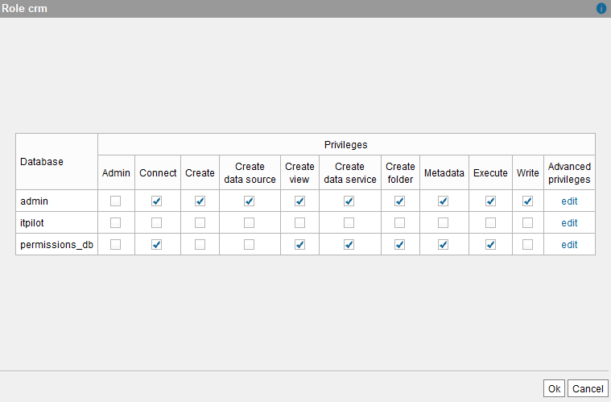
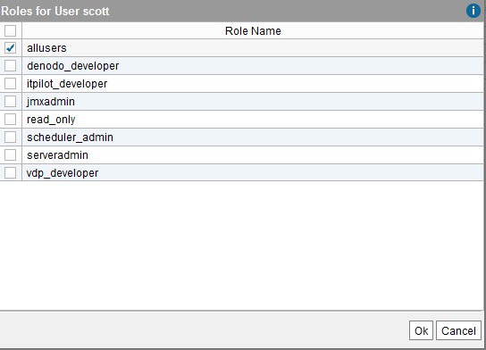
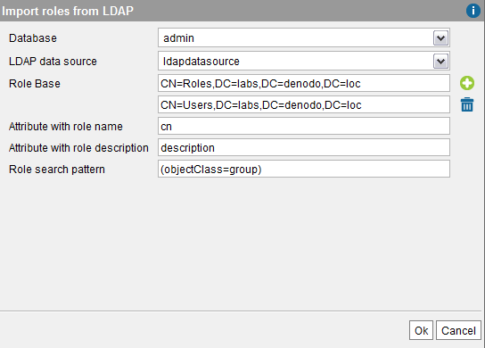
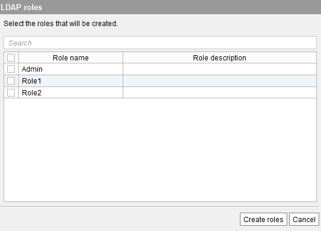

==============
Creating Roles
==============

A role is a set of access rights that we can grant to users.

To create a new role, click **Role management** on the
**Administration** menu. In this dialog, click **New role**. In this
dialog, you have to provide the following:

-  The name of the new role.
-  A description.

Then click **Ok**. After creating the role, you have to assign
privileges to these roles. To do this, select the role and click
**Assign privileges**.

In this dialog, you can select
the access privileges assigned to this role. The access privileges that
you can assign to a role and to a user are the same and work in the same
way. The section :doc:`Modifying the Privileges of a User <./modifying_and_deleting_users>` explains how to
assign these privileges.

.. note:: As explained in the section :ref:`Roles`, if you assign two roles
   to a user, the “effective permissions” of this user will be the union of
   the privileges of both roles.

   Assigning privileges to a role

You can also assign a role to another role (Role Inheritance) as
explained in the section :ref:`Roles`, by clicking on **Assign roles**.
Then, for each role you want to assign, select it in the list and click
on |image1|.

In the figure below, you can see
that the role “denodo\_developer” has the roles “itpilot\_developer” and
“vdp\_developer”. The users that have the role “denodo\_developer” will
have the privileges assigned to the roles “itpilot\_developer”,
“vdp\_developer” and “denodo\_developer”.

   Assigning roles to another role (Role inheritance)

Instead of creating the roles manually, you can import them from an LDAP
server. Before importing them, you need to do one of these tasks:

#. Create a database with LDAP authentication that to authentication
   users, uses the LDAP server from which you want to obtain the list of
   roles.
#. *Or* create an LDAP data source that points to the LDAP server from
   which you want to obtain the list of roles. Create this data source
   in a database without LDAP authentication. The section :ref:`LDAP
   Sources` explains how to create an LDAP data source.

After this, click on **Import roles from LDAP** to display the “Import
Roles from LDAP” wizard.

Wizard "Import Roles from LDAP"
===============================

The wizard "Import Roles from LDAP" imports the names and
descriptions of roles from an LDAP data sources (usually, Active Directory). Then, you have to grant them the appropriate
privileges.

   Import roles from LDAP wizard (1)

You have to provide the following data:

-  **Database**: select a database that is configured with LDAP
   authentication or the database that contains the LDAP data source.

   If you select a database with LDAP authentication, the Tool will copy the 
   LDAP configuration of the database to the boxes below. The Tool will disable the box **LDAP data source**
   because the wizard will use the LDAP data source of the selected database.

   Alternatively, select a database that contains the LDAP data source 
   that points to the LDAP server from which you want to obtain the list 
   of roles and select the source in the **LDAP data source** box below.

-  **Role base**: node of the LDAP server that is used as scope to
   search nodes that represent roles.
   
   You can enter more than one “Role base” by clicking on the button
   |image1| beside the “Role base” box.
   
-  **Attribute with role name**: name of the attribute that contains the
   name of the role, in the nodes that represent roles.
-  **Attribute with role description**: name of the attribute that
   contains the description of the role, in the nodes that represent
   roles.
-  **Role search pattern**: pattern used to generate the LDAP queries
   that will be executed to obtain the nodes that represent the roles
   you want to import into Virtual DataPort.

Then, click **Ok**. The Tool will display the roles found in the LDAP
server (see `Import roles from LDAP wizard (2)`_). In this list, you
have to select the roles you want to import and click **Ok**.

   Import roles from LDAP wizard (2)

You can use the text field at the bottom to search roles by their name.

This dialog does not list the roles ``serveradmin`` or ``jmxadmin`` even
if they are returned by the LDAP query. The reason is that these roles
are automatically defined during the installation of Virtual DataPort so
they already exist. See more about these roles in the section :ref:`Roles`.

.. |image1| image:: ../../common_images/icon-plus3.png

