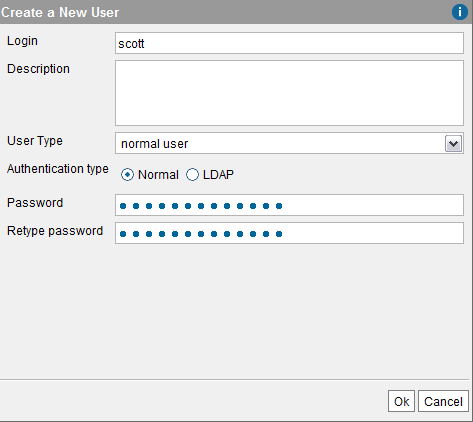
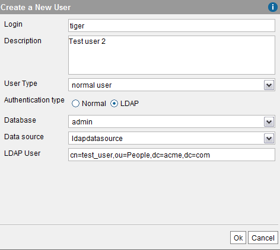

==============
Creating Users
==============

To create a user, click **User management** on the **Administration**
menu. In this dialog, click **New user**.

In this dialog, you have to provide the following data (see `Creating a
normal user`_):

-  **Login** and **password** of the new user.
   
   .. note:: The login can only contain letters, numbers and underscores.

-  **Description** of the new user (optional)

-  **User type**: users can be of the type “Administrator” or “Normal”
   (user without administration privileges).
   
   .. note:: Administrator users can perform **any** action on any
      database of the Server.
   

   .. note:: You cannot assign privileges to “Normal” users over
      databases with “Authentication type” “LDAP”. That is because for these
      databases, the Server obtains the names of the roles of the users from
      the LDAP server.

-  **Authentication type**. Users can be authenticated with a regular user
   and password (**Normal** option) or against an LDAP server registered in
   Virtual DataPort (see the section :ref:`LDAP Sources` for information on how to
   register an LDAP server). The data to be completed is different,
   depending on the selected option:

   -  **Normal**: you have to provide a password for the new user.

   -  **LDAP**: you have to provide the following (see `Creating a normal
      user`_):

      -  **LDAP data source**. Select the database where the LDAP server
         required has been registered using the selectable “Database”. Once
         this has been done, select the LDAP data source using the drop-down
         “Data source”.
      -  **LDAP user**. The name of the user in the LDAP server.
         For example, the value ``cn=test,ou=People,dc=denodo,dc=com``
         identifies the ``test`` user in an organizational unit ``People`` for
         the domain ``denodo.com``.
      

.. important:: The LDAP authentication of users is different from
   databases with LDAP authentication.
   When the “Authentication type” of a user is “LDAP”, the LDAP server is
   only used to check that the password provided by the user is correct.
   The privileges of this user are still managed from Virtual DataPort.
   In a database with LDAP authentication, the Server obtains the roles
   of the user from the LDAP server and the privileges of the user are
   those assigned to its roles.

.. note:: We do not recommend creating users with LDAP authentication.
   Instead, create databases with LDAP authentication, which will simplify
   the management of users and their privileges. See more about this type
   of databases in the section :ref:`Creating a Database with LDAP
   Authentication`.

   Creating a normal user

.. note:: If an LDAP data source is deleted on cascade (see section
   :ref:`Importing SOAP Web Service Sources`), then the users depending on it
   will also be deleted. This operation can only be executed by an
   administrator user.

   Creating an LDAP user

