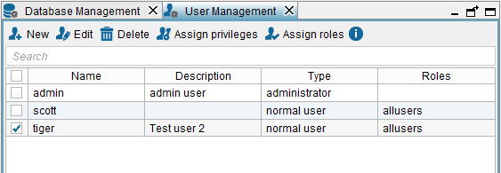
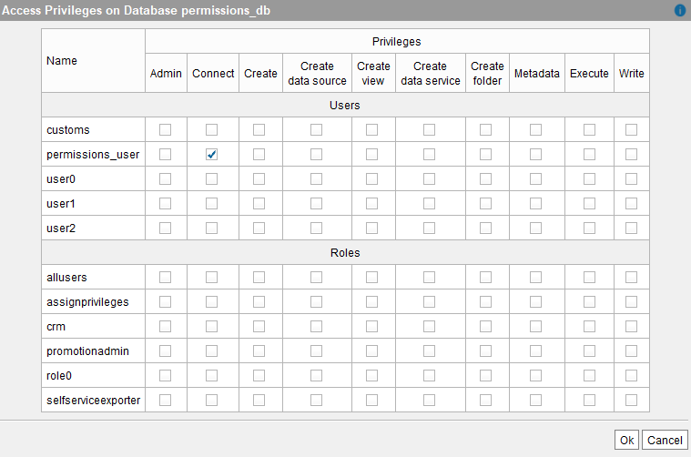
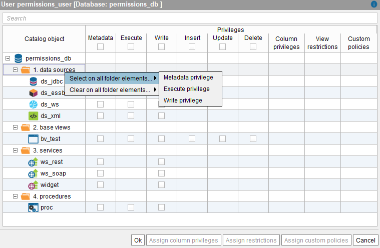
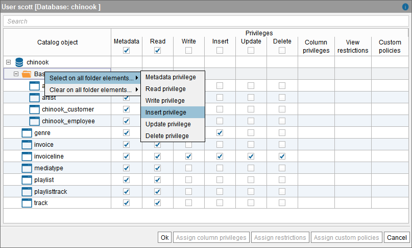
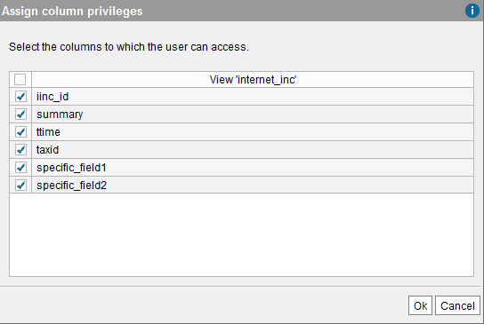
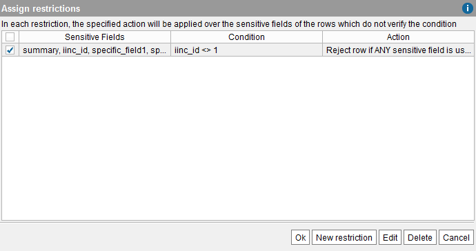
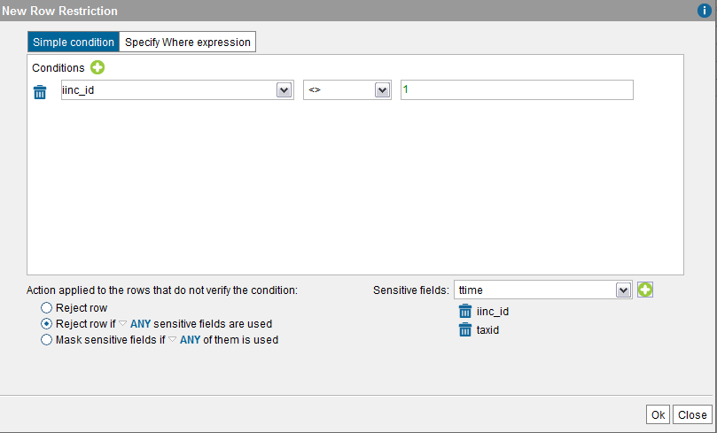

============================
Modifying and Deleting Users
============================

To see the current list of users of the Virtual DataPort server, click
on **User management** on the menu **Administration** (see `List of existing users`_).

If you have many users, you can search one by typing its name in the box
at the top of the dialog.

   List of existing users

To update the description and password of a user, select it and click
**Edit**.

If the user is not an Administrator, click **Assign privileges** to
modify her access privileges over the existing Virtual DataPort
databases (see section `Modifying the Privileges of a User`_).

To delete a user, select it and click **Delete**. The default
administrator user “admin” can be deleted, but you need to have at least
one administrator user at any moment.

Changing Active User Password
=============================

To modify your own password, click the menu **File** > **Change
password**.

Modifying the Privileges of a User
==================================

Click **Assign privileges** on the **User management** dialog to modify
the privileges of a user to access the databases and views of Virtual
DataPort.

You cannot assign privileges to “Administrator” users because these
users already have privileges to execute any operation.

The “Assign privileges” dialog lists the existing Virtual DataPort
databases (see `Assigning privileges to a user at database level`_). For
each database, a series of check boxes allows assigning the user the
desired global access rights.

   Assigning privileges to a user at database level

The privileges that can be assigned to a user over a database are:

-  **Admin** (Local administrator)
-  **Connect**
-  **Create**
-  **Create data source**
-  **Create view**
-  **Create data service**
-  **Create folder**
-  **Metadata**
-  **Execute**
-  **Write**

The section :ref:`Types of Access Rights` describes what users can do when
they have these privileges assigned.

To configure privileges over specific views/stored procedures/data sources/web services/widgets of a
database, click on **edit** to display the “Advanced privileges” dialog.
This dialog lists the views, procedures, data sources, web services and widgets of the database
and for each one, you can select the appropriate check box to give the
user privileges over a views/stored procedures/data sources/web services/widgets procedure (The privileges you can grant to an element vary depending on the type of element i.e. see the figure below).

   Granting privileges to a user at view and/or stored procedure level

You can grant privileges view per view. You can also assign a privilege
over all the elements of a folder. To do this, right-click the folder,
click **Select on all folder elements** and then, **Execute privilege**,
**Write privilege**, etc. Virtual DataPort manages the privileges of the
views/stored procedures/data sources/web services/widgets individually and not by folder. Therefore, if, after
granting a privilege over all the elements of a folder, you add an
element to the folder, you have to grant this privilege to this element.
Otherwise, the user will not have any privilege over this element.

   Granting “Write” privileges to a user over all the elements of a folder

In this dialog, we can also assign the following to specific views:

-  Column privileges (see section :ref:`Column Privileges`)
-  Row restrictions (see section :ref:`Row Restrictions`)
-  Custom policies (see section :doc:`Custom policies<../../../developer/custom_policies/custom_policies>`
   of the Developer Guide)

To assign column privileges over a view, select the check box of the
“Execute” column to assign Execute access to this user over the view (only if
the user does not have Execute access to the database), select the view and
click **Assign column privileges**.

In this dialog, select the columns that you want to allow this user to
project and clear the others. The selected columns are the ones that the
user will be able to project when it queries this view.

For example, a user with the column privilege of `Establishing column
privileges over a view (User Management)`_ will be able to project the
fields ``summary``, ``ttime``, ``taxid`` and ``iinc_id`` of the view.
However, queries over that view that project any of the other fields of
the view will fail.

   Establishing column privileges over a view (User Management)

You can also add restrictions over the contents of a view so certain
users or users that belong to a certain role can only obtain some rows
when querying that view.

To add a restriction over the contents of a view, enable the “Execute”
privilege over the view (only if the user does not have “Execute” access to
the database), select the view and click on **Assign restrictions**.
This dialog (see `Row privileges over the contents of a view`_) lists
the current restrictions of the view and in it, you can add new
restrictions or edit/delete the existing ones.

   Row privileges over the contents of a view

To add a new restriction, click **New restriction**.

   Adding a row restriction over the contents of a view (User Management)

In this dialog, you have to enter a “restriction condition”. To do this,
select the option **Simple condition** or **Specify Where expression**
and enter the condition. Then, select the action that you want to do
with the rows that do *not* verify the condition:

-  **Reject row**: the row will be discarded.
-  **Reject row if ANY/ALL sensitive fields are used**: the rows that do
   not verify the condition if the user is projecting ANY or ALL the
   sensitive fields specified. You can switch between ANY or ALL by
   clicking on
-  **Mask sensitive fields if ANY/ALL sensitive fields are used**: this
   option is similar to the previous one, but instead of rejecting the
   row, the sensitive values are set to ``NULL``.

This condition may include subqueries.

**Examples of how row restrictions work**

**Example 1**: assign a row restriction over the view ``product`` to the
user ``user1``, with the condition
``id = ANY (SELECT product_id FROM warehouse WHERE quantity > 0)`` and
the action **Reject row**.

When ``user1`` executes ``SELECT * FROM product``, the Server will only
return the products in stock (``quantity > 0``).

|

**Example 2**: assign a row restriction over the view ``internet_inc``
to the user ``user2``, with the condition ``iinc_id <> 1``, with the
“Sensitive fields” ``iinc_id`` and ``summary`` and the action **Reject
row if ALL sensitive fields are used**.

When ``user2`` executes ``SELECT * FROM internet_inc``, the Server will
only return the rows that match the condition ``iinc_id <> 1``. However,
if ``user2`` executes ``SELECT summary FROM internet_inc``, the Server
will return all the rows of the view because not all the “sensitive
fields” of the restriction are projected and therefore, the restriction
is not triggered.

|

**Example 3**: assign a row restriction over the view ``internet_inc``
to the user ``user3``, with the condition ``iinc_id <> 1``, with the
“Sensitive fields” ``iinc_id`` and ``summary`` and the option **Reject
row if ANY sensitive fields are used**.

When ``user3`` executes ``SELECT * FROM internet_inc``, the Server will
only return the rows that match the condition ``iinc_id <> 1``. In
addition, if ``user3`` executes ``SELECT summary FROM internet_inc``,
the restriction will also be triggered and it will only return the rows
that match this condition.

|

If you need a row restriction that takes into account more complex
information to decide if the result of the query is filtered or not, you
can develop a custom policy (see section :doc:`Custom policies <../../../developer/custom_policies/custom_policies>`
of the Developer Guide. Custom policies are very similar to restrictions and
they are assigned in the same way.

After importing the custom policy (see section :ref:`Importing Extensions`),
you can assign it to a user/role over a view. To do this, open the
dialog to manage the privileges of a user/role over the views of a
database, select the view and click **Assign custom policies**. Then,
click **New custom policy** and then, on the name of the custom policy.
If the policy has parameters, you will have to provide a value for them
at this point. These values will be provided to the policy at runtime.

