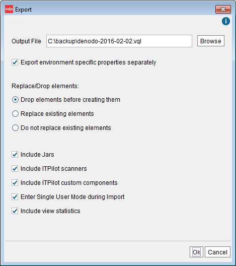

=============================
Exporting the Server Metadata
=============================

There are four options to export the metadata from the Server:

1. In the Server Explorer, right-click on the element you want to export and
   click on **Export**. This option exports the metadata of the selected
   element.

#. **Export database** (**File** > **Export database** menu): exports the
   contents of one or more Denodo virtual databases. For each database, the
   output includes the metadata of data sources, views, Web services
   (including the statements to deploy them if they were deployed), JMS
   listeners, etc.

#. **Export** (**File** > **Export…** menu): exports all the contents of
   the Virtual DataPort Server (see `Export dialog`_). That includes:

   -  The metadata from all the databases of the Server. Not just the
      database that you are currently connected to.
   -  Users, roles and their privileges.
   -  Server settings.
   -  …

   This option is available only for administrator users.

#. Use the **export script** included in the *Denodo Tools* toolkit. The
   section :ref:`Using the Import/Export Scripts for Backup and/or Replication`
   explains how to use this script.

   Export dialog

After exporting the metadata of a Virtual DataPort server, it can be
imported back to the same Server or into another one. The section
:ref:`Exporting and Importing Elements across Different Environments`
explains how to do this.

The **Export** and **Export database** dialogs of the **File** menu have
the following options:

-  **Output file**: file where the VQL statements to recreate the metadata
   will be stored.

-  **Export environment specific properties separately**. If selected, the
   metadata is stored in two files:

   -  A file with the name **Output file** that contains the VQL statements
      of all the elements of the database. The values of the parameters
      that depend on the environment are variables instead of the actual
      values.
   -  And, a file that contains the values of the variables. The name of
      this file is the same as **Output file** but with the extension
      ``.properties``.
      This option makes exporting and importing metadata across different
      environments, easier. See more about this in the section :ref:`Exporting and
      Importing Elements across Different
      Environments`.

-  In the “Export database” dialog, if you select the option **Database**,
   you can select the databases whose metadata you want to export. In this case,
   you can select all the databases but take into account that doing this is different
   than exporting the metadata from the “Export” dialog. That is because, in addition
   to the metadata of the databases, the output of the “Export” dialog also includes
   the settings of the Virtual DataPort server.

   If you select **Web service**, you can select **Export specific web service operations** and then,
   select which operations (if you selected a SOAP web service) or resources (if you selected a REST web service)
   you want to export. The output file will have the VQL statement :ref:`ALTER REST WEBSERVICE <Syntax of the ALTER REST WEBSERVICE statement>` or :ref:`ALTER SOAP WEBSERVICE <Syntax of the ALTER SOAP WEBSERVICE statement>`, which do
   not recreate the web service but add the selected operations to an existing web service.

   For example, if you have a web service called “incident” that publishes the view “incident” and you just export this resource, the output file will be like this:

   .. code-block:: sql

    ALTER REST WEBSERVICE incident
    SET VIEW incident FIELDS (
        summary : 'text',
        ttime : 'date',
        taxid : 'text',
        inc_type : 'long'
    );

-  **Replace / Drop elements**. Select the action that a Virtual DataPort
   server will take when importing this VQL file and the server has
   elements (data sources, views, etc.) with the same name and type as the
   ones that is importing:

   -  **Drop elements before creating them**. Before creating a new
      element, it will delete, if exists, the element with that name and
      all the elements that depend on it.

      E.g. when a server imports a JDBC data source ``ds_jdbc_acme``,
      first it will delete the existing JDBC data source
      ``ds_jdbc_acme`` and all the views that depend on this data
      source.

      This option is useful when you want to make sure that the imported
      data sources do not have more views than the ones contained in the
      VQL file.
   -  **Replace existing elements**. It will replace the existing elements
      with the elements from the file.

      E.g. when importing a LDAP data source
      ``ds_ldap_activedirectory`` and the Server already has a LDAP
      data source with that name, the server will replace this data source
      with the one from the VQL file. However, it will not modify or delete
      the views that depend on the existing data source.
   -  **Do not replace existing elements**. It will keep the existing
      elements and ignore the ones from the file.

      E.g. if the server has a view ``internet_inc`` and the VQL file
      contains a view with that name, the server will keep the existing
      view, instead of deleting it or replacing it.

      This option is useful when we need to add more elements to the server
      without affecting the existing ones.

-  **Export dependencies** (only for “Export database” and when the
   selected element is not **Database**). If selected, and the selected
   type is:

   -  **View**, the output will include all the necessary elements to
      create this view (other views, types, data sources, folders, etc.)
   -  **Folder**, the output will include the statement to create the
      folder and its inner elements. It will also include the statements to
      create the elements that the elements of the folder rely on.
   -  **Web service**, the output will include the statements to create the
      Web service and the elements that this Web service relies on: views,
      data sources...

      .. note:: The output will *not* include the metadata of the elements
         published by the Web service if you have added them to the Web
         service with the **Publish from VQL expression** dialog.

   -  **Widget**, the output will include the statements to create the
      widget and the elements that this widget relies on.
   -  **Stored Procedure**, output will include the statement to create the
      folder(s) where the stored procedure is stored in.

-  **Create Virtual Database** (only for the “Export database” dialog). If
   selected, the output will include a ``CREATE DATABASE`` statement so,
   when the metadata is imported, the database will be recreated and all
   the metadata will be created in this database. If it is not selected,
   when the metadata is imported, the elements will be created in the
   database that you are connected at that moment.

-  **Include Jars**. If selected, the output will include the Jars that
   contain the Java classes used to create:

   -  Stored procedures.
   -  Custom data sources (also known as Custom Wrappers)
   -  Virtual DataPort custom functions.
   -  ITPilot custom functions.

   These classes belong to the Jar files that were imported into the Server
   with the **Extension management** dialog (see section :ref:`Importing
   Extensions`).

-  **Include ITPilot scanners**. If selected, the output will include the
   scanners used by WWW (Web) sources (see section :ref:`Delimited File
   Sources` and the :doc:`/itpilot/user_guide/index`).

-  **Include ITPilot custom components**. If selected, the output will
   include the ITPilot custom components used by the WWW data sources.

-  **Enter Single Mode during Import**. If selected, the file generated
   will begin with the statement ``ENTER SINGLE USER MODE`` and
   finish with ``EXIT SINGLE USER MODE``, so that Virtual DataPort
   switches to single user mode while importing this file (see
   section :ref:`Importing Metadata` of the VQL Guide).

   .. note:: You are strongly advised to import metadata in a Virtual
      DataPort server in single user mode.

-  **Include users and privileges**. If selected, the output will include
   the statements to replicate the privileges of the exported elements.
   That is, it will include the statements to do the following:

   -  Create the users and the roles that are owners or have privileges
      assigned over the exported elements.
   -  Assign the privileges to these users/roles over the exported views.

   This option is only available in “Export database” and not in the
   “Export” dialog because when exporting the metadata of the entire
   Server, you already are exporting all this information.

-  **Include view statistics**. If selected, the output will include the
   statistics gathered for the views that are used by the cost-based
   optimization.
