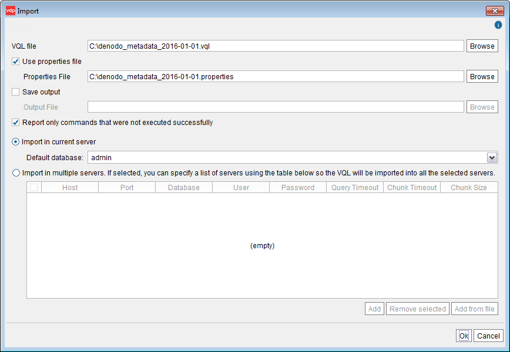
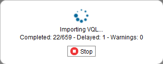

================================
Importing Metadata into a Server
================================

The content exported from a Virtual DataPort can be imported into
another Virtual DataPort Server using:

-  The **File** > **Import** dialog, as described below.
-  Or, the **import script** of the Denodo Tools toolkit. See section
   :ref:`Using the Import/Export Scripts for Backup and/or Replication` for
   more information about this.

   Import dialog

The **Import** dialog of the menu **File** has the following options:

-  **VQL file**. Enter the path to the VQL file. That is, the file that
   contains the VQL statements to recreate the metadata.
   
   If you have exported the metadata with the “Include properties” option
   enabled, select the **Use properties file** check box and enter the
   path to the file with the ``.properties`` extension in the
   **Properties File** box.

-  **Save output**. Select this check box to save the output of the
   import process into a file. That file will contain the summary of the
   execution of each VQL command.
   
   If selected, enter the path to the output file in the **Output file**
   box.

-  **Report only commands that were not executed successfully**. If
   selected, the Tool will only list the errors occurred while executing
   the VQL statements of the “VQL file”. If cleared, this list will contain
   a list of all the executed statements.

-  **Import in current server**. If selected, the VQL file will be executed
   on the current Server, on the database selected on the list **Default
   database**.

   For example, if the VQL file only contains the statement
   ``CREATE VIEW view1...``, it is important that you select the right
   “Default database” because that is where “view1” will be created.
   
   If the VQL is a full export of the entire Server, it does not matter
   because the VQL file will contain the appropriate ``CONNECT DATABASE``
   statements, which change the database over which the following
   statements will be executed.

-  **Import in multiple servers**. If selected, the VQL file will be
   imported to all the *selected* servers on the list below.

   .. important:: The metadata will *only* be imported into the selected
      servers on this list. It will *not* be imported to the Server you are
      currently connected to, unless it is also in this list.

   You have two options two add servers to the table:
   
   a. Add the list of servers manually by clicking **Add** and entering the
      connection details.
   b. Import the list from a file. To do this, click **Add from file** and
      select the file. This file has to contain the URL of each server in a
      different line, with this syntax:

.. code-block:: none

   [//]host[:port]/database?user@password[&queryTimeout=value][&chunkTimeout=value][&chunkSize=value]

..

      In this file, you can store the password of each server in plain text 
      or encrypted. To encrypt a password, execute the statement 
      ``ENCRYPT_PASSWORD`` from the VQL Shell. For example,
      
      .. code-block:: sql
      
         ENCRYPT_PASSWORD 'password'
         
      This command will return the password encrypted. Then, you have to add it to the servers file prefixed with “encrypted:”
      For example,
      
      .. code-block:: properties
         :name: Import dialog: sample servers file
         :caption: Import dialog: sample servers file
      
         //production_server_1:9999/admin?administrator_user@encrypted:Gr16MjvuXhRzPtPH/yTXHw==
         //production_server_2:9999/admin?administrator_user@encrypted:Gr16MjvuXhRzPtPH/yTXHw==
         
After clicking **Ok**, the Server begins processing the VQL statements
inside the file and the tool displays the progress dialog. In this
dialog, the “Delayed” queries are the ones that failed but will be
executed again later. The reason for executing again a query that failed
is that it can fail because it tries to create an element that cannot be
created yet since it depends on an element of a database that has not
been created yet.

For example, let us say that the VQL you are importing does the
following:

#. It creates the database “customer”.

#. It executes these statements

   .. code-block:: sql
   
      CREATE VIEW v1 AS SELECT * FROM support.v3;
      CREATE VIEW v2 AS SELECT * FROM support.v4;

#. It creates the database “support” and the views v3 and v4.

When the Server processes this VQL, the statements that create the views
v1 and v2 on the database customer fail because the views v3 and v2 of
the support database do not exist yet. When a query fails, it is added
to the list of “delayed queries”. Once the entire file is processed, the
import process tries to execute the delayed queries in the appropriate
database. In this case, it tries to create the views v1 and v2 and it
will succeed. Once a statement is executed successfully is removed from
the list of delayed queries.

   Import VQL: progress dialog with a delayed statement

The import process, after executing all the statements of the VQL file,
keeps executing all the delayed queries until one of these conditions is
met:

#. The list of delayed queries is empty, which means the entire VQL file
   was imported successfully.
#. Or, all the statements that fail belong to the same database.
#. Or, after executing all the delayed statements and none of them were
   successfully executed.

When there are delayed statements, if you click “More details” after the
import process finishes, you will see something like:

.. code-block :: sql

   Command #500
   Statement: CREATE VIEW v1 AS SELECT * FROM support.v3
   QUERY DELAYED

This means that this statement initially failed and that it was executed
again later, successfully.