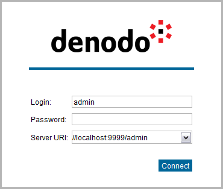

==================================================
Launching the Virtual DataPort Administration Tool
==================================================

.. toctree::
   :hidden:
   
   main_areas_of_the_administration_tool.rst
   tool_preferences.rst
   using_the_vql_shell.rst
   query_monitor.rst
   catalog_search.rst
   invalidate_cache.rst
   trace_viewer.rst
   
   
There are two options to launch the Virtual DataPort Administration
Tool:

#. Use the shortcut included in the Denodo Platform Control Center.
#. Execute the script: :file:`{<DENODO_HOME>}/bin/vdpadmin`

After this, you will see the log-in dialog. Enter the connection details and click **Connect** to connect to the
Virtual DataPort server.

   Authentication screen in the Virtual DataPort Administration Tool

The URI for a default installation is ``//localhost:9999/admin``.

The default credentials are *Login* = *admin* and *Password* = *admin*. We strongly recommend that you change the password of the admin user after logging in for the first time. You can also create another administrator user and after, delete the user *admin*.

The administration tool will warn you if you are connecting to a Virtual DataPort server that runs with a
different Denodo update.