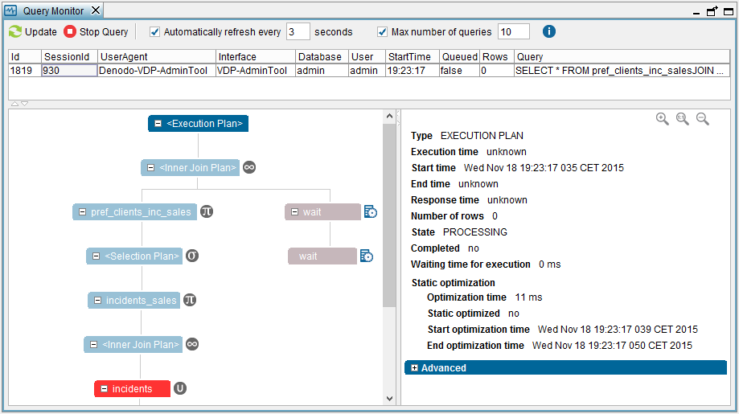

=============
Query Monitor
=============

The Query Monitor lists all the statements that Virtual DataPort is
currently processing: ``SELECT``, ``CALL``, ``CREATE VIEW``,
``ALTER DATASOURCE JDBC``, ``CREATE USER``, etc.

The Query Monitor is available to all users but the queries a user sees
depend on the privileges granted to the user:

-  Normal users only see the statements they execute; not the ones from
   other users.
-  The administrators of a database see all the queries executed in that
   database.
-  Users of type administrator and users with the roles ``serveradmin`` and/or ``jmxadmin`` 
   can see all the statements running in all databases.

To open it, click **Query Monitor** on the **Tools** menu.

   Query Monitor

The queries are listed in a table on the top of the dialog. If you
select a row of this table, the Monitor displays the Execution trace of
the query. Click the nodes of the trace to display information about
them, such as number of processed rows, state, etc.

You can copy the value of each parameter by right-clicking on it and
then, clicking **Copy**.

To store the current execution trace and the tree of views, click **Save**.

The format used to display the information is identical to the one used
in the execution trace (see section :ref:`Execution Trace of a Statement`).

The Monitor updates automatically the list of queries unless you clear
the **Automatically refresh every…** check box. In this case, you can
click **Update** to update the list manually.

To stop the execution of a query, select its row in the table and click
**Stop query**.
