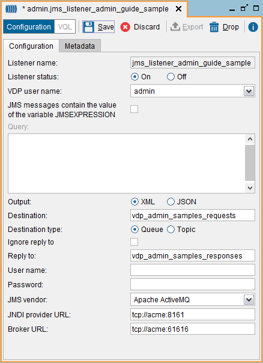
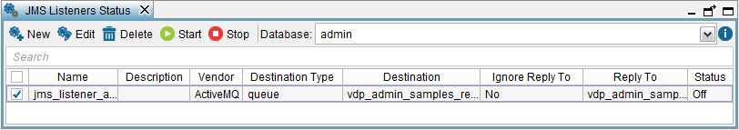

===========================
Creating a New JMS Listener
===========================

Follow these steps to create a JMS listener:

#. Click **JMS Listener** on the **File** > **New** menu or right-click
   the Server Explorer and click **JMS Listener** on the **New** menu.
   
#. Click **On** to enable the listener. If you click **Off**, the listener
   will be created but it will be disabled.

#. Select the **VDP user name** that Virtual DataPort will use to execute
   the queries received by the listener. The user selected has to be a
   local user. It cannot be an LDAP user. The subsection :ref:`Who Can Create
   JMS Listeners` explains in detail the type of users you can select in
   this list.

   For example, if we have two users:

     a. admin: is an “administrator” or a user promoted to “local
        administrator” of the database so it can access any view of the
        database.
     b. user1: is a “normal user” that only has ``EXECUTE`` privileges over this
        database.
        
        If you select the user “admin”, the listener will be able to execute
        any query. However, if you select “user1”, the ``CREATE``, ``DROP``,
        ``INSERT``, ``UPDATE`` and ``DELETE`` queries will fail because
        “user1” only has ``EXECUTE`` privileges.

#. If you want to use a parameterized query, select the **JMS messages
   contain the value of…** check box and enter the query in the box
   below.
   
   As we have explained in the previous section, when using this option,
   the string ``@JMSEXPRESSION`` is replaced at runtime by the value
   received from the JMS server.

#. Select **Output** **XML** or **JSON** if you want the output of the
   listener to be an XML document or a JSON document.

#. **Destination** is the name of the queue or topic that Virtual
   DataPort will subscribe to, waiting for requests.
   
   Depending on the vendor of the JMS server, you might have to create
   the JMS destination, or it will be created automatically when the
   listener tries to subscribe to it.

#. Select **Queue** or **Topic**.

#. **Reply to** is the name of the JMS queue or topic where the responses
   will be sent to.
   
   If not empty, the responses will always be sent to this destination,
   even if the JMS message contains the “Reply to” field.
   
   If empty, the responses will be sent to the destination indicated in
   the “Reply to” field of the JMS request. If the JMS request does not
   have this field either, the Server will not send any response.
   
   If **Ignore reply to** is selected, the listener will never send a
   response.

#. **User name** and **Password** are the credentials to connect to the JMS
   server.

#. **JMS vendor**. Select **Generic** if the vendor of the JMS server is
   not in the list and it can be accessed via JNDI. In this case, you have
   to provide the appropriate JNDI connection properties (appendix :ref:`JMS
   Connection Details: JNDI Properties` contains a list of the required
   JNDI properties for the most popular JMS vendors).

#. In the **Metadata** tab, you can set the folder where the JMS listener
   will be stored and provide a description for it.

.. note:: The first time you create a JMS listener, you have to install
   the client jars of the JMS server. The section 
   :doc:`Installing the JMS Connectors to Create JMS Listeners and Web services with SOAP over JMS <../../../../platform/installation/postinstallation_tasks/postinstallation_tasks_in_virtual_dataport/installing_the_jms_connectors_to_create_jms_listeners_and_web_services_with_soap_over_jms>`
   of the Installation Guide explains how to do this and lists the client jars
   of the most popular JMS vendors.

   Creating a new JMS listener

After creating the listener, you can open the JMS Listener Status dialog
(**Tools** > **JMS Listeners** menu) to see the list of existing JMS
listeners.

   List of existing JMS listeners

You can enable / disable a JMS listener by selecting its check box
beside the status of the listeners and clicking on **Enabled selected**
and **Disable selected**.

To delete a listener, right-click on it in the Server Explorer and click
**Drop**.
