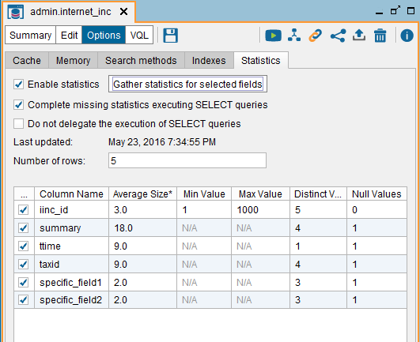
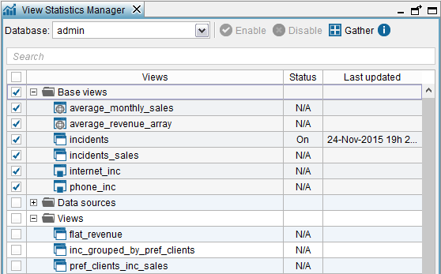

=================================
Gathering the Statistics of Views
=================================

The cost-based optimization requires the statistics. To instruct Virtual
DataPort to gather and store the statistics of a view, do the following:

#. Open the view.

#. Click **Options** and then, click the **Statistics** tab.

#. Select **Enable statistics**.

#. If you select **Complete missing statistics executing SELECT queries**,
   the Server, during the process of gathering the statistics of the view,
   will execute a ``SELECT`` statement to gather the statistics that it
   could not obtain from the system tables of the database.

   If cleared, the Server gathers the statistics from the system tables of
   the database and does *not* execute the SELECT statement.
   
   This option is only available for JDBC base views created over data
   sources with certain adapters. The section :ref:`How the Gathering Statistics
   Process Works` lists what statistics are obtained from the system
   tables of each database vendor.

#. Do one of these:

   a. Click **Gather statistics for selected fields** to automatically gather
      *and* store the statistics of this view. Once the process finishes, the
      statistics will be stored in the metadata of the view.

      .. important:: Before obtaining the statistics of a JDBC base view, make
         sure that the source database (Oracle, IBM DB2, etc.) has the statistics
         of this table. If the statistics are not present or are outdated, the
         statistics gathered will not be accurate and the execution plans
         selected by the cost-based optimizer could be suboptimal.

      Virtual DataPort only obtains the statistics of the selected fields (by
      default all the fields are selected).
      
      Usually you want to select all the fields to obtain the statistics of
      all of them at once, but this is not always possible:
      
      i.   It is not possible to obtain the statistics of all the fields. If
           this is a JDBC base view and the check box “Complete missing
           statistics…” is selected, Virtual DataPort executes a ``SELECT``
           query to gather the statistics it could not obtain from the
           database’s system tables. 
           
           However, the database may return an error
           when executing this query. For example, some databases return an
           error when a query tries to obtain the average size of a blob
           field. In a case such as this, clear the check box of the affected
           fields to be able to obtain the statistics of the other fields.
      ii.  The database does not support executing the functions required to
           gather the statistics. In this case, select the check box **Do not
           delegate the generation of the statistics**. By doing this, Virtual
           DataPort retrieves all the data from the table (executes a
           ``SELECT * FROM view``) and executes the aggregation functions
           locally. We do not recommend selecting this option, unless it is
           necessary.
      iii. Obtaining the statistics of all the fields at once may put too much
           strain on the data source that holds the data and you want to avoid
           it. In this case, you may want to obtain the statistics of some of
           the fields but not all of them.

      Read the section :ref:`Gathering Statistics Automatically` to fully
      understand the process of gathering the statistics of a view.

   b. You can also provide the statistics of the view manually, but we
      recommend doing it automatically as described in the previous step. To
      manually provide the statistics of the view, enter the **Number of
      rows** and, in the table below, the required values for each field:

      i.   The average size of its values.
      ii.  The maximum value and minimum value (not for values of type
           ``text``)
      iii. The number of distinct values.
      iv.  Number of ``NULL`` values.

   Gathering the statistics of a view

The cost-based optimizer does not use the maximum and minimum values of
the fields of type ``blob``, ``boolean``, ``date``, ``text``, ``xml``,
``array`` or ``record``. Therefore, they cannot be specified (in the
table, the cells of these fields are disabled and have the label “N/A”).

Once the statistics of a view have been gathered or you have provided
them manually, you can disable the statistics of the view by clearing
the **Enable statistics** check box. By doing this, the statistics are
not “lost” but the cost-based optimization will not use them and
therefore, the Server will not apply this optimization in a query if the
optimization needs the statistics of this view.

|

You can also gather the statistics of several views at once. To do this,
click **Manage statistics** on the **Tools** menu.

   Gathering the statistics of several views at once

In this dialog, select the views that you want to obtain its statistics
and click **Gather**. To select all the views of a folder, select the
folder.

.. note:: Denodo gathers the statistics of the views using the settings of the dialog 
   *Options* > tab *Statistics* of each view (options *Complete missing statistics executing SELECT queries* 
   and *Do not delegate the generation of statistics* of the view).

   Depending on these options and the underlying data source, the statistics of a view may be incomplete.
   For example, the default behavior for JDBC base views is to 
   obtain the statistics from the system tables of the
   database, without executing any query. Depending on the database, this information may not be complete
   and you may need to enable the option *Complete missing statistics executing SELECT queries* of the view
   and gather the statistics again (see section :ref:`How the Gathering Statistics Process Works`).
   
   Therefore, we recommend reviewing the statistics of the views after this process, in order to ensure 
   that the statistics were gathered as expected.

For the views whose statistics already have been obtained (views with
“On” or “Off” in the “Status” column of the table), their statistics can
be enabled/disabled by selecting the views and clicking **Enable** or
**Disable**.

When the statistics of a view are disabled (“Off” status) or have not
been gathered (“N/A” status), the Server will not apply the cost-based
optimization in a query, if it needs the statistics of one of these
views.

To search a view or a folder, type its name in the box located at the
top of the dialog.

The statistics of a view are not included in version control because
they are environment-dependent.

Gathering Statistics Automatically
=================================================================================

This section describes the process for automatically gathering the
statistics of the views used by the cost-based optimization:

-  Section :ref:`How the Gathering Statistics Process Works` describes how
   the gathering process works.
-  Section :ref:`Scheduling the Gathering of Statistics` describes how to
   use Denodo Scheduler to collect and update statistics on a periodical
   basis.
-  Section :ref:`Limitations of the Gathering Statistics Process` describes
   some current limitations of the gathering process.

How the Gathering Statistics Process Works
------------------------------------------

This section explains how the Server gathers the statistics of a view.

.. important:: Before obtaining the statistics for a JDBC base view,
   make sure that the source database (Oracle, IBM DB2, etc.) has the
   statistics of this table. If the statistics are not present or are
   outdated, the statistics gathered will not be accurate and the execution
   plans selected by the cost-based optimizer could be suboptimal.

The process to gather the statistics of a view depends on the type of
base view:

-  JDBC base views: the Server gathers the statistics of the view from
   the system tables of the database. The information obtained from
   these tables depends on the database adapter of the view’s data
   source. The reason is that some databases provide more statistics
   about their tables/views than others.
   
   The table :ref:`Statistics that are gathered from the system tables of each vendor`
   lists the statistics that the Server can gather from each database vendor.

   If “Complete missing statistics...” is selected, the Server executes 
   an additional SELECT query to obtain the statistics it cannot obtain 
   from the system tables.
   
   
-  Other views: Virtual DataPort executes a query like the one in
   `Sample SQL query executed to gather statistics of a non-JDBC base
   view`_ to gather the statistics of the view. If the view involves an
   ODBC source, part of this query may be pushed down to that source,
   thus making the process faster.

.. code-block:: sql
   :caption: Sample SQL query executed to gather statistics of a non-JDBC base view
   :name: Sample SQL query executed to gather statistics of a non-JDBC base view
 
   SELECT count(*),
       , avg( length( <text field> ) )
       , max( <text field> )
       , min( <text field> )
       , count( DISTINCT <text field> )
       , ...
       , max( <numeric field> )
       , min( <numeric field> )
       , count( distinct( <numeric field> ) )
       , count( <numeric field> )
       , ...
       FROM view

There are databases that do not support projecting several aggregation
functions in a ``SELECT`` statement. In this case, select the check box
“Do not delegate the generation of the statistics” before clicking the
button “Gather statistics for selected fields”. By doing this, Virtual
DataPort retrieves all the data from the table (executes a
``SELECT * FROM view``) and executes the aggregation functions locally.
Whenever possible, avoid selecting this option because the database is
forced to send all the data stored in the table to Virtual DataPort. In
addition, usually databases execute these functions faster.

When the data is obtained from other types of sources (e.g. delimited
files, XML, etc.), Virtual DataPort retrieves all the rows from the
source and computes the statistics by itself. In views where all the
data is obtained from sources that are not databases, selecting the
check box “Gather statistics for…” is equivalent to clearing it.

.. note:: If the statistics are not gathered from the system tables of a
   database, the process of gathering statistics can take a long time for
   large views. It can also induce significant workload in both Virtual
   DataPort and the data sources. Therefore, it is convenient to gather the
   statistics during periods where the system is not expected to be under
   heavy load (see the section :ref:`Scheduling the Gathering of Statistics`
   for details about how to schedule the statistics gathering process).

The following table lists which statistics are gathered from the system
tables of each database vendor.

.. table:: Statistics that are gathered from the system tables of each vendor
   :name: Statistics that are gathered from the system tables of each vendor

   +----------------+------------+---------+------------+------------+-----------+---------+
   | Database       | Number of  | Average | Min Value  | Max Value  | Distinct  | Null    |
   | Adapter        | Rows of    | Size    |            |            | Values    | Values  |
   |                | the Table  |         |            |            |           |         |
   +================+============+=========+============+============+===========+=========+
   | Amazon         | X          | X       |            |            | X         | X       |
   | Redshift       |            |         |            |            |           |         |
   +----------------+------------+---------+------------+------------+-----------+---------+
   | Azure SQL      | X          | X       |            |            | X         |         |
   | Data Warehouse |            |         |            |            |           |         |
   +----------------+------------+---------+------------+------------+-----------+---------+
   | Cloudera       | X          | X       |            |            | X         | X       |
   | Impala         |            |         |            |            |           |         |
   +----------------+------------+---------+------------+------------+-----------+---------+
   | Greenplum      | X          | X       |            |            | X         | X       |
   +----------------+------------+---------+------------+------------+-----------+---------+
   | IBM DB2        | X          | X       | X          | X          | X         | X       |
   +----------------+------------+---------+------------+------------+-----------+---------+
   | IBM DB2 z/OS   | X          |         | X          | X          | X         |         |
   +----------------+------------+---------+------------+------------+-----------+---------+
   | Microsoft      | X          | X       |            |            | X         |         |
   | SQL Server     |            |         |            |            |           |         |
   +----------------+------------+---------+------------+------------+-----------+---------+
   | Netezza        | X          |         |            |            | X         |         |
   +----------------+------------+---------+------------+------------+-----------+---------+
   | Oracle         | X          | X       | X          | X          | X         | X       |
   +----------------+------------+---------+------------+------------+-----------+---------+
   | PostgreSQL     | X          | X       |            |            | X         | X       |
   +----------------+------------+---------+------------+------------+-----------+---------+
   | Presto (\*)    | X          |         | X          | X          | X         | X       |
   +----------------+------------+---------+------------+------------+-----------+---------+
   | Spark 2.x      | X          | X       | X          | X          | X         | X       |
   +----------------+------------+---------+------------+------------+-----------+---------+
   | Teradata       | X          |         |            |            | X         |         |
   +----------------+------------+---------+------------+------------+-----------+---------+
   | Vertica        |            |         |            |            | X         |         |
   +----------------+------------+---------+------------+------------+-----------+---------+

**(\*)**: by default, the Presto adapter can obtain the statistics from the system tables of Presto version 183 or higher, but not from earlier versions. To be able to do this for earlier versions of Presto, follow these steps:

1. Obtain the version of Presto you are connecting to.
2. Login as an administrator and execute this command from the VQL Shell:

   .. code-block:: vql

      SET 'com.denodo.vdb.contrib.storedprocedure.GenerateStatsProcedure.presto.statsversion' = '<value>';
   
   where <value> is:
   
   -  ``pre_177``: if the version of Presto is 176 or lower. In these versions, the system tables do not provide statistics.
   -  ``post_177``: if the version is 177 or higher but lower than 183. In these versions, the system tables provide the statistics "number of rows", "distinct values" and "null values" but not "min value" and "max value".
   -  ``post_183`` (default value): if the version is 183 or higher. In these versions, the system tables provide the statistics listed in the table above.
   
3. In the installation of the administration tool you use, edit the file :file:`{<DENODO_HOME>}/conf/vdp-admin/VDBAdminConfiguration.properties` and add this property

   .. code-block:: properties
      
      com.denodo.vdb.contrib.storedprocedure.GenerateStatsProcedure.presto.statsversion=<version>
      
   Replace <version> with the same value you set in the previous step.
   
4. Restart the Virtual DataPort server and the administration tool.

|

For the vendors not listed in this table, the statistics are obtained
issuing ``SELECT`` queries like the one in :ref:`Sample SQL query executed to
gather statistics of a non-JDBC base view`.

|

The following table lists the tables, statements or functions Virtual DataPort
queries or executes to obtain the statistics listed in the table above. They depend
on the database from which Virtual DataPort obtains the statistics.

.. table:: Tables, statements or functions executed by Virtual DataPort to obtain statistics
   :name: Tables, statements or functions executed by Virtual DataPort to obtain statistics

   +----------------------+-----------------------------------------------------------------+
   | Database Adapter     | Elements Inspected to Obtain Statistics                         |
   +======================+=================================================================+
   | Amazon Redshift      | System tables: PG_STATS, PG_CLASS and PG_NAMESPACE, PG_INHERITS.|
   +----------------------+-----------------------------------------------------------------+
   | Azure SQL            | System tables: SYS.OBJECTS, SYS.PARTITIONS, SYS.STATS,          |
   | Data Warehouse       | SYS.STATS_COLUMNS.                                              |
   +----------------------+-----------------------------------------------------------------+
   | Cloudera Impala      | Statements: SHOW COLUMN STATS and SHOW TABLE STATS.             |
   +----------------------+-----------------------------------------------------------------+
   | Greenplum            | System tables: PG_STATS, PG_CLASS and PG_NAMESPACE, PG_INHERITS.|
   +----------------------+-----------------------------------------------------------------+
   | IBM DB2 (\*)         | System tables: SYSCAT.COLUMNS and SYSCAT.TABLES.                |
   +----------------------+-----------------------------------------------------------------+
   | Microsoft SQL Server | System tables: SYS.OBJECTS, SYS.PARTITIONS, SYS.STATS,          |
   |                      | SYS.STATS_COLUMNS.                                              | 
   +----------------------+-----------------------------------------------------------------+
   | Netezza              | System tables: _V_RELATION_COLUMN_XDB and _V_TABLE_XDB.         |
   +----------------------+-----------------------------------------------------------------+
   | Oracle 9i            | System tables: ALL_TAB_COLUMNS and ALL_ALL_TABLES.              |
   +----------------------+-----------------------------------------------------------------+
   | Oracle >= 9i         | System tables: ALL_TAB_COLUMNS and ALL_TAB_STATISTICS           |
   +----------------------+-----------------------------------------------------------------+
   | PostgreSQL           | System tables: PG_STATS, PG_CLASS and PG_NAMESPACE, PG_INHERITS.|
   +----------------------+-----------------------------------------------------------------+
   | Presto               | Statements: SHOW STATS                                          |
   +----------------------+-----------------------------------------------------------------+
   | Spark 2.x            | Statements: DESCRIBE EXTENDED                                   |
   +----------------------+-----------------------------------------------------------------+
   | Teradata             | Statements: HELP STATISTICS                                     |
   +----------------------+-----------------------------------------------------------------+
   | Vertica              | Functions: APPROXIMATE_COUNT_DISTINCT                           |
   +----------------------+-----------------------------------------------------------------+

The Server does *not* collect statistics for the fields of the following
types:

-  ``blob``

-  ``boolean``

-  ``xml``

-  ``array``

-  ``register``.

-  Any field whose source type property is one of the following:

   -  ``BIT``
   -  ``CLOB``
   -  ``LONGVARCHAR``
   -  ``LONGNVARCHAR``

For the fields of some of these types, it sets a value that is
extrapolated from other statistics. For example, for ``blob``, ``array``
and ``register`` fields, it assumes that each value is different.
Therefore, the value of the statistic “Distinct values” is the number of
rows of the view.

The cost-based optimizer does not use the maximum and minimum values of
the fields of type ``blob``, ``boolean``, ``date``, ``text``, ``xml``,
``array`` or ``record``. Therefore, in the statistics table of the view,
the cells of these fields are disabled and have the label “N/A”.

Scheduling the Gathering of Statistics
-----------------------------------------------------------------------------------------------------

The stored procedure ``GENERATE_STATS`` gathers and stores the
statistics of a view. Use Denodo Scheduler to schedule the gathering of
the statistics of a view. The main objective of this is to gather them
during periods where the system is not expected to be under heavy load.

See more about this procedure in the section :ref:`GENERATE_STATS` of the
VQL Guide.

Limitations of the Gathering Statistics Process
-----------------------------------------------------------------------------------------------------

There are several limitations in the process of gathering statistics.
When these limitations apply, statistics can be specified manually for
the affected fields:

-  In some databases, the statistics are not obtained for fields of some
   database data types, even if in Virtual DataPort they are mapped to a
   data type not included in the previous bullet. More precisely:

   -  In IBM DB2, statistics are not collected for table fields of the data
      types ``LONGVARCHAR`` and ``LONGVARGRAPHIC``.
   -  In Microsoft SQL Server, statistics are not collected for table
      fields of the data types ``TEXT`` and ``NTEXT``.
   -  In Oracle, statistics are not collected for table fields of the data
      types ``CLOB``, ``NCLOB``, and ``SQLXML``.
   -  In Spark, minimum and maximum metrics are not available for binary and 
      string types.

-  Before gathering the statistics of views whose data is obtained from
   Informix 7.x, select the check box “Do not delegate the generation of
   statistics”.
   In later versions of Informix, it is not possible to collect statistics
   from tables with fields of types ``INTERVAL``.

-  It is not possible to collect statistics from tables in SQL Server with
   fields of types ``UNIQUEIDENTIFIER`` or ``SQLVARIANT``.

-  It is not possible to collect statistics for views that have mandatory
   fields.
