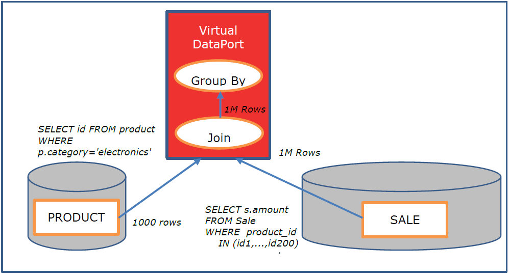
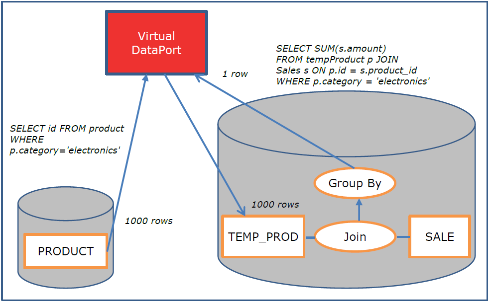
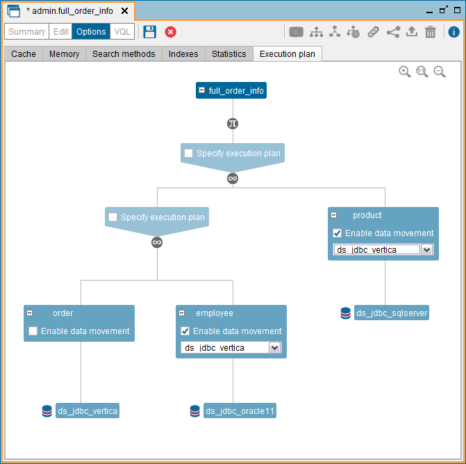
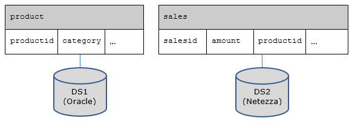

=============
Data Movement
=============

.. toctree::
   :hidden:
   
   data_movements_from_to_netezza_databases.rst
   examples_of_data_movement.rst
   known_limitations.rst

The Data Movement optimization provides a way to execute federated
queries more efficiently. When a query involves two views and one of
them is much larger than the other, Virtual DataPort can transfer the
data of the smaller view into the data source of the larger view and
execute the operation in the second data source. This may offer great
performance improvements.

The performance of the following operations can be improved with this
optimization:

-  Join
-  Union
-  Minus
-  Intersect

Let us consider the following example:

We have a view *product* in the data source *DS1* that contains one
million rows. This view has an attribute called *category*. There are
one thousand products in the category “electronics”.

We have a view *sale* in the data source *DS2* that contains one billion
rows. The view *sale* has an attribute *product\_id* that indicates the
product sold in a particular sale. Therefore, on average, we have 1000
sales for each product.

|image0| 

The following query obtains the amount of sales of products of the
“electronics” department:

.. code-block:: sql

   SELECT SUM(s.amount)
   FROM Product p JOIN Sale s ON p.id = s.product_id
   WHERE p.category = 'electronics'

The usual strategy for this JOIN should be NESTED. In this case, Denodo
would automatically use the optimization of the NESTED join that groups
several ids of the outer relation (*product*) when querying the inner
relation (*sale*). More precisely, these would be the execution steps
(see `Data movement: nested join operation`_):

#. Denodo executes in ``DS1`` a query like
   ``SELECT id FROM product WHERE p.category = 'electronics'``
   
   This query will return 1000 rows.

#. Denodo groups the 1000 ``product_ids`` obtained in step 1 into five
   groups, each one having 200 ids. For each group, it executes on DS2 a
   query like
   ``SELECT s.amount FROM Sale WHERE product_id IN (id1,...,id200)``
#. Step 2 will produce one million rows (200,000 for each group) that
   are transferred from *DS2* to Denodo
#. Denodo post-processes the one million rows obtained in step 3 to
   obtain the total amount.

   
   Data movement: nested join operation

By using the Data Movement optimization, the following alternative is
possible (see `Data movement: join optimized with Data movement`_):

#. Denodo queries the product view with the condition
   ``c.category = 'electronics'``. This query will return 1000 rows.
#. Denodo inserts the 1000 rows obtained in step1 in a table
   (``TEMP_PROD``) in *DS2*.
#. Now, Denodo can delegate the entire query to DS2, to obtain the final
   result, which consists of a single row:
   
   .. code-block:: sql
   
      SELECT SUM(s.amount)
      FROM tempProduct p JOIN Sale s
      ON p.id = s.product_id
      WHERE p.category = 'electronics'

   
   Data movement: join optimized with Data movement

The target of a data movement can be one of these:

-  A JDBC data source involved in the execution of the view and 
   whose database adapter is supported by the Cache Engine (the section :ref:`Cache Module`
   lists them).
-  The database used by the Cache Engine: ``vdpcachedatasource`` or
   ``customvdpcachedatasource``.

This condition ensures that Virtual DataPort has the correct mappings
over the column types and knows how to create tables correctly
and insert data in them.

Besides, the data source configuration must contain all the necessary
information to be able to create a table in it. This means that
the connection URI has to contain the database name.

To create a view with a Data Movement you need the following privileges:

-  Read privilege over all the views to be moved. That is, the ones
   specified in the ``DATAMOVEMENTPLAN`` property of the ``CONTEXT``
   clause.

-  Execute privilege over the target data source.

The Data movement of a view is defined in the **Execution plan** tab of
the “Options” dialog of the view.

   Defining the data movement of a view

In the `Defining the data movement of a view`_, there is a view
``full_order_info`` with two data movements defined. When a user queries
this view, the execution engine will create two tables in the
database of source ``ds_jdbc_vertica``. Then, it will retrieve the data
of the view ``employee`` and insert it in one of the tables in
``ds_jdbc_vertica``; and it will the data from ``product`` in the other
table. After this, the execution engine will be able to
delegate the two joins to ``ds_jdbc_vertica``.

Once the query finishes, Virtual DataPort will delete the 
tables from ``ds_jdbc_vertica``.

To enable the movement of data of a view, select the check box **Enable
data movement** and, in the box below, select the data source that
represents the database where the table will be created.

Options of the CONTEXT Clause that Control a Data Movement
==========================================================

The ``CONTEXT`` clause of the queries has three clauses that control data movements:

1. ``data_movement_bulk_load``. If ``off`` and the execution engine is going to perform a data movement for this query, the execution engine will not use the bulk load API of the target database. Instead, it uses INSERT statements to insert the data.

   Default value: ``on``. If the target data source is configured to use the bulk load API of the data source, the execution engine uses it by default.

#. ``data_movement_clean_resources``. If ``true`` and the execution engine uses the bulk load API of the database to perform a data movement, once the data movement finishes, it will remove the delimited files generated to perform this operation. If ``false``, it does not remove these files.

   Default value: ``true``.
   
   This property only affects the data movements to databases for which the data is written to a temporary file before loading it. For example, Denodo performs data movements to HP Vertica without writing the data to disk. Therefore, this property does not modify the behavior of the data movement. The section :ref:`Bulk Data Load` has a subsection for each database that explain if the execution engine creates a temporary data file or not.
   
   Note that the files generated for data movements contain all the data to be inserted. Therefore, we do not recommend setting this property to ``false`` if the data movement of a query involves millions of rows *and* it is executed very often (for example, from a job of Denodo Scheduler). As the files will use a lot of space, the hard drive could be filled with the files generated for each execution of the query.

#. ``data_movement_clean_resources_on_error``. If ``false``, the execution engine uses the bulk load API of the database to perform a data movement, and the data movement fails, the execution engine will not remove the delimited files generated to perform this operation. If the data movement succeeds, the execution engine removes these files.

   Default value: ``true``. With this value, the execute engine will delete these files regardless of if the statement fails or not, unless you set the property ``data_movement_clean_resources`` to ``false``.
   
   This option is useful to debug problems when setting up a job in Denodo Scheduler that involves data movement. It will allow you to debug issues in jobs that fail but without having to keep the data files of queries that succeed. 

