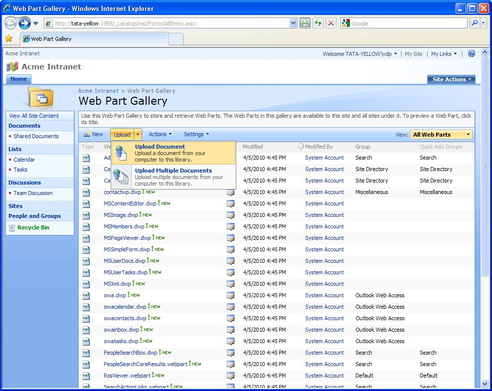
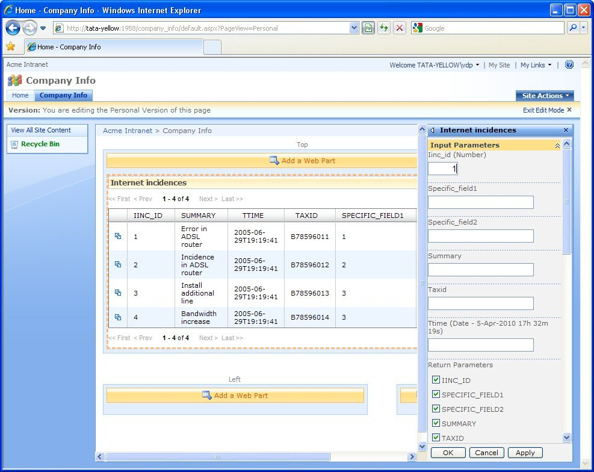

==================================
Deployment of a Microsoft Web Part
==================================

.. note:: Publishing views as widgets is a deprecated feature and it may be removed in future
   major versions of the Denodo Platform.
   
   The section :ref:`Features Deprecated in Virtual DataPort 7.0` lists all the features that are deprecated.

The first time you want to deploy a Web Part you have to deploy the
Denodo SharePoint Solution located in
:file:`{<DENODO_HOME>}/webapps/webpart-core/DenodoWebPart.wsp`. The
appendix :ref:`Installing the Denodo Solution for Microsoft SharePoint` explains how to do it.

After this, you are ready to deploy the exported Web Parts. To do this,
follow these steps:

#. Unzip the exported “.zip” file in your SharePoint server and copy the
   “.xml” file to:
   ``C:\Inetpub\wwwroot\wss\VirtualDirectories\80\wpresources\DenodoWebPart``
#. Open the “Web Part gallery”, usually located in
   \http://<SHAREPOINT_SERVER>/\_catalogs/wp/Forms/AllItems.aspx
   and load the “webpart” file into the gallery (see `Loading the
   .webpart file into the Web Part gallery`_).

   Loading the ``.webpart`` file into the Web Part gallery

Now, the Web Part is ready to be added to any page.

As portlets, the Web Parts also have a query form to configure the
following parameters (see `Web Part search form`_):

-  Query parameters that will be used to filter the contents of the
   exported view.
-  Hide some of the columns of the results table.
-  Results table settings: rows per page, height and width of the
   results table and its cells, and columns whose HTML code will not be
   escaped (if a cell of a selected column contains HTML, it will not be
   escaped)

   Web Part search form
